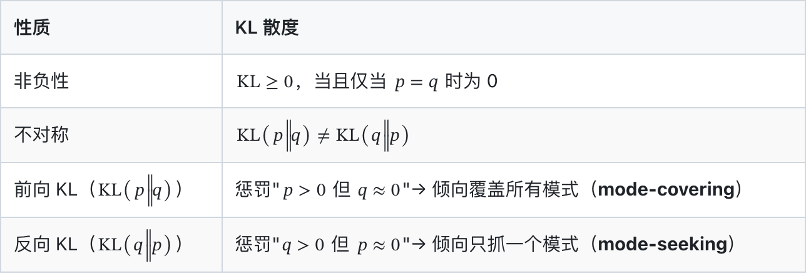
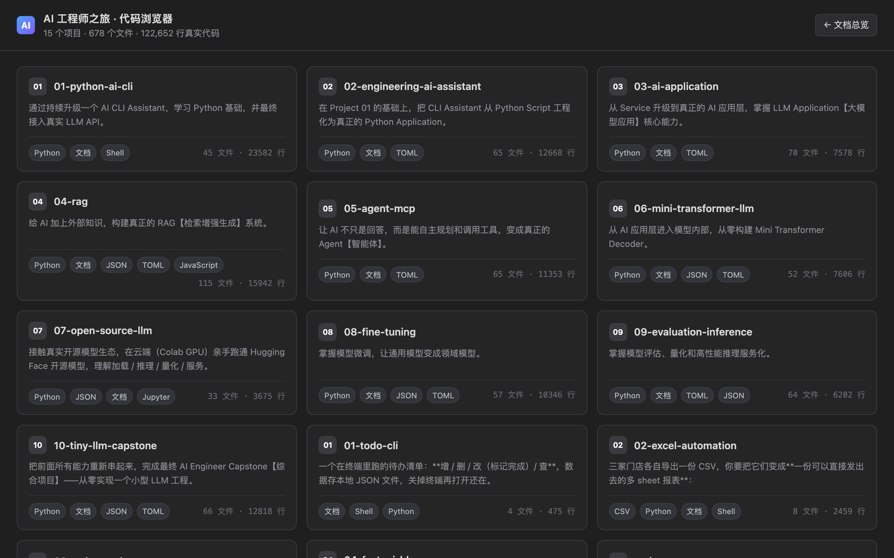
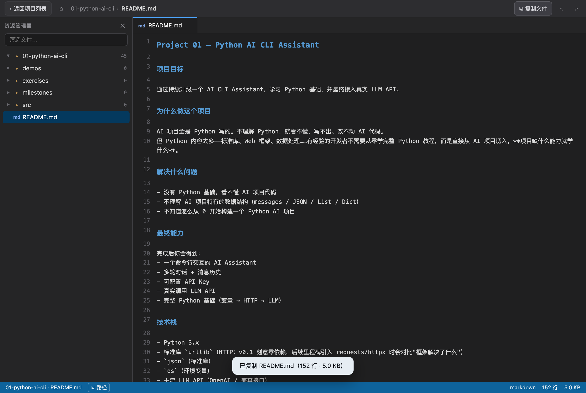
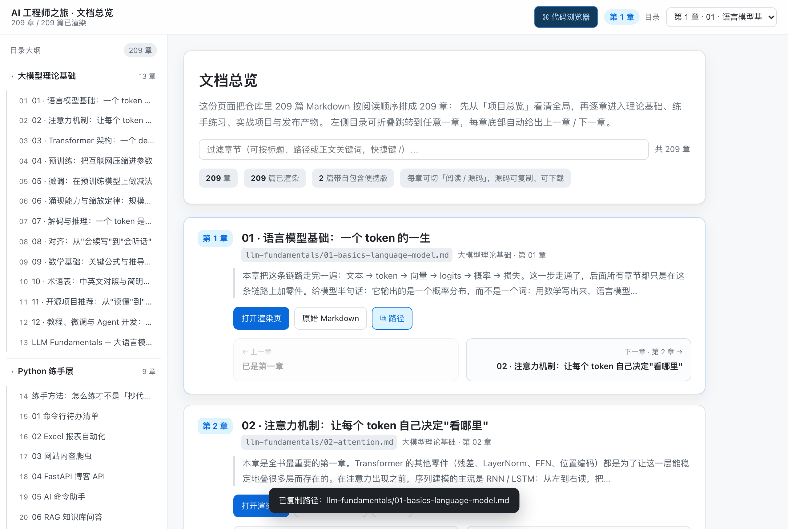
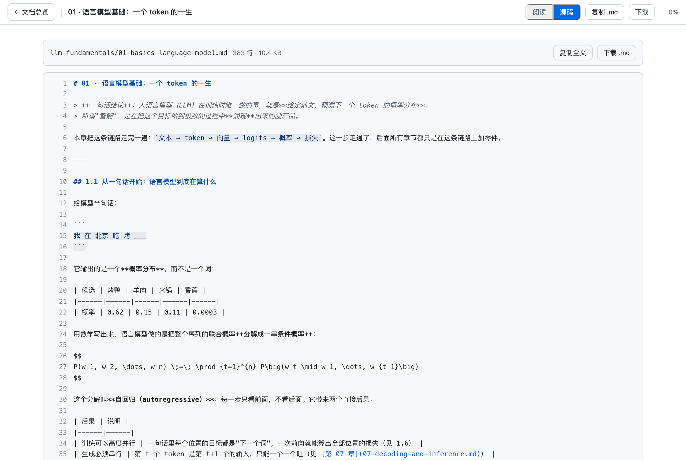

# AI Engineer Journey

> **Project First — 通过连续项目逐步构建 AI Engineer 能力**

## 项目定位

面向有 Java / 前端基础、但 Python 和 AI 基础薄弱的开发者，
通过 **10 个连续项目**，从 Python 基础一路学到 AI Application、RAG、Agent、
PyTorch、Transformer、微调、评估、量化、部署，并最终自己实现 Tiny LLM。

**这不是课程，不是知识库，是一组持续演进、可以运行、可以展示、可以继续扩展的工程项目。**

## Project First 原则

```text
Project
  >
Milestone
  >
Knowledge
  >
Code
  >
Practice
  >
Documentation
```

**项目遇到问题 → 学习知识 → 知识进入代码 → 运行验证 → 形成能力 → 进入下一个项目**

## 10 个项目路线

| # | 项目 | 核心能力 | 状态 |
|---|------|----------|------|
| 01 | [Python AI CLI Assistant](projects/01-python-ai-cli/) | Python 基础 + 真实 LLM API | 🔄 |
| 02 | [Engineering AI Assistant](projects/02-engineering-ai-assistant/) | Python 工程化 + FastAPI | ✅ |
| 03 | [AI Application](projects/03-ai-application/) | Prompt / Streaming / Function Calling | ✅ |
| 04 | [AI Knowledge Base / RAG](projects/04-rag/) | Embedding / Chunk / Vector DB / RAG | ✅ |
| 05 | [Research Agent / MCP](projects/05-agent-mcp/) | Agent / Tool / MCP Protocol | ✅ |
| 06 | [Mini Transformer / LLM](projects/06-mini-transformer-llm/) | 从零 autograd / Attention / Transformer | ✅ |
| 07 | [Open Source LLM](projects/07-open-source-llm/) | Hugging Face / Tokenizer / 本地推理 | 🔄 |
| 08 | [LoRA / QLoRA Fine-Tuning](projects/08-fine-tuning/) | SFT / LoRA / QLoRA | ✅ |
| 09 | [LLM Evaluation / Inference](projects/09-evaluation-inference/) | 评估 / 量化 / 服务化 | ✅ |
| 10 | [Tiny LLM Capstone](projects/10-tiny-llm-capstone/) | 从零实现小型 LLM（Tokenizer → Serving 全链路） | ✅ |

> 状态列指**内容状态**：✅ 已完成 / 🔄 进行中 / 📝 草稿 / ⬜ 未开始。
> 「我是否真的学会了」另记在 [PROGRESS.md](PROGRESS.md) 的学习进度轨 —— 文档就绪 ≠ 已掌握。

## 仓库结构

```text
ai-engineer-journey/
│
├── README.md              # 本文件
├── ROADMAP.md             # 10 项目路线图
├── PROGRESS.md            # 双轨进度（学习进度 / 内容生产）
├── KNOWLEDGE-MAP.md       # 能力关系网（只展示关联，不复制正文）
├── CONTRIBUTING.md        # 维护规范（单一事实源 / 命名 / 分级 / Git 约定）
├── LICENSE
├── .gitignore
│
├── mistakes/              # 错题本：真实踩过的坑（日期 + 原因 + 修复）
│   └── README.md
│
├── llm-fundamentals/      # 基础理论层：大模型原理教材（12 章 + 可运行 demo + 真实配图）
│                          #   定位见下方「基础知识层」一节；projects/ 仍是唯一事实源
│
├── python-practice/       # 练手层：6 个入门动手练习 + 07 延伸阅读（01–04 可跑，05/06 指路）
│                          #   定位见下方「练手项目层」一节
│
├── audit/                 # 仓库体检档案：每期一次真实运行的全面体检 + 建议清单
│
├── projects/              # 核心内容（唯一事实源）
│   ├── 01-python-ai-cli/
│   │   ├── README.md          # 项目主页（必须对齐规范模板）
│   │   ├── milestones/       # 学习里程碑（Project First 模板）
│   │   │   ├── 01-variables.md
│   │   │   ├── 02-list-dict-json.md
│   │   │   └── ...（共 10 个）
│   │   ├── exercises/        # 配套练习（01-basic 已有题，02/03/04 待播种）
│   │   └── src/              # 项目代码
│   ├── 02-engineering-ai-assistant/
│   └── ...（共 10 个项目）
│
└── publishing/            # 对外发布内容（输出层，不是知识源）
    ├── articles/          # 课程学习笔记型文章
    ├── tutorials/         # 独立成篇的图文教程（md + html + assets/）
    └── finetune-series/   # 微调系列草稿库（未校对，择优转正为 tutorials）
```

### 维护工具（`scripts/`）

| 脚本 | 作用 |
|------|------|
| `check_links.py --strict` | 死链 + 坏图体检（CI 也在跑） |
| `audit.py` | 全仓库体检：骨架完整性 / 证据链 / 配图 / 文档漂移 / 密钥；`--tests` 可实跑全部测试 |
| `check_repos.py` | **学习资源体检**：把文档里推荐的 GitHub 仓库逐个探测（可访问 / 星标 / 是否归档 / 是否搬家 / 最近提交 / 是否维护模式）。不需要 API token |
| `render_terminal.py` | 把真实 stdout 渲染成终端风格 PNG（截图有据可依） |
| `md_to_tutorial_html.py` | 教程 Markdown → HTML 同款排版 |
| `build_docs_html.py` | **批量渲染**：把全部（或指定子集）Markdown 转成 `publishing/html/docs/` 下的 HTML 树，并自校验链接 |
| `gen_doc_index.py` | 把全部文档重排成「第 1 章…第 N 章」的文档式总览页 `publishing/html/index.html`：左侧可折叠目录大纲、滚动高亮当前章节、章节下拉快跳、搜索过滤、每章底部上一章 / 下一章链式导航、一键复制文档路径 |
| `md_to_book_html.py` | 单篇渲染器：顶栏（返回总览 / 阅读·源码切换 / 复制 / 下载）、自动抽取 h2/h3 生成侧边目录大纲、阅读进度条与百分比、每章末尾「上一节 / 下一节」链式导航、代码块一键复制、图片灯箱、宽表横滚、移动端目录抽屉；`--relative-images` 走 base64 内嵌的自包含单文件版 |
| `gen_ide_browser.py` | **代码浏览器**：把 10 个项目 + 4 个练手项目 + `scripts/` 的真实源码（678 个文件 / 12.26 万行）全部内嵌，产出一个自包含单文件 IDE 界面 `publishing/html/ide.html` |
| `verify_pages.js` | **站点交互实测**：用真实 Chromium 走一遍三张页面的交互（返回总览、阅读↔源码切换、灯箱、复制反馈、hash 路由与浏览器前进后退、深链直达），并顺带产出 `publishing/site-assets/` 里的截图 |
| `latex_mathml.py` | **公式渲染**：构建期把 `$…$` / `$$…$$` 里的 LaTeX 转成浏览器原生 MathML（分数/根式/上下标/矩阵/`\text` 中文混排/`\operatorname`/`\mathbb`/间距与箭头），运行时零依赖 |
| `verify_math_layout.js` | **公式版式实测**：用真实 Chromium 量「公式是否横排、是否溢出行容器、行内混排是否撑歪行高」，桌面 1280px + 移动 390/768px 三个视口 |
| `shot_math.js` | 用真实 Chromium 截取公式渲染截图（`llm-fundamentals/assets/math-render-*.png` 的来源） |

**公式渲染**：文档里的 `$…$`（行内）与 `$$…$$`（行间）在**构建期**就转成了浏览器原生的
MathML，随页面一起落地——不引 CDN、不塞 KaTeX 字体，断网双击照样排版正确。
行间公式居中且过长时在容器内横向滚动（窄屏先自动缩字号），行内公式与中文正文基线对齐。





**代码浏览器**：`publishing/html/ide.html` 打开就是项目列表，点进某一项目后是
IDE 布局——左侧可折叠文件树（支持筛选、展开/折叠全部）、右侧带语法高亮的代码区
（标签页、行号、面包屑、底部状态栏），深色主题、响应式，同样零依赖、双击即开。
顶栏有「⧉ 复制文件」一键复制当前文件的完整内容（`file://` 下 Clipboard API 被拒时
自动退回 `execCommand`，不会变成一个按不动的假按钮），状态栏可复制文件路径。
地址栏就是状态：`ide.html#/01-python-ai-cli/README.md` 可以直达某个文件，
浏览器前进 / 后退也真的能用来在「项目列表 ↔ 项目 ↔ 文件」之间来回走。
数据源是构建时从仓库真实采集的（不含 `.venv` / `node_modules` / 二进制 / 权重），
改完代码重跑 `python3 scripts/gen_ide_browser.py` 即可刷新。




**本地阅读**：`publishing/html/index.html` 是入口，209 篇文档全部以渲染后的页面打开
（`publishing/html/docs/…`，与源目录同构；图片按相对路径指回源树，零外部依赖、双击即开）。
每个章节页的顶栏都有「← 文档总览」，并且**带着该章的锚点回去**（`index.html#ch-47`），
落回总览里的第 47 章而不是被扔回页面顶部。





索引里带紫色 <code>便携版</code> 标签的两篇（`python-practice/07-延伸阅读`、
`llm-fundamentals/12-tutorials-and-agent`）是 base64 内嵌的自包含单文件，
存在镜像树的同名 `*.portable.html` 里——图片全在文件内，拷到别处、发给别人、断网都能双击打开，
是这两篇的便携阅读副本；其余文档想拷走单篇，用 `md_to_book_html.py` 现生成。

**关于「原始 Markdown」**：浏览器不认识 `.md`，双击只会把源码当纯文本摊开，
而索引里原先那条「原始 .md」链接连文件都找不到（路径按仓库根算，却从 `publishing/html/`
解析，209 条全是 404）。现在改成打开该文档在渲染页里的**源码视图**：带行号、
有 Markdown 高亮、可一键复制、可下载成 `.md`，与阅读视图用顶栏的「阅读 / 源码」随时互切
（快捷键 `S`）。同一页两副面孔，就不用再维护第二棵文件树。

## 单一事实源

> 所有知识只维护在 `projects/*/milestones/` 中。其他目录只做引用、关联或派生输出。

禁止出现平行知识体系：`curriculum/`、`labs/`、`knowledge/`、`assessments/`、`progress/`。

## 基础知识层

[`llm-fundamentals/`](llm-fundamentals/README.md) 是**基础理论层**：把 Transformer、注意力、预训练/微调、涌现、推理优化、对齐等原理系统整理成 12 章笔记，每章配 Mermaid 图、公式推导、术语表与**真实运行出来的配图**（终端截图 + 公式计算绘图，均可复现）。

- 与实践层的关系：`llm-fundamentals/` 讲**为什么这么设计**，`projects/*/milestones/` 讲**怎么跑起来**。两者互相引用，不重复正文。
- 目录内自带 `demos/`（numpy 实现，无需 GPU）与 `demos/make_figures.py`（重建全部配图）。
- 第 11 章把 10 个开源项目对应到具体章节，并给出"跑通的标志"。
- 第 12 章按「学 / 调 / 造」三条线整理**教程课程、微调框架、Agent 开发框架**，星标与维护状态全部由 `scripts/check_repos.py` 当场核验（含 2026 年的生态洗牌与仓库迁移对照表）。

## 练手项目层

[`python-practice/`](python-practice/README.md) 是**动手练手层**：6 个按难度递进的小练习，目标是「一个周末能跑通一个」，用它们把 Python 本身的语法、文件、网络、Web 框架各走一遍。

| # | 练习 | 难度 | 代码位置 |
|---|------|------|----------|
| 01 | 命令行待办清单 | ●○○ 入门 | 🏠 本目录可跑（纯标准库） |
| 02 | Excel 报表自动化 | ●●○ 进阶 | 🏠 本目录可跑（pandas） |
| 03 | 网站内容爬虫 | ●●○ 进阶 | 🏠 本目录可跑（requests + bs4） |
| 04 | FastAPI 博客 API | ●●○ 进阶 | 🏠 本目录可跑（FastAPI + pytest） |
| 05 | AI 命令助手 | ●●● 挑战 | → [`projects/01`](projects/01-python-ai-cli/README.md) |
| 06 | RAG 知识库问答 | ●●● 挑战 | → [`projects/04`](projects/04-rag/README.md) |
| 07 | [延伸阅读：书单与读法](python-practice/07-延伸阅读.md) | 读物 | 🏠 不占练习配额：Python 学习路线 + 读生产代码四阶梯 + Java 对照表 |

- 与另外两层的关系：`python-practice/` 要的是**会写**，`projects/` 要的是**做出来**，`llm-fundamentals/` 要的是**想明白**。
- 05 / 06 的完整实现已由 `projects/01`、`projects/04` 承担，本层**不重复实现**，只给指路牌与冷启动路线。
- 07 不是练习，是「练完前四个之后读什么、怎么读」的书单与方法论；继续往大模型 / 微调 / Agent 方向走见 [`llm-fundamentals/12`](llm-fundamentals/12-tutorials-and-agent.md)。
- 01–04 每个都遵循同一套可复现约定：固定随机种子、`demo.sh` / `demo.py` 一键跑、原始 stdout 入库、截图由 `scripts/render_terminal.py` 从真实输出渲染（**不是手截的**）。
- 先读 [`python-practice/00-how-to-practice.md`](python-practice/00-how-to-practice.md)——讲「怎么练才不是抄代码」，比任何一个练习本身都重要。

## 技术术语规范

所有教学内容中的英文技术术语必须优先使用：**英文名称【主流中文名称】**

例如：Embedding【向量嵌入】、Token【词元】、Attention【注意力机制】、Fine-Tuning【微调】、Quantization【量化】

## 如何开始

```bash
# 1. 读第一个项目主页
open projects/01-python-ai-cli/README.md

# 2. 跑项目
cd projects/01-python-ai-cli/src
cp .env.example .env   # 填入真实 API Key
python3 main.py

# 3. 学 Milestone
open projects/01-python-ai-cli/milestones/01-variables.md
```

## 安全约定

- API Key 只通过环境变量 / `.env` 提供
- `.env` 永不入库，仓库只有 `.env.example`

## 双远程

GitHub（origin）+ Gitee（gitee），每次提交双推。

## License

[MIT](LICENSE)
