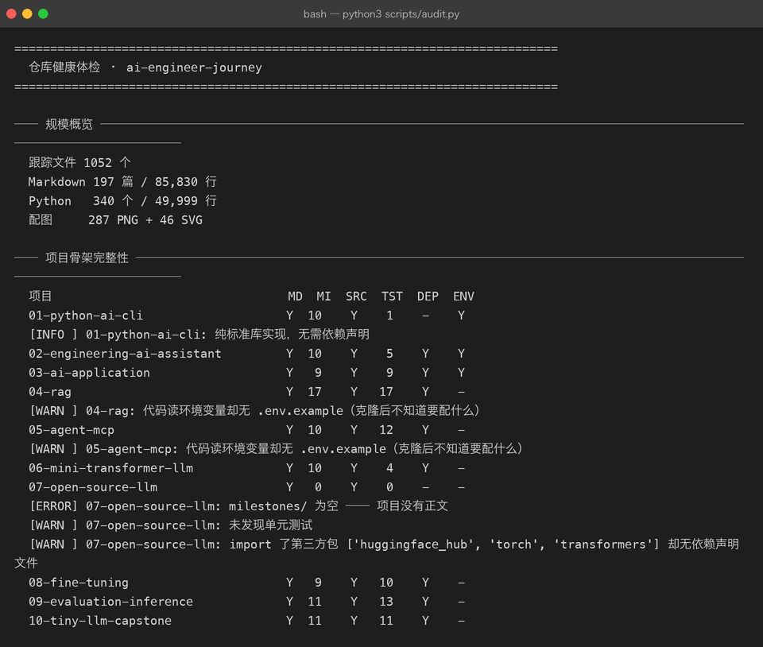
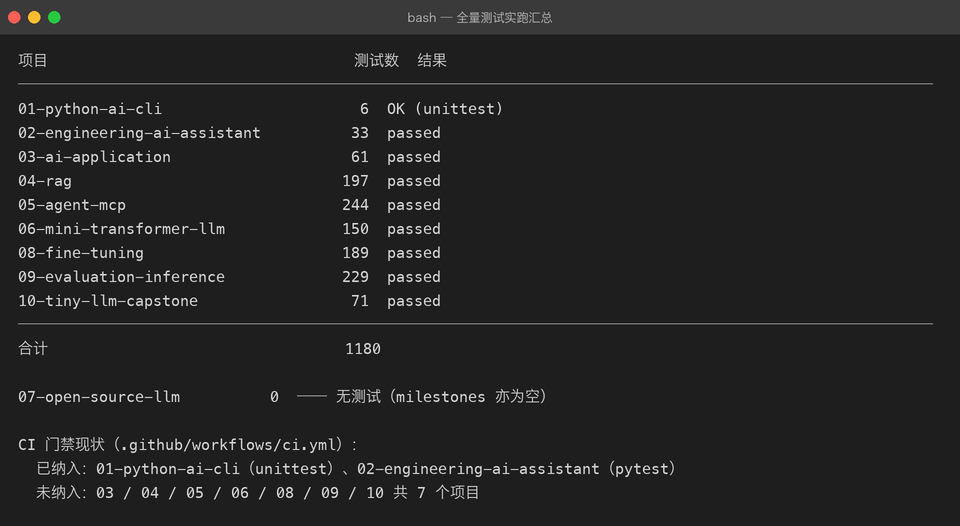
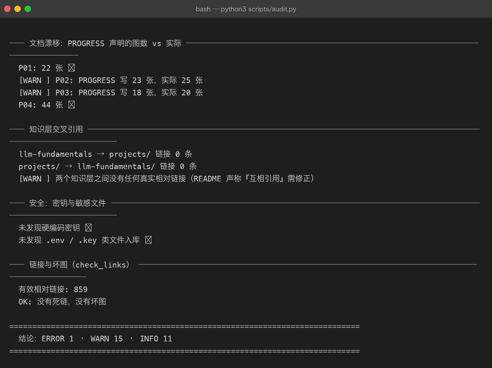
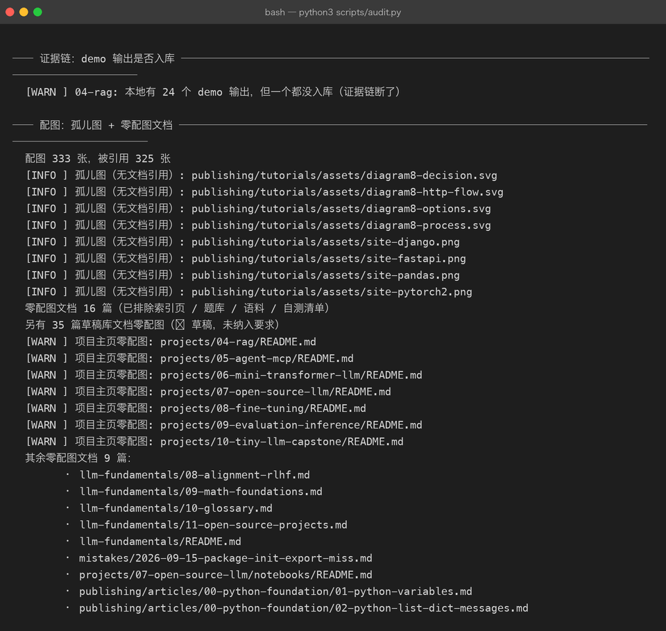

# 全仓库体检报告 · 2026-09-30

> 体检对象：`ai-engineer-journey` @ **`2014d85`**
> 全部数字来自当场执行的真实命令，原始输出存档在 [`assets/audit-run.txt`](assets/audit-run.txt) 与 [`assets/tests-run.txt`](assets/tests-run.txt)。
>
> **口径说明**：本报告描述的是 `2014d85` 那一刻的状态。报告自身连同体检脚本一共新增了
> 9 个文件（2 篇文档 + 4 张截图 + 2 份原始输出 + 1 个脚本），因此把报告提交上去之后，
> 「跟踪文件 / Markdown / 配图 / 链接」这几个总数会比下表各多出对应的一点点。
> 这是审计报告的固有自指效应，不是数据失真 —— 需要最新数字时重跑 `scripts/audit.py` 即可。

---

## 0. 一句话结论

**骨架是完整的，质量底线守住了，但「新克隆者能不能跑起来」和「CI 到底守住了什么」这两件事上没有对齐。**

- 守住的部分：1180 项测试全绿、859 条相对链接零死链、零硬编码密钥、333 张配图里 325 张有引用（无占位图、无来源不明图片）。
- 没对齐的部分：**1 个阻断级缺口（P07 无正文）**、**3 项会让复现失败的欠账（CI 只门禁 2/10 项目、P04/P05 无 `.env.example`、P04 证据链未入库）**，外加 11 项文档漂移与规范漂移。

体检结论：`ERROR 1 · WARN 15 · INFO 11`。

---

## 1. 体检方法（可复现）

```bash
python3 scripts/audit.py --quick          # 8 项检查：规模 / 骨架 / 证据链 / 配图 / 漂移 / 交叉引用 / 密钥
python3 scripts/audit.py --tests          # 额外实跑全部项目测试（约 85 秒）
```



上图这一屏就把问题暴露出来了：`07-open-source-llm` 的 `MI`（milestone 数）是 **0**，而 `04-rag` / `05-agent-mcp` 的 `ENV` 列是空的。

> **写体检工具时踩到的一个坑，值得单独记一句**：孤儿图检测最初扫描仓库里**所有**文本文件。
> 结果本报告的归档 `assets/audit-run.txt` 里原样抄了一遍 `[INFO] 孤儿图: .../site-pandas.png`，
> 工具就把这行当成了「该图被引用」，**8 个孤儿图瞬间全部消失**。
> 修法：引用来源只扫 `.md / .html / .py / .yml / .json / .ipynb`，不扫 `.txt`。
> 教训——**观测工具的输出一旦进了被观测范围，就会污染观测结果**；这类自指污染不会报错，只会让数字悄悄变好看。

---

## 2. 现状盘点

### 2.1 规模

| 项 | 数量 |
|----|------|
| git 跟踪文件 | 1,052 |
| Markdown | 197 篇 / 85,830 行 |
| Python | 340 个 / 49,999 行 |
| 配图 | 287 PNG + 46 SVG |

### 2.2 项目矩阵（`Y` 表示齐备，`-` 表示缺失）

| 项目 | README | Milestones | src | 测试数 | 依赖声明 | `.env.example` |
|------|:---:|---:|:---:|---:|:---:|:---:|
| 01-python-ai-cli | Y | 10 | Y | 6 | 不需要¹ | Y |
| 02-engineering-ai-assistant | Y | 10 | Y | 33 | Y | Y |
| 03-ai-application | Y | 9 | Y | 61 | Y | Y |
| 04-rag | Y | 17 | Y | 197 | Y | **-** |
| 05-agent-mcp | Y | 10 | Y | 244 | Y | **-** |
| 06-mini-transformer-llm | Y | 10 | Y | 150 | Y | 不需要² |
| **07-open-source-llm** | Y | **0** | Y | **0** | **-** | 不需要³ |
| 08-fine-tuning | Y | 9 | Y | 189 | Y | 不需要² |
| 09-evaluation-inference | Y | 11 | Y | 229 | Y | 不需要² |
| 10-tiny-llm-capstone | Y | 11 | Y | 71 | Y | 不需要² |

¹ P01 是纯标准库教学项目（`import` 只有 `pkgdemo` 等本地包），按 CONTRIBUTING §4「v0.1 允许零依赖标准库实现」豁免。
² P06 / P08 / P09 / P10 走纯 numpy 手写路线，不调外部 API，因此没有 Key 需求。
³ P07 的 `pipelines/` 需要 `DEEPSEEK_API_KEY`，但确实没有 `.env.example` —— 见 §3 第 3 条。

### 2.3 测试实跑（1180 项，全绿）



合计 **1180 项全绿，0 failed**。这个数字值得单独强调：它是本仓库最硬的质量资产。

> 表末两行是本期人工补充的 CI 现状说明，不是工具输出。同一批数字已用
> `python3 scripts/audit.py --tests` 独立复跑一次核对（87 秒，逐项一致，`全部通过 ✓`），
> 所以结论不依赖某个临时脚本。

### 2.4 安全与链接基线



这一屏是全仓库最让人放心的部分：**零硬编码密钥、零 `.env`/`.key` 入库、859 条相对链接零死链零坏图**。
`check_links.py --strict` 也挂在 CI 上，属于「已经守住、不需要额外投入」的底线。

---

## 3. 发现清单

### P0 — 阻断级（1 项）

#### 3.1 `projects/07-open-source-llm/milestones/` 为空

- **现象**：目录存在但 0 个 `.md`。ROADMAP 承诺 9 个 Milestone，实际一条正文都没有。
- **不是偷懒，是被资源卡住**：本机 M1 磁盘余量 ~15 GB，而 Qwen2.5-7B 的 bf16 权重就要 14.18 GiB。项目已拆成两条线，`pipelines/` 那条（调用 / 参数 / 显存账本）**已真实跑通并产出 6 张终端截图**，`notebooks/` 那条在等 Colab GPU。
- **后果**：这是全仓库唯一的 `ERROR`。它让 ROADMAP 里「9 个 Milestone」的进度表（✅/🔶/⬜）失去正文支撑 —— 读者点进去是空的。同时它也是唯一没有单元测试的项目，而 P07 的 `pipelines/llm_client/` 是有真实逻辑的（参数账本、KV Cache 估算、usage 守恒校验）。
- **建议（两条路，推荐先做 B）**：
  - **A（等资源）**：等你在 Colab 跑完 `p07_colab.ipynb` / `p07_finetune_java_interview.ipynb`，回收输出后再写 milestone。缺点：无限期挂起，且 P07 会一直是仓库里唯一没有正文的项目。
  - **B（推荐，立即可做）**：把 `pipelines/` 已跑通的 6 条线**直接落成 6 篇 milestone 正文**（M01 调用 / M02 流式 / M03 生成参数 / M04 参数量对账 / M05 显存账本 / M06 Java 面试助手应用），把剩下 3 条（HF 生态 / BPE 细节 / 量化）在正文里明确标注为「待 GPU 资源，当前不可复现」。这样 P07 从「🔴 空目录」变成「🟡 6/9 文档就绪、3/9 明确挂起」，ROADMAP 的进度表才立得住。
  - **顺带**：给 `pipelines/llm_client/` 补最小单测（参数账本与 usage 守恒都是纯算术，不需要网络即可断言），补上 `pyproject.toml`。

### P1 — 影响复现（3 项）

#### 3.2 CI 只门禁 2/10 个项目：1180 项测试里只有 39 项被 CI 跑

- **现象**：`.github/workflows/ci.yml` 只跑 `01-python-ai-cli`（unittest 6 项）与 `02-engineering-ai-assistant`（pytest 33 项）。**3 / 4 / 5 / 6 / 8 / 9 / 10 共 7 个项目、1141 项测试完全不进 CI。**
- **风险**：CI 流水线显示绿色，容易被读成「全仓库健康」，实际它只覆盖了 3.3% 的测试。本仓库所有项目都刻意做到了**离线可跑**（Fake/InMemory 客户端 + 真实链路分离），所以加进去没有技术障碍。单次耗时也很可控：P08 最慢，34.8 s。
- **建议**：在 `ci.yml` 里按 `working-directory` 逐个补 step。P01/P02 步骤保留，新增 7 个。若担心总时长，可用 `matrix` 并行，或把 P08 单独放一个 job。验收：GitHub Actions 一次运行能打印出 1180 项测试结果。

#### 3.3 P04 / P05 没有 `.env.example`，README 也没说要配什么

- **现象**：两个项目的代码都读外部凭据（`DASHSCOPE_API_KEY`、`DEEPSEEK_API_KEY`），但仓库里既没有 `.env.example`，项目 README 里也**一个字都没提环境准备**。
- **对比**：P01 / P02 / P03 都有规范的 `.env.example`（内含 `your-api-key-here` 占位 + `DEEPSEEK_BASE_URL` 等）。
- **后果**：新克隆者跑 P04 的 embedding 链路会直接拿到 KeyError/401，且不知道要去哪配。这也是 CONTRIBUTING §4 明写的要求（「引入第三方库时同步给 `requirements.txt` + `.env.example`」）。
- **建议**：补两个 `.env.example`（`DASHSCOPE_API_KEY` / `DASHSCOPE_BASE_URL`、`DEEPSEEK_API_KEY` / `DEEPSEEK_BASE_URL` / `DEFAULT_MODEL`），并在两个 README 加一节「环境准备」。验收：`git ls-files | grep env.example` 能列出 5 个项目。

#### 3.4 P04 的 demo 输出全部未入库，证据链与其余 9 个项目不一致

- **现象**：`projects/04-rag/.gitignore` 里有一行 `demos/out/`，导致本地 24 个输出文件**一个都没入库**；而 01 / 02 / 03 / 05 / 06 / 07 / 08 / 09 / 10 **全部入库**（P05 入库 14 个、P01 9 个……）。
- **后果**：P04 文档里引用的实测数字（`recall@1 87.5%`、阈值校准曲线等）在克隆后的仓库里**无法被复核**，也无法重渲染截图。这与 P10 确立的原则直接冲突：*「`demos/out/*_terminal.txt` 必须入库，它是文档里所有数字的唯一来源」*。
- **建议**：二选一并写进 CONTRIBUTING，不要两套政策并存。推荐**改成与其余项目一致**（删掉那行 ignore、把 24 个输出入库），因为 P04 是本仓库图最多的项目（44 张），证据权重最高。验收：`git ls-files projects/04-rag | grep -c 'demos/out/'` 大于 0。

### P2 — 文档漂移（按 CONTRIBUTING §5，这些「视为 bug」）

| # | 位置 | 声称 | 实际 |
|---|------|------|------|
| 3.5 | `PROGRESS.md` Project 02 行 | `assets 共 23 张` | **25 张** |
| 3.6 | `PROGRESS.md` Project 03 行 | `assets 共 18 张` | **20 张** |
| 3.7 | `README.md` 结构树第 75 行 | `exercises/ # 01-basic 已有题，02/03/04 待播种` | **4 个目录都已播种**（各 2 个文件） |
| 3.8 | `projects/07-open-source-llm/pipelines/README.md` | 3 处引用 `workflows/` 目录（第 5 / 16 / 266 行） | **该目录不存在**（`ls` 报 No such file） |
| 3.9 | `README.md` §基础知识层 + `ROADMAP.md` 附节 | 「两者**互相引用**，不重复正文」 | 双向真实相对链接 **0 条**（`llm-fundamentals → projects/` 0，反向 0） |
| 3.10 | `CONTRIBUTING.md` §1 | 「**所有知识**只维护在 `projects/*/milestones/`」；禁止清单含 `curriculum/` `labs/` `knowledge/` `assessments/` | `llm-fundamentals/` 是事实上的第二棵知识树，**不在豁免清单里**，措辞与之直接冲突 |
| 3.11 | `CONTRIBUTING.md` §6 | 「是否推送由维护者当场决定；未明确授权时不推送」 | 实际执行的是 origin + gitee 双推，两者矛盾 |
| 3.12 | `CONTRIBUTING.md` §6 | 「里程碑打 tag」 | `git tag` **0 个** |

**建议**：3.5–3.9 是纯修数字/改措辞，一次提交可清完；3.10 / 3.11 需要在 CONTRIBUTING 里补第 3 条豁免（把 `llm-fundamentals/` 写成「已批准的例外：理论层只讲为什么，不复制 milestone 正文」）并重写推送条款；3.12 要么给已完成的 P08/P09/P10 补 tag，要么把这条规则删掉（**规则写了不执行，比没写更有害**，因为后来者会以为它在执行）。

### P3 — 资产与规范（6 项）

#### 3.13 7 个项目主页零配图

`projects/{04-rag, 05-agent-mcp, 06-mini-transformer-llm, 07-open-source-llm, 08-fine-tuning, 09-evaluation-inference, 10-tiny-llm-capstone}/README.md` 一篇图都没有。这 7 个恰好是最"重"的项目。项目主页是读者进入任何项目的**第一落点**，而仓库的硬约定是「所有文档必须配图」。

**建议**：每个主页补 1 张——优先复用已有资产里的**架构图 SVG**（P06–P10 各有 9–11 张手写 SVG），或用现成的终端截图拼一张 montage。不要新造图，避免又产生一批没人引用的孤儿图。



#### 3.14 4 张无人引用的网站截图（约 833 KB）

`site-django.png` 56 KB、`site-fastapi.png` 124 KB、`site-pandas.png` 116 KB、`site-pytorch2.png` 537 KB —— `git grep` 全仓库零命中。**建议**：确认是否留给后续文章；若无用途则删除。**不建议直接删**，先确认。

#### 3.15 4 个 `diagram8-*.svg` 不是孤儿，但容易被误删

它们与同名 `.png` 成对存在（`diagram8-decision.svg` ↔ `.png`），是渲染 PNG 前保留的矢量源文件。体检脚本把它们标为「未被引用」，实际是**有意保留**。**建议**：在 `publishing/tutorials/README.md` 的「配图规范」里补一行「SVG 矢量源文件与 PNG 成品并存，不入引用表」，否则下一轮体检或清理时大概率被当垃圾删掉。

#### 3.16 配图命名规范漂移

CONTRIBUTING §2 规定配图前缀为 `site-* / term-* / colab-* / diagram-*`。实际：

- `llm-fundamentals/assets/`：`attention-heatmap.png`、`kv-cache-memory.png`、`positional-encoding.png`、`scaling-law.png`、`softmax-temperature.png`、`lora-params.png` —— 6 张全部无前缀。
- `projects/06–10/assets/*.svg`：描述性命名（如 `model-serving.svg`），亦无前缀。

**建议**：与其强行改名（会产生大量链接变更风险），不如**放宽规范**：在 CONTRIBUTING §2 补一句「教学用示意图允许描述性命名，但同一目录内必须唯一且格式统一」。规范要服务一致性，不是制造改造工作量。

#### 3.17 错题本几乎空着

`mistakes/` 只有 1 条记录（2026-09-15）。而**实际踩过的坑远不止一个**——仅在项目工作日志里就能捞出几十条，例如：

- P06 的 `Tensor.__init__` 把 `_backward` 设成实例属性，**遮蔽**子类同名方法 → 梯度校验静默返回 1.0、loss 不降且不报错（最阴的一类静默失败）
- P06 的 `Module.parameters()` 漏掉整个词嵌入（`TokenEmbedding` 未继承 `Module`）→ 少算 65,536 参数
- P06 的 Adam 动量从未累积（`step()` 里 m/v 是局部变量）
- ASCII 双引号内嵌中文引号 → Python `SyntaxError`（llm-fundamentals 4 个脚本同时中招）
- macOS 的 `HTTP_PROXY` 拦截 localhost → 本地服务测不通

`mistakes/README.md` 自己写着「教程让人看懂，错误记录让人真正掌握」。**这是 Track 1（我是否真的学会）的一部分，但它现在是空的。** 建议：先补 5 条最有价值的（上面前三条 + 中文引号 + HTTP_PROXY），每条按既定 7 段式写。

#### 3.18 只有 2/10 个项目有自测清单，Track 1 无法执行

PROGRESS 把「学习进度」列为 Track 1 并声明「文档就绪 ≠ 已掌握」，判定规则是「做完题 → 能讲清为什么 → 才由你本人打勾」。但：

- `LEARNING.md`（自测清单）**只有 P02、P03 有**。
- `exercises/`（题库）**只有 P01、P02、P03 有**。

也就是说，**P04–P10 这 7 个项目（占仓库 63% 的里程碑、最多的代码）根本没有自测手段**，Track 1 对它们完全是空转。

**建议**：这是本报告里**对你的学习收益 highest-leverage 的一项**。不必一次做满 7 个，建议按「你已经学完哪个就补哪个」的顺序，每个项目先做 10 道判断题 + 5 道动手题（P02/P03 的 LEARNING.md 已有成熟模板可复制）。验收：PROGRESS 的 Track 1 表格里，7 个「⬜ 未开始」至少有 1 个能开始。

---

## 4. 补充建议清单（可直接照着做）

按「先修会误导人的，再修会拦住人的，最后修锦上添花的」排序。

| 序 | 事项 | 动作 | 验收标准 | 量级 |
|:--:|------|------|----------|------|
| 1 | P07 无正文（P0） | 把 `pipelines/` 已跑通的 6 条线落成 6 篇 milestone，其余 3 条标注「待 GPU」 | `ls projects/07-open-source-llm/milestones/*.md` ≥ 6 | 中 |
| 2 | CI 形同虚设（P1） | `ci.yml` 补 7 个项目的 pytest step | Actions 日志能见到 1180 项测试 | 小 |
| 3 | 文档漂移 3.5–3.9 | 改 2 处数字、1 处结构树描述、3 处 `workflows/` 引用、交叉引用措辞 | `python3 scripts/audit.py` 的 WARN 减少 5 条 | 小 |
| 4 | P04/P05 无法复现（P1） | 补 2 个 `.env.example` + 2 段「环境准备」 | `git ls-files \| grep -c env.example` = 5 | 小 |
| 5 | P04 证据链（P1） | 取消 `demos/out/` 忽略、24 个输出入库 | P04 输出入库数 > 0 | 小 |
| 6 | CONTRIBUTING 与现实冲突 3.10–3.12 | 补 `llm-fundamentals` 豁免条款、重写推送条款、给 P08–P10 补 tag（或删掉该规则） | 规则与实际一致，无「写了不执行」的条款 | 小 |
| 7 | 项目主页零配图 3.13 | 7 个主页各配 1 张（优先复用已有 SVG/截图） | audit 的「项目主页零配图」WARN 归零 | 中 |
| 8 | 错题本空置 3.17 | 补 5 条真实踩坑记录 | `ls mistakes/*.md \| wc -l` ≥ 6 | 中 |
| 9 | Track 1 空转 3.18 | 按已学进度，给 P04–P10 补 `LEARNING.md` + 题 | Track 1 至少有 3 个项目能开始 | **大（但收益最高）** |
| 10 | 资产清理 3.14 / 3.15 / 3.16 | 确认 4 张无用截图后再删；补 SVG 源文件说明；放宽命名规范 | audit 的 INFO 项有明确处置意见 | 小 |

---

## 5. 不建议做的事

- **不要把 `llm-fundamentals/` 合并进 `projects/`**。两者定位不同（理论层 vs 实践层），合并成本高且会让 milestone 正文变成大杂烩。正确解法是补交叉引用（建议：llm-fundamentals 每章末尾加一行「对应实践项目」，同时给 P06/P08/P10 的 README 加一行「理论背景见 llm-fundamentals 第 N 章」）。
- **不要为了统一命名规范去批量重命名配图**。333 张图里任何一次改名都要同步文档引用，风险远大于收益。放宽规范即可。
- **不要直接删那 4 张 `site-*.png`**。先确认没有留给后续文章，再走删除流程。

---

## 附：复现本期体检

```bash
cd ai-engineer-journey
python3 scripts/audit.py > audit/assets/audit-run.txt              # 体检（本报告 §1/§3 的证据）
python3 scripts/audit.py --tests | tail -16 | tee audit/assets/tests-run.txt  # 全量测试（§2.3）
python3 scripts/check_links.py --strict                            # 死链坏图
```

截图渲染（需要带 Pillow 的解释器）：

```bash
P=/Users/beiluo/.workbuddy/binaries/python/envs/default/bin/python
$P scripts/render_terminal.py <(sed -n '1,28p'  audit/assets/audit-run.txt) \
    --out audit/assets/audit-01-skeleton.png --title "bash — python3 scripts/audit.py"
```

---

[← 返回体检档案](README.md)
