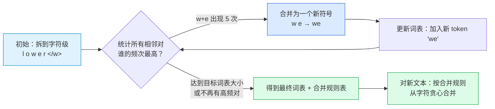
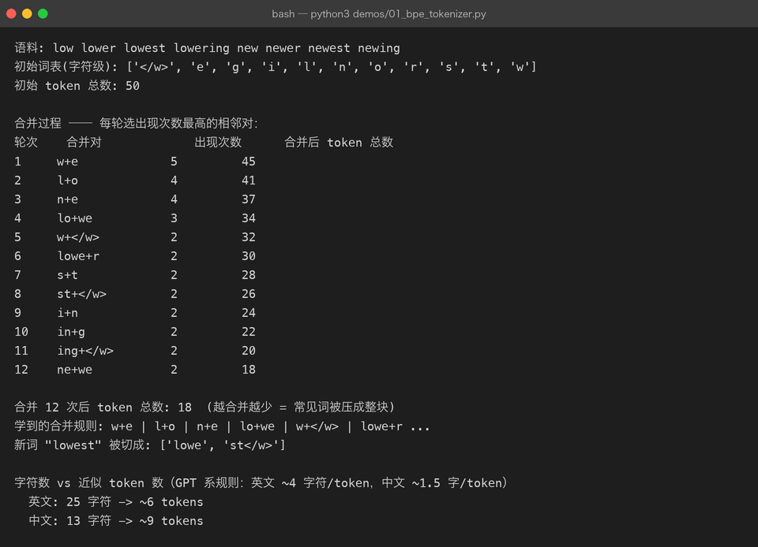
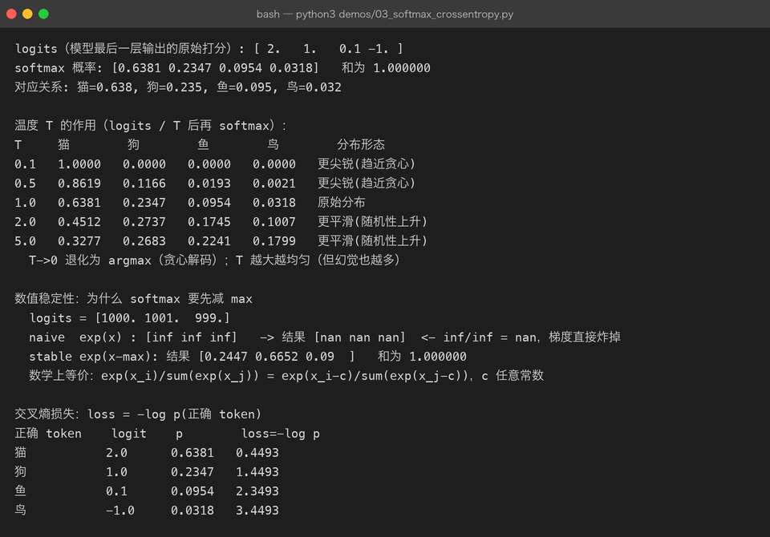
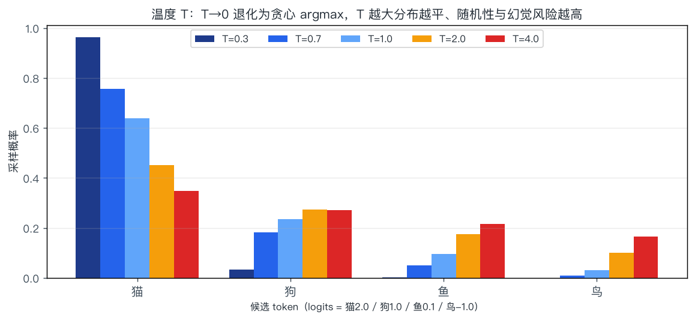
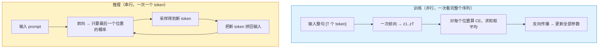
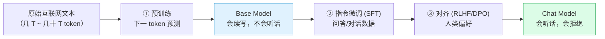

# 01 · 语言模型基础：一个 token 的一生

> **一句话结论**：大语言模型（LLM）在训练时唯一做的事，就是**给定前文，预测下一个 token 的概率分布**。
> 所谓"智能"，是在把这个目标做到极致的过程中**涌现**出来的副产品。

本章把这条链路走完一遍：`文本 → token → 向量 → logits → 概率 → 损失`。这一步走通了，后面所有章节都只是在这条链路上加零件。

---

## 1.1 从一句话开始：语言模型到底在算什么

给模型半句话：

```
我 在 北京 吃 烤 ___
```

它输出的是一个**概率分布**，而不是一个词：

| 候选 | 烤鸭 | 羊肉 | 火锅 | 香蕉 |
|------|------|------|------|------|
| 概率 | 0.62 | 0.15 | 0.11 | 0.0003 |

用数学写出来，语言模型做的是把整个序列的联合概率**分解成一串条件概率**：

$$
P(w_1, w_2, \dots, w_n) \;=\; \prod_{t=1}^{n} P\big(w_t \mid w_1, \dots, w_{t-1}\big)
$$

这个分解叫**自回归（autoregressive）**：每一步只看前面，不看后面。它带来两个直接后果：

| 后果 | 说明 |
|------|------|
| 训练可以高度并行 | 一句话里每个位置的目标都是"下一个词"，一次前向就能算出全部位置的损失（见 1.6） |
| 生成必须串行 | 第 t 个 token 是第 t+1 个的输入，只能一个一个吐（见 [第 07 章](07-decoding-and-inference.md)） |

```text
输入:  我  在  北京  吃  烤
目标:  在  北京  吃  烤  鸭        <- 每个位置都预测"它的下一个"
       ↑ 这就是"下一 token 预测"，一句话同时提供了 5 个训练样本
```

> **记住这一句**：整个 LLM 产业（预训练 → 微调 → 对齐 → 推理优化）都是围绕"下一 token 预测"这一个目标展开的。

---

## 1.2 第一步：文本 → token（分词 / Tokenization）

模型不认识字符，只认识整数。**token 是模型处理文本的最小单位**，介于"字符"和"词"之间。

### 1.2.1 为什么不用「按字符」或「按词」

| 粒度 | 词表大小 | 序列长度 | 问题 |
|------|----------|----------|------|
| 按字符 | 极小（~10⁴） | 太长 | 序列翻好几倍，注意力是 O(n²)，算不起；单字符信息量太低 |
| 按词 | 极大（10⁶⁺） | 短 | 未登录词（OOV）无法处理；中文/德语的复合词爆炸；词表大 → embedding 矩阵和 softmax 都变贵 |
| **BPE 子词** | 中（3×10⁴ ~ 2×10⁵） | 适中 | ✅ 常见词整块保留，生僻词拆成片段，兼顾长度与词表 |

### 1.2.2 BPE：字节对编码的算法思想

BPE（Byte-Pair Encoding）的核心只有两步循环：**统计最常相邻的符号对 → 合并它**。



下面是 `demos/01_bpe_tokenizer.py` 的**真实运行结果**（语料 8 个词，合并 12 次）——注意"合并后 token 总数"一路下降，说明常见片段被压成了整块：



合并过程中学到的高频组合，正好是英语里最常见的词素：`w+e` → `l+o` → `n+e` → `lo+we` → `w+</w>` → `lowe+r` … 最后新词 `lowest` 被切成 `['lowe', 'st</w>']` 而不是 6 个字符。**这就是子词分词的价值：见过的部分复用，没见过的部分拆开。**

### 1.2.3 真实的分词器长什么样

生产模型用的是**字节级 BPE（BBPE）**：先按 UTF-8 转成字节，再对字节做 BPE。好处是**任何 Unicode 文本都不会 OOV**，最坏情况退化为逐字节。

| 模型 | 分词器 | 词表大小 | 特点 |
|------|--------|----------|------|
| GPT-2 | BPE | 50,257 | 最早的字节级 BPE |
| GPT-4 / o 系列 | cl100k_base / o200k_base | 10 万 / 20 万 | 合并了多空格、对代码友好 |
| LLaMA 3 | TikToken-based BPE | 128,256 | 词表大 → 同样文本 token 更少，推理更快 |
| Qwen / DeepSeek | BPE | 15 万左右 | 中文压缩率高（1 汉字常为 1 token） |
| SentencePiece / Unigram | 语言无关子词 | 32k 左右 | 不依赖空格，适合中日韩 |

### 1.2.4 中文为什么更"贵"

同样的意思，中文信息密度高、但**每个汉字占的字节多**（UTF-8 一个汉字 3 字节），早期面向英文训练的分词器会把一个汉字拆成 2–3 个 token：

| 文本 | 字符数 | 大致 token 数 | 说明 |
|------|--------|---------------|------|
| `The quick brown fox jumps` | 25 | ~6 | 英文约 4 字符/token |
| `那只敏捷的棕色狐狸跳了过去` | 13 | ~9（老分词器） / ~13（中文优化后 1 字 1 token） | 中文早期常 1 字 ≈ 1.5 token |

**这件事有真实的钱味**：token 数直接决定 API 计费和上下文上限。所以国内模型都专门扩了中文词表。

### 1.2.5 别忽略特殊 token

| token | 作用 | 典型形式 |
|-------|------|----------|
| BOS / EOS | 序列开始 / 结束 | `<s>`、`<｜endoftext｜>` |
| PAD | 批处理时补齐长度 | `<pad>`（注意 attention mask 要屏蔽掉，见 [第 02 章](02-attention.md) 2.5） |
| 角色标记 | 对话模板 | `<｜im_start｜>user` … `<｜im_end｜>` |

> **坑**：同一个模型权重，用错 chat template（比如漏掉角色标记）会让效果断崖式下跌。这不是"格式洁癖"，因为模型就是在这些 token 的分布上训练出来的。

---

## 1.3 第二步：token → 向量（Embedding）

token id 只是索引，没有语义。要参与矩阵运算，必须先变成向量。

$$
\text{embedding 矩阵 } E \in \mathbb{R}^{V \times d_{model}},\qquad
x_t = E[\,\text{id}_t\,] \in \mathbb{R}^{d_{model}}
$$

- `V`：词表大小（例如 128,256）
- `d_model`：隐藏维度（例如 4096）
- 所谓"查表"，数学上等价于 **one-hot 向量 × E**

```text
id = 321   ->   one-hot(长度 V) = [0,0,...,1,...,0]
                                       ↑ 第 321 位
              ×  E (V × d_model)
                    ↓
              x = [0.12, -0.88, ..., 0.31]     长度 d_model
```

| 关键性质 | 含义 |
|----------|------|
| 参数量 = `V × d_model` | LLaMA-7B：128k × 4096 ≈ **5.2 亿**参数，占总参数 7.5%，不小 |
| 语义相似 = 向量相近 | "猫"和"狗"的 embedding 余弦相似度明显高于"猫"和"利率" |
| 一个 token 一个向量？ | 不完全是。同一个词在不同上下文中，**上下文相关表示**在注意力层里被改写（见 [第 02 章](02-attention.md)） |
| 权重共享（weight tying） | 输出投影 `d_model × V` 直接复用 `Eᵀ`，省下同样的 5 亿参数（GPT-2 / 多数小模型这么做） |

> 注意区分两个常被混为一谈的词：
> - **Input embedding**：token → 向量（本章）
> - **Sentence embedding / text embedding**：整句话 → 一个向量，用于检索。RAG 用的就是这种（由 encoder 或专门的双塔模型产出），跟语言模型内部的 embedding 不是一回事。

---

## 1.4 第三步：向量 → 概率（LM Head + Softmax）

经过 N 层 Transformer（[第 03 章](03-transformer.md)）后，最后一个位置的隐藏状态 `h ∈ R^{d_model}` 要变成"下一个词的打分"。

$$
\text{logits} = h \, W_{lm},\quad W_{lm} \in \mathbb{R}^{d_{model} \times V}
\qquad\Longrightarrow\qquad
p = \operatorname{softmax}(\text{logits})
$$

### 1.4.1 logits 是什么

**logits = 未归一化的打分**，可以为负、可以很大，还不构成概率分布。只有过完 softmax 才是概率。

$$
\operatorname{softmax}(z)_i = \frac{e^{z_i}}{\sum_{j=1}^{V} e^{z_j}}
$$

工程上必须**先减去最大值**再取指数——数学上等价，但能避免 `exp(1000)` 溢出：

$$
\operatorname{softmax}(z)_i = \frac{e^{\,z_i - \max_j z_j}}{\sum_j e^{\,z_j - \max_j z_j}}
$$

下面是 `demos/03_softmax_crossentropy.py` 的真实输出，用 `logits = [1000, 1001, 999]` 做了对照实验：



看第 2 段：**不减最大值时 `exp` 全部溢出成 `inf`，`inf/inf` 得到 `nan`，梯度直接炸掉**；减掉最大值后得到正常的 `[0.2447, 0.6652, 0.0900]`。这就是为什么所有框架的 softmax 都是"数值稳定"版本。

### 1.4.2 温度 T：采样时的"随机性旋钮"

在 softmax 之前把 logits 除以 T：

$$
p_i = \operatorname{softmax}\!\left(\frac{z_i}{T}\right)
$$



| T | 效果 | 使用场景 |
|---|------|----------|
| → 0 | 退化为 argmax（永远取最高分） | 数学解题、抽取结构化字段 |
| 0.2 – 0.7 | 分布更尖锐，稳定但略死板 | 代码、翻译、RAG 问答 |
| 1.0 | 使用模型原始分布 | 通用对话 |
| > 1.2 | 分布变平，长尾 token 有机会 | 创意写作、头脑风暴（**幻觉风险同步上升**） |

> 注意：温度**不改变相对排序**，只改变分布平坦程度。`argmax` 在任意 T 下都不变——所以"调温度"解决不了"模型把答案排在了第二位"这类问题。

### 1.4.3 完整链路速查

| 阶段 | 张量形状 | 含义 | 典型数值 |
|------|----------|------|----------|
| 输入文本 | `(1,)` str | `"我在北京吃烤"` | — |
| token ids | `(T,)` int | `[7892, 221, 1900, ...]` | 词表内 |
| embedding | `(T, 4096)` float | 逐 token 向量 | ~N(0, 1) |
| 隐藏状态（末层） | `(T, 4096)` float | 上下文相关表示 | — |
| logits | `(T, V)` float | 每个位置对全词表打分 | −30 ~ +30 |
| 概率 | `(T, V)` float | 每行和为 1 | 0 ~ 1 |
| 采样结果 | `(1,)` int | 实际吐出的 token | 词表内 |

---

## 1.5 训练目标：交叉熵与困惑度

### 1.5.1 交叉熵损失

$$
\mathcal{L} = -\frac{1}{T}\sum_{t=1}^{T} \log P\big(w_t \mid w_{<t}\big)
\;=\; -\frac{1}{T}\sum_{t=1}^{T} \log \operatorname{softmax}(z_t)\big[\,w_t\,\big]
$$

符号含义：

| 符号 | 含义 |
|------|------|
| $T$ | 序列长度（实际是有效 token 数，PAD 不算） |
| $z_t$ | 第 t 个位置的 logits，维度 V |
| $z_t[w_t]$ | 正确 token 对应的那一个 logit |
| $\log$ | 自然对数 |

**直觉**：只惩罚"正确 token 的概率不够高"。模型给出的正确概率是 0.9 → loss 0.105；只给 0.01 → loss 4.6。

### 1.5.2 shift-by-one：目标怎么对齐

```text
tokens:   [BOS]  我   在   北京  吃   烤   鸭   [EOS]
logits:    z0    z1   z2   z3   z4   z5   z6
target:     我   在   北京  吃   烤   鸭   [EOS]   <- 就是输入左移一位
loss:     CE(z0, 我) + CE(z1, 在) + ... + CE(z6, EOS)
```

**一句话：输入和标签是同一串 token，只是错开一格。** 这就是"自监督"——不需要任何人工标注。

### 1.5.3 困惑度（Perplexity）

$$
\mathrm{PPL} = \exp(\mathcal{L}) = \exp\!\left(-\frac{1}{T}\sum_t \log p_t\right)
$$

| 交叉熵 | 困惑度 | 人话解释 |
|--------|--------|----------|
| 0.00 | 1.0 | 完全确定（不可能达到） |
| 0.69 | 2.0 | 每次预测 ≈ 在 2 个候选里犹豫 |
| 2.30 | 10.0 | 每次都像在 10 个候选里挑 |
| 5.00 | 148 | 基本在瞎猜 |

真实参考（不同语料不可直接比）：

| 模型 / 设置 | 交叉熵 | 困惑度 |
|-------------|--------|--------|
| 随机猜（词表 5 万） | 10.8 | 5 万 |
| GPT-2 在通用英文 | ~3.0 | ~20 |
| 现代 7B 模型在英文维基 | ~2.2 | ~9 |
| 现代 70B+ 模型 | < 2.0 | < 8 |

**困惑度越低 ≠ 越有用**。它衡量的是"对语料的拟合"，而用户关心的是"任务做对没有"。这两者常常一起上升，但对齐（[第 08 章](08-alignment-rlhf.md)）后经常出现"困惑度略升、人类评价更高"的情况。

### 1.5.4 为什么用交叉熵，不用准确率

| 指标 | 可导 | 梯度信息 | 结论 |
|------|------|----------|------|
| 准确率（是否 argmax 命中） | ✗ 阶梯函数，几乎处处梯度为 0 | 无 | 无法训练 |
| 交叉熵 | ✓ | 连续反映"差多远" | ✅ 训练目标 |
| 困惑度 | ✓（是 CE 的单调变换） | 与 CE 等价 | 用来汇报 |

---

## 1.6 训练 vs 推理：同一个模型的两种姿势



| 维度 | 训练 | 推理（生成） |
|------|------|--------------|
| 并行度 | 全部位置并行 | 严格串行 |
| 输入 | 真实文本（teacher forcing） | 模型自己刚生成的 token |
| 计算特点 | 算力密集（矩阵乘满负荷） | 显存带宽密集（每步只算一点） |
| 关键优化 | 混合精度、并行策略、FlashAttention | KV Cache、连续批处理、量化（[第 07 章](07-decoding-and-inference.md)） |
| 副作用 | — | **曝光偏差（exposure bias）**：训练时只看过正确前缀，推理时错一步就可能越走越偏 |

> **曝光偏差**是"训练/推理不一致"的经典后果。缓解手段（如 scheduled sampling）在 LLM 时代不主流，更常用的办法是：**对齐阶段教它自我纠错**（[第 08 章](08-alignment-rlhf.md)），以及**解码阶段加约束**（[第 07 章](07-decoding-and-inference.md)）。

---

## 1.7 完整地图：三阶段分别改变了什么



| 阶段 | 数据形态 | 改变了什么 | 详见 |
|------|----------|------------|------|
| 预训练 | 海量无标注文本 | 学会语言与世界的统计规律 | [第 04 章](04-pretraining.md) |
| 指令微调 | 指令-回答对（万~百万级） | 学会"按指令办事"的形式 | [第 05 章](05-finetuning.md) |
| 对齐 | 人类偏好对比数据 | 学会"什么是好回答" | [第 08 章](08-alignment-rlhf.md) |

---

## 1.8 常被误解的点

| 误解 | 真相 |
|------|------|
| "模型在数据库里检索答案" | 知识被**压缩进参数**（分布式存储）。所以会有"记错"和"编造"，这是压缩的固有代价，不是 bug |
| "温度调低就不会胡说" | 低温度让输出更确定，但**错误答案同样更确定**。事实性要靠 RAG / 工具调用兜底 |
| "困惑度低就是好模型" | 困惑度只看语言拟合，不看指令遵循、事实性、安全性 |
| "token 就是词" | 一个词可能是多个 token，一个 token 也可能是半个词或一堆空格 |
| "logits 就是概率" | logits 未归一化，可为负。softmax 之后才是概率 |
| "训练时模型看见答案才知道怎么答" | 训练时确实喂了真实文本（teacher forcing），但模型内部**只能看到左侧位置**——因果掩码保证了这一点（[第 02 章](02-attention.md) 2.5） |

---

## 1.9 动手

```bash
cd llm-fundamentals

# 1) 亲手看 BPE 怎么合并：改 CORPUS 和 NUM_MERGES 再跑
python3 demos/01_bpe_tokenizer.py

# 2) 亲手看 logits → 概率 → loss：改 logits 数组再跑
python3 demos/03_softmax_crossentropy.py

# 3) 重画温度对比图
python3 demos/make_figures.py
```

**建议动手改的三个数**：

1. `01_bpe_tokenizer.py` 里把语料换成中文（`["我们", "你们", "他们", "我们"]`），观察合并出的 token 是什么——你会发现中文按字节合并会产出奇怪但有效的片段。
2. `03_softmax_crossentropy.py` 里把 `logits` 改成 `[0.1, 0.1, 0.1, 0.1]`，观察 loss 是否等于 `ln(4) = 1.386`（完全均匀分布时的交叉熵）。
3. 把 `batch_probs` 改成 4 个 0.25，验证 PPL = 4。

---

## 1.10 自查问题

1. 为什么语言模型的训练目标可以只用无标注文本？（答：标签是输入自身左移一位）
2. `tokenizer` 词表从 5 万扩到 15 万，会带来哪三处变化？（答：embedding 参数量 ×3、每句 token 数下降、softmax 计算量变大）
3. 为什么 softmax 要先减最大值？不减会怎样？
4. 交叉熵 2.3 对应的困惑度是多少？意味着什么？
5. 训练时是并行的，推理时为什么必须串行？这个差异导致哪种偏差？
6. 温度调到 0.01，模型输出会不会更"正确"？

---

[← 返回总览](README.md) · [下一章：注意力机制 →](02-attention.md)
