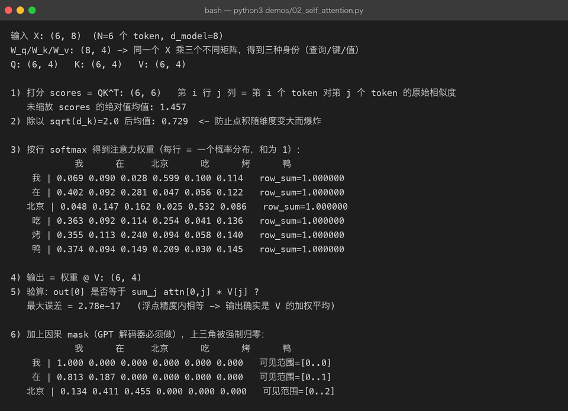
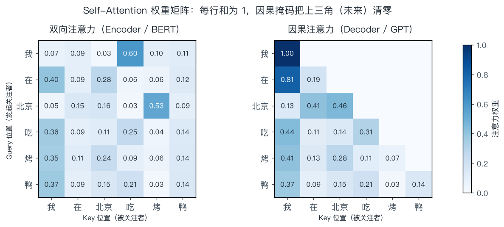
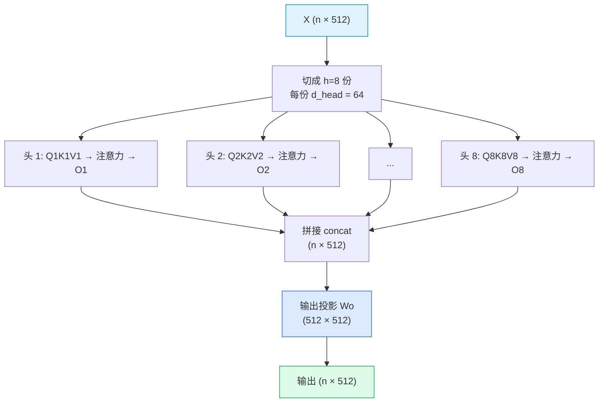

# 02 · 注意力机制：让每个 token 自己决定"看哪里"

> **一句话结论**：注意力机制做的只有一件事——**对序列做加权平均，而权重由"当前 token 想要什么"和"其他 token 能提供什么"的匹配程度决定**。
> 它解决了 RNN 的两个死穴：不能并行、长距离信息会被压扁。

本章是全书最重要的第一章。Transformer 的其他零件（残差、LayerNorm、FFN、位置编码）都是为了让这一层能稳定地叠很多层而存在的。

---

## 2.1 先看问题：RNN 为什么不够用

在注意力出现之前，序列建模的主流是 RNN / LSTM：从左到右读，把历史压进一个**固定长度的隐状态** `h_t`。

```text
RNN:   h1 ──► h2 ──► h3 ──► ... ──► h100
       ↑每个 h 都要等上一个算完（串行）
       ↑第 100 步要用第 1 步的信息，得穿过 99 次传递（梯度消失 / 信息被挤压）
```

| 问题 | 具体表现 |
|------|----------|
| 串行 | 第 t 步依赖第 t−1 步，GPU 的并行能力用不上，训练慢 |
| 信息瓶颈 | 无论前面多长，都被塞进一个固定维度向量；"第 1 个词"和"第 100 个词"抢同一块带宽 |
| 长距离依赖退化 | 距离越远，梯度越容易消失（LSTM 缓解但没根治） |

**注意力的回答很直接**：既然隐状态是瓶颈，那就不压缩——**让每个位置直接去"看"所有位置，按相关度加权取信息**。代价是从 O(n) 变成 O(n²)，但这笔账在现代硬件上算得过来。

---

## 2.2 直觉：图书馆检索

把注意力想成一次检索：

| 角色 | 类比 | 作用 |
|------|------|------|
| **Query（查询）** | 你手里的检索词 | "我现在需要什么信息" |
| **Key（键）** | 每本书的标题/标签 | "我能提供哪类信息" |
| **Value（值）** | 书的正文 | "实际内容是什么" |

流程：**用 Query 和每个 Key 比对相似度 → 得到一组权重（和为 1）→ 按权重把 Value 加权求和**。

```text
Query:  "我在找【吃的】"            (当前 token: 烤)
Key1:   "我"    相似度 0.07
Key3:   "北京"  相似度 0.03
Key4:   "吃"    相似度 0.60   <-- 最相关
Key6:   "鸭"    相似度 0.11
        ↓ softmax 归一化
权重:   [0.07, 0.09, 0.03, 0.60, 0.10, 0.11]     和 = 1
        ↓ 加权求和
输出 =  0.07·V(我) + 0.09·V(在) + ... + 0.11·V(鸭)
```

关键点：**Q、K、V 全部来自同一个输入 X**——所以叫 **Self**-Attention（自注意力）。三个不同的线性投影把同一个 X 映射成三种角色：

$$
Q = XW_Q,\qquad K = XW_K,\qquad V = XW_V
$$

| 矩阵 | 形状 | 作用 |
|------|------|------|
| $X$ | $(n, d_{model})$ | n 个 token，每个 d_model 维 |
| $W_Q, W_K, W_V$ | $(d_{model}, d_k)$ | 学出来的三套投影 |
| $Q, K, V$ | $(n, d_k)$ | 同一批 token 的三种"身份" |

> **面试常问**：为什么 Q/K/V 要分开？如果 K 和 Q 用同一个投影，相似度矩阵就变成对称的（$XWW^TX^T$），"我关注你"和"你关注我"永远同强度，表达力被削掉一半。V 单独一套，则是因为"相关性高"和"内容该抄多少"是两件事。

---

## 2.3 公式拆解与真实计算

### 2.3.1 完整公式

$$
\operatorname{Attention}(Q,K,V) \;=\; \operatorname{softmax}\!\left(\frac{QK^{\top}}{\sqrt{d_k}}\right)V
$$

拆成四步看：

| 步 | 运算 | 形状变化 | 含义 |
|----|------|----------|------|
| ① | $S = QK^{\top}$ | $(n,d_k)\times(d_k,n) \to (n,n)$ | 两两相似度打分矩阵 |
| ② | $S / \sqrt{d_k}$ | $(n,n)$ | 缩放，防止 softmax 过饱和（见 2.4） |
| ③ | $A = \operatorname{softmax}(S)$（按行） | $(n,n)$ | 每行是一个概率分布，和为 1 |
| ④ | $O = AV$ | $(n,n)\times(n,d_k) \to (n,d_k)$ | 按权重对 V 加权求和 |

### 2.3.2 跑一遍真的（demos/02_self_attention.py）

6 个 token、d_model=8、d_k=4 的真实运行结果：



三个关键读数：

1. **第 3 段的权重矩阵每行和都是 1.000000** —— softmax 是按行做的（对"被关注者"这一维归一化）。
2. **第 5 段最大误差 2.78e-17** —— 输出确实等于 $\sum_j A_{0j} V_j$，误差只是浮点舍入。这验证了"注意力 = 加权平均"这个本质。
3. **第 6 段加因果掩码后，上三角全为 0** —— 每行可见范围 `[0..i]`，且行和仍为 1。

同一批数据画成热力图，左右对照能看清掩码做了什么：



左图（双向）每个位置都能看全句；右图（因果）第 i 行只在 ≤ i 的格子有值——**这就是 Encoder 和 Decoder 的唯一本质区别**。

### 2.3.3 一个容易忽略的性质：注意力是"置换等变"的

把输入 token 的顺序打乱，输出会**以同样方式打乱**，但每个位置的数值不变：

$$
\operatorname{Attn}(\pi(X)) = \pi(\operatorname{Attn}(X))
$$

**这意味着自注意力本身完全不知道顺序！** "我在北京吃烤鸭"和"鸭烤吃京北在我"在这层看来是一样的。所以必须额外注入位置信息——这就是[位置编码](03-transformer.md#34-位置编码把顺序写进向量)存在的原因。

---

## 2.4 为什么必须除以 √d_k

这是面试里区分"背过公式"和"懂了"的经典问题。

**推导思路**（完整版见 [第 09 章 · Self-Attention 的缩放](09-math-foundations.md)）：

设 $q_i, k_j \in \mathbb{R}^{d_k}$ 的各分量独立、均值 0、方差 1，则点积的方差是：

$$
\operatorname{Var}\!\left(\sum_{i=1}^{d_k} q_i k_i\right) = \sum_{i=1}^{d_k} \operatorname{Var}(q_i k_i) = d_k
$$

也就是**点积的典型大小是 $\sqrt{d_k}$，随维度增长**。而 softmax 的输入一旦数值过大，分布就会极端化：

| softmax 输入尺度 | 分布形态 | 梯度状况 |
|------------------|----------|----------|
| 小（~1） | 平滑，各位置都能分到权重 | 梯度良好 |
| 大（±20） | 接近 one-hot | softmax 饱和区，**梯度 ≈ 0，学不动** |

除以 $\sqrt{d_k}$ 把点积的方差拉回 1，softmax 就工作在"有梯度"的区间。这不是经验技巧，而是**必须做的归一化**。

真实数据对照（`demos/02_self_attention.py` 的输出）：

| 指标 | 未缩放 | 除以 √d_k = 2.0 |
|------|--------|-----------------|
| 打分绝对值均值 | 1.457 | 0.729 |

> **补充**：这也是为什么后来出现 QK-Norm、softmax 前加 tanh 等变体——一旦维度继续变大（如 128 以上、或训练不稳定时），缩放系数还需要继续调。

---

## 2.5 掩码（Mask）：两条不同的"禁令"

注意力矩阵上叠一个可加性掩码（加 −∞ 或很大的负数），softmax 后对应位置概率为 0。

### 2.5.1 Padding Mask —— 别看 PAD

批处理时长短不一的句子要用 PAD 补齐：

```text
句子 A: 我 在 北京 吃 烤 鸭 [PAD] [PAD]
句子 B: 你 好 [PAD] [PAD] [PAD] [PAD] [PAD]
```

如果不管它，模型会把"关注 PAD"学成一个有意义的动作，污染表示。做法：

```python
scores = scores.masked_fill(pad_mask, -1e9)   # pad_mask: (batch, 1, 1, T)
```

### 2.5.2 Causal Mask —— 别看未来

解码器生成时，第 i 个位置不能提前看到 i+1：

$$
M_{ij} = \begin{cases} 0, & j \le i \\ -\infty, & j > i \end{cases}
$$

```text
允许位置:               被屏蔽位置:
1 . . . . .             。 X X X X X
1 1 . . . .             。 。 X X X X
1 1 1 . . .             。 。 。 X X X
1 1 1 1 . .             。 。 。 。 X X
1 1 1 1 1 .             。 。 。 。 。 X
1 1 1 1 1 1             。 。 。 。 。 。
```

为什么必须屏蔽？因为训练时**整个序列一次喂入**，如果不屏蔽，模型在预测第 3 个 token 时能直接"偷看"第 4 个 token 的输入——训练损失会降得很漂亮，但推理时根本看不到未来，效果直接崩。这种错误叫 **information leakage / 标签泄漏**。

| 掩码 | 用在哪 | 忽略的对象 |
|------|--------|------------|
| Padding mask | Encoder + Decoder | 补齐用的 PAD token |
| Causal mask | Decoder（包括所有 GPT 系模型） | 当前位置之后的 token |
| 两者组合 | Decoder 训练时 | PAD + 未来 |

> **坑**：现代推理框架里，同时用两种 mask 容易和 KV Cache 的偏移搞混（缓存长度 ≠ 当前序列长度），表现为"首 token 正常、后续开始乱说"。这也是 [第 07 章](07-decoding-and-inference.md) 要处理的问题。

---

## 2.6 多头注意力（MHA）：并行地看多种关系

单个注意力头只能输出**一种**加权平均模式。但语言里的关系是多种多样的：语法主谓、指代、修饰、位置邻近……

**做法**：把 d_model 切成 h 份，每份独立做一次注意力，最后拼回来。



维度与参数量（以 d_model=512, h=8 为例）：

| 项 | 计算 | 数量 |
|----|------|------|
| d_head | 512 / 8 | 64 |
| W_Q, W_K, W_V | 各 512×512 | 3 × 262,144 |
| W_O | 512×512 | 262,144 |
| 单头方案的参数量 | 512×512 × 3 + W_O | **完全相同** |

**结论**：多头**不增加参数量**，只是把同一块参数预算切成多个"视角"。所以多头几乎是免费的午餐——但它让不同头可以分工（真实模型里确实能观察到"位置头""语法头""指代头"）。

| 名词 | 含义 | 代表模型 |
|------|------|----------|
| MHA（Multi-Head） | 每个头都有自己的 K/V | GPT-2、LLaMA-1 早期 |
| MQA（Multi-Query） | 所有头**共享一份** K/V | PaLM、Falcon |
| GQA（Grouped-Query） | 头分成若干组，组内共享 K/V | LLaMA-2/3、Qwen、Mistral |

为什么关心这个？因为它直接决定 **KV Cache 的大小**（[第 07 章](07-decoding-and-inference.md)）：

| 方案 | 头数 : KV 头数 | KV Cache 相对大小 | 生成速度 | 效果 |
|------|----------------|-------------------|----------|------|
| MHA | 32 : 32 | 100% | 慢（显存带宽吃紧） | 最好 |
| GQA | 32 : 8 | 25% | 快 | 接近 MHA |
| MQA | 32 : 1 | 3% | 最快 | 略有损失 |

> GQA 是当前主流折中：训练时用 MHA 的稳定性，推理时享受 MQA 的省显存。

---

## 2.7 复杂度：注意力的代价

单层的计算量与显存量（n = 序列长度，d = d_model）：

| 项 | 复杂度 | n=4k, d=4096 时的量级 |
|----|--------|------------------------|
| QKV 投影 | $O(n \cdot d^2)$ | 3 × 4096² × 4096 |
| 注意力打分 QKᵀ | $O(n^2 \cdot d)$ | 4096² × 4096 |
| 加权求和 AV | $O(n^2 \cdot d)$ | 同上 |
| 注意力矩阵显存 | $O(n^2)$ per head | 4096² × 2 bytes × 32 头 ≈ 1 GB |

**序列长度翻倍，注意力部分开销变 4 倍** —— 这是长上下文（128k、1M）的根本障碍。

主流应对手段：

| 手段 | 思路 | 代表 |
|------|------|------|
| FlashAttention | 不把 n×n 矩阵写回显存，分块在 SRAM 里算（**精确**等价，只是省 IO） | 现在几乎所有训练框架默认 |
| 稀疏/滑窗注意力 | 只算局部窗口 + 少量全局 token | Longformer、Mistral 的 SWA |
| 线性注意力 / SSM | 换掉 softmax 结构，把复杂度降到 O(n) | Mamba、RWKV（但表达力有取舍） |
| KV Cache 压缩 | GQA / MLA / 量化 | LLaMA-3、DeepSeek-V2 的 MLA |

> **重要区分**：FlashAttention 不改变数学结果，它优化的是**显存访问**；稀疏注意力和 Mamba 改变的是**计算的内容**，属于模型结构变化。二者不可混为一谈。

---

## 2.8 常被误解的点

| 误解 | 真相 |
|------|------|
| "注意力权重高 = 因果重要" | 权重是**信息路由**，不代表因果。很多头可以被剪掉而不掉点（冗余） |
| "多头就是在多个维度上做 attention" | 多头是把 d_model 切分给多个独立子空间，每个头有**自己的** W_Q/W_K/W_V |
| "FlashAttention 是近似算法" | 它是精确计算，只是改变了显存读写顺序（tiling + 重算） |
| "自注意力能感知顺序" | 不能。顺序信息全部来自位置编码（或 RoPE 旋转） |
| "PAD 不影响结果" | 不加 padding mask 会污染结果，尤其在短句占比高的 batch 里 |
| "缩放就是调超参" | √d_k 是方差归一化的必然结果，不是可调超参 |

---

## 2.9 动手

```bash
python3 demos/02_self_attention.py       # 本文件所有数值的真实来源
python3 demos/make_figures.py            # 重画 attention-heatmap.png
```

**建议改的三处**：

1. 把 `D_K` 从 4 改成 16、32，观察第 2 段"未缩放打分均值"如何随 √d_k 增长 → 亲手验证缩放的必要性。
2. 把 `np.random.randn(D_MODEL, D_K) * 0.35` 里的 0.35 改成 2.0，观察注意力矩阵退化成接近 one-hot。
3. 把因果 mask 那段的 `k=1` 改成 `k=2`，理解"屏蔽两条对角线"意味着什么（提示：某些训练目标里会用到）。

---

## 2.10 自查问题

1. Q/K/V 各自扮演什么角色？为什么三个投影不能共用一套？
2. 写出注意力公式，并说明每一步的张量形状变化。
3. 为什么除以 √d_k？如果去掉会怎样？（要能从方差角度说）
4. Padding mask 和 causal mask 分别解决什么问题？只加一个会出错吗？
5. 多头注意力为什么"不增加参数量"？它带来了什么好处？
6. MHA / MQA / GQA 的差别在哪一层？为什么要关心？
7. 为什么说自注意力"置换等变"？这引出哪个必需组件？

---

[← 上一章：语言模型基础](01-basics-language-model.md) · [返回总览](README.md) · [下一章：Transformer 架构 →](03-transformer.md)
