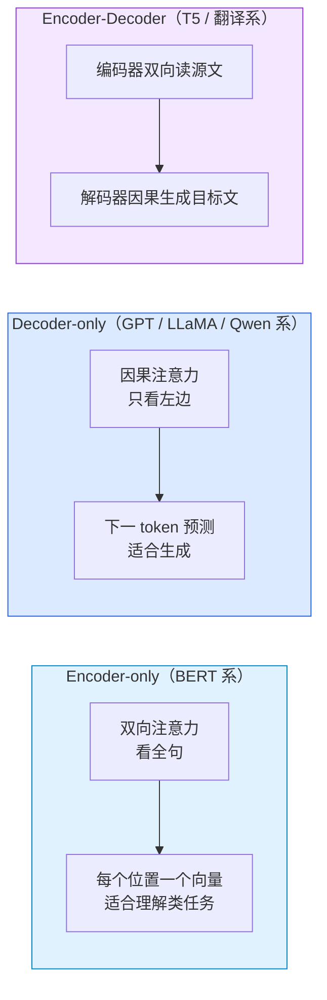
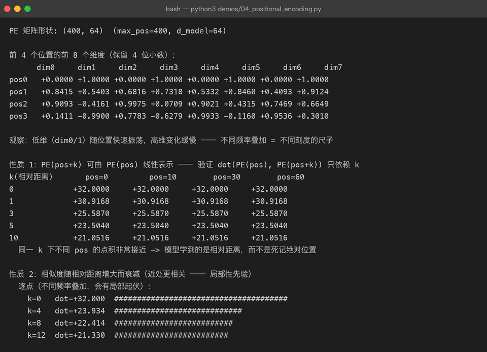
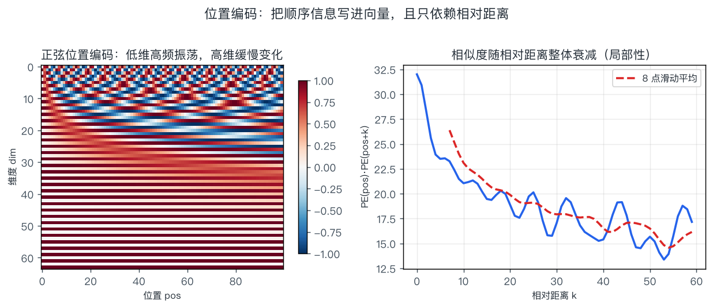
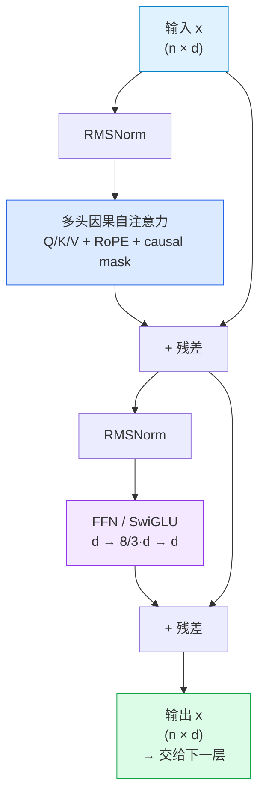

# 03 · Transformer 架构：一个 decoder block 里到底有什么

> **一句话结论**：现代 LLM = **N 个结构完全相同的 decoder block 堆叠**。
> 每个 block 只有两个子层——注意力（负责"从上下文取信息"）和前馈网络（负责"加工信息"）——外面包上残差和归一化，让几十上百层能稳定地叠起来。

[第 02 章](02-attention.md)讲了注意力这一个零件，本章把它组装成机器。

---

## 3.1 三种形态：先认清你看的是哪一台机器



| 形态 | 代表 | 注意力 | 预训练目标 | 现状 |
|------|------|--------|------------|------|
| Encoder-only | BERT、RoBERTa、BGE | 双向 | 掩码语言建模（MLM） | 作为**文本嵌入模型**仍是主力（RAG 检索就用它） |
| Decoder-only | GPT 全系、LLaMA、Qwen、DeepSeek | 因果 | 下一 token 预测（CLM） | **当前 LLM 唯一主流** |
| Encoder-Decoder | T5、BART、原始 Transformer | 编码器双向 + 解码器因果 | Span corruption 等 | 翻译/摘要仍有市场，通用 LLM 已让位 |

**为什么 Decoder-only 赢了**：一个目标（预测下一个 token）+ 一套结构，就能同时表达理解与生成；训练信号最密集（每个位置都是监督）；且天然支持 in-context learning 与任意长度的续写。

本章接下来讲的都是 **decoder block**。

---

## 3.2 骨架：残差 + 归一化

### 3.2.1 为什么需要残差连接

$$
x' = x + \operatorname{Sublayer}(x)
$$

| 作用 | 说明 |
|------|------|
| 梯度高速公路 | 反向传播时 `∂x'/∂x = I + ∂Sublayer/∂x`，恒等项保证梯度至少能原样流回底层，缓解深层网络梯度消失 |
| 恒等初始化友好 | 子层初始输出很小，网络初始近似恒等映射，"先能训得动，再慢慢学" |
| 不增加参数量 | 只做加法 |

### 3.2.2 LayerNorm：把数值拉回可控范围

$$
\operatorname{LN}(x) = \gamma \odot \frac{x - \mu}{\sqrt{\sigma^2 + \epsilon}} + \beta
$$

- 对**每个 token 的特征维**（最后一维）做归一化，与 batch 无关
- 这就是它比 BatchNorm 更适合变长文本的原因：**不依赖 batch 统计**，推理时行为一致

现代模型多数换成 **RMSNorm**（去掉均值中心化，只保留缩放）：

$$
\operatorname{RMSNorm}(x) = \gamma \odot \frac{x}{\sqrt{\frac{1}{d}\sum_i x_i^2 + \epsilon}}
$$

省掉均值计算，约省 10% 的归一化开销，效果基本无差。LLaMA、Qwen、Gemma 都用它。

### 3.2.3 Pre-LN vs Post-LN：一个必须记住的工程结论

```text
Post-LN（原论文）:   x = LN(x + Sublayer(x))       归一化在残差之后
Pre-LN（现代主流）:  x = x + Sublayer(LN(x))       归一化在子层之前
```

| 方案 | 深层训练稳定性 | 是否要 warmup | 代表 |
|------|----------------|---------------|------|
| Post-LN | 差，需要精心调 warmup，层数一多就发散 | 必须 | 原始 Transformer |
| **Pre-LN** | 好，能直接堆几百层 | 宽松得多 | GPT-2 之后几乎所有 LLM |

**记忆点**：看到"模型层数上不去 / 训练初期 loss 爆炸"，第一反应就是检查用的哪种 LN 布局。

---

## 3.3 前馈网络（FFN）：被低估的三分之二

注意力负责"跨 token 通信"，但**每个 token 内部的信息加工**由 FFN 完成。

$$
\operatorname{FFN}(x) = W_2 \cdot \sigma(W_1 x + b_1) + b_2
$$

标准配置把维度先放大 4 倍：

| 项 | 形状（d=4096） | 参数量 |
|----|----------------|--------|
| $W_1$ | 4096 × 16384 | 67.1 M |
| $W_2$ | 16384 × 4096 | 67.1 M |
| 合计 | — | **134.2 M** |
| 对比：一次注意力的 QKVO | 4 × 4096 × 4096 | 67.1 M |

**FFN 参数量是注意力部分的 2 倍**。所以"7B 参数"里，大头其实是 FFN。

| 变体 | 公式 | 特点 |
|------|------|------|
| 标准 ReLU FFN | $\max(0, xW_1)W_2$ | 原版 |
| GELU FFN | $\operatorname{GELU}(xW_1)W_2$ | GPT-2/BERT |
| **SwiGLU** | $(\operatorname{Swish}(xW_g) \odot xW_1)W_2$ | LLaMA 系主流；三个矩阵但把隐藏维降到 8/3 d，总参数持平，效果更好 |

> **"FFN 是键值记忆"** 这个解释很流行（Geva et al. 2021）：把 W₁ 的每行看成"模式检测器"，W₂ 的列看成"对应输出内容"。这解释了为什么对 FFN 做知识编辑（ROME 一类方法）能改掉模型的具体事实记忆。

---

## 3.4 位置编码：把顺序写进向量

[第 02 章](02-attention.md)说过注意力是置换等变的——不注入位置信息，模型看"我打你"和"你打我"一样。位置编码就是补上这一课。

### 3.4.1 正弦位置编码（原论文方案）

$$
\begin{aligned}
PE_{(pos,\,2i)} &= \sin\!\left(\frac{pos}{10000^{2i/d_{model}}}\right) \\[4pt]
PE_{(pos,\,2i+1)} &= \cos\!\left(\frac{pos}{10000^{2i/d_{model}}}\right)
\end{aligned}
$$

| 符号 | 含义 |
|------|------|
| $pos$ | 位置索引（0, 1, 2, …） |
| $i$ | 维度对的索引（0 … d/2−1） |
| $10000^{2i/d}$ | 不同维度对应不同波长：低维波长短（高频），高维波长长（低频） |

这就是"多把不同刻度的尺子同时量距离"。`demos/04_positional_encoding.py` 的真实运行结果：



**第 1 段**验证了"低维快速振荡、高维缓慢变化"；**第 2 段（性质 1）**是这套编码最漂亮的地方——**同一相对距离 k 下，不管 pos 是 0 还是 60，点积几乎完全一样**（7.4852 / 7.4852 / 7.4852 / 7.4852）：

$$
\langle PE_{pos},\, PE_{pos+k}\rangle \approx f(k) \quad \text{只依赖 } k
$$

这意味着模型能学到"距离 5 个位置"这种**相对概念**，而不是死记"第 37 个位置"——泛化到没见过的长度才成为可能。

同一批数据画出来更直观：



左图是 PE 矩阵（横轴位置、纵轴维度）：低维是密集的横纹（高频），高维是平缓的色块（低频）。右图是相似度随距离的衰减：**单点有起伏（多频率叠加的必然结果），滑动平均后单调下降**——这就是"局部性先验"的来源：近处 token 天然更容易互相注意。

### 3.4.2 三种方案的对比与演进

| 方案 | 是否可训练 | 外推能力 | 代表模型 | 说明 |
|------|------------|----------|----------|------|
| Sinusoidal（正弦） | 否 | 公式上任意长，但实际外推一般 | 原始 Transformer、早期 GPT | 本章 demo 实现的就是它 |
| Learned（可学习） | 是 | **差**，超过训练长度失效 | BERT、GPT-2 | 简单直接，但长度被写死在表里 |
| **RoPE（旋转位置编码）** | 否（有少量超参） | 好，配合插值可扩展到 128k+ | LLaMA、Qwen、Mistral、DeepSeek | 当前绝对主流 |
| ALiBi | 否 | 好 | BLOOM、部分长文模型 | 直接给注意力打分加距离偏置 |

**RoPE 的核心思想**（推导见 [第 09 章](09-math-foundations.md)）：不改 embedding，而是把 Q、K 向量按位置**旋转**一个角度：

$$
q_m' = R_{\Theta, m}\, q_m,\qquad k_n' = R_{\Theta, n}\, k_n
\qquad\Longrightarrow\qquad
{q_m'}^{\top} k_n' = g(q_m, k_n,\; m-n)
$$

旋转后的内积**天然只依赖相对位置 m−n**，与绝对位置无关。相比正弦编码（加在输入上，之后还要经过多层投影会被"稀释"），RoPE 直接作用在注意力的打分里，而且不增加参数量——这是它成为主流的原因。

| 长上下文扩展技巧 | 做法 |
|------------------|------|
| 位置插值（PI） | 把超长位置压缩回训练范围 |
| NTK-aware / YaRN | 改变旋转频率基底，按维度分频缩放 |
| 继续预训练 | 直接用长文本再训一段（最可靠，也最贵） |

---

## 3.5 一个 decoder block 的完整数据流

把上面的零件拼起来，一层 decoder（Pre-LN 布局）：



一个 7B 级模型的超参（LLaMA-7B 量级）：

| 超参 | 取值 | 备注 |
|------|------|------|
| d_model | 4096 | 隐藏维度 |
| n_layers | 32 | 层数 |
| n_heads | 32 | 头数 |
| d_head | 128 | 4096 / 32 |
| d_ff | 11008 | SwiGLU 的中间维度（≈ 8/3 × 4096 取整到 256 的倍数，为硬件友好） |
| vocab_size | 32,000（LLaMA-1）/ 128,256（LLaMA-3） | 词表 |
| context_len | 2048 → 4096 → 128k | 逐代变长 |
| norm | RMSNorm + Pre-LN | — |
| 位置编码 | RoPE | — |
| 激活 | SwiGLU | — |

### 端到端的张量形状（batch=1，序列长 T）

| 阶段 | 形状 | 说明 |
|------|------|------|
| token ids | `(1, T)` | — |
| embedding | `(1, T, 4096)` | 查表 |
| × 32 层 | `(1, T, 4096)` | 形状全程不变（这是残差能用的前提） |
| final norm | `(1, T, 4096)` | — |
| lm_head | `(1, T, V)` | V = 词表大小，**这一层 logits 是显存杀手**（T=2048、V=128k 时约 500 MB/序列，fp16） |
| softmax + 采样 | `(1,)` | 只取最后一个位置 |

> **工程提示**：推理时一般只需要最后一个位置的 logits，但很多实现会把整个 `(T, V)` 算出来，白白浪费算力与显存——这也是为什么"只取最后位置"是一种常见的推理优化。

---

## 3.6 参数量估算：自己算一遍

单层参数（忽略 bias）：

$$
\underbrace{4 d^2}_{\text{注意力 QKVO}} + \underbrace{3 \cdot d \cdot d_{ff}}_{\text{SwiGLU 三个矩阵}}
$$

加上词表（含输出层共享时为一份）：

$$
N \approx 12 \cdot L \cdot d^2 \; \left(\text{当 } d_{ff} = 4d \text{ 时}\right)
$$

这个"12·L·d²"是面试常考的速算公式。验证一下：

| 模型 | L | d | 12·L·d² | 官方参数量 | 误差来源 |
|------|---|---|---------|------------|----------|
| GPT-2 small | 12 | 768 | 85 M | 124 M（含 50k 词表 embedding 39 M） | 词表未计入 |
| GPT-3 | 96 | 12288 | 173 B | 175 B | 接近 |
| LLaMA-7B | 32 | 4096 | 6.4 B | 6.7 B | SwiGLU 的 d_ff=11008 < 4d |

**结论**：免词表时，参数量 ≈ `12 · L · d²`；实际再加 `V · d` 的 embedding（若共享则只算一次）。

---

## 3.7 架构演化：从 GPT-1 到现代 LLM

| 代际 | 代表 | 关键变化 | 解决的问题 |
|------|------|----------|------------|
| 原始（2017） | Transformer | 提出注意力、位置编码、Post-LN | 取代 RNN |
| 规模化（2018-2020） | GPT-2 / GPT-3 | Pre-LN、更大词表、层数堆深 | 训练稳定性、规模扩展 |
| 开源对齐（2023） | LLaMA-1 | RMSNorm + SwiGLU + RoPE | 同规模下更强、更省显存 |
| 推理友好（2023-2024） | LLaMA-2/3、Qwen | GQA、更长上下文、更大词表 | 推理成本、长文能力 |
| 效率结构（2024-） | Mixtral、DeepSeek-V2/V3 | MoE（稀疏专家）、MLA、FP8、MTP | 用更少的激活参数换更大容量 |

**MoE 一句话**：把 FFN 换成 N 个"专家"，每个 token 只激活其中 1–2 个。总参数很大（容量大），但每次前向只算一小部分（推理便宜）。Mixtral 8×7B 总参数 46.7B，激活只有 12.9B。

| 概念 | 含义 | 注意 |
|------|------|------|
| 总参数（total） | 模型文件大小、显存占用 | 决定"装得下吗" |
| 激活参数（active） | 每个 token 实际参与计算的参数 | 决定"跑得快吗" |

---

## 3.8 常被误解的点

| 误解 | 真相 |
|------|------|
| "Transformer 就是注意力" | 注意力只占参数 1/3；FFN 占 2/3，且是知识与事实的主要存储地 |
| "位置编码只是个细节" | 没有它模型完全无法理解语序；方案选择直接决定外推能力上限 |
| "层数越多越强" | 在同等参数预算下，宽/深存在最优比；堆深主要考验训练稳定性（Pre-LN 才敢堆） |
| "Pre-LN 和 Post-LN 差不多" | 差很多，Post-LN 在深层必须靠 warmup 救，Pre-LN 是能堆 100+ 层的前提 |
| "d_ff 一定是 4d" | LLaMA 用 SwiGLU 时取 8/3·d，为的是保持总参数不变 |
| "MoE 一定更省钱" | 只在**推理**上省算力；显存要装下全部专家，训练也更复杂 |

---

## 3.9 动手

```bash
python3 demos/04_positional_encoding.py     # 位置编码的四个性质都是真实算出来的
python3 demos/make_figures.py               # 重画 positional-encoding.png
```

**建议改的三处**：

1. 把 `D_MODEL` 从 64 改成 8，观察"性质 1"那张表是否还那么整齐（提示：维度太少，频率分辨率不够）。
2. 把 `10000` 改成 `100`，观察热力图的频率分布如何变化。
3. 自己加一段：实现 RoPE 的二维旋转矩阵，验证 $q_m'^\top k_n'$ 只依赖 m−n。

---

## 3.10 自查问题

1. 一个 decoder block 里有哪些子层？各占多少参数？
2. 残差连接为什么能缓解梯度消失？（写出 ∂x'/∂x）
3. Pre-LN 和 Post-LN 的公式分别是什么？为什么现代模型都用 Pre-LN？
4. 位置编码为什么必需？RoPE 相比正弦编码好在哪两个点？
5. 用 `12·L·d²` 估算一个 L=80、d=8192 的模型参数量，再想想词表占多少。
6. Encoder-only / Decoder-only / Encoder-Decoder 各自适合什么任务？为什么 LLM 是 Decoder-only？
7. MoE 的"总参数"和"激活参数"分别影响什么？

---

[← 上一章：注意力机制](02-attention.md) · [返回总览](README.md) · [下一章：预训练 →](04-pretraining.md)
