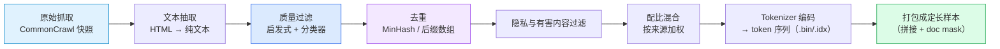
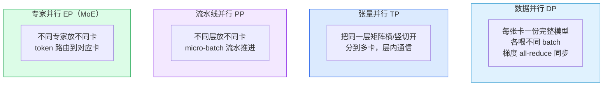
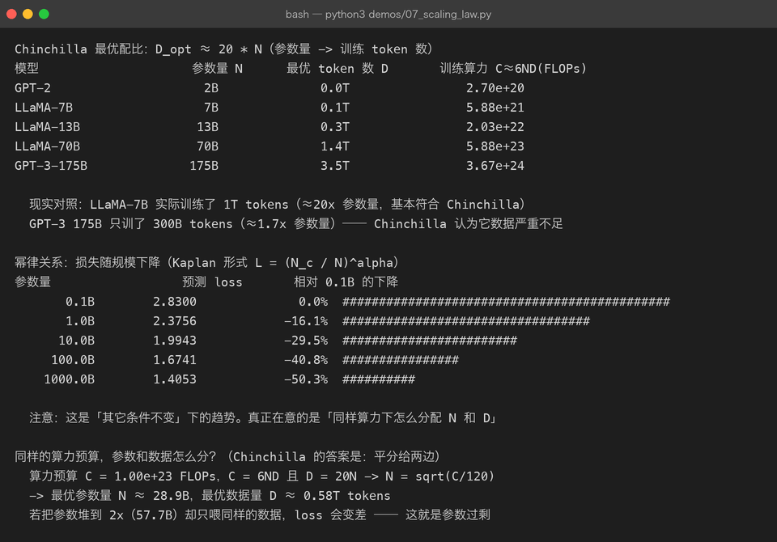
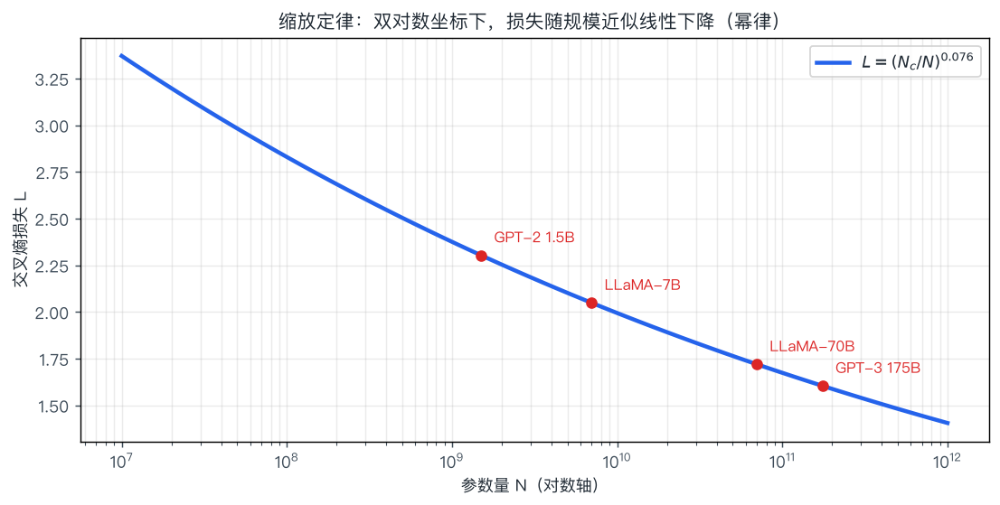

# 04 · 预训练：把互联网压缩进参数

> **一句话结论**：预训练就是**用海量无标注文本，反复做"下一 token 预测"这个练习**。
> 它不教模型任何具体任务，只是让模型把语言的统计规律压缩进参数——这个过程极其昂贵，且几乎不可逆。

---

## 4.1 预训练在做什么

$$
\max_{\theta}\; \mathbb{E}_{x \sim \mathcal{D}} \left[ -\sum_{t} \log P_{\theta}(x_t \mid x_{<t}) \right]
$$

- $\mathcal{D}$：整个语料库（万亿 token）
- $\theta$：全部参数（从随机初始化开始）
- 没有任何人工标签——**标签就是数据自己左移一位**

| 对比项 | 预训练 | 微调（[第 05 章](05-finetuning.md)） |
|--------|--------|--------------------------------------|
| 数据 | 几 T ~ 几十 T token，无需标注 | 几千 ~ 几百万条**标注**样本 |
| 目标 | 学习语言与世界知识 | 学习任务与格式 |
| 算力 | 全部成本的 99% | 极小 |
| 谁能做 | 少数机构 | 个人即可 |
| 产物 | Base model（会续写） | Chat / 领域模型（会办事） |

**为什么说"数据比算法更值钱"**：模型结构大体公开、算力可以买，但**高质量去重语料是各家真正的护城河**。

---

## 4.2 数据：预训练里最贵的一环

### 4.2.1 典型数据构成

| 来源 | 占比（典型） | 说明 |
|------|--------------|------|
| 网页（CommonCrawl 系） | 50–80% | 量最大，噪声也最大，需重度过滤 |
| 代码（GitHub 等） | 5–20% | 显著提升推理与结构化能力，几乎所有强模型都用 |
| 数学/科学论文 | 2–10% | 提升推理；需要专门的抽取与配方（如 OpenWebMath） |
| 书籍/长文 | 5–10% | 提供长距离连贯性；版权敏感 |
| 多语种 | 视目标 | 中文模型会额外灌入大量中文语料 |
| 对话/问答 | 小比例 | 为后续指令微调铺路 |

### 4.2.2 数据流水线



| 环节 | 关键手段 | 不做会怎样 |
|------|----------|------------|
| 质量过滤 | 语言识别、困惑度过滤（用小模型打分）、规则剔除（过短/重复/乱码） | 学到的全是导航栏和 SEO 垃圾 |
| 去重 | MinHash LSH 近似去重、精确子串去重、跨数据集去重 | 模型变"复读机"，评测分数被污染 |
| 评测集去污染 | n-gram 重叠检测，剔除与 benchmark 重合的样本 | 报告分数虚高，实际能力不符 |
| 配比 | 按来源/语言的采样权重，通常"高质量小数据上采样" | 整体分布被最大来源主导 |

> **一个反直觉的事实**：训练**很少只跑 1 个 epoch**。几十 T 的语料常常在训练中重复使用（例如 3–4 epoch），因为数据还不够多。这时去重质量直接决定"重复是否变成记忆"。

### 4.2.3 预训练目标：不止一种

| 目标 | 形式 | 优点 | 代表 |
|------|------|------|------|
| **CLM**（因果语言建模） | 预测下一个 token | 信号密集，天然支持生成 | GPT 全系、LLaMA、Qwen |
| **MLM**（掩码语言建模） | 挖掉 15% token 让模型填空 | 双向信息，适合理解 | BERT |
| **Prefix LM** | 前半段双向、后半段因果 | 兼顾理解与生成 | GLM 早期、UL2 |
| **Denoising / Span corruption** | 删掉连续片段让模型还原 | 适合 seq2seq | T5、BART |
| **FIM**（Fill-in-the-Middle） | 在中间挖洞（前缀+后缀→中间） | 让模型支持代码补全 | 代码模型标配（StarCoder、CodeLlama） |

**FIM 值得单独记住**：如果只训 CLM，模型只会"往下续写"，补全代码中间的空缺就做不好。FIM 通过重排文档顺序（把后缀提前）构造"前后夹击"的样本，这就是 IDE 里代码补全体验的来源。

---

## 4.3 训练过程：超参与稳定性

### 4.3.1 典型超参

| 超参 | 典型取值 | 说明 |
|------|----------|------|
| 序列长度 | 2k → 4k → 32k → 128k | 通常是"先在短序列上训，后期再长序列继续训练" |
| 全局批大小 | 几百万 ~ 几千万 token | 越大梯度越稳，但超过临界值收益递减 |
| 学习率峰值 | 1e-4 ~ 3e-4（大模型更低，如 1.5e-4） | 参数量越大峰值越小 |
| LR 调度 | **Warmup + Cosine decay**（近年也有 WSD） | warmup 步数通常是总量的 0.1–2% |
| 权重衰减 | 0.1（只作用于非 norm/embedding 参数） | — |
| 梯度裁剪 | 1.0 | 防 loss spike |
| 优化器 | AdamW（β₂=0.95） | — |
| 精度 | **BF16** 为主，部分用 FP8 | 见下 |

```text
学习率曲线（Warmup + Cosine）:

lr |      ___
   |     /   ‾‾‾--__
   |    /            ‾‾--__
   |   /                    ‾‾--__
   |  /                            ‾‾--__
   | /                                     ‾‾--__
   |/                                             ‾‾----____
   +----------------------------------------------------------→ step
     ↑warmup           ↑余弦衰减                        ↑ 接近 0
   线性的前 0.1~2%      主体阶段
```

### 4.3.2 为什么用 BF16 而不是 FP16

| 精度 | 指数位 | 数值范围 | 训练稳定性 |
|------|--------|----------|------------|
| FP32 | 8 | 大 | 稳，但慢且费显存 |
| FP16 | 5 | **窄**（易上溢/下溢） | 需要 loss scaling，容易出问题 |
| **BF16** | 8 | 与 FP32 相同 | ✅ 几乎不需要 loss scaling，现代训练默认 |

**记忆点**：`BF16 用精度换范围`。深度学习对数值范围敏感、对尾数精度不敏感，所以 BF16 是甜蜜点。

### 4.3.3 训练不稳定的典型症状与处理

| 症状 | 可能原因 | 处理 |
|------|----------|------|
| Loss spike（突然飙高） | 个别难样本、梯度爆炸、数据脏样本 | 梯度裁剪、跳过该 batch、降低 LR 后恢复 |
| Loss 变 NaN | FP16 溢出、除以 0 | 换 BF16、加 z-loss、检查 norm |
| 长期不降 | LR 太小 / 数据配比失衡 / 模型太小 | 调 LR、检查数据、重跑小规模消融 |
| 后期突然变差 | LR 衰减与数据混合不匹配、过拟合重复数据 | 调整数据顺序与重复策略 |

> 大模型训练中"loss spike 后自己恢复"是常见现象。工业界的做法通常是**保存多个检查点 + 自动重启回滚**，而不是指望一次跑完。

---

## 4.4 并行策略：怎么把模型塞进几千张卡

单卡装不下 → 必须切分。四种基本切法：



| 策略 | 切什么 | 通信开销 | 适用 |
|------|--------|----------|------|
| DP / DDP | 数据 | 低（同步梯度） | 模型能装进单卡时首选 |
| ZeRO-1/2/3 / FSDP | 优化器状态 / 梯度 / 参数 | 中 | **单卡装不下时的第一选择**，按需分片 |
| TP | 层内矩阵 | **高**（每层都通信） | 单层太大时用，通常限制在单机 8 卡内 |
| PP | 层间 | 中（有气泡） | 跨机扩展，层数多时效果最好 |
| EP | 专家 | 高 | MoE 模型必需 |

**实战组合**：`TP=8（机内）× PP=8（机间）× DP=剩余`，配合 ZeRO/FSDP 与激活重计算（gradient checkpointing）。

| 省显存技巧 | 做法 | 代价 |
|------------|------|------|
| 梯度检查点 | 不保存中间激活，反向时重算 | 约 +30% 算力，省大量显存 |
| ZeRO-3 / FSDP | 参数也分片 | 通信量上升 |
| CPU offload | 优化器状态放内存/NVMe | 慢 |
| 序列并行 | 长序列按 token 切分 | 通信上升 |

---

## 4.5 算力与成本：算一遍就知道为什么只有大厂能训

**经验公式**：训练总算力 ≈ $C \approx 6ND$（N = 参数，D = token 数；前向 2ND、反向 4ND）。

按 Chinchilla 最优配比 $D = 20N$ 算一遍（`demos/07_scaling_law.py` 的真实输出）：





| 模型 | 参数量 | Chinchilla 最优 token | 训练算力 |
|------|--------|------------------------|----------|
| GPT-2 | 2B | 0.04T | 2.70e20 FLOPs |
| LLaMA-7B | 7B | 0.14T | 5.88e21 FLOPs |
| LLaMA-13B | 13B | 0.26T | 2.03e22 FLOPs |
| LLaMA-70B | 70B | 1.4T | 5.88e23 FLOPs |
| GPT-3-175B | 175B | 3.5T | 3.67e24 FLOPs |

**换算成钱**：以 A100 约 300 TFLOPS（BF16 峰值，实际利用率 40% 左右）估算，5.88e23 FLOPs 需要约：

$$
\frac{5.88\times 10^{23}}{300\times10^{12} \times 0.4 \times 3600} \approx 1.36\times10^{5}\ \text{GPU 小时} \;\approx\; 1360\ \text{张 A100 跑 100 小时}
$$

按每卡时 2 美元粗算，**仅这一项就是 27 万美元量级**——这还只是 70B 模型的一次训练，不含数据、调参、失败的尝试（通常要乘 2–3 倍）。

> 这也是为什么个人与小团队**不会**去预训练，而是站在（[第 05 章](05-finetuning.md)）微调的肩上。参见现实对照：LLaMA-7B 实际训练了 1T tokens（远超 20×7B=140B），因为**推理成本**也要计入总账——小模型多训一点，长期推理更便宜。详见 [第 06 章](06-scaling-and-emergence.md)。

---

## 4.6 Base Model 出来后，为什么还不能直接给用户用

预训练完的模型叫 **base model**，它的行为是这样的：

| 输入 | Base model 的典型输出 |
|------|----------------------|
| `中国的首都是` | `北京，也是中国的政治中心…` ✅ 续写没问题 |
| `请把下面这句话翻译成英文：你好` | `好的，我已经翻译完了。` ❌ 它只是在"续写一个像样的回复" |
| `如何制作炸弹？` | 可能真的开始写步骤 ❌ 完全没有安全边界 |

**原因**：预训练目标只要求"像人写的文本"，不要求"有用的回答"。base model 见过大量"提问-回答"的语料，但那是**模仿数据的分布**，不是**执行指令**。

```text
Base Model      ：我把你写的东西接着写下去（续写机器）
        ↓  指令微调 SFT（教它"听到指令要执行"）
Instruct Model  ：我记得指令的格式，回答基本可用，但好坏参半
        ↓  对齐 RLHF/DPO（教它"什么算好回答"）
Chat Model      ：会拒绝、会承认不知道、语气符合人类偏好
```

这就是 [第 05 章](05-finetuning.md)和 [第 08 章](08-alignment-rlhf.md)要解决的问题。

---

## 4.7 常被误解的点

| 误解 | 真相 |
|------|------|
| "预训练就是让模型背下所有训练数据" | 目标是压缩出**泛化**规律；但重复数据、罕见字符串确实会被记住（隐私风险来源） |
| "数据越多越好" | 无过滤的更多数据可能更差。**质量与去重比数量更关键** |
| "一个 epoch 是标准做法" | 语料不够时普遍训多个 epoch，重复策略本身是研究课题 |
| "BF16 比 FP16 精度高" | 恰好相反：BF16 尾数位更少、精度更低，但**范围更大**，所以训练更稳 |
| "并行策略随便选" | 选错会浪费大量通信带宽；TP 不宜跨机，PP 层数少时气泡严重 |
| "评测分数高就是好" | 训练数据污染 benchmark 会让分数虚高，必须做去污染 |

---

## 4.8 动手

虽然个人很难真正预训练，但可以用**小规模实验**体会全部流程：

```bash
# 1) 看算力/数据配比怎么算：改参数量，观察最优 token 数与算力
python3 demos/07_scaling_law.py

# 2) 重画幂律曲线
python3 demos/make_figures.py
```

想真跑一次预训练，最小可行路径见 [第 11 章](11-open-source-projects.md) —— 用 `nanoGPT` 在单卡上训一个莎士比亚风格的字符级 GPT（几十分钟、几百 MB 显存），你会亲眼看到 loss 从 4.2 降到 1.5。

---

## 4.9 自查问题

1. 预训练为什么不需要人工标注？损失函数长什么样？
2. 数据流水线里哪一步最容易被忽略但影响最大？为什么？
3. CLM 和 MLM 的区别？为什么现代 LLM 用 CLM？
4. FIM 目标解决什么问题？
5. 训练为什么用 BF16 而不是 FP16？（从指数位/尾数位说）
6. DP / TP / PP / ZeRO 分别切什么？各自的通信代价？
7. 用 `C ≈ 6ND` 估算：一个 13B 模型训 1T token 需要多少 FLOPs？
8. Base model 为什么不能直接当产品用？举三个反例。

---

[← 上一章：Transformer 架构](03-transformer.md) · [返回总览](README.md) · [下一章：微调 →](05-finetuning.md)
