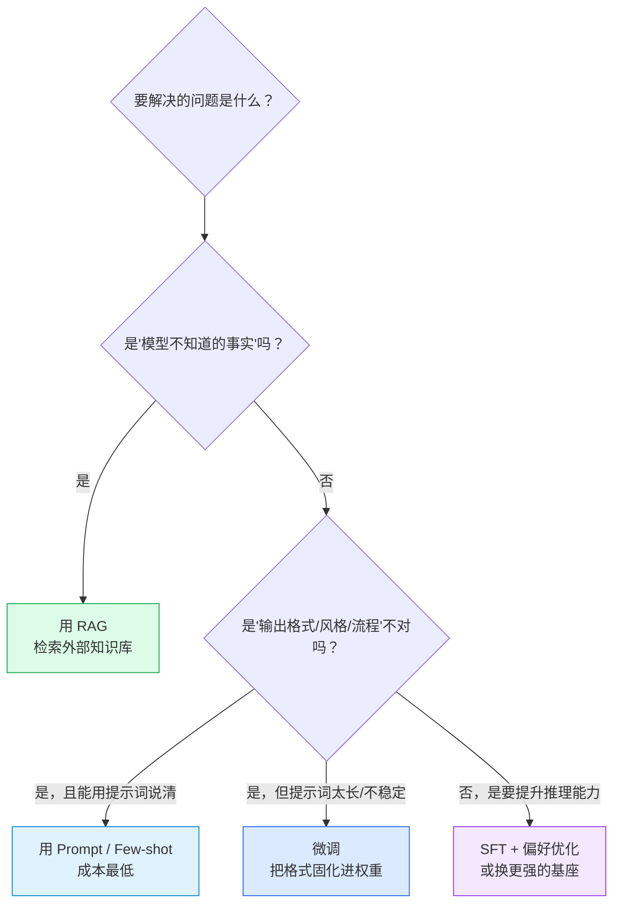
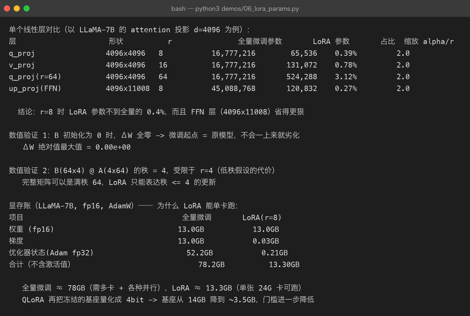
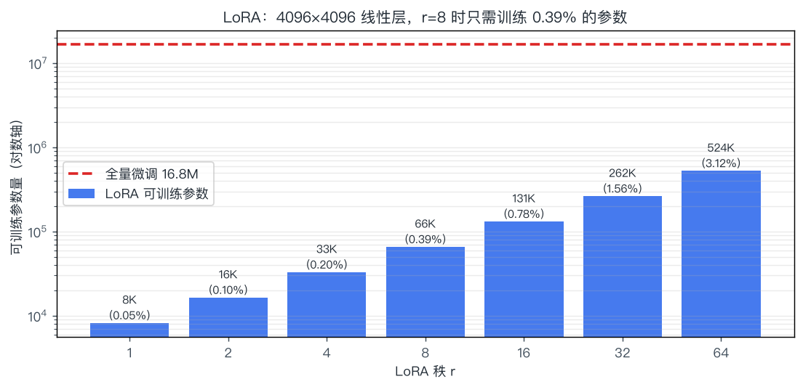

# 05 · 微调：在预训练模型上做减法

> **一句话结论**：微调不是"教模型新知识"，而是**用少量高质量样本把模型已有的能力"对齐"到你的任务格式上**。
> 由于全量微调显存开销巨大，实践中的主角是 **LoRA / QLoRA** —— 只训练 0.1%–1% 的参数，效果却接近全量。

---

## 5.1 先做选择：Prompt / RAG / 微调 该用哪个

在动手调参之前，先回答"这件事到底该不该微调"：



| 方案 | 解决 | 成本 | 更新速度 | 典型场景 |
|------|------|------|----------|----------|
| Prompt 工程 | 表达方式（能用话讲清的） | 最低 | 立刻 | 分类、改写、简单抽取 |
| RAG | 事实与私有知识 | 中 | 实时（改库即可） | 企业知识问答、文档问答 |
| **微调** | 行为模式、格式、语气、领域黑话 | 高 | 慢（要重训） | 固定 JSON 输出、客服口吻、领域术语 |
| 长上下文 | 单次任务的信息量 | 低 | 立刻 | 长文摘要、多文档对比 |

> **最常被搞混的一条**：**微调不擅长注入新事实**。想让它记住"2026 年公司新政策第 7 条"，微调的效果远不如把文档塞进 RAG。微调真正擅长的是"学会怎么说话、怎么组织输出"。

---

## 5.2 SFT：监督微调（把"续写"变成"听话"）

### 5.2.1 数据长什么样

SFT 的数据是**指令-回答对**，训练时**只对"回答"部分算损失**：

```text
<|im_start|>system
你是一个严谨的助手。            <- 系统提示（可省略）
<|im_end|>
<|im_start|>user
把下面这句话翻译成英文：你好    <- 指令
<|im_end|>
<|im_start|>assistant
Hello.                          <- 只对这一段的 token 算 loss
<|im_end|>
```

```text
loss mask 示意:
token:   <|im_start|> system ... <|im_end|> <|im_start|> user ... <|im_end|> <|im_start|> assistant Hello . <|im_end|>
loss:    0    0     0    ...     0        0        0    0  ...    0        0          1    1    1    1    1     1
         └────────────── 系统与用户部分不算 loss ──────────────┘  └──── 只算回答部分的 ────┘
```

**为什么必须 mask 掉指令部分**？否则模型会把"学会复述用户的问题"也当成目标，浪费容量并可能出现"回答里重复提问"的毛病。

### 5.2.2 关键超参（与预训练完全不同）

| 超参 | 预训练 | SFT | 原因 |
|------|--------|-----|------|
| 学习率 | 1e-4 ~ 3e-4 | **1e-5 ~ 2e-4**（LoRA 可到 1e-4~3e-4） | 参数已有好初值，大步长会震散知识 |
| epoch | 多 epoch over 大语料 | **1 ~ 3** | 数据量小，多了必然过拟合 |
| 批大小 | 几百万 token | 几十~几百条样本 | 数据规模差异 |
| 损失 | 全部 token | 只算回答 token | 见上 |
| warmup | 有 | 少量（总步数 3% 左右） | — |

**SFT 数据质量 > 数量**：1000 条精心构造的样本，往往胜 10 万条噪声数据。业界共识（如 LIMA 论文）：**少量高质量即可激活模型已有的能力**——这也反过来说明，SFT 主要在"选能力"，不是在"装能力"。

---

## 5.3 全量微调：为什么个人做不了

全量微调要更新全部参数，显存账是这么算的（AdamW）：

$$
\text{显存} \approx \underbrace{2N}_{\text{权重 fp16}} + \underbrace{2N}_{\text{梯度}} + \underbrace{8N}_{\text{Adam 一阶/二阶动量 fp32}} + \underbrace{\text{激活值}}_{\text{与 batch × seq 相关}}
$$

以 7B 模型为例（`demos/06_lora_params.py` 的真实计算）：



| 项目 | 全量微调 | LoRA(r=8) |
|------|----------|-----------|
| 权重 fp16 | 13.0 GB | 13.0 GB |
| 梯度 | 13.0 GB | 0.03 GB |
| 优化器状态 fp32 | 52.2 GB | 0.21 GB |
| **合计（不含激活）** | **78.2 GB** | **13.3 GB** |

**结论**：全量微调 7B 至少要 1–2 张 A100 80G，还要额外处理激活值（靠梯度检查点）；而 LoRA 在**一张 24G 的 3090/4090 上就能跑**。这就是 PEFT 存在的全部理由。

---

## 5.4 LoRA：低秩假设带来的"免费午餐"

### 5.4.1 核心思想

微调时权重的**变化量** $\Delta W$ 是低秩的——不需要动完整的 d×d 矩阵，用两个瘦矩阵近似就够：

$$
W' = W + \Delta W = W + \frac{\alpha}{r} B A
\qquad
B \in \mathbb{R}^{d \times r},\; A \in \mathbb{R}^{r \times d},\; r \ll d
$$

| 符号 | 含义 | 典型值 |
|------|------|--------|
| $W$ | 原始权重，**冻结不更新** | d×d |
| $B, A$ | 两个可训练的小矩阵 | r×d 与 d×r |
| $r$ | 秩（rank），控制容量 | 4 / 8 / 16 / 64 |
| $\alpha$ | 缩放系数，实际学习率为 `lr × α/r` | 常取 `2r` |

训练时**前向不变**（初始 B=0 保证 ΔW=0）：

$$
h = W'x = Wx + \frac{\alpha}{r}BAx
$$

推理时可以**合并回原权重**（`W' = W + (α/r)BA`），**零额外延迟** —— 这是 LoRA 相比 Adapter 类方法的决定性优势。

### 5.4.2 为什么"低秩"假设成立

| 证据/直觉 | 说明 |
|-----------|------|
| 微调任务与预训练任务高度相关 | 只是"重新加权"已有能力，不需要新增自由度 |
| 实验观察 | 微调后 ΔW 的奇异值谱下降极快，前几个奇异值就占了大部分能量 |
| 实测 | r=8 时效果已接近全量微调；r 再往上收益迅速递减 |

`demos/06_lora_params.py` 里的两个数值验证：

1. **B 初始化为 0 → ΔW 全零**（最大绝对值 0.00e+00）：保证微调起点就是原模型，绝不会"一上来就变差"。
2. **B(64×4) @ A(4×64) 的秩 = 4**：这是低秩假设的**代价**——LoRA 只能表达秩 ≤ r 的更新，超出这个子空间的信息学不进去。这也是为什么 r 太小会"学不动"，r 太大又退化成全量微调并容易过拟合。

### 5.4.3 参数量与 r 的取舍（真实计算）



| 层 | 形状 | r | 全量参数 | LoRA 参数 | 占比 |
|----|------|---|----------|-----------|------|
| q_proj | 4096×4096 | 8 | 16,777,216 | 65,536 | **0.39%** |
| v_proj | 4096×4096 | 16 | 16,777,216 | 131,072 | 0.78% |
| q_proj | 4096×4096 | 64 | 16,777,216 | 524,288 | 3.12% |
| up_proj (FFN) | 4096×11008 | 8 | 45,088,768 | 120,832 | **0.27%** |

**FFN 层更划算**：形状越"瘦长"，LoRA 的占比越低。现代实践通常对**全部线性层**（含 FFN）挂 LoRA，而不仅限 attention。

### 5.4.4 挂在哪里、用什么配置

| 配置项 | 常见选择 | 说明 |
|--------|----------|------|
| target_modules | 只挂 `q_proj,v_proj` → 挂全部线性层 | 挂全层通常更好，参数仍只有 1% 左右 |
| r | 8（对话）/ 16–64（领域知识/代码） | 任务越"远"，r 越大 |
| lora_alpha | 2r 或固定 16/32 | 影响有效学习率 |
| lora_dropout | 0.05 ~ 0.1 | 小数据集防过拟合 |
| bias | `none` | 训练 bias 收益小 |
| 合并 | 部署前 merge_and_unload | 推理零开销 |

---

## 5.5 QLoRA：把门槛再降一个数量级

QLoRA = **4bit 量化的基座 + LoRA 适配器**，三处关键设计：

| 技术 | 做什么 | 效果 |
|------|--------|------|
| **NF4**（4-bit NormalFloat） | 按正态分布分位数量化，信息论上对正态权重最优 | 比 INT4 精度更高 |
| **双重量化** | 量化常数的本身也被量化 | 每参数再省约 0.37 bit |
| **Paged Optimizer** | 优化器状态用统一内存分页，峰值时换出到 CPU | 避免 OOM 崩训练 |

| 方案 | 7B 模型基座显存 | 单卡可行性 |
|------|-----------------|------------|
| 全量 fp16 | 14 GB 权重 + 66 GB 状态 | 需多卡 |
| LoRA fp16 | 14 GB + ~0.2 GB | 24G 卡可跑 |
| **QLoRA** | **~3.5 GB**（4bit 基座）+ ~0.2 GB | ✅ 消费级显卡（8–12G 可跑小模型） |

代价：4bit 反量化会带来少量精度损失和速度下降（约 20–40% 训练变慢），但**质量基本对齐 16bit LoRA**。

---

## 5.6 其他 PEFT 方法对比

| 方法 | 改哪里 | 额外参数 | 推理开销 | 现状 |
|------|--------|----------|----------|------|
| **LoRA** | 权重旁路（低秩增量） | 0.1%–1% | **可合并，无** | ✅ 主流 |
| QLoRA | LoRA + 4bit 基座 | 同上 | 可合并 | ✅ 显存最优 |
| DoRA | 把幅度与方向解耦 | 略多于 LoRA | 可合并 | 小数据上更稳，2024 起流行 |
| Adapter | 层间插入小 MLP | 1%–5% | **有**（不能合并） | 已边缘化 |
| Prefix / P-Tuning | 在序列前加可训练的"虚拟 token" | <0.1% | 占上下文位置 | 效果不稳 |
| Prompt Tuning | 只学 soft prompt | 极少 | 占位置 | 大模型上不如 LoRA |
| 全量微调 | 全部参数 | 100% | 无 | 数据多、算力足时的上限方案 |

> **选择建议**：显存够就用 LoRA（r=16，全线性层）；显存紧就 QLoRA；数据量大（>10 万条）且要压榨上限，才考虑全量。

---

## 5.7 灾难性遗忘：微调的副作用

**现象**：在一个很窄的任务上微调后，模型在该任务上变强，但通用能力（写代码、数学、多语言）**明显退化**。

| 缓解手段 | 做法 | 代价 |
|----------|------|------|
| 混入通用数据 | 训练集里掺 5%–20% 通用指令数据 | 需要准备数据 |
| 降低学习率 / 减少 epoch | 别把模型"训狠了" | 收敛慢 |
| 用 LoRA 而非全量 | 更新被限制在低秩子空间，天然更保守 | 上限略低 |
| 只训高层 | 冻结底层 | 领域适配可能不足 |
| 定期评测通用能力 | 每次训练后跑 MMLU/C-Eval 子集 | 增加流程成本 |
| 模型合并（model soup / TIES） | 把多个微调版本权重融合 | 需要实验 |

**判断标准**：如果微调后模型在原有场景"变笨了"，最常见原因就是**lr 太大 + epoch 太多 + 数据太窄**这三件事叠加。

---

## 5.8 微调实战 checklist

| 阶段 | 要做的事 | 常见坑 |
|------|----------|--------|
| 数据 | 统一 chat template；去重；清理格式错乱样本 | 训练/推理模板不一致（最致命的坑） |
| 划分 | 留 5%–10% 验证集 | 无验证集 → 看不见过拟合 |
| 基线 | **先跑 prompt/few-shot 基线** | 直接微调，最后发现提示词就够用 |
| 训练 | lr 从 2e-4（LoRA）或 1e-5（全量）试；epoch 1–3 | lr 过大 → loss 震荡、通用能力崩 |
| 监控 | 训练 loss + 验证 loss + 通用能力抽样 | 只看训练 loss → 过拟合无感 |
| 评估 | 任务指标 + 通用指标 + 人工抽检 | 只测训练集分布，等于自欺 |
| 部署 | merge LoRA → 量化 → 服务化 | 忘了 merge 导致推理变慢 |

> **数据格式才是第一大坑**。LoRA 训练 90% 的"效果不好"，根因是训练时用的 chat template 和推理时不一致（多一个空格、少一个 `<|im_end|>` 都会显著掉点）。

---

## 5.9 常被误解的点

| 误解 | 真相 |
|------|------|
| "微调能让模型记住新知识" | 效果有限且不稳定，事实注入应该用 RAG |
| "LoRA 效果一定不如全量" | 多数任务上接近甚至更好（正则化效应）；数据极多时全量才有优势 |
| "r 越大效果越好" | 收益快速递减，且更容易过拟合；r=8~16 是甜蜜点 |
| "LoRA 会增加推理延迟" | 合并后与原模型**完全一致**，零开销 |
| "QLoRA 是精度换显存，效果一定差" | 实测质量基本对齐 16bit LoRA，是现代最低门槛方案 |
| "SFT 数据越多越好" | 质量 > 数量；10 万条脏数据会教坏模型 |
| "训练 loss 降到很低就是成功" | 更可能是过拟合；要看验证集与通用能力 |

---

## 5.10 动手

```bash
python3 demos/06_lora_params.py     # 参数量、显存账、秩验证，全部现场计算
python3 demos/make_figures.py       # 重画 lora-params.png
```

**建议改的三处**：

1. 把 `r` 改成 256、1024，观察参数量占比如何逼近全量 → 理解"LoRA 是连续退化为全量"的渐变过程。
2. 把 `d_out` 从 4096 改成 11008（FFN 层），比较 LoRA 占比变化。
3. 手算：给一个 13B 模型（L=40, d=5120）全量微调，需要多少 GB 显存？

真跑一次微调，见 [第 11 章](11-open-source-projects.md) 里的 LLaMA-Factory / PEFT 路径。

---

## 5.11 自查问题

1. 什么时候该用 RAG，什么时候该微调？给两个具体例子说明。
2. SFT 为什么要 mask 掉指令部分的 loss？
3. LoRA 的两个矩阵形状分别是什么？为什么初始化时 B 要设为 0？
4. r、alpha 分别控制什么？为什么有效学习率与 α/r 有关？
5. 全量微调 7B 的显存怎么算？各部分分别是多少？
6. QLoRA 的三项关键技术分别解决什么问题？
7. 灾难性遗忘的症状是什么？三种缓解手段？
8. 为什么说"训练/推理 chat template 不一致"是最致命的坑？

---

[← 上一章：预训练](04-pretraining.md) · [返回总览](README.md) · [下一章：涌现与缩放定律 →](06-scaling-and-emergence.md)
