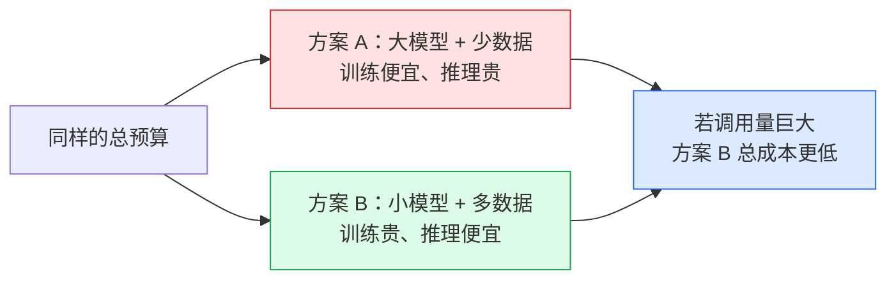

# 06 · 涌现能力与缩放定律：规模到底买到了什么

> **一句话结论**：损失随规模**平滑**下降（幂律，可预测），但**具体任务的表现**往往在某个规模点突然变好——这就是"涌现"。
> 对工程的意义：小模型"差一点"往往不是差一点，而是**差一个台阶**；选型时卡在临界点下方比预算不足更亏。

---

## 6.1 缩放定律（Scaling Law）：可预测的那一半

### 6.1.1 Kaplan 定律（2020）

OpenAI 发现：把模型变大、数据变多、算力变大，**交叉熵损失呈幂律下降**——在双对数坐标下近似是一条直线：

$$
L(N) = \left(\frac{N_c}{N}\right)^{\alpha_N}
\qquad\text{或更完整的形式}\qquad
L(N, D) = \left(\frac{N_c}{N}\right)^{\alpha_N} + \left(\frac{D_c}{D}\right)^{\alpha_D} + L_\infty
$$

| 符号 | 含义 | 典型拟合值 |
|------|------|------------|
| $N$ | 参数量（不含 embedding） | — |
| $D$ | 训练 token 数 | — |
| $N_c, D_c$ | 拟合常数 | 量级 10¹³ / 10¹² |
| $\alpha_N, \alpha_D$ | 幂指数 | 约 0.076 / 0.095（都很小！） |
| $L_\infty$ | 不可约损失（语言的固有熵） | 约 1.6 ~ 1.7 |

**指数只有 0.076 意味着什么**：参数量翻 10 倍，损失只降约 `10^0.076 ≈ 1.19` 倍的幂——看起来很少，但因为损失是指数敏感的指标（PPL = e^L），实际能力提升非常显著。


真实运行数据（`demos/07_scaling_law.py`）：

| 参数量 | 预测 loss | 相对 0.1B 的下降 |
|--------|-----------|------------------|
| 0.1B | 2.8300 | — |
| 1.0B | 2.3756 | −16.1% |
| 10B | 1.9943 | −29.5% |
| 100B | 1.6741 | −40.8% |
| 1000B | 1.4053 | −50.3% |

### 6.1.2 Chinchilla 定律（2022）：算力怎么分最划算

DeepMind 的关键结论：**给定算力预算，参数量和数据量应该等比增长**。

$$
N_{opt} \propto C^{0.5}, \qquad D_{opt} \propto C^{0.5}
\qquad\Longrightarrow\qquad
\boxed{D_{opt} \approx 20 \cdot N}
$$

即**每 1 个参数配 20 个 token**。训练算力估算：

$$
C \approx 6ND \quad \Longrightarrow \quad N_{opt} \approx \sqrt{\frac{C}{120}}
$$


按这个公式，同样的算力预算怎么分配，有明确的答案：

```text
C = 1e23 FLOPs 预算
  -> 最优参数量 N ≈ 28.9B，最优数据量 D ≈ 0.58T tokens
  若把参数堆到 2x（57.7B）却只喂同样数据 -> 参数过剩，loss 更差
```

| 历史对照 | 参数量 | 实际训练 token | token/参数 比 | 评价 |
|----------|--------|----------------|---------------|------|
| GPT-3 | 175B | 300B | 1.7× | 严重欠训练（参数过剩） |
| Chinchilla | 70B | 1.4T | 20× | 算力最优 |
| LLaMA-1 | 7B–65B | 1.0T–1.4T | 140×–21× | 已超出 Chinchilla |
| LLaMA-3 | 8B | 15T | **1875×** | 大幅 overtraining |

### 6.1.3 为什么现代模型都在"过度训练"

Chinchilla 优化的是**训练效率**（同样算力得到最低 loss）。但真实成本还要算**推理**：

$$
\text{总成本} \;=\; \text{训练成本（一次性）} \;+\; \text{推理成本（每次调用都付）}
$$



**结论**：模型上线后要服务几亿次请求时，把 8B 模型从 Chinchilla 最优的 160B token 训到 15T token，虽然训练成本变高，但推理时用的小模型便宜得多——**这才是 LLaMA-3 8B 训练 15T token 的经济学原因**。

> 记忆要点：**Chinchilla 是算力最优，不是总拥有成本最优（TCO 最优）。**

---

## 6.2 涌现能力：不可预测的那一半

### 6.2.1 现象

在损失平滑下降的同时，某些**具体能力**呈现"阶梯式"出现：小模型几乎完全不会，模型大到某个规模后突然会了。

```text
准确率
 100% |                                    ___________  多步推理 /
      |                                   /             CoT
  50% |            ______    ____________/
      |           /                        ____  指令遵循
   0% |___________/          _____________/
      +----------------------------------------------------→ 规模（log）
              ↑某个临界点前几乎为 0
```

| 涌现能力 | 典型出现规模（数量级） | 表现 |
|----------|------------------------|------|
| In-Context Learning（少样本示例学习） | ~10B | 给几个例子就能学会新任务，**无需改权重** |
| 思维链推理（CoT） | ~100B（GSM8K 上更晚） | 让它"一步步想"才有效，小模型反而更差 |
| 指令遵循 | ~10B–100B | 能听懂"总结成三句话"这类指令 |
| 多步算术 / 逻辑 | ~100B | 3 位数乘法开始可用 |
| 代码能力 | ~10B（专训后） | HumanEval 突然过得去 |

### 6.2.2 争议：涌现是真相还是度量伪影

2023 年 Schaeffer et al. 提出质疑：**很多"涌现"是因为指标选得不对**。

| 视角 | 说法 |
|------|------|
| 涌现是真的 | 能力出现伴随内部表征的质变（例如电路的形成） |
| 是度量伪影 | 用"完全答对才得分"（exact match）这种**非线性/不连续指标**时，底层能力的连续提升会被显示成突变；换成 token 级准确率、编辑距离等**连续指标**，曲线立刻变平滑 |

$$
\text{底层能力} \xrightarrow{\text{连续提升}} \begin{cases}
\text{用 exact match 度量} & \to \text{看起来是阶跃（涌现）} \\
\text{用 token 准确率度量} & \to \text{平滑上升}
\end{cases}
$$

**工程结论**：不要迷信"某个规模以下一定不会"。**别用不连续指标判断"能不能用"**，要用贴近业务的实际评估（部分正确是否有价值）。

---

## 6.3 其他与规模相关的现象

| 现象 | 定义 | 工程含义 |
|------|------|----------|
| **In-Context Learning** | 不更新权重，仅靠提示里的示例学习 | 这是"提示工程有效"的根本原因 |
| **思维链 CoT** | 生成中间推理步骤再给答案 | 只在足够大的模型上有效；小模型加 CoT 可能更差 |
| **Grokking** | 在小数据集上训练很久后，测试准确率突然从记忆跳到泛化 | 说明"训练够久"有时能跨过质变点 |
| **U 形缩放 / Inverse Scaling** | 某些任务上模型越大反而越差（如模仿偏见、重复无理输入） | 规模不是万能的，对齐阶段必须处理 |
| **双重下降** | 测试误差随规模先降后升再降 | 提醒不要用单一小规模实验下结论 |
| **数据质量 > 数量** | 同样算力下，精选数据可抵数倍原始数据（phi 系列的核心主张） | 小团队的机会窗口 |

---

## 6.4 对小团队和个人的实战启示

| 场景 | 建议 |
|------|------|
| 想省钱 | 选"刚好跨过临界点"的规模，而不是最大或最小。7B–14B 是当前性价比区 |
| 想提升效果 | 先做数据（清洗 + 精选 + 领域数据），再做规模 |
| 推理成本敏感 | 选已 well-trained 的小模型（如 8B 训 15T token 类），而非 Chinchilla 最优的小模型 |
| 能力不达标 | 先确认"是知识缺失（用 RAG）还是能力不足（换更大基座）"，不要硬靠微调补 |
| 做长上下文 | 位置编码与数据配比都要专门处理，不是把 context_len 改大就行 |

---

## 6.5 常被误解的点

| 误解 | 真相 |
|------|------|
| "规模大了自然什么都会" | 部分能力反而随规模倒退（inverse scaling）；且能力要靠提示/训练目标激活 |
| "涌现是玄学" | 底层能力提升是连续的，只是**度量方式**造成了阶跃外观 |
| "Chinchilla 最优 = 实践最优" | 它只优化训练效率；考虑推理成本后，**过度训练**常更划算 |
| "参数量翻倍损失减半" | 幂指数约 0.076，收益远小于此；是**指数放大**后才显得明显 |
| "小模型加 CoT 也能变强" | 反例常见：小模型加"一步步思考"可能比直接回答更差 |
| "把 context 设长就能长文推理" | 长上下文是**能力**，需要数据（长文档）与位置编码共同支持 |

---

## 6.6 动手

```bash
python3 demos/07_scaling_law.py      # 表格与结论全部现场算出
python3 demos/make_figures.py        # 重画 scaling-law.png
```

**建议改的三处**：

1. 把 `flops_str(budget)` 里的 `1e23` 改成 `1e21`、`1e25`，观察"最优参数量"如何随算力平方根增长。
2. 把 `alpha` 从 0.076 改成 0.05 / 0.15，看曲线斜率如何变化 → 直观理解幂指数的作用。
3. 用 `C = 6ND` 手算：训练一个 7B 模型 15T token 需要多少 FLOPs？再对比 Chinchilla 最优的 140B token。

---

## 6.7 自查问题

1. 写出缩放定律的幂律形式，并说明幂指数"只有 0.076"意味着什么。
2. Chinchilla 的核心结论是什么？为什么 GPT-3 被称为"欠训练"？
3. 为什么 LLaMA-3 8B 要训 15T token？请从总拥有成本角度解释。
4. "涌现能力"的争议双方各持什么论据？工程上应该怎么应对？
5. In-Context Learning 为什么"不用改权重"？它对提示工程意味着什么？
6. 举一个 inverse scaling 的例子，并说明为什么对齐阶段要处理它。

---

[← 上一章：微调](05-finetuning.md) · [返回总览](README.md) · [下一章：解码与推理 →](07-decoding-and-inference.md)
