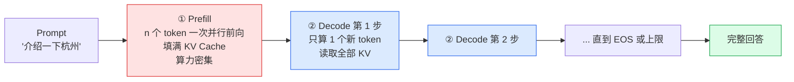
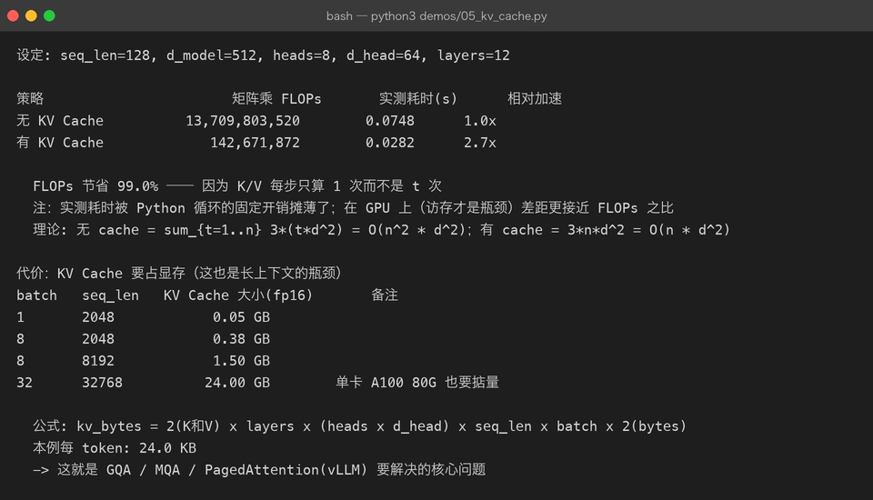
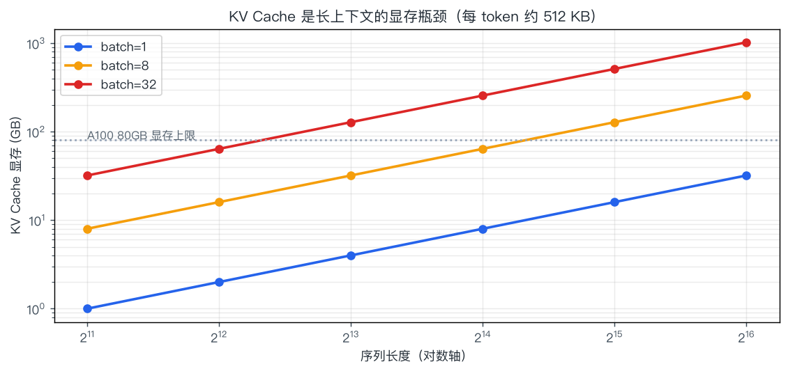
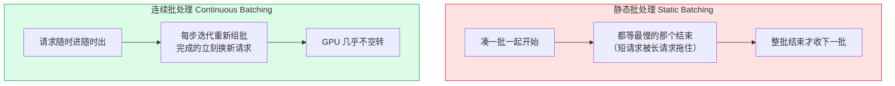

# 07 · 解码与推理：一个 token 是怎么被"吐"出来的

> **一句话结论**：推理分两段——**Prefill（并行读完 prompt，算力密集）** 和 **Decode（逐个吐 token，显存带宽密集）**。
> 所有推理优化（KV Cache、连续批处理、量化、投机解码）都在解决同一个矛盾：**decode 阶段每步只算一点点，却要搬运全部权重和缓存**。

---

## 7.1 两阶段：Prefill 与 Decode



| 阶段 | 输入 | 计算特征 | 瓶颈 | 首 token 延迟影响 |
|------|------|----------|------|--------------------|
| Prefill | 整个 prompt（n 个 token） | 大矩阵乘，并行度高 | **算力（FLOPS）** | TTFT（Time To First Token） |
| Decode | 上一个 token（1 个） | 每步一个向量乘矩阵 | **显存带宽（HBM 读写）** | TPOT / ITL（每 token 延迟） |

**为什么 decode 是带宽瓶颈**：生成 1 个 token，要把整个模型的权重从显存读一遍（7B fp16 = 14 GB），却只做了约 14 GFLOPs 的计算。算术强度极低，GPU 的算力单元大量空闲——所以**批量处理（batching）几乎是唯一解**：一次读权重，服务多个序列。

$$
\text{每 token 理论延迟} \;\approx\; \frac{\text{模型大小} + \text{KV Cache 大小}}{\text{显存带宽}}
$$

7B fp16 在 A100（2 TB/s）上的下界：14 GB / 2 TB/s ≈ **7 ms/token** → 理论上限约 140 token/s（单序列，实际更低）。

---

## 7.2 解码策略：从确定到随机

模型给出概率分布后，怎么选下一个 token：

| 策略 | 做法 | 优点 | 缺点 | 适用 |
|------|------|------|------|------|
| **Greedy** | 取概率最高的 | 确定、可复现 | 死板、易重复 | 抽取、代码、数学 |
| **Beam Search** | 维护 k 条候选路径，选总分最高 | 全局更优（对翻译有效） | 计算 ×k，生成类任务反而更平庸 | 翻译、语音识别 |
| **Temperature** | 缩放 logits 后再采样 | 控制随机性 | 只调平坦度 | 通用 |
| **Top-k** | 只在概率最高的 k 个里采样 | 砍掉长尾垃圾 | k 固定，不适应分布形状 | 通用 |
| **Top-p（核采样）** | 取累计概率达到 p 的最小集合再采样 | **自适应**候选数量 | p 需调 | ✅ 最常用 |
| Min-p | 按最大概率的比例设阈值 | 高温下更稳 | 较新，支持度不一 | 创意写作 |
| Repetition penalty | 惩罚已出现过的 token | 抑制复读 | 过强会伤流畅度 | 长文生成 |
| 约束解码 | 用正则/语法强制格式（JSON Schema） | 100% 格式合规 | 需引擎支持 | 结构化输出、工具调用 |

```text
Top-p 示意（p = 0.9，按概率降序累加）:
候选:   烤鸭 0.62 | 羊肉 0.15 | 火锅 0.11 | 小吃 0.05 | 香蕉 0.03 | ...
累计:        0.62 |     0.77 |     0.88 |     0.93 ✂ | 截断后重新归一化
                            ↑ 累计到 0.88 还不够，继续加
                                       ↑ 到 0.93 ≥ 0.9，从这里截断
```

> **工程现实**：现在 API 里常见的组合是 `temperature=0.7, top_p=0.9, repetition_penalty=1.05`。而 `temperature=0`（贪心）在多数服务框架里会**直接跳过采样**，速度略快且结果可复现——适合需要确定的场景。

---

## 7.3 KV Cache：推理优化的头号功臣

### 7.3.1 问题：每步都在重复计算

自回归第 t 步需要 $K_{1..t}, V_{1..t}$。如果不缓存，就要把整个前缀重新投影一遍。

```text
无 KV Cache（第 t 步）:  重新计算 K/V 共 t 个 token 的投影   -> 总计 O(n²) 次投影
有 KV Cache（第 t 步）:  只计算第 t 个 token 的 K/V，拼到缓存 -> 总计 O(n) 次投影
```

`demos/05_kv_cache.py` 的真实测量（seq_len=128, d_model=512, 12 层）：



| 策略 | 矩阵乘 FLOPs | 相对 |
|------|--------------|------|
| 无 KV Cache | 13,709,803,520 | 1.0× |
| 有 KV Cache | 142,671,872 | **节省 99.0%** |

理论依据：

$$
\text{无缓存} = \sum_{t=1}^{n} O(t \cdot d^2) = O(n^2 d^2)
\qquad\qquad
\text{有缓存} = O(n \cdot d^2)
$$

> 注意脚本里同时打印了实测耗时（2.4× 加速）。耗时加速比远小于 FLOPs 节省比，是因为 Python 循环的固定开销摊薄了小矩阵乘——**在 GPU 上访存才是瓶颈，收益会更接近 FLOPs 之比**。这也是为什么"FLOPs 账"和"实际延迟账"经常对不上，做性能分析时不能只看 FLOPs。

### 7.3.2 代价：显存

$$
\text{KV Cache 字节数} = 2 \times L \times h_{kv} \times d_{head} \times n \times b \times \text{bytes}
$$

（2 = K 和 V；L 层数；h_kv KV 头数；n 序列长；b 批大小；fp16 时 bytes=2）



MHA 配置下每 token 约 **512 KB**（32 层 × 32 头 × 128 维 × 2 × 2 字节），于是：

| batch | seq_len | KV Cache (fp16) | 现实 |
|-------|---------|------------------|------|
| 1 | 2048 | 0.5 GB | 轻松 |
| 8 | 8192 | 3.0 GB | 还行 |
| 32 | 32768 | 24 GB | 单卡 A100 也不够宽裕 |
| 1 | 128k | 64 GB | 基本无法用 MHA 承载 |

**KV Cache 是长上下文与高并发吞吐的第一瓶颈**，于是有了这些手段：

| 手段 | 做法 | 节省 | 代价 |
|------|------|------|------|
| **GQA**（分组查询） | 多个 Q 头共享一组 K/V 头 | KV 降到 1/4 ~ 1/8 | 效果略降 |
| **MQA**（多查询） | 所有头共享 1 份 K/V | 降到 1/h | 效果损失更明显 |
| MLA（DeepSeek） | 把 KV 压成低维潜向量再还原 | 大幅降低（约 1/10 量级） | 工程复杂 |
| KV 量化 | 缓存存 int8/fp8 | 减半以上 | 少量精度损失 |
| PagedAttention | 像操作系统分页一样管理 KV 块，按需分配 | 消除碎片，**提升并发** | 需要专门引擎 |
| 前缀缓存（Prefix Cache） | 相同前缀（系统提示）复用 KV | 省 prefill | 需匹配前缀 |
| 滑窗/稀疏注意力 | 只保留最近和关键的 KV | 取决于实现 | 影响长依赖 |

---

## 7.4 批处理：吞吐量的关键

单序列解码只能塞满一点点算力，所以必须并发服务多条请求。



| 方案 | GPU 利用率 | 吞吐 | 现状 |
|------|------------|------|------|
| 单请求 | 极低 | 1× | 只用于本地实验 |
| 静态批处理 | 低（受最长样本拖累） | 数倍 | 旧方案 |
| **连续批处理**（vLLM / TGI / SGLang） | 高 | 10× – 30× | ✅ 生产标配 |

配套概念：

| 概念 | 含义 |
|------|------|
| Chunked Prefill | 把长 prompt 切块，与 decode 交错执行，避免长 prompt 阻塞其他请求 |
| PD 分离（Prefill-Decode Disaggregation） | prefill 与 decode 放不同实例，各自配比不同资源 |
| 显存利用率（GPU KV cache usage） | 决定能同时服务多少并发；通常 90%+ 才算打满 |

---

## 7.5 量化：用精度换显存与速度

| 精度 | 每参数字节 | 7B 权重显存 | 说明 |
|------|------------|-------------|------|
| FP32 | 4 | 28 GB | 训练/科学计算 |
| FP16 | 2 | 14 GB | 传统推理精度 |
| **BF16** | 2 | 14 GB | 范围大，训练默认 |
| FP8 | 1 | 7 GB | H100 起原生支持，训练推理都用 |
| INT8 | 1 | 7 GB | 成熟、损失小 |
| **INT4 / NF4** | 0.5 | ~3.5 GB | 消费级可跑（GPTQ/AWQ/GGUF Q4） |

三大量化路线：

| 方案 | 类型 | 特点 | 典型场景 |
|------|------|------|----------|
| **GPTQ** | 训练后量化（PTQ），需校准数据 | 4bit、GPU 友好、成熟 | 服务端 4bit 部署 |
| **AWQ** | PTQ，保护重要通道 | 4bit 质量通常优于 GPTQ | 服务端首选之一 |
| **GGUF / llama.cpp** | 面向 CPU/端侧，多种混合精度档位（Q2–Q8） | 无需 GPU，可按内存选档 | Mac / 边缘设备 |
| bitsandbytes | 训练时 4/8bit | 配合 QLoRA | 微调（[第 05 章](05-finetuning.md)） |

**注意区分**：**量化 ≠ 蒸馏 ≠ 剪枝**。

| 技术 | 做什么 | 是否改变结构 |
|------|--------|--------------|
| 量化 | 降低数值精度 | 否 |
| 蒸馏 | 用大模型教小模型 | 是（重新训练小模型） |
| 剪枝 | 删除权重/神经元/层 | 是 |

---

## 7.6 推理引擎选型

| 引擎 | 亮点 | 适合 |
|------|------|------|
| **vLLM** | PagedAttention、连续批处理、生态最广 | 通用服务端部署 ✅ 首选 |
| **SGLang** | RadixAttention（前缀复用）、结构化输出强 | 高并发 + 复杂 prompt 模板 |
| TensorRT-LLM | NVIDIA 官方，极致性能 | 追求极致吞吐、能接受构建复杂度 |
| TGI（HF） | 与 HF 生态无缝 | HF 模型快速上线 |
| llama.cpp / Ollama | CPU/Metal 可跑，一条命令启动 | 本地开发、边缘部署 |
| LMDeploy | 国产、TurboMind 引擎 | 国内团队、多模态支持 |

选型口诀：

```text
要吞吐与生态   → vLLM
要极致性能     → TensorRT-LLM（N 卡）
要结构化/前缀复用 → SGLang
要本地跑得动   → llama.cpp / Ollama
```

---

## 7.7 延迟分解与优化清单

一次 API 调用的延迟构成：

```text
|---- 排队 ----|---- Prefill ----|-------- Decode (n 个 token) --------|
       ↑                ↑                        ↑
   并发高时显著    与 prompt 长度成正比      与输出长度 × 每 token 时间成正比
                   受 TTFT 指标关注          受 TPOT / ITL 指标关注
```

| 指标 | 全称 | 含义 | 优化手段 |
|------|------|------|----------|
| TTFT | Time To First Token | 首 token 延迟 | 前缀缓存、chunked prefill、缩短 prompt |
| TPOT / ITL | Time Per Output Token | 每 token 延迟 | 量化、GQA、批大小调整 |
| 吞吐 | tokens/s（全局） | 单位时间产出 | 连续批处理、PD 分离、更大 batch |
| 总延迟 | E2E | 全部输出完成 | 减少输出长度、流式返回（改善体感） |

**一个常被忽略的优化**：**流式输出不降低总延迟，但大幅改善体感**。用户看到第一个字的时间从 3s 变成 0.5s，感知差异巨大——这是产品层面的优化，不花算力。

---

## 7.8 常被误解的点

| 误解 | 真相 |
|------|------|
| "KV Cache 是缓存整个上下文" | 只缓存**每层**的 K 和 V 投影结果（不含 Q，也不用缓存 attention 的中间结果） |
| "量化一定掉点" | INT8 几乎无损；AWQ/GPTQ 的 4bit 在多数任务上损失很小 |
| "批处理越大吞吐越高" | 到某个点后延迟显著上升而吞吐不再增长（KV 显存被占满） |
| "温度=0 就更准" | 更**确定**，不是更**正确**；错误答案也会更稳定地重复 |
| "顶配 GPU 就能快" | decode 是带宽瓶颈，用带宽更高的卡比用算力更高的卡更有效 |
| "并发=吞吐" | 并发高但显存被打满会导致排队，端到端延迟反而恶化 |
| "流式输出省算力" | 不省，只改善体感延迟 |

---

## 7.9 动手

```bash
python3 demos/05_kv_cache.py        # FLOPs 对比、显存公式、耗时实测
python3 demos/make_figures.py       # 重画 kv-cache-memory.png
```

**建议改的三处**：

1. 把 `SEQ` 从 128 改成 512，观察 FLOPs 节省比例如何变化（应趋近 100%）与耗时差距。
2. 把 `N_HEADS` 改成 4 并保持 d_model 不变（模拟 GQA），重新算 KV Cache 大小。
3. 把 `'32, 32768'` 那行的 batch 改成 1，观察显存从 24 GB 降到多少 → 理解"长上下文 vs 并发"的取舍。

---

## 7.10 自查问题

1. Prefill 和 Decode 的瓶颈分别是什么？为什么？
2. KV Cache 省下的是哪一部分计算？为什么显存会变贵？
3. 写出 KV Cache 显存公式，并解释 GQA 如何降低它。
4. 静态批处理和连续批处理的区别？为什么后者能提高吞吐？
5. Top-k 和 Top-p 的区别？为什么 Top-p 更常用？
6. TTFT 和 TPOT 分别受什么影响？如何分别优化？
7. INT4 量化到 7B 模型，权重显存从多少降到多少？

---

[← 上一章：涌现与缩放定律](06-scaling-and-emergence.md) · [返回总览](README.md) · [下一章：对齐（RLHF 与 DPO）→](08-alignment-rlhf.md)
