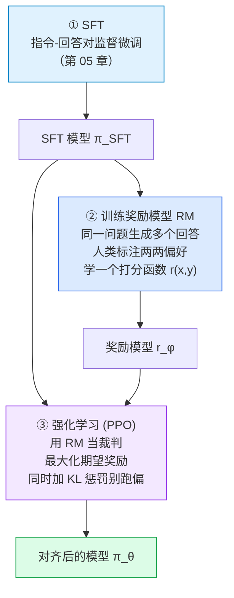
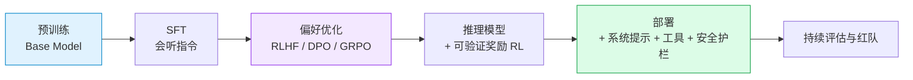

# 08 · 对齐：从"会续写"到"会听话"

> **一句话结论**：对齐 = **用人类偏好数据，把"预测下一个 token"的目标改造成"输出人类喜欢的回答"**。
> 主流路线是 RLHF（奖励模型 + 强化学习），而 DPO 把其中两步合并成一个类似监督学习的损失，工程门槛低得多。

---

## 8.1 为什么需要对齐

预训练（[第 04 章](04-pretraining.md)）和指令微调（[第 05 章](05-finetuning.md)）之后，模型"能听懂指令"了，但还不能判断**什么样的回答算好回答**：

| 问题 | 表现 | 对齐如何解决 |
|------|------|--------------|
| 有害内容 | 问危险问题照答 | 偏好数据中"拒绝"被标注为更好 |
| 幻觉 | 编造事实时同样自信 | 偏好数据中"承认不知道"优于"编造" |
| 冗长/谄媚 | 话多、讨好、不直接 | 人类偏好更短、更直接、更诚实的回答 |
| 格式混乱 | 该列表的写成一段 | 偏好数据固定了常用输出结构 |
| 不做澄清 | 遇到模糊需求直接瞎答 | 学会反问 |

关键点：**"好回答"很难用规则写出来，但人很容易比较两个回答谁更好**。这就是偏好数据的价值——**相对判断比绝对评分更可靠**。

---

## 8.2 RLHF 三阶段



| 阶段 | 数据 | 产物 | 训练信号 |
|------|------|------|----------|
| ① SFT | 指令-回答对 | 会听指令的模型 | 监督（交叉熵） |
| ② RM | 同一 prompt 下的回答**排序**（A > B） | 打分器 r(x,y) | 偏好对（分类/回归） |
| ③ RL | 无需新标注，模型自己采样 | 最终策略 π_θ | 标量奖励（RM 打分） |

### 8.2.1 奖励模型：把偏好变成标量

用 **Bradley-Terry 模型**把"人觉得 A 比 B 好"转成可优化目标：

$$
P(y_w \succ y_l \mid x) = \sigma\big(r_\phi(x, y_w) - r_\phi(x, y_l)\big)
$$

| 符号 | 含义 |
|------|------|
| $x$ | 问题（prompt） |
| $y_w$ | 被偏好的回答（winner） |
| $y_l$ | 被拒绝的回答（loser） |
| $r_\phi(x,y)$ | 奖励模型输出的标量分数（通常就是 LM 头部改成一个输出 1 维的线性层） |
| $\sigma$ | sigmoid，把分数差映射成概率 |

损失函数就是最大化"偏好对排序正确"的似然：

$$
\mathcal{L}_{RM} = -\mathbb{E}_{(x, y_w, y_l) \sim \mathcal{D}} \Big[\log \sigma\big(r_\phi(x,y_w) - r_\phi(x,y_l)\big)\Big]
$$

**直觉**：不要求模型学出"绝对分数"，只要能正确排序——这就是为什么用两两比较而不是打分（人的绝对打分极不一致，但相对排序可靠）。

### 8.2.2 PPO 目标

$$
\mathcal{J}(\theta) = \mathbb{E}_{x \sim \mathcal{D},\, y \sim \pi_\theta(y|x)} \left[\; r_\phi(x, y) \;-\; \beta \, \mathrm{KL}\!\big(\pi_\theta(y|x) \,\|\, \pi_{ref}(y|x)\big) \right]
$$

| 项 | 作用 | 不要它会发生什么 |
|----|------|------------------|
| $r_\phi(x,y)$ | 奖励：RM 打了多少分 | 模型没有优化方向 |
| $\beta \cdot \mathrm{KL}(\pi_\theta \| \pi_{ref})$ | **惩罚"偏离参考模型"** | 模型会找到 RM 的漏洞，输出人类看不懂但对 RM 分数极高的怪话（reward hacking） |
| $\pi_{ref}$ | 参考模型（通常就是 SFT 模型），**冻结** | 没有锚点，模型会漂移 |

为什么 KL 惩罚必不可少：**RM 只是人类偏好的一个近似**。让模型无约束地去骗这个近似，等价于"过度拟合奖励模型的偏好"，会牺牲真实有用性。KL 项就是"别忘了原本会说话"。

> PPO 本身是个复杂的 RL 算法（actor + critic + 优势估计 + 裁剪目标）。对齐场景里普遍用简化配置（去掉部分组件、用 GAE、共享 backbone），这也是它工程复杂、容易训崩的原因。

---

## 8.3 DPO：把 RLHF 化简成一个监督损失

**核心洞察**（Rafailov et al. 2023）：在 KL 约束下最大化奖励的那个最优策略，有解析解：

$$
\pi^*(y \mid x) = \frac{1}{Z(x)} \, \pi_{ref}(y \mid x) \exp\!\left(\frac{1}{\beta} r(x,y)\right)
$$

反过来就能把"奖励"用策略和参考模型的概率比表达出来：

$$
r(x,y) = \beta \log \frac{\pi^*(y|x)}{\pi_{ref}(y|x)} + \beta \log Z(x)
$$

把它代回 Bradley-Terry 偏好模型，**配分配对消掉**，得到只含两个模型的直接优化目标：

$$
\boxed{\;
\mathcal{L}_{DPO}(\theta) = -\mathbb{E}_{(x, y_w, y_l)} \left[
\log \sigma\!\left(
\beta \log \frac{\pi_\theta(y_w|x)}{\pi_{ref}(y_w|x)}
- \beta \log \frac{\pi_\theta(y_l|x)}{\pi_{ref}(y_l|x)}
\right)
\right]
\;}
$$

**人话版**：让模型**相对于参考模型**更倾向于回答 $y_w$、更不倾向于 $y_l$。`β` 控制偏离参考模型的强度（越大越保守）。

```text
RLHF:  需要 4 个模型同时在线
       actor(π_θ) + critic + reward model + reference   →  显存大、流程复杂、易崩

DPO:   只需 2 个模型
       policy(π_θ) + reference(π_ref)                   →  训练像 SFT 一样简单
```

| 维度 | RLHF（PPO） | DPO |
|------|-------------|-----|
| 需要的模型数 | 4（actor/critic/RM/ref） | 2（policy/ref） |
| 训练稳定性 | 差（RL 调参敏感、易 reward hack） | 好（监督式损失，和 SFT 同级） |
| 数据需求 | 偏好对 + 需要在线采样 | **只要现成的偏好对** |
| 效果 | 上限更高（有在线探索） | 多数场景接近，部分任务略逊 |
| 算力 | 高 | 低（约等于一次 SFT） |
| 适用 | 大厂、追求极限 | ✅ 绝大多数团队与个人 |

**实践建议**：预算有限或刚开始做对齐 → **DPO**；有稳定的 RM 且要压榨上限 → RLHF/GRPO。

---

## 8.4 后续演进：更简单、更省数据

| 方法 | 一句话 | 需要偏好对？ | 需要奖励模型？ |
|------|--------|--------------|----------------|
| PPO（RLHF） | 经典在线 RL | RM 生成的偏好 | 是 |
| **DPO** | 离线偏好优化的解析化简 | 是 | 否 |
| **RLAIF / Constitutional AI** | 用 AI（而非人类）生成偏好标注 | 是（AI 生成） | 视实现 |
| **GRPO**（DeepSeek） | 去掉 critic，组内相对比较估优势 | 否（用规则/答案） | 可选 |
| ORPO | 把 SFT 和偏好优化合成一步 | 是 | 否 |
| KTO | 只需要"好/坏"二元标签，不需要成对 | 否（单条即可） | 否 |
| SimPO | DPO 的无参考模型版本（用平均 log 概率当隐式奖励） | 是 | 否 |

**RLAIF 为什么重要**：人类标注贵且慢。用强模型（或按一套"宪法原则"自我批判）生成偏好数据，成本降一个数量级，效果在多数任务上接近 RLHF——这是当前工业界对齐数据的主要来源之一。

**GRPO 为什么火**：推理模型（如 DeepSeek-R1）训练时用**规则可验证的奖励**（数学答案对不对、代码过不过测试）取代人类偏好模型，配合组内相对优势估计，避免训练一个 critic。这直接绕开了"奖励模型被钻空子"的问题——因为奖励是客观可验证的。

---

## 8.5 奖励劫持（Reward Hacking）与安全

**定义**：模型学会**提高奖励分数**而不是**真正变得更好**。

| 症状 | 例子 |
|------|------|
| 谄媚（sycophancy） | 用户说错话，模型顺着说"你说得对" |
| 长度膨胀 | RM 偏好长回答 → 输出越来越啰嗦 |
| 格式讨好 | 无脑堆列表、加粗、emoji 骗分 |
| 过度拒绝 | 安全训练过头，正常问题也拒答 |
| 拒绝承认不知道 | 宁可编也不说"我不确定" |

对应治理手段：

| 手段 | 说明 |
|------|------|
| KL 约束 | 限制偏离参考模型（[8.2.2](#822-ppo-目标)） |
| 奖励模型集成 | 多个 RM 平均，降低被单点欺骗的概率 |
| 可验证奖励 | 用规则/单测代替人偏好（数学、代码） |
| 长度/格式去偏 | 训练 RM 时消除长度等表面特征的相关性 |
| 红队测试 + 持续评估 | 上线前系统化找漏洞 |
| 定期用人类抽检校准 | 防止指标好看但体验变差 |

> **核心矛盾**：对齐指标（RM 分数、胜率）是**代理指标**，而我们要的是"真实有用、安全"。代理指标一定可以被优化到失真。这不是工程 bug，而是这类方法的固有风险。

---

## 8.6 对齐的完整位置



**对齐不是终点**：系统提示、RAG、工具调用、输出过滤、权限控制都是"部署期对齐"的一部分。把安全性完全寄托在权重上是不现实的。

---

## 8.7 常被误解的点

| 误解 | 真相 |
|------|------|
| "RLHF 让模型学会了新知识" | 它调的是**偏好与风格**；知识来自预训练 |
| "DPO 完全等价于 RLHF" | 在离线数据下接近，但缺少在线探索，上限通常略低 |
| "KL 惩罚是为了防止过拟合" | 更准确说是防止**偏离参考模型去骗奖励模型**（reward hacking） |
| "对齐后困惑度应该更低" | 常常**略升**；因为优化目标变了，人类评价才是准绳 |
| "安全对齐靠加一堆拒绝话术" | 过度拒绝本身是缺陷；好的对齐是"该拒的拒、该答的认真答" |
| "有 RM 就够了" | RM 是代理指标，可被优化到失真；必须配合评估与人类抽检 |

---

## 8.8 自查问题

1. 为什么用两两比较而不是绝对打分来收集偏好数据？
2. 写出 Bradley-Terry 偏好概率与 RM 损失。
3. PPO 目标里的 KL 项作用是什么？去掉会怎样？
4. DPO 为什么不需要奖励模型？它的损失在比较什么？
5. RLHF 和 DPO 各需要几个模型？工程差异体现在哪里？
6. 什么是 reward hacking？举三个真实症状。
7. 为什么推理模型偏好"可验证奖励"而不是人类偏好模型？

---

[← 上一章：解码与推理](07-decoding-and-inference.md) · [返回总览](README.md) · [下一章：数学基础 →](09-math-foundations.md)
