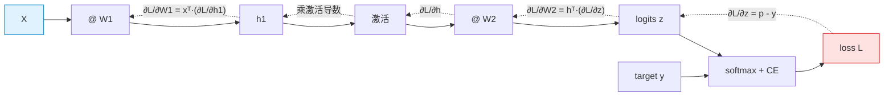

# 09 · 数学基础：关键公式与推导思路

> **一句话结论**：LLM 用到的数学其实不多——**矩阵乘法、softmax、交叉熵、链式法则、几个优化器**。
> 难的不是数学本身，而是把符号和工程实现对应起来。本章按"符号 → 公式 → 推导思路 → 实现注意"的顺序过一遍。

**怎么读这一章**：第 02/03/07 章已经把结论用掉了。本章是"回头补推导"的地方，第一次读可以跳读，第二遍再细看。

---

## 9.1 符号约定（先统一口径）

| 符号 | 含义 | 典型值 |
|------|------|--------|
| $n$ / $T$ | 序列长度（token 数） | 512 – 128k |
| $d$ / $d_{model}$ | 隐藏维度 | 4096 |
| $h$ | 注意力头数 | 32 |
| $d_k = d/h$ | 每个头的维度 | 128 |
| $V$ | 词表大小 | 32k – 200k |
| $L$ | 层数 | 32 |
| $B$ | 批大小（batch size） | 1 – 512 |
| $X \in \mathbb{R}^{n \times d}$ | 输入序列的表示矩阵 | — |
| $x_t \in \mathbb{R}^{d}$ | 第 t 个 token 的向量（行向量约定） | — |
| $W \in \mathbb{R}^{d \times d'}$ | 权重矩阵 | — |
| $z \in \mathbb{R}^{V}$ | logits（未归一化打分） | — |
| $p$ | 概率分布，$\sum_i p_i = 1$ | — |
| $\theta$ | 全部可训练参数 | 7e9 |
| $\eta$ | 学习率 | 1e-4 |
| $\sigma$ | sigmoid：$\frac{1}{1+e^{-x}}$ | — |
| $\odot$ | 逐元素乘（Hadamard） | — |
| $\nabla_\theta$ | 对参数的梯度 | — |

> **约定说明**：本笔记与多数实现一致，**每个 token 是矩阵的一行**（$X \in \mathbb{R}^{n \times d}$）。看到公式里的行/列要能自动换算——这是读论文时最常见的困惑来源。

---

## 9.2 前置：三个必须熟练的运算

### 9.2.1 矩阵乘法与形状检查

$$
(A B)_{ij} = \sum_{k} A_{ik} B_{kj},
\qquad
\underbrace{(m \times k)}_{A} \cdot \underbrace{(k \times p)}_{B} = \underbrace{(m \times p)}_{AB}
$$

**形状检查是调试的第一手段**：算不出来 90% 是形状不对（内维必须相等）。

| 运算 | 形状 | 计算量 |
|------|------|--------|
| $XW$ | $(n,d)\times(d,d') \to (n,d')$ | $2ndd'$ FLOPs |
| $AB^{\top}$ | $(n,d)\times(d,n) \to (n,n)$ | $2n^2d$ |
| 逐元素 | 形状必须相同 | $O(n)$ |

### 9.2.2 点积与余弦相似度

$$
a \cdot b = \sum_{i=1}^{d} a_i b_i = \|a\|\,\|b\|\cos\theta
$$

注意力里 $q \cdot k$ 就是用它衡量"方向一致程度"（含模长影响，所以缩放很关键，见 9.3）。

### 9.2.3 转置与广播

- $(AB)^{\top} = B^{\top}A^{\top}$ —— 反向传播推导的基础
- 广播（broadcast）：`(n,1)` 与 `(1,m)` 相加得到 `(n,m)`，掩码就是这么加的

---

## 9.3 Self-Attention 的缩放：为什么是 √d_k

**结论**：为了让注意力打分矩阵在初始化时保持**单位方差**，softmax 不至于饱和。

### 推导思路

**前提假设**：$q$ 和 $k$ 的各分量独立同分布，均值 0、方差 1（这是合理的初始化假设——现代网络的激活尺度控制就是朝这个方向设计的）。

**第一步**：计算单个乘积项的方差。

$$
\operatorname{Var}(q_i k_i) = \mathbb{E}[q_i^2 k_i^2] - \big(\mathbb{E}[q_i k_i]\big)^2 = \mathbb{E}[q_i^2]\,\mathbb{E}[k_i^2] - 0 = 1 \cdot 1 = 1
$$

**第二步**：$d_k$ 个独立项求和，方差线性累加。

$$
\operatorname{Var}\!\left(\sum_{i=1}^{d_k} q_i k_i\right) = \sum_{i=1}^{d_k} \operatorname{Var}(q_i k_i) = d_k
\qquad \Longrightarrow \qquad
\text{标准差} = \sqrt{d_k}
$$

**第三步**：结论。点积的典型大小随 $\sqrt{d_k}$ 增长。除以 $\sqrt{d_k}$ 后方差回到 1：

$$
\operatorname{Var}\!\left(\frac{q \cdot k}{\sqrt{d_k}}\right) = \frac{d_k}{d_k} = 1
$$

**第四步**：为什么方差重要——看 softmax 的行为。

$$
\operatorname{softmax}(z)_i = \frac{e^{z_i}}{\sum_j e^{z_j}}
$$

| 输入标准差 | softmax 输出 | 梯度 |
|------------|--------------|------|
| ≈ 1 | 平滑分布，各位置都有权重 | 健康 |
| ≫ 1（如 10） | 接近 one-hot；最大项独占 | $\partial p / \partial z \to 0$，**饱和，学不动** |

**真实数据验证**（`demos/02_self_attention.py`）：未缩放时打分绝对值均值 1.457，除以 √d_k = 2.0 后降到 0.729——数值被"压"到合理区间。

### 顺带：Softmax 的雅可比矩阵（推导思路）

$$
\frac{\partial p_i}{\partial z_j} = p_i (\delta_{ij} - p_j)
\qquad\Longrightarrow\qquad
\frac{\partial \mathcal{L}}{\partial z} = p - y \quad (\text{与交叉熵复合后})
$$

这个"$p - y$"结果极其重要（见 9.4），也是为什么 softmax + 交叉熵的组合在框架里常常被合并成一个 op（`cross_entropy_with_logits`）—— 不只是为了数值稳定，也因为梯度形式特别简洁。

---

## 9.4 Softmax 与交叉熵：梯度为什么这么漂亮

### 9.4.1 Softmax 的数值稳定性

$$
\operatorname{softmax}(z)_i = \frac{e^{z_i - c}}{\sum_j e^{z_j - c}} \quad \text{对任意常数 } c \text{ 成立}
$$

取 $c = \max_j z_j$，指数项的取值范围被压到 $(-\infty, 0]$，永不溢出。真实实验见 [第 01 章](01-basics-language-model.md)（`logits=[1000,1001,999]` 时 naive 版本得到 `nan`）。

### 9.4.2 交叉熵

单样本（正确类别为 $y$）：

$$
\mathcal{L} = -\log p_y = -\log \frac{e^{z_y}}{\sum_j e^{z_j}} = -z_y + \log \sum_j e^{z_j}
$$

这个形式叫 **log-sum-exp**，也是数值稳定实现的标准写法。

一个 batch：

$$
\mathcal{L} = -\frac{1}{N}\sum_{i=1}^{N} \log p_{i, y_i}
$$

### 9.4.3 梯度推导

对 logits 求导：

$$
\frac{\partial \mathcal{L}}{\partial z_j} = -\frac{\partial z_y}{\partial z_j} + \frac{\partial}{\partial z_j}\log\sum_k e^{z_k}
= -\delta_{jy} + \frac{e^{z_j}}{\sum_k e^{z_k}}
= p_j - \delta_{jy}
$$

$$
\boxed{\;\frac{\partial \mathcal{L}}{\partial z} = p - y\;}
$$

**人话**：梯度就是"预测分布 − 真实分布（one-hot）"。预测得越准，梯度越小；错得越离谱，梯度越大（但配合 softmax 有上界，不会爆炸）。这个结果也解释了为什么 softmax + CE 的组合训练如此稳定。

### 9.4.4 困惑度

$$
\mathrm{PPL} = \exp(\mathcal{L})
$$

推导：对一个长度为 $T$ 的序列，其似然是 $\prod_t p_t$，取负对数再取指数就是"几何平均的倒数"：

$$
\mathrm{PPL} = \left(\prod_{t=1}^{T} \frac{1}{p_t}\right)^{1/T} = \exp\!\left(-\frac{1}{T}\sum_t \log p_t\right) = e^{\mathcal{L}}
$$

**直觉**：PPL 相当于"模型每次预测时，等价于在 PPL 个候选里均匀犹豫"。

---

## 9.5 位置编码与 RoPE

### 9.5.1 正弦位置编码

$$
PE_{(pos,\,2i)} = \sin\!\left(\frac{pos}{10000^{2i/d}}\right),
\qquad
PE_{(pos,\,2i+1)} = \cos\!\left(\frac{pos}{10000^{2i/d}}\right)
$$

定义角频率 $\omega_i = 10000^{-2i/d}$，则 $\operatorname{PE}(pos) = [\sin(\omega_0 pos), \cos(\omega_0 pos), \sin(\omega_1 pos), \cos(\omega_1 pos), \dots]$

**为什么能表达相对位置**（推导思路）：利用和角公式

$$
\begin{aligned}
\sin(\omega(pos+k)) &= \sin(\omega pos)\cos(\omega k) + \cos(\omega pos)\sin(\omega k) \\
\cos(\omega(pos+k)) &= \cos(\omega pos)\cos(\omega k) - \sin(\omega pos)\sin(\omega k)
\end{aligned}
$$

写成矩阵形式：

$$
\begin{bmatrix} \sin(\omega(pos+k)) \\ \cos(\omega(pos+k)) \end{bmatrix}
=
\underbrace{\begin{bmatrix} \cos(\omega k) & \sin(\omega k) \\ -\sin(\omega k) & \cos(\omega k) \end{bmatrix}}_{\text{只与 } k \text{ 有关的旋转矩阵}}
\begin{bmatrix} \sin(\omega pos) \\ \cos(\omega pos) \end{bmatrix}
$$

**结论**：$PE(pos+k)$ 是 $PE(pos)$ 的一个**只依赖 k 的线性变换**。所以注意力里 $q^{\top}k$ 能自然地表达相对距离——这就是 `demos/04_positional_encoding.py` 里"同一 k 下不同 pos 点积完全相同"（7.4852 × 4）的数学原因。

### 9.5.2 RoPE：把旋转搬到 Q/K 上

RoPE 直接对 Q、K 施加旋转（而非加在输入上）：

$$
q_m' = R_{\Theta,m} q_m, \qquad k_n' = R_{\Theta,n} k_n
$$

对二维子空间 $(2i, 2i+1)$ 的旋转矩阵：

$$
R^{(i)}_{\theta_i, m} =
\begin{bmatrix}
\cos(m\theta_i) & -\sin(m\theta_i) \\
\sin(m\theta_i) & \cos(m\theta_i)
\end{bmatrix},
\qquad \theta_i = 10000^{-2i/d}
$$

**关键性质**（这是 RoPE 的全部价值）：

$$
{q_m'}^{\top} k_n' = (R_m q_m)^{\top}(R_n k_n) = q_m^{\top} R_m^{\top} R_n k_n = q_m^{\top} R_{n-m} k_n
$$

因为 $R^{\top}_m R_n = R_{n-m}$（旋转矩阵的正交性与可加性）。**内积只依赖 $n-m$，即相对位置。** 而且这个操作不增加任何参数，也不改变向量模长（正交变换）。

| 实现细节 | 说明 |
|----------|------|
| 应用到哪些位置 | 只对 Q、K 旋转，**V 不动** |
| 计算方式 | 用 `cos/sin` 预计算表，偶数维用 sin、奇数维用 cos 配对旋转 |
| 长上下文扩展 | 位置插值 / 调整 $\theta_i$ 基底（NTK-aware）/ YaRN |

---

## 9.6 反向传播与自动微分

### 9.6.1 链式法则

$$
\frac{\partial \mathcal{L}}{\partial \theta}
= \frac{\partial \mathcal{L}}{\partial z} \cdot \frac{\partial z}{\partial h} \cdot \frac{\partial h}{\partial \theta}
$$

**反向传播 = 按计算图的逆序，反复应用链式法则**，同时复用中间梯度（所以它比"逐个参数数值求导"快几个数量级）。

### 9.6.2 计算图（前向 → 反向）

虚线是反向传播方向。工程上一个必须记住的结论：

> **每个算子的反向传播，本质上都是"用上游梯度 × 本算子的局部雅可比"，而矩阵乘的反向就是"另一侧的转置"**。
> 例：$z = hW$ 时，$\frac{\partial \mathcal{L}}{\partial W} = h^{\top}\frac{\partial \mathcal{L}}{\partial z}$，$\frac{\partial \mathcal{L}}{\partial h} = \frac{\partial \mathcal{L}}{\partial z}W^{\top}$。

### 9.6.3 为什么必须用 autograd

以 7B 模型为例，参数量 7×10⁹：

| 方式 | 代价 | 可行性 |
|------|------|--------|
| 数值求导（逐参数扰动） | 每个参数需要 2 次前向 → 1.4×10¹⁰ 次前向 | ❌ 完全不可行 |
| 符号求导（推导闭式） | 表达式爆炸 | ❌ 不现实 |
| **反向传播 + autograd** | 约 1 次前向的 2 倍计算量 | ✅ 唯一可行 |

这也解释了 `C ≈ 6ND` 的由来：**前向 2ND + 反向 4ND = 6ND**。

### 9.6.4 梯度累积与裁剪

GPU 装不下大 batch 时：

$$
g_{\text{effective}} = \frac{1}{K}\sum_{k=1}^{K} g_k \quad \text{（K 个 micro-batch 累积后再更新）}
$$

梯度裁剪（防爆炸）：

$$
g \leftarrow g \cdot \min\!\left(1, \frac{c}{\|g\|}\right) \qquad (c \text{ 通常取 } 1.0)
$$

---

## 9.7 优化器：从 SGD 到 AdamW

| 优化器 | 更新公式 | 特点 |
|--------|----------|------|
| SGD | $\theta \leftarrow \theta - \eta g$ | 简单，收敛慢，对 LR 敏感 |
| Momentum | $v \leftarrow \beta v + g;\; \theta \leftarrow \theta - \eta v$ | 抑制震荡，加速方向一致性 |
| RMSProp | $s \leftarrow \beta s + (1-\beta)g^2;\; \theta \leftarrow \theta - \eta \frac{g}{\sqrt{s}+\epsilon}$ | 自适应学习率 |
| **Adam** | $m \leftarrow \beta_1 m + (1-\beta_1)g$ $v \leftarrow \beta_2 v + (1-\beta_2)g^2$ $\hat m = \frac{m}{1-\beta_1^t},\; \hat v = \frac{v}{1-\beta_2^t}$ $\theta \leftarrow \theta - \eta\frac{\hat m}{\sqrt{\hat v}+\epsilon}$ | 一阶+二阶动量，几乎所有 LLM 都用 |
| **AdamW** | 同 Adam，但权重衰减**独立**于梯度：$\theta \leftarrow \theta - \eta(\frac{\hat m}{\sqrt{\hat v}+\epsilon} + \lambda\theta)$ | 修正原版 Adam 中 L2 与自适应缩放耦合的问题 |

**符号含义**：

| 符号 | 含义 | 默认值 |
|------|------|--------|
| $\beta_1$ | 一阶动量衰减 | 0.9 |
| $\beta_2$ | 二阶动量衰减 | 0.95（LLM 常用，而非 0.999） |
| $\epsilon$ | 数值稳定项 | 1e-8 |
| $\lambda$ | 权重衰减系数 | 0.1 |
| $\hat m, \hat v$ | 偏差校正后的动量（因为初始为 0，前几步偏小） | — |

**为什么 LLM 显存这么贵**：Adam 要为每个参数存一阶和二阶动量，各 4 字节 fp32：

$$
\text{优化器状态} = 8N \text{ bytes} = 8 \times 7\times10^9 \approx 52\ \text{GB}
$$

（[第 05 章](05-finetuning.md)里的显存账就是这么来的。）

---

## 9.8 概率与信息论速查

### 9.8.1 熵、交叉熵、KL 散度

$$
H(p) = -\sum_i p_i \log p_i
\qquad
H(p,q) = -\sum_i p_i \log q_i
\qquad
\mathrm{KL}(p \| q) = \sum_i p_i \log \frac{p_i}{q_i}
$$

三者的关系（**这是理解"为什么训练目标合理"的关键**）：

$$
H(p, q) = H(p) + \mathrm{KL}(p \| q)
$$

- $H(p)$：真实分布的固有不确定性（不可约损失 $L_\infty$）
- $\mathrm{KL}(p\|q)$：模型分布与真实分布的差距（我们真正想最小化的东西）
- 由于 $H(p)$ 与参数无关，**最小化交叉熵 ≡ 最小化 KL 散度**

| 性质 | KL 散度 |
|------|---------|
| 非负性 | $\mathrm{KL} \ge 0$，当且仅当 $p=q$ 时为 0 |
| 不对称 | $\mathrm{KL}(p\|q) \neq \mathrm{KL}(q\|p)$ |
| 前向 KL（$\mathrm{KL}(p\|q)$） | 惩罚"$p>0$ 但 $q\approx 0$"→ 倾向覆盖所有模式（**mode-covering**） |
| 反向 KL（$\mathrm{KL}(q\|p)$） | 惩罚"$q>0$ 但 $p\approx 0$"→ 倾向只抓一个模式（**mode-seeking**） |

> 对齐（[第 08 章](08-alignment-rlhf.md)）里用的 KL 惩罚是 $\mathrm{KL}(\pi_\theta \| \pi_{ref})$——注意方向很重要，它约束的是"新模型不要跑到参考模型概率极低的地方去"。

### 9.8.2 采样：温度与 top-p 的数学

温度采样：

$$
p_i = \frac{\exp(z_i / T)}{\sum_j \exp(z_j / T)}
$$

**T 的极限行为**（值得记）：

| T | 极限 | 证明思路 |
|---|------|----------|
| $T \to 0^+$ | $p \to$ one-hot（argmax） | 最大项占指数主导 |
| $T \to \infty$ | $p \to$ 均匀分布 | $z_i/T \to 0$，所有 $e^0 = 1$ |

Top-p（核采样）：按概率降序排列，取最小集合 $S$ 满足

$$
\sum_{i \in S} p_i \ge p
$$

然后把 $S$ 外概率置 0 并重新归一化。

### 9.8.3 奖励模型里的 Bradley-Terry

见 [第 08 章 8.2.1](08-alignment-rlhf.md)，本质是用 sigmoid 把"分数差"映射为偏好概率：

$$
P(y_w \succ y_l) = \sigma(r_w - r_l)
$$

---

## 9.9 手推清单（面试前自查）

能不看笔记推出下面这些，理论部分就过关了：

| # | 推导 | 关键工具 |
|---|------|----------|
| 1 | 注意力公式中 √d_k 的来历 | 方差可加性 |
| 2 | softmax 的雅可比 $p_i(\delta_{ij}-p_j)$ | 商的求导 |
| 3 | 交叉熵对 logits 的梯度 $p - y$ | 链式法则 + log-sum-exp |
| 4 | PPL 与交叉熵的关系 | 几何平均 |
| 5 | 正弦位置编码的"相对位置线性变换"性质 | 和角公式 |
| 6 | RoPE 内积只依赖相对位置 | 旋转矩阵正交性 $R_m^{\top}R_n = R_{n-m}$ |
| 7 | 矩阵乘的反向传播 | $(AB)^{\top}=B^{\top}A^{\top}$ |
| 8 | Adam 的偏差校正为什么必要 | 初始动量全 0 |
| 9 | $C \approx 6ND$ 的由来 | 前向 2ND + 反向 4ND |
| 10 | KL 惩罚如何抑制 reward hacking | 前向 KL 的 mode-covering 行为 |

---

## 9.10 自查问题

1. 为什么注意力要除以 √d_k？请写出方差推导的两步。
2. 交叉熵对 logits 的梯度是什么？为什么这个形式带来训练稳定性？
3. 正弦位置编码为什么能表达相对位置？RoPE 的做法有什么不同？
4. 反向传播为什么比数值求导快几个数量级？
5. AdamW 和 Adam 的区别是什么？为什么要做这个改动？
6. 交叉熵、KL 散度、熵三者的关系式是什么？为什么最小化交叉熵是合理的？
7. 温度 T→0 和 T→∞ 时，softmax 分别退化成什么？为什么？

---

[← 上一章：对齐（RLHF 与 DPO）](08-alignment-rlhf.md) · [返回总览](README.md) · [下一章：术语表 →](10-glossary.md)
