# 11 · 开源项目推荐：从"读懂"到"跑通"

> 选项目的标准：**能跑（有清晰的安装与数据准备说明）**、**能读（代码量与结构适合学）**、**能对应到本目录的具体章节**。
> 下面 10 个按"从零实现 → 生态与微调 → 推理部署"排序，每个都标注了对应章节和上手建议。

---

## 11.1 一览表

| # | 项目 | 一句话 | 对应章节 | 难度 |
|---|------|--------|----------|------|
| 1 | [karpathy/nanoGPT](#1-karpathynanogpt) | 400 行代码从零训练 GPT | [01](01-basics-language-model.md) · [03](03-transformer.md) · [04](04-pretraining.md) | ⭐⭐ |
| 2 | [karpathy/minbpe](#2-karpathyminbpe) | 从零实现 BPE 分词器 | [01.2](01-basics-language-model.md) | ⭐ |
| 3 | [rasbt/LLMs-from-scratch](#3-rasbtllms-from-scratch) | 配套《Build a LLM from Scratch》的完整代码 | 全书 01–05 | ⭐⭐ |
| 4 | [bbycroft/llm-viz](#4-bbycroftllm-viz) | GPT 前向计算的 3D 可视化 | [02](02-attention.md) · [03](03-transformer.md) | ⭐ |
| 5 | [huggingface/transformers](#5-huggingfacetransformers) | 模型加载与推理的事实标准 | [03](03-transformer.md) · [05](05-finetuning.md) | ⭐⭐ |
| 6 | [huggingface/peft](#6-huggingfacepeft) | LoRA / QLoRA 的官方实现 | [05](05-finetuning.md) | ⭐⭐ |
| 7 | [hiyouga/LLaMA-Factory](#7-hiyougallama-factory) | 零代码微调平台（中文友好） | [05](05-finetuning.md) | ⭐ |
| 8 | [huggingface/trl](#8-huggingfacetrl) | SFT / DPO / PPO / GRPO 训练库 | [08](08-alignment-rlhf.md) | ⭐⭐⭐ |
| 9 | [vllm-project/vllm](#9-vllm-projectvllm) | 高吞吐推理引擎（PagedAttention 发源地） | [07](07-decoding-and-inference.md) | ⭐⭐ |
| 10 | [jingyaogong/minimind](#10-jingyaogongminimind) | 从零训练中文小模型（2 小时） | 全书 | ⭐⭐ |

---

## 1. karpathy/nanoGPT

- **仓库**：<https://github.com/karpathy/nanoGPT>
- **简介**：Andrej Karpathy 写的"最简可训练的 GPT"参考实现。`model.py` 约 300 行，`train.py` 约 300 行，把[第 03 章](03-transformer.md)里的 decoder block 完整写了一遍：多头因果自注意力、MLP、残差、LayerNorm、权重共享。
- **对应章节**：
  - [01 语言模型基础](01-basics-language-model.md) —— 亲手看到 `x` 与 `y` 错开一位、交叉熵怎么算
  - [03 Transformer 架构](03-transformer.md) —— 这是本书架构章的**可执行版本**
  - [04 预训练](04-pretraining.md) —— 体验 `C≈6ND`、学习率调度、梯度裁剪
- **上手建议**：
  ```bash
  git clone https://github.com/karpathy/nanoGPT && cd nanoGPT
  python data/shakespeare_char/prepare.py      # 准备数据集
  python train.py config/train_shakespeare_char.py   # 单卡几十分钟
  ```
  跑完后 `loss` 会从 ~4.2 降到 ~1.5，然后可以采样出一段"莎士比亚风格"文本。**这是理解"预训练到底在做什么"最直观的一次体验。**
- **读代码顺序建议**：`model.py` 的 `CausalSelfAttention` → `MLP` → `Block` → `GPT.forward`，与[第 03 章 3.5 的数据流图](03-transformer.md)逐行对照。

---

## 2. karpathy/minbpe

- **仓库**：<https://github.com/karpathy/minbpe>
- **简介**：极简 BPE 实现（含 GPT-2/GPT-4 风格的正则预切分），代码不到 300 行，是 `tiktoken` 的教学简化版。
- **对应章节**：[01.2 分词](01-basics-language-model.md)
- **上手建议**：先跑通 `train()` 观察合并过程，再对照本目录 `demos/01_bpe_tokenizer.py`——后者是本章 demo 的原型，你可以把两个实现并排读，看工业实现多了哪些处理（正则预切分、特殊 token、字节级处理）。

---

## 3. rasbt/LLMs-from-scratch

- **仓库**：<https://github.com/rasbt/LLMs-from-scratch>
- **简介**：配套《Build a Large Language Model (From Scratch)》一书的全部代码，从 tokenizer、注意力、GPT 架构，到预训练、加载预训练权重、指令微调，**一章一个 notebook**，循序渐进且不需要多卡。
- **对应章节**：本目录 [01](01-basics-language-model.md) – [05](05-finetuning.md) 的**最佳动手配套**，尤其是：
  - 第 3 章 → [第 02 章 注意力](02-attention.md)
  - 第 4 章 → [第 03 章 架构](03-transformer.md)
  - 第 6-7 章 → [第 05 章 微调](05-finetuning.md)
- **上手建议**：按章节 notebook 顺序做，每个 notebook 都有清晰的"自己动手改"练习。适合**边读本书边敲代码**的节奏。

---

## 4. bbycroft/llm-viz

- **仓库**：<https://github.com/bbycroft/llm-viz>
- **简介**：用 3D 方式可视化 GPT 的前向计算——每个 token 如何变成 embedding、QKV 如何投影、注意力矩阵长什么样、softmax 在哪一步发生、最终如何采样出 token。**把[第 02](02-attention.md)/[03 章](03-transformer.md)的抽象过程变成可旋转的实物**。
- **对应章节**：[02 注意力](02-attention.md)、[03 Transformer](03-transformer.md)
- **上手建议**：先自己做一遍 `demos/02_self_attention.py`，再用这个项目对照——你会发现两者的计算步骤完全一致，只是它把张量画了出来。

---

## 5. huggingface/transformers

- **仓库**：<https://github.com/huggingface/transformers>
- **简介**：几乎所有开源模型的统一加载与推理接口。**读懂它的 `modeling_llama.py` / `modeling_qwen2.py`，等于读懂了工业级实现**（FlashAttention 集成、KV Cache、RoPE 实现、GQA）。
- **对应章节**：
  - [03 架构](03-transformer.md) —— 对照 `LlamaDecoderLayer` 看每个子层
  - [05 微调](05-finetuning.md)、[07 推理](07-decoding-and-inference.md) —— 加载、生成、量化接口
- **上手建议**：
  ```python
  from transformers import AutoModelForCausalLM, AutoTokenizer
  tok = AutoTokenizer.from_pretrained("Qwen/Qwen2.5-0.5B-Instruct")
  m = AutoModelForCausalLM.from_pretrained("Qwen/Qwen2.5-0.5B-Instruct")
  ```
  然后用 `output_hidden_states=True` 把中间层打出来，和本目录讲的形状表逐项核对。

---

## 6. huggingface/peft

- **仓库**：<https://github.com/huggingface/peft>
- **简介**：LoRA / QLoRA / DoRA / Prefix Tuning 等 PEFT 方法的官方实现，接口极简（几行配置即可挂载）。
- **对应章节**：[05 微调](05-finetuning.md)（尤其是 LoRA 与 QLoRA 两节）
- **上手建议**：
  ```python
  from peft import LoraConfig, get_peft_model
  cfg = LoraConfig(r=8, lora_alpha=16, target_modules=["q_proj", "v_proj"], lora_dropout=0.05)
  model = get_peft_model(base_model, cfg)
  model.print_trainable_parameters()   # 亲手验证 0.39% 这个数字
  ```
  跑完把这个输出与 `demos/06_lora_params.py` 的表格比对，**你会看到数学公式和真实框架完全对上**。

---

## 7. hiyouga/LLaMA-Factory

- **仓库**：<https://github.com/hiyouga/LlamaFactory>（原 `hiyouga/LLaMA-Factory`，仓库已改名）
- **简介**：国产开源微调平台，支持 100+ 模型、SFT / DPO / PPO / 预训练全流程，**带 WebUI 和中文文档**，命令行与配置文件两种方式都能跑。
- **对应章节**：[05 微调](05-finetuning.md)、[08 对齐](08-alignment-rlhf.md)
- **上手建议**：用 WebUI 走一遍"选模型 → 上传数据集 → 选 LoRA → 训练 → 推理"的全流程，**把本目录第 05 章的每个超参在界面上找到对应项**。这是最低成本的一次真实微调体验。
- **注意**：显存门槛取决于模型大小，QLoRA + 7B 在 12–24 GB 卡上可行。

---

## 8. huggingface/trl

- **仓库**：<https://github.com/huggingface/trl>
- **简介**：Transformer Reinforcement Learning，实现 SFT、DPO、PPO、GRPO、ORPO、KTO 等对齐算法，与 `peft` / `transformers` 无缝配合。
- **对应章节**：[08 对齐（RLHF 与 DPO）](08-alignment-rlhf.md)
- **上手建议**：从 `DPOTrainer` 开始（不需要奖励模型，几十行就能跑通），跑通后再看 `PPOTrainer` 的实现——**对比两者的数据流，第 08 章的"4 个模型 vs 2 个模型"就变成可触摸的代码差异**。

---

## 9. vllm-project/vllm

- **仓库**：<https://github.com/vllm-project/vllm>
- **简介**：当前最主流的推理引擎，PagedAttention 与连续批处理的发源地。同样硬件下吞吐常是朴素实现的十几倍。
- **对应章节**：[07 解码与推理](07-decoding-and-inference.md)（KV Cache / PagedAttention / 连续批处理）
- **上手建议**：
  ```bash
  pip install vllm
  vllm serve Qwen/Qwen2.5-0.5B-Instruct --max-model-len 4096
  ```
  然后用 `nvidia-smi`（或有 `metrics` 接口时看日志）观察：
  1. 并发 1 个请求 vs 32 个请求时的吞吐差异 → 验证"decode 是带宽瓶颈"
  2. 日志里的 **GPU KV cache usage** → 验证[第 07 章](07-decoding-and-inference.md)的 KV Cache 显存公式
  3. 对比 `--gpu-memory-utilization` 调大后并发能力的变化

---

## 10. jingyaogong/minimind

- **仓库**：<https://github.com/jingyaogong/minimind>
- **简介**：中文社区很受欢迎的"从零训练小模型"项目：**约 2 小时、单卡 3090 就能训出一个 26M 参数、能对话的中文小模型**，覆盖 tokenizer → 预训练 → SFT → LoRA → 推理全链路，文档全中文。
- **对应章节**：本目录**全书的主线**——[01](01-basics-language-model.md) 的 token 流程、[03](03-transformer.md) 的架构、[04](04-pretraining.md) 的预训练、[05](05-finetuning.md) 的 SFT/LoRA
- **上手建议**：**这是本目录最推荐的"毕业项目"**。它把本书所有章节串成一条可执行链路，而且中文语境下更容易对照理解（分词、数据、对话模板都是中文场景）。
- **对照读法**：一边跑训练一边回来翻本目录对应章节，尤其是"预训练数据怎么准备""SFT 的 loss mask 怎么打"这两处细节。

---

## 11.2 学习路径：三条不同起点的路线

```mermaid
flowchart TD
    subgraph L1["路线 A · 想彻底搞懂原理（2–4 周）"]
        A1["minbpe<br/>分词"] --> A2["nanoGPT<br/>架构 + 预训练"]
        A2 --> A3["LLMs-from-scratch<br/>逐章精读"]
        A3 --> A4["peft<br/>亲手验证 0.39%"]
    end
    subgraph L2["路线 B · 想尽快能干活（1–2 周）"]
        B1["llm-viz<br/>建立直觉"] --> B2["LLaMA-Factory<br/>跑通一次微调"]
        B2 --> B3["vllm<br/>部署与压测"]
        B3 --> B4["trl<br/>做一次 DPO"]
    end
    subgraph L3["路线 C · 中文项目实战（1 周）"]
        C1["minimind<br/>全链路复现"] --> C2["transformers<br/>读工业实现"]
        C2 --> C3["LLaMA-Factory + trl<br/>中文对话模型"]
    end

    style L1 fill:#e0f2fe,stroke:#0284c7
    style L2 fill:#dcfce7,stroke:#16a34a
    style L3 fill:#f3e8ff,stroke:#9333ea
```



---

## 11.3 延伸资源（不计入正式推荐，但值得知道）

| 资源 | 类型 | 用途 |
|------|------|------|
| <https://github.com/ggml-org/llama.cpp> | 推理引擎 | 在 CPU / Apple Silicon 上跑量化模型（GGUF），本地开发首选 |
| <https://github.com/EleutherAI/lm-evaluation-harness> | 评测框架 | 跑 MMLU / GSM8K 等标准 benchmark（[第 06 章](06-scaling-and-emergence.md)评测） |
| <https://github.com/huggingface/lighteval> | 评测框架 | HF 生态的评测工具，与 Transformers 集成 |
| <https://github.com/Dao-AILab/flash-attention> | 底层算子 | FlashAttention 官方实现（[第 02 章 2.7](02-attention.md)） |
| <https://github.com/huggingface/accelerate> | 训练工具 | 一行命令切换单卡/多卡/FSDP（[第 04 章 4.4](04-pretraining.md)） |
| <https://github.com/deepspeedai/DeepSpeed> | 训练框架 | ZeRO 系列实现（[第 04 章 4.4](04-pretraining.md)） |
| <https://jalammar.github.io/illustrated-transformer/> | 图解博客 | The Illustrated Transformer，理解注意力最经典的图文教程 |

---

## 11.4 建议的验证方式（怎么算"跑通了"）

| 项目 | 跑通的标志 | 与本目录的对照点 |
|------|------------|------------------|
| minbpe | 能打印出合并记录，且新词切分结果与你手推一致 | [01.2](01-basics-language-model.md) 的合并表 |
| nanoGPT | loss 从 ~4.2 降到 ~1.5，能采样出连贯风格文本 | [04.5](04-pretraining.md) 的算力账 |
| peft | `print_trainable_parameters()` 输出 ≈ 0.39%（r=8） | [05.4](05-finetuning.md) 的参数量表 |
| vllm | 并发提升后吞吐显著上升，日志显示 KV cache 使用率 | [07.3](07-decoding-and-inference.md) 的显存公式 |
| trl (DPO) | 偏好对的 `rewards/chosen` 上升、`rejected` 下降 | [08.3](08-alignment-rlhf.md) 的 DPO 损失 |
| minimind | 2 小时训出能对话的中文小模型 | 全书串讲 |

---

[← 上一章：术语表](10-glossary.md) · [返回总览](README.md) · [返回仓库首页](../README.md)
