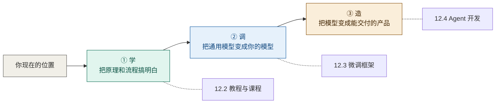
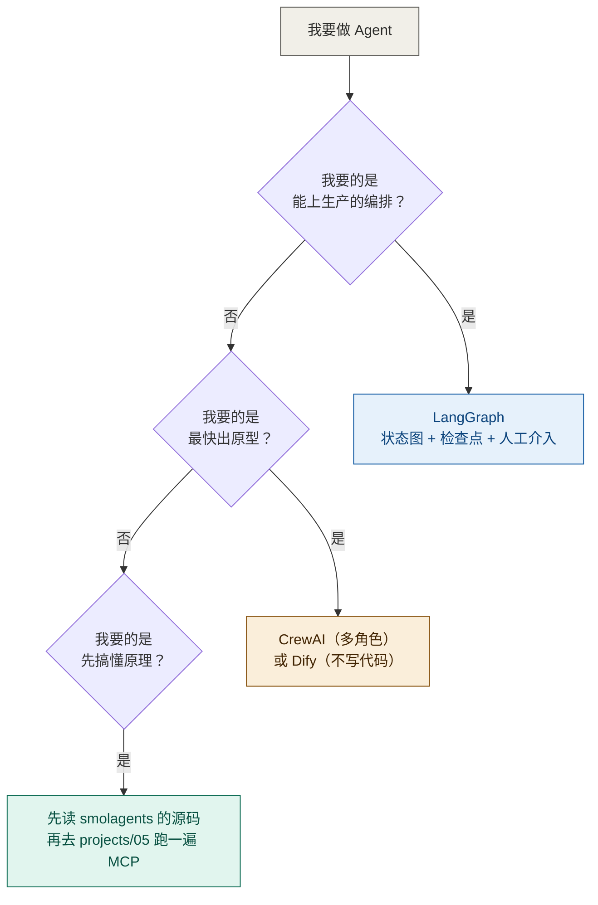
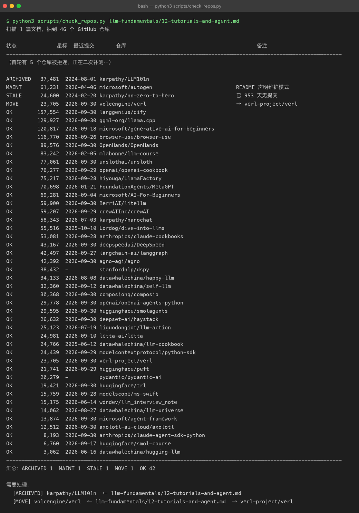

# 12 · 教程、微调与 Agent 开发：从「看懂」到「做出来」

> **[第 11 章](11-open-source-projects.md) 与本章的分工**：
> 第 11 章推的是「**能动手复现的开源项目**」——从零实现 Transformer、微调库、推理引擎；
> 本章推的是「**教程与课程**」（先把路走对）和「**Agent 开发框架**」（把模型变成产品）。
> 两边只在微调部分有少量交接，都有明确指向，**不重复正文**。
>
> 文中的星标数与最近提交日期，全部由 [`scripts/check_repos.py`](../scripts/check_repos.py)
> 在 **2026-09-30** 当天从 GitHub 现场抓取（见 [12.7](#127-这份清单怎么维护) 的真实运行截图）。
> 快照会过期，所以更要紧的是 [12.7](#127-这份清单怎么维护) 那套**自己复跑**的方法。

---

## 12.1 三张地图：学、调、造

这一章的内容对应三种截然不同的目标。**先认清自己在哪一条线上，再往下看**——
否则你会把「学原理的教程」当成「做产品的框架」用，浪费掉几周。



一句话区分：

| 线 | 你在回答的问题 | 典型产出 | 本仓库对应 |
|---|---|---|---|
| **学** | 「这件事为什么成立」 | 笔记、能跑通的最小实现 | 本目录第 01–10 章 + [第 11 章](11-open-source-projects.md) |
| **调** | 「怎么让模型听我的」 | 一个 LoRA 权重、一份训练日志 | [第 05 章](05-finetuning.md) · [第 08 章](08-alignment-rlhf.md) |
| **造** | 「怎么让别人用上」 | 一个能调用的 API / 一个能演示的应用 | [`projects/03`](../projects/03-ai-application/README.md) · [`projects/05`](../projects/05-agent-mcp/README.md) |

---

## 12.2 教程与课程：先把路走对

### 12.2.1 中文优先

你在中文语境下学，分词、数据集、对话模板都会更顺，**遇到问题也更容易搜到答案**。

| 仓库 | 星标 | 最近提交 | 覆盖什么 | 适合谁 |
|---|---|---|---|---|
| **[`datawhalechina/happy-llm`](https://github.com/datawhalechina/happy-llm)** | 34.1k | 2026-08-08 | NLP 基础 → Transformer → 预训练模型 → **动手搭 LLaMA2** → 训练实践 → RAG / Agent | **中文首选**。有 PDF + 在线阅读，第七章正好接本章 12.4 |
| [`datawhalechina/self-llm`](https://github.com/datawhalechina/self-llm) | 32.4k | 2026-09-12 | 面向国内开源模型（Qwen / GLM / InternLM 等）的**部署与微调实操指南** | 手上只有一张消费级显卡、想真调一次时看它 |
| [`liguodongiot/llm-action`](https://github.com/liguodongiot/llm-action) | 25.1k | 2026-07-19 | 大模型**训练 / 推理 / 微调 / 压缩 / 应用**的工程实战合集 | 偏工程视角，和你的后端背景最贴 |
| [`datawhalechina/llm-cookbook`](https://github.com/datawhalechina/llm-cookbook) | 24.8k | 2025-06-12 | 吴恩达系列课程的中文版（Prompt / RAG / Agent 三部分） | 想快速过一遍「LLM 应用能做什么」 |
| [`wdndev/llm_interview_note`](https://github.com/wdndev/llm_interview_note) | 15.2k | 2026-06-14 | 大模型岗位面试题库与知识点整理 | 准备面试时当题纲，配合本目录 [第 10 章术语表](10-glossary.md) |
| [`datawhalechina/llm-universe`](https://github.com/datawhalechina/llm-universe) | 14.1k | 2026-08-27 | 动手学大模型应用开发：RAG、Agent、评估 | 与你 [`projects/04`](../projects/04-rag/README.md) 的路线高度重合，可作外部对照 |
| [`datawhalechina/hugging-llm`](https://github.com/datawhalechina/hugging-llm) | 3.1k | 2026-06-16 | 面向 HuggingFace 生态的入门笔记 | 早期项目，内容较浅，**按需查** |

### 12.2.2 英文经典

| 仓库 | 星标 | 最近提交 | 一句话 |
|---|---|---|---|
| [`microsoft/generative-ai-for-beginners`](https://github.com/microsoft/generative-ai-for-beginners) | 120.8k | 2026-09-18 | 微软的 21 课生成式 AI 入门，**每课都有可跑代码**，是「应用侧」最完整的免费课 |
| [`mlabonne/llm-course`](https://github.com/mlabonne/llm-course) | 83.2k | 2026-02-05 | 路线图 + Colab，分「基础 / 科学家 / 工程师」三条线，配图质量高 |
| [`openai/openai-cookbook`](https://github.com/openai/openai-cookbook) | 76.3k | 2026-09-29 | 官方示例集。**学 API 用法看它就够了**，比读任何二手教程都准 |
| [`microsoft/AI-For-Beginners`](https://github.com/microsoft/AI-For-Beginners) | 69.3k | 2026-09-04 | 更宽的 AI 通识课（含传统 ML / CV / NLP），用来补非 LLM 的背景 |
| [`karpathy/nanochat`](https://github.com/karpathy/nanochat) | 58.3k | 2026-07-03 | 不到 8000 行跑通「分词 → 预训练 → SFT → RL → 评估 → 推理」全流程，**一个 `--depth` 旋钮控制全部超参** |
| [`Lordog/dive-into-llms`](https://github.com/Lordog/dive-into-llms) | 55.5k | 2025-10-10 | 上海交大的动手实践课：微调、推理、**智能体、安全（越狱攻击）**、RLHF，有 PPT + Notebook |
| [`anthropics/claude-cookbooks`](https://github.com/anthropics/claude-cookbooks) | 53.1k | 2026-09-28 | Anthropic 官方示例库，**工具调用 / Agent 部分写得非常实操** |
| [`karpathy/nn-zero-to-hero`](https://github.com/karpathy/nn-zero-to-hero) | 24.6k | 2024-02-20 | 从反向传播手搓到 GPT 的视频课配套代码。**已不再更新，但内容是完整的**——它是「讲得最清楚」的那一类，不是「最新」的那一类 |
| [`huggingface/smol-course`](https://github.com/huggingface/smol-course) | 6.8k | 2026-09-17 | HF 官方小模型课，聚焦「小到能本地跑」的模型与对齐 |

### 12.2.3 三条不要踩的坑

1. **不要全都做。** 上面每一条都够你学一个月，全做等于全不做。
   中文线挑 `happy-llm` **一个**，英文线挑 `openai-cookbook`（学应用）或 `nanochat`（学全流程）**一个**，就够了。
2. **教程的终点是「自己写一遍」。** 和 [`python-practice/00-how-to-practice.md`](../python-practice/00-how-to-practice.md) 说的一样：
   关掉教程重写，才算学过。
3. **注意教程和框架的时效差。** 教程可以慢两年，框架不行——本章 12.4 里就有活例子。

---

## 12.3 微调：把通用模型变成你的模型

> [第 05 章](05-finetuning.md) 讲**原理**（LoRA 为什么省显存、loss mask 怎么打），[第 11 章第 7 节](11-open-source-projects.md#7-hiyougallama-factory) 推了 **LLaMA-Factory 与 trl**。
> 这里补的是「**你到底该用哪个**」，以及第 11 章没覆盖的工程侧选项。

| 仓库 | 星标 | 最近提交 | 定位 | 什么时候用它 |
|---|---|---|---|---|
| **[`unslothai/unsloth`](https://github.com/unslothai/unsloth)** | 77.1k | 2026-09-30 | **极致省显存**的 LoRA / QLoRA 引擎 | **单卡首选**。24 GB 显存能跑 7B；官方给免费 Colab，适合你的第一次微调 |
| [`hiyouga/LlamaFactory`](https://github.com/hiyouga/LlamaFactory) | 75.2k | 2026-09-28 | 一站式微调平台，100+ 模型、SFT/DPO/PPO/KTO 全支持 | **零代码 WebUI**，中文文档完善。想先跑通流程用它 |
| [`deepspeedai/DeepSpeed`](https://github.com/deepspeedai/DeepSpeed) | 43.2k | 2026-09-30 | 微软的分布式训练框架（ZeRO 系列） | **多卡 / 大模型**才需要。单卡跑 LoRA 用不上它 |
| [`volcengine/verl`](https://github.com/volcengine/verl) | 23.7k | 2026-09-30 | RL 训练框架，RLHF / GRPO 流水线 | 要做[第 08 章](08-alignment-rlhf.md)那种对齐训练时。**注意仓库已迁至 `verl-project/verl`**，见 [12.6](#126-避坑清单脚本实测非转述) |
| [`huggingface/peft`](https://github.com/huggingface/peft) | 21.7k | 2026-09-29 | LoRA / QLoRA / DoRA 官方实现 | **想理解 LoRA 而不是只想用**：几行代码挂上去，`print_trainable_parameters()` 亲手验证 0.39% |
| [`huggingface/trl`](https://github.com/huggingface/trl) | 19.4k | 2026-09-30 | SFT / DPO / PPO / GRPO 训练库 | 从 `DPOTrainer` 入手，不需要奖励模型就能跑通 |
| [`modelscope/ms-swift`](https://github.com/modelscope/ms-swift) | 15.8k | 2026-09-28 | 魔搭的微调框架，**国产模型支持最全** | 你要调 Qwen / GLM / InternLM 系列时，它比 LLaMA-Factory 更贴 |
| [`axolotl-ai-cloud/axolotl`](https://github.com/axolotl-ai-cloud/axolotl) | 12.5k | 2026-09-30 | 配置驱动的微调工具，**YAML 即实验** | 需要跑大量消融实验、想用配置文件管理版本时 |

**一句选型话**：单卡先试 `unsloth`；想不写代码就先 `LlamaFactory`；只想搞懂原理就 `peft`。

---

## 12.4 Agent 开发：把模型变成产品

这是本章最重要的部分，也是**最容易踩坑**的部分——因为它的生态正在快速洗牌。

### 12.4.1 写在最前：2026 年的两次洗牌

| 事件 | 事实 | 对你的影响 |
|---|---|---|
| **AutoGen 进入维护模式** | 脚本实测：`microsoft/autogen` 最近提交 **2026-04-06**，首页带维护模式徽章；它最近一次提交的标题是 *"Update maintenance mode banner in readme"*。功能已合并进 [`microsoft/agent-framework`](https://github.com/microsoft/agent-framework) | **新项目不要从 AutoGen 起步**。它仍是多智能体领域最经典的教材（读设计思想很有价值），但别把它当生产线 |
| **多个知名仓库换了组织** | `geekan/MetaGPT` → [`FoundationAgents/MetaGPT`](https://github.com/FoundationAgents/MetaGPT)；`All-Hands-AI/OpenHands` → [`OpenHands/OpenHands`](https://github.com/OpenHands/OpenHands)；`anthropics/anthropic-cookbook` → [`anthropics/claude-cookbooks`](https://github.com/anthropics/claude-cookbooks) | 引用旧地址会 302，但**你抄来的示例可能已经落后一个版本**。引用前先确认真实地址 |

> 这两条不是从博客转述的，是 [`scripts/check_repos.py`](../scripts/check_repos.py) 当场探测的结果
> （归档/维护模式/迁移都是脚本直接读仓库首页与 Atom feed 得出的）。**网上大量 2026 年的对比文章仍在推荐 AutoGen 做新项目。**

### 12.4.2 代码优先的框架

| 仓库 | 星标 | 最近提交 | 心智模型 | 适合 |
|---|---|---|---|---|
| **[`langchain-ai/langgraph`](https://github.com/langchain-ai/langgraph)** | 42.5k | 2026-09-27 | **状态图**：节点是步骤，边是条件跳转，检查点保存状态 | **要上生产就选它**。人工介入、断点重放、长任务恢复是原生能力 |
| [`crewAIInc/crewAI`](https://github.com/crewAIInc/crewAI) | 59.2k | 2026-09-29 | **角色分工**：agent 有 role / goal / backstory，像带团队 | 最快做出多智能体原型。**但它已不依赖 LangChain**，网上老教程里的写法可能失效 |
| [`openai/openai-agents-python`](https://github.com/openai/openai-agents-python) | 29.8k | 2026-09-30 | 轻量：handoff 交接 + guardrails + 追踪 | 已经在用 OpenAI 生态，想要最少抽象 |
| [`huggingface/smolagents`](https://github.com/huggingface/smolagents) | 29.6k | 2026-09-30 | **极简**：核心约一千行，用「写代码」代替「调工具」 | 想先看懂 Agent 到底是怎么转起来的——**建议第一个读它** |
| [`deepset-ai/haystack`](https://github.com/deepset-ai/haystack) | 26.6k | 2026-09-30 | 管道式，为 RAG 而生 | 你的 [`projects/04`](../projects/04-rag/README.md) 要上生产时的重型替代 |
| [`letta-ai/letta`](https://github.com/letta-ai/letta) | 25.0k | 2026-09-10 | **有状态**：把长期记忆当一等公民 | 跨会话记忆是核心需求时 |
| [`geekan/MetaGPT`](https://github.com/FoundationAgents/MetaGPT) | 70.7k | 2026-01-21 | 把「软件公司」建模成多智能体 | 读它的**角色编排设计**，产出 PRD / 架构 / 代码的教学演示很完整 |
| [`stanfordnlp/dspy`](https://github.com/stanfordnlp/dspy) | 38.4k | 2026-09-27 | **不写提示词，写程序**：把 prompt 当可优化参数 | 你受够了手调 prompt、想用数据自动优化时 |
| [`agno-agi/agno`](https://github.com/agno-agi/agno) | 42.4k | 2026-09-30 | 轻量多模态 Agent 框架 | 快速起步的另一个选择 |
| [`pydantic/pydantic-ai`](https://github.com/pydantic/pydantic-ai) | 20.3k | 2026-09-30 | **类型安全**：产出直接是 Pydantic 模型 | 你在 [`python-practice/04`](../python-practice/04-fastapi-blog/README.md) 用过 pydantic，**这条对你迁移成本最低** |
| [`microsoft/agent-framework`](https://github.com/microsoft/agent-framework) | 13.9k | 2026-09-30 | AutoGen + Semantic Kernel 的合并继任者 | 团队在 .NET / Azure 栈时 |

### 12.4.3 平台：不写代码也能搭

| 仓库 | 星标 | 最近提交 | 说明 |
|---|---|---|---|
| [`langgenius/dify`](https://github.com/langgenius/dify) | 157.6k | 2026-09-30 | 可视化搭 Agent 与 RAG 流水线，**星标数是整个 Agent 生态第一**。适合快速做 Demo 与内部工具 |
| [`browser-use/browser-use`](https://github.com/browser-use/browser-use) | 116.8k | 2026-09-26 | 让模型**操作真实浏览器**，专治「没有 API 的网站」。注意每步都是一次模型调用，长任务很贵 |
| [`OpenHands/OpenHands`](https://github.com/OpenHands/OpenHands) | 89.6k | 2026-09-30 | 自主编程 Agent，在沙箱里写代码、跑测试、迭代 |

### 12.4.4 能力组件：Agent 的「手脚」

框架负责**怎么想**，这些负责**能干什么**：

| 仓库 | 星标 | 最近提交 | 解决什么 |
|---|---|---|---|
| [`modelcontextprotocol/python-sdk`](https://github.com/modelcontextprotocol/python-sdk) | 24.4k | 2026-09-29 | **MCP 官方 Python SDK**。把「你能调的工具」标准化，本仓库 [`projects/05`](../projects/05-agent-mcp/README.md) 就是这条线 |
| [`BerriAI/litellm`](https://github.com/BerriAI/litellm) | 59.9k | 2026-09-30 | 统一 100+ 模型厂商的调用接口 + 成本统计 + 限流。**换模型不改业务代码** |
| [`composiohq/composio`](https://github.com/composiohq/composio) | 30.4k | 2026-09-30 | 预置的工具集（GitHub / Slack / Gmail…），省掉手写工具定义 |
| [`anthropics/claude-agent-sdk-python`](https://github.com/anthropics/claude-agent-sdk-python) | 8.2k | 2026-09-30 | Claude 官方 Agent SDK，安全敏感场景的第一方选择 |

### 12.4.5 怎么选（我建议的顺序）

别按星标选，按你**现在缺什么**选：



**给你的具体建议**：你已经有 [`projects/05-agent-mcp`](../projects/05-agent-mcp/README.md)（MCP 那条线）和 [`projects/03-ai-application`](../projects/03-ai-application/README.md)。
下一步最划算的不是再学一个框架，而是：

1. 先把 `smolagents` 的源码读一遍——**一千行能读完**，读完你就知道框架到底替你做了什么；
2. 然后用 `LangGraph` 把 [`projects/03`](../projects/03-ai-application/README.md) 里那个应用重写一遍，加上检查点与人工确认；
3. 全程用 `litellm` 做模型层，这样换模型不用改业务代码。

**框架会一直换，这三件事（工具调用、状态管理、可观测性）不会换。**

---

## 12.5 一张总表：从「想做的事」倒推资源

| 我想做的事 | 教程 | 框架 / 工具 | 本仓库对接点 |
|---|---|---|---|
| 搞懂 Transformer 为什么这么设计 | [本章 12.2](#122-教程与课程先把路走对) + 第 01–03 章 | — | [`llm-fundamentals/`](README.md) 全书 |
| 从零复现一个小模型 | `nanochat` | — | [第 11 章](11-open-source-projects.md) · [`projects/06`](../projects/06-mini-transformer-llm/README.md) |
| 让模型学会我的领域知识 | `self-llm` · `happy-llm` 第六/七章 | `unsloth` / `LlamaFactory` | [第 05 章](05-finetuning.md) · [`projects/08`](../projects/08-fine-tuning/README.md) |
| 让模型输出「我更想要」的风格 | `dive-into-llms` 对齐实验 | `trl` / `verl` | [第 08 章](08-alignment-rlhf.md) |
| 做一个能用的 AI 应用 | `generative-ai-for-beginners` | `LangGraph` + `litellm` | [`projects/03`](../projects/03-ai-application/README.md) |
| 让 Agent 调用我的工具 | `claude-cookbooks` | `modelcontextprotocol/python-sdk` | [`projects/05`](../projects/05-agent-mcp/README.md) |
| 做一个 RAG 问答 | `llm-universe` · `llm-cookbook` | `haystack` / `Dify` | [`projects/04`](../projects/04-rag/README.md) · [`python-practice/06`](../python-practice/06-rag-qa.md) |
| 不写代码先出个 Demo | `llm-course` | `Dify` | — |

---

## 12.6 避坑清单（脚本实测，非转述）

| 状态 | 仓库 | 实测结果 | 怎么办 |
|---|---|---|---|
| **已归档** | [`karpathy/LLM101n`](https://github.com/karpathy/LLM101n) | 37.5k 星，**2024-08-01 已归档**，只读 | 内容有参考价值，但**不会有新内容**。学全流程改用 `nanochat` |
| **维护模式** | [`microsoft/autogen`](https://github.com/microsoft/autogen) | 61.2k 星，最近提交 2026-04-06，首页带维护模式徽章 | 新项目改用 [`microsoft/agent-framework`](https://github.com/microsoft/agent-framework) |
| **已搬家** | `geekan/MetaGPT` · `All-Hands-AI/OpenHands` · `anthropics/anthropic-cookbook` · `volcengine/verl` · `hiyouga/LLaMA-Factory` · `microsoft/DeepSpeed` | 均 302 到新地址（见下表） | 引用与 clone 都用新地址 |
| **长期未更新** | [`karpathy/nn-zero-to-hero`](https://github.com/karpathy/nn-zero-to-hero) | 24.6k 星，最近提交 2024-02-20（已 953 天） | **这不一定是缺点**：它是「讲清楚」型的完成品，不是「跟着版本走」的工具。按内容判断，别只看日期 |

**已搬家的新地址对照：**

| 旧地址 | 实际地址 |
|---|---|
| `geekan/MetaGPT` | [`FoundationAgents/MetaGPT`](https://github.com/FoundationAgents/MetaGPT) |
| `All-Hands-AI/OpenHands` | [`OpenHands/OpenHands`](https://github.com/OpenHands/OpenHands) |
| `anthropics/anthropic-cookbook` | [`anthropics/claude-cookbooks`](https://github.com/anthropics/claude-cookbooks) |
| `volcengine/verl` | [`verl-project/verl`](https://github.com/verl-project/verl) |
| `hiyouga/LLaMA-Factory` | [`hiyouga/LlamaFactory`](https://github.com/hiyouga/LlamaFactory) |
| `microsoft/DeepSpeed` | [`deepspeedai/DeepSpeed`](https://github.com/deepspeedai/DeepSpeed) |
| `ggerganov/llama.cpp` | [`ggml-org/llama.cpp`](https://github.com/ggml-org/llama.cpp) |

**最后一条，也是最要紧的一条：星标数不等于可用性。**
本章星标最高的是 `Dify`（157.6k）和 `browser-use`（116.8k），但它们是**平台与特定能力**，不是通用编排框架；
而生产环境用得最多的 `LangGraph` 只有 42.5k 星。**按「你缺什么」选，不要按排行榜选。**

---

## 12.7 这份清单怎么维护

推荐清单是**最容易腐烂**的东西：库会归档、会搬家、会悄无声息地进维护模式，
而你写下的那行链接永远不会自己变。

本仓库为此加了 [`scripts/check_repos.py`](../scripts/check_repos.py)：
它从文档里抽出所有 GitHub 链接，逐个探测「能否访问 / 星标 / 是否归档 / 是否搬家 / 最近提交 / 是否声明维护模式」。
**不需要 API token**（匿名 GitHub API 每小时只有 60 次，扫不完一个仓库），
它改抓公开页面与 `commits.atom`，你可以随时复跑：

```bash
python3 scripts/check_repos.py llm-fundamentals/12-tutorials-and-agent.md
python3 scripts/check_repos.py --json repos.json     # 导出机器可读结果
python3 scripts/check_repos.py --delay 1.5           # 被限流时放慢（见上图说明）
```

真实运行结果：



> 图中有两行日期显示为 `-`（`stanfordnlp/dspy` 与 `pydantic/pydantic-ai`）：
> 那是抓 `commits.atom` 时正好撞上 GitHub 对当前出口 IP 的限流，重试 3 次仍未取到。
> **脚本不会把这种情况悄悄留空当成功**——它会在「备注」列显式写出失败原因。
> 这两条的日期另行单独复核过：`dspy` 为 **2026-09-27**、`pydantic-ai` 为 **2026-09-30**，
> 与 [12.4.2](#1242-代码优先的框架) 表中一致。
>
> 另外提一句：连续扫两轮（近 100 次请求）之后，本机访问 `github.com` 曾出现**整站 502**
> 而 `api.github.com` 仍正常——这是限流，不是仓库坏了，也不是脚本坏了。
> 遇到它应放慢（`--delay`）并稍后再跑，**绝不能把那一轮结果当成死链写进文档**。

---

## 12.8 自查问题

1. 「学 / 调 / 造」三条线里，你现在在哪条？你手上的项目属于哪条？
2. 为什么本章不建议从 AutoGen 起步做新项目？判据是什么（不要答"网上这么说"）？
3. 单卡想微调一个 7B 模型，三个候选（`unsloth` / `LlamaFactory` / `DeepSpeed`）里先排除哪个，为什么？
4. `smolagents` 和 `LangGraph` 的抽象层次差在哪？什么时候该上重的那个？
5. 如果你要给别人推荐一个库，**你会用什么方法确认它还没死**？

---

[← 上一章：开源项目推荐](11-open-source-projects.md) · [返回总览](README.md) ·
[Python 侧延伸阅读](../python-practice/07-延伸阅读.md) · [返回仓库首页](../README.md)
