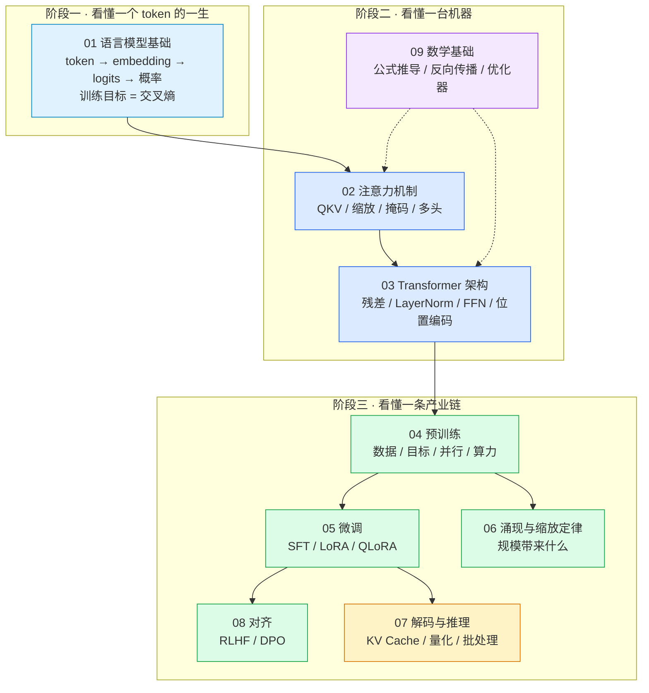

# LLM Fundamentals — 大语言模型基础理论笔记

> 从「模型在算什么」到「为什么要这么算」，把大语言模型的基础理论按一条主线串起来。
> 每个主题都配**真实运行出来的图**：要么是 demo 脚本的真实输出截图，要么是按公式算出来再画的图，没有示意图凑数。

---

## 这个目录写给谁

| 你是谁 | 从哪开始 |
|--------|----------|
| 会调 API，想知道模型内部发生了什么 | [第 01 章](01-basics-language-model.md) → [第 02 章](02-attention.md) |
| 会写 RAG / Agent，想搞懂原理补短板 | [第 02 章](02-attention.md) → [第 03 章](03-transformer.md) → [第 07 章](07-decoding-and-inference.md) |
| 打算自己微调 / 训练小模型 | [第 04 章](04-pretraining.md) → [第 05 章](05-finetuning.md) → [第 06 章](06-scaling-and-emergence.md) |
| 面试前速查、术语对不上号 | [第 10 章 术语表](10-glossary.md) |
| 想动手复现 | [第 11 章 开源项目推荐](11-open-source-projects.md) |

目录里所有脚本都可以直接跑，**不需要 GPU、不需要深度学习框架**（只依赖 numpy；生成配图额外需要 matplotlib，见 [`demos/requirements.txt`](demos/requirements.txt)）：

```bash
cd llm-fundamentals
pip install -r demos/requirements.txt
python3 demos/02_self_attention.py      # 手算注意力，看清每一步
python3 demos/make_figures.py           # 重新生成 assets/ 里的所有配图
```

---

## 学习路线：三个阶段，一条主线



一句话主线：

> **语言模型 = 用注意力机制在上下文里找相关信息，预测下一个 token。**
> 预训练让它学会语言，微调让它学会任务，对齐让它学会"好好说话"，推理优化让它跑得动。

---

## 章节地图

| 章节 | 核心问题 | 关键配图 |
|------|----------|----------|
| [01 语言模型基础](01-basics-language-model.md) | 模型到底在算什么？token / embedding / logits / loss 是什么关系 | `term-01`、`term-03`、`softmax-temperature.png` |
| [02 注意力机制](02-attention.md) | 为什么"看哪里"比"看多少"更重要？QKV 是怎么来的 | `term-02`、`attention-heatmap.png` |
| [03 Transformer 架构](03-transformer.md) | 一个 decoder block 里到底有哪些零件？为什么这么设计 | `term-04`、`positional-encoding.png` |
| [04 预训练](04-pretraining.md) | 几十 T token 是怎么喂进去的？为什么数据比参数更贵 | `term-07`、`scaling-law.png` |
| [05 微调](05-finetuning.md) | SFT 和 LoRA 到底改了什么？显存账怎么算 | `term-06`、`lora-params.png` |
| [06 涌现与缩放定律](06-scaling-and-emergence.md) | 规模到了某个点会发生什么？涌现是真相还是错觉 | `scaling-law.png` |
| [07 解码与推理](07-decoding-and-inference.md) | 为什么生成慢？KV Cache 省了什么、又贵在哪 | `term-05`、`kv-cache-memory.png` |
| [08 对齐：RLHF 与 DPO](08-alignment-rlhf.md) | 怎么把"会续写"变成"会听话" | Mermaid 三阶段流程 |
| [09 数学基础](09-math-foundations.md) | 关键公式怎么推？符号都是什么意思 | 计算图 + 公式推导 |
| [10 术语表中英对照](10-glossary.md) | 名词太多，快速对齐 | 分组大表 |
| [11 开源项目推荐](11-open-source-projects.md) | 想动手，从哪个仓库开始 | 项目表 + 路径图 |

---

## 每章的结构约定

每章都按同一套结构写，方便跳读：

```
1. 一句话结论         —— 这章解决什么问题
2. 直觉               —— 先建立"人话版"理解
3. 机制与公式         —— 公式 + 符号表
4. 配图               —— Mermaid / 表格 / 真实运行截图
5. 常被误解的点       —— 面试高频混淆
6. 动手               —— 对应 demo 脚本
7. 自查问题           —— 能答上来才算懂
```

---

## 配图从哪来（可复现）

本目录**不使用任何来源不明的图片**，图分三类，全部可复现：

| 类型 | 生成方式 | 例子 |
|------|----------|------|
| 真实运行截图 | `python3 demos/xx.py > out.txt` 后由 `scripts/render_terminal.py` 渲染 | `assets/term-02_self_attention.png` |
| 公式计算后绘图 | `demos/make_figures.py`（matplotlib，数据全部现场算） | `assets/attention-heatmap.png` |
| 结构示意图 | Markdown 内嵌 Mermaid / ASCII 图 | 各章的流程图与张量形状图 |

想重建所有图：

```bash
python3 demos/make_figures.py                                     # 6 张数据图
python3 demos/02_self_attention.py > demos/out/02.txt             # 真实输出
python3 ../scripts/render_terminal.py demos/out/02.txt \
        --out assets/term-02_self_attention.png --title "bash — python3 demos/02_self_attention.py"
```

---

## 阅读建议

- **不要一上来抠公式**。先把每章的 Mermaid 图和真实运行截图看懂，再回去看公式——公式是对图的翻译，不是前提。
- **数学部分可以第二遍再读**。[第 09 章](09-math-foundations.md) 是"加工厂"，第 02/03/07 章正文里已经把结论用掉了。
- **每章的"自查问题"必须能答**。答不上来就说明这一章只是"读过了"，不是"学会了"。

---

[返回仓库首页](../README.md) · [路线图](../ROADMAP.md) · [知识地图](../KNOWLEDGE-MAP.md)
