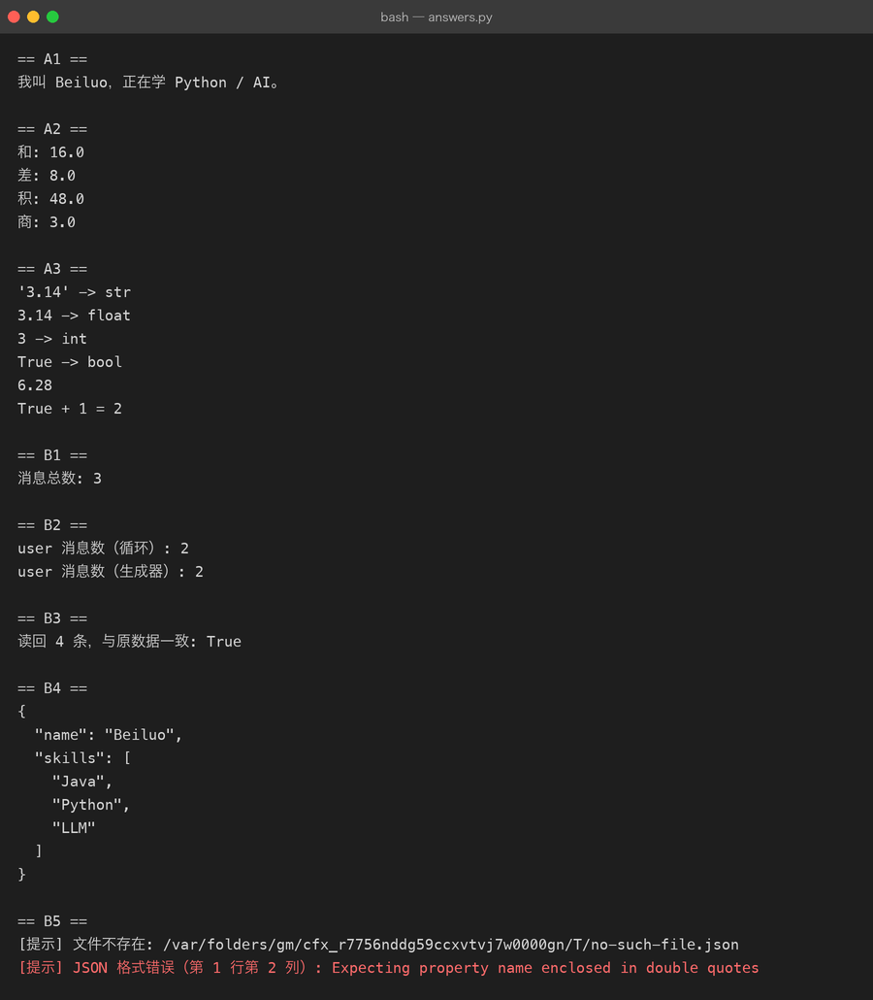

# Exercises 01-basic — Milestone 01-02 配套练习

> 对应：`milestones/01-variables.md`（🎓 已学习）+ `milestones/02-list-dict-json.md`（🔄 学习中）
> 规则：**亲手敲，不复制粘贴**。每题先自己写，跑通后再对照 milestone 里的示例。
> 完成一题就在题号前打 ✅。写完的代码放本目录（如 `01_answers.py`）。

## A. 变量与类型（Milestone 01）

- [ ] **A1** 写程序：输入你的名字和学习方向，输出一句话自我介绍（用 f-string）
- [ ] **A2** 让用户输入两个数字，打印它们的和、差、积、商（想想 `input()` 返回的是什么类型）
- [ ] **A3** 打印 `type()` 验证：`"3.14"`、`3.14`、`3`、`True` 各是什么类型？再把 `"3.14"` 转成 float 做加法

## B. List / Dict / JSON（Milestone 02）

- [ ] **B1** 建一个 `messages` 列表，装 3 条 AI 对话消息（每条是 `{"role": ..., "content": ...}` 的 dict），打印消息总数
- [ ] **B2** 在 B1 基础上追加一条 user 消息，再统计 `role == "user"` 的消息有几条（提示：循环或列表推导式）
- [ ] **B3** 把 B1 的 `messages` 用 `json.dumps` 存成文件，再用 `json.load` 读回来，验证内容一致
- [ ] **B4** 给定 `data = {"name": "Beiluo", "skills": ["Java", "Python"]}`，追加一个 skill 后打印完整 JSON（缩进 2 格）
- [ ] **B5（挑战）** 读入一个 JSON 文件，安全处理「文件不存在」和「JSON 格式错误」两种情况（打印友好提示而不是崩溃——提前偷看 Milestone 06）

## 验收标准

A1-A3 + B1-B4 全部亲手跑通 = Milestone 01 ✅ + Milestone 02 可标记 🎓。
B5 做不出来没关系，学到 Milestone 06 回来补刀。

## 参考答案

写完再看：[`answers.py`](answers.py)（带 Java 类比注释）

```bash
python3 answers.py                # 用示例数据跑一遍，看输出
python3 answers.py --interactive  # 交互模式，真的等你输入
```

参考答案的运行输出（真实跑出来的）：



规矩：**先自己敲、跑通了再对照**。只准看卡住的那一个函数，不要整份抄。
