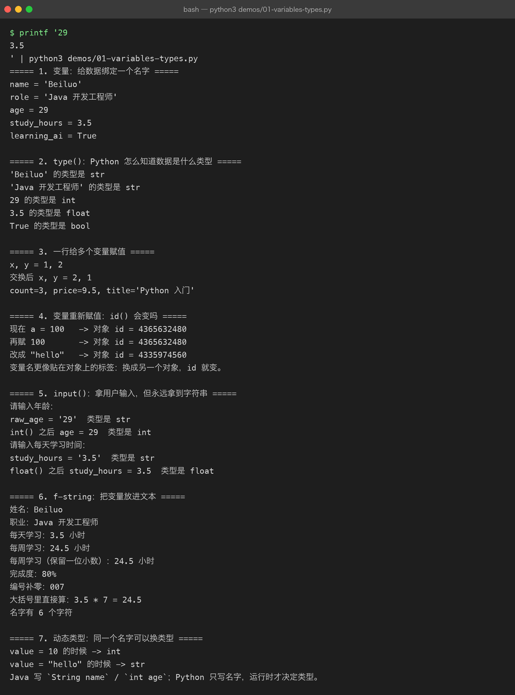

# Lesson 01 — 用 Python 做第一个小项目：AI Engineer 学习档案生成器

> AI Engineer Journey · Project 01 — Python AI CLI Assistant  
> 学习方式：Project-Based Learning【项目驱动学习】  
> 本章目标：**不单独背 Python 语法，而是在完成一个真实小项目的过程中学会 Python 基础。**

---

# 1. 这一章我们到底要做什么？

我们先不学一堆 Python 语法。

假设我们刚刚开始学习 AI，现在想做一个最简单的小工具：

> **输入自己的学习信息，程序帮我们生成一份 AI Engineer 学习档案。**

最终运行效果：

```text
$ python main.py

========== AI Engineer 学习档案 ==========

姓名：Beiluo
当前职业：Java 开发工程师
每天学习时间：3.5 小时
当前方向：Python + AI + LLM

目标：
成为 AI Engineer

===========================================
```

听起来很简单。

但为了完成这个小项目，我们自然会遇到：

```text
怎么保存姓名？
怎么保存年龄？
怎么保存学习时间？
怎么让用户输入？
怎么输出？
学习时间为什么是数字？
Python 怎么知道变量是什么类型？
怎么把变量放进一段文本？
```

于是我们开始学习：

```text
变量
数据类型
input()
print()
type()
类型转换
f-string
```

这就是这一章的学习方式：

> **先有项目问题，再学习解决问题所需要的 Python 知识。**

---

# 2. 项目地图

我们的第一个项目非常小，但会逐步升级。

```text
Project 00
AI Engineer 学习档案生成器

v0.1
写死数据
 ↓
v0.2
让用户输入
 ↓
v0.3
处理数字
 ↓
v0.4
格式化输出
 ↓
v0.5
检查数据类型
 ↓
v1.0
完成学习档案
```

这条路线很重要。

以后真正开发 AI 应用也是一样：

```text
先有需求
↓
先做最小版本
↓
遇到问题
↓
补知识
↓
继续升级
```

---

# 3. 项目 v0.1：先把结果做出来

第一版我们甚至不学习 `input()`。

先写一个最简单的程序：

```python
print("========== AI Engineer 学习档案 ==========")
print("姓名：Beiluo")
print("当前职业：Java 开发工程师")
print("每天学习时间：3.5 小时")
print("当前方向：Python + AI + LLM")
print("目标：成为 AI Engineer")
print("===========================================")
```

运行：

```text
========== AI Engineer 学习档案 ==========

姓名：Beiluo
当前职业：Java 开发工程师
每天学习时间：3.5 小时
当前方向：Python + AI + LLM
目标：成为 AI Engineer

===========================================
```

很好。

我们的第一个版本已经能运行了。

但是马上出现一个问题：

> 如果换一个人使用怎么办？

现在所有内容都是写死的。

---

# 4. 第一个问题：程序怎么保存数据？

例如我们希望：

```text
姓名 → Beiluo
职业 → Java 开发工程师
学习时间 → 3.5
方向 → Python + AI + LLM
```

我们需要给这些数据起名字。

于是出现 Python 最基础的概念：

# 变量 Variable【变量】

把代码改成：

```python
name = "Beiluo"
role = "Java 开发工程师"
study_hours = 3.5
direction = "Python + AI + LLM"

print(name)
print(role)
print(study_hours)
print(direction)
```

这里真正发生的事情是：

```text
name
 ↓
"Beiluo"

role
 ↓
"Java 开发工程师"

study_hours
 ↓
3.5

direction
 ↓
"Python + AI + LLM"
```

变量的作用可以先简单理解为：

> **给数据绑定一个名字，后面可以通过这个名字使用数据。**

---

# 5. Java 开发者怎么理解变量？

Java：

```java
String name = "Beiluo";
double studyHours = 3.5;
```

Python：

```python
name = "Beiluo"
study_hours = 3.5
```

这里最大的区别之一：

Java 通常显式写类型：

```java
String name
double studyHours
```

Python 通常直接：

```python
name
study_hours
```

Python 会根据右侧对象判断类型。

所以：

```python
name = "Beiluo"
```

Python 知道这是字符串。

```python
study_hours = 3.5
```

Python 知道这是浮点数。

---

# 6. 第二个问题：Python 怎么知道数据是什么？

现在项目有：

```python
name = "Beiluo"
age = 29
study_hours = 3.5
learning_ai = True
```

它们的数据明显不一样。

所以我们需要知道：

> **这些数据到底是什么类型？**

使用：

```python
type()
```

例如：

```python
print(type(name))
print(type(age))
print(type(study_hours))
print(type(learning_ai))
```

输出类似：

```text
<class 'str'>
<class 'int'>
<class 'float'>
<class 'bool'>
```

于是我们第一次遇到了 Python 的基本类型。

---

# 7. 项目中最常见的几种类型

我们只学项目当前需要的。

## `str` —— String【字符串】

文本：

```python
name = "Beiluo"
role = "Java 开发工程师"
```

---

## `int` —— Integer【整数】

整数：

```python
age = 29
```

---

## `float` —— Floating Point【浮点数】

带小数：

```python
study_hours = 3.5
```

---

## `bool` —— Boolean【布尔值】

只有两个值：

```python
True
False
```

例如：

```python
learning_ai = True
has_finished_python = False
```

---

# 8. 第三个问题：让程序真的能给别人用

当前代码：

```python
name = "Beiluo"
role = "Java 开发工程师"
study_hours = 3.5
```

还是写死。

我们希望：

```text
请输入姓名：
请输入职业：
请输入每天学习时间：
请输入学习方向：
```

这时候就需要：

# `input()`

例如：

```python
name = input("请输入你的姓名：")
```

运行：

```text
请输入你的姓名：Beiluo
```

用户输入：

```text
Beiluo
```

那么：

```python
name
```

就保存了：

```text
Beiluo
```

---

# 9. 第一个真正能交互的版本

把项目升级：

```python
name = input("请输入你的姓名：")
role = input("请输入你的职业：")
study_hours = input("请输入每天学习时间：")
direction = input("请输入当前学习方向：")

print(name)
print(role)
print(study_hours)
print(direction)
```

现在它已经不是一个静态脚本了。

它变成：

```text
程序
 ↓
等待用户输入
 ↓
得到数据
 ↓
保存数据
 ↓
继续执行
```

这就是最基本的程序交互。

---

# 10. `input()` 的第一个坑

现在做个实验：

```python
study_hours = input("每天学习几小时：")

print(study_hours)
print(type(study_hours))
```

输入：

```text
3.5
```

你可能会以为：

```text
study_hours = 3.5
```

但实际上：

```text
<class 'str'>
```

为什么？

因为：

> **`input()` 默认返回字符串。**

即使用户输入：

```text
29
```

程序默认得到的是：

```text
"29"
```

而不是：

```text
29
```

这两个东西不一样。

---

# 11. 项目开始真正遇到类型转换问题

现在我们的需求是：

> 每天学习时间以后可能需要做数学计算。

比如：

```text
每天 3.5 小时
一个星期大约学习多少小时？
```

如果：

```python
study_hours = "3.5"
```

它只是字符串。

我们需要把它变成数字。

使用：

```python
float()
```

于是：

```python
study_hours = float(
    input("请输入每天学习时间：")
)
```

现在：

```python
print(type(study_hours))
```

会得到：

```text
<class 'float'>
```

于是：

```text
用户输入
 ↓
"3.5"
 ↓
float()
 ↓
3.5
```

---

# 12. 如果是年龄呢？

年龄是整数：

```python
age = int(input("请输入年龄："))
```

于是：

```text
用户输入：
29

得到：

29
```

类型：

```text
int
```

---

# 13. 类型转换

项目里现在出现了几个常见函数：

```python
int()
float()
str()
bool()
```

例如：

```python
age = int("29")
study_hours = float("3.5")
```

你可以暂时记成：

```text
字符串
 ↓
int()
 ↓
整数
```

或者：

```text
字符串
 ↓
float()
 ↓
浮点数
```

---

# 14. 第四个问题：输出太难看了

现在我们的程序可能写成：

```python
print(name)
print(role)
print(study_hours)
print(direction)
```

运行：

```text
Beiluo
Java 开发工程师
3.5
Python + AI + LLM
```

虽然有内容，但用户体验很差。

我们需要把变量和文字组合起来。

于是学习：

# f-string【格式化字符串】

写：

```python
print(f"姓名：{name}")
print(f"职业：{role}")
print(f"每天学习时间：{study_hours} 小时")
print(f"当前方向：{direction}")
```

这里：

```python
f"姓名：{name}"
```

意思就是：

> 在字符串中把 `name` 当前保存的值插入进去。



---

# 15. 最终项目 v1.0

现在，我们把刚刚遇到的所有问题组合起来：

```python
name = input("请输入你的姓名：")
age = int(input("请输入你的年龄："))
role = input("请输入你的职业：")
study_hours = float(input("请输入每天学习时间："))
direction = input("请输入当前学习方向：")

print("\n========== AI Engineer 学习档案 ==========")

print(f"姓名：{name}")
print(f"年龄：{age}")
print(f"职业：{role}")
print(f"每天学习时间：{study_hours} 小时")
print(f"当前学习方向：{direction}")

print("\n目标：成为 AI Engineer")

print("===========================================")
```

例如：

```text
请输入你的姓名：Beiluo
请输入你的年龄：29
请输入你的职业：Java 开发工程师
请输入每天学习时间：3.5
请输入当前学习方向：Python + AI + LLM

========== AI Engineer 学习档案 ==========

姓名：Beiluo
年龄：29
职业：Java 开发工程师
每天学习时间：3.5 小时
当前学习方向：Python + AI + LLM

目标：成为 AI Engineer

===========================================
```

现在我们已经完成第一个真正的 Python 小项目。

---

# 16. 回头看：我们到底学了什么？

注意：

我们不是先学：

```text
变量
类型
input
print
f-string
```

然后再做项目。

而是：

```text
项目需求
 ↓
我要保存数据
 ↓
学习变量
 ↓
我要知道数据是什么
 ↓
学习类型
 ↓
我要接收用户输入
 ↓
学习 input()
 ↓
我要进行数学计算
 ↓
发现 input() 是字符串
 ↓
学习 int() / float()
 ↓
我要漂亮地输出
 ↓
学习 f-string
```

这就是：

# Project-Based Learning

真正的项目驱动。

---

# 17. 本章知识地图

现在把这几个知识点串起来：

```text
                   AI Engineer 学习档案
                            │
                            ↓
                     用户输入数据
                            │
                            ↓
                         input()
                            │
                            ↓
                         变量
                            │
                            ↓
                     数据类型判断
                            │
                  ┌─────────┼─────────┐
                  ↓         ↓         ↓
                 str       int      float
                  │         │         │
                  └─────────┼─────────┘
                            ↓
                       类型转换
                            │
                            ↓
                        f-string
                            │
                            ↓
                         print()
                            │
                            ↓
                         最终输出
```

### 联系描述

用户首先通过 `input()` 向程序提供数据，Python 把这些数据保存到变量中。由于不同输入具有不同的数据类型，我们需要理解 `str`、`int`、`float` 和 `bool`，并在需要进行数学运算时使用 `int()` 或 `float()` 完成类型转换。最后通过 f-string 把变量组合成用户能够理解的文本，并使用 `print()` 输出。整个过程形成了一个最基本的“输入 → 处理 → 输出”程序闭环。

这也是后续 AI 应用的基本结构：

```text
用户
 ↓
输入
 ↓
程序处理
 ↓
AI / API
 ↓
输出
```

---

# 18. Java → Python 的迁移

现在不需要死记完整 Python 语法，只先建立这个映射。

|项目需求|Java|Python|
|---|---|---|
|文本|`String`|`str`|
|整数|`int`|`int`|
|小数|`double`|`float`|
|布尔值|`boolean`|`bool`|
|获取输入|`Scanner`|`input()`|
|输出|`System.out.println()`|`print()`|
|字符串格式化|拼接 / Formatter|f-string|
|字符串转整数|`Integer.parseInt()`|`int()`|
|字符串转小数|`Double.parseDouble()`|`float()`|

注意：

> 这些只是帮助你迁移编程思维，不意味着 Java 和 Python 的底层机制完全一样。

---

# 19. 一个重要认识：动态类型

看看：

```python
x = 10
print(type(x))

x = "hello"
print(type(x))
```

第一次：

```text
int
```

第二次：

```text
str
```

所以 Python 属于：

> **动态类型语言（Dynamically Typed Language）**

简单理解：

> 变量在写代码的时候通常不用声明固定类型，运行时根据绑定的对象决定类型。

但是：

> **动态类型 ≠ 没有类型。**

`10` 还是 `int`。

`"hello"` 还是 `str`。

---

# 20. 本章第一个工程习惯

以后不要一看到代码就背。

先问：

```text
这个项目要解决什么问题？
 ↓
需要保存什么数据？
 ↓
这些数据是什么类型？
 ↓
用户数据从哪里来？
 ↓
数据需要怎么处理？
 ↓
最后输出什么？
```

这就是工程思维的开始。

---

# 21. 小实验：自己修改需求

现在项目已经可以用了。

我们增加一个需求：

> 根据每天学习时间，计算一周总学习时间。

新增：

```python
weekly_hours = study_hours * 7
```

然后：

```python
print(f"预计每周学习时间：{weekly_hours} 小时")
```

整个代码变成：

```python
name = input("请输入你的姓名：")
age = int(input("请输入你的年龄："))
role = input("请输入你的职业：")
study_hours = float(input("请输入每天学习时间："))
direction = input("请输入当前学习方向：")

weekly_hours = study_hours * 7

print("\n========== AI Engineer 学习档案 ==========")

print(f"姓名：{name}")
print(f"年龄：{age}")
print(f"职业：{role}")
print(f"每天学习时间：{study_hours} 小时")
print(f"预计每周学习时间：{weekly_hours} 小时")
print(f"当前学习方向：{direction}")

print("\n目标：成为 AI Engineer")

print("===========================================")
```

注意：

我们没有专门开一节讲“算术运算”。

因为项目需求自然让你遇到了：

```python
study_hours * 7
```

后面真正需要更多运算的时候，再继续学。

---

# 22. 小挑战

现在不要看上面的最终代码。

自己重新写一个：

# AI Engineer Profile v2

要求用户输入：

```text
姓名
当前职业
Java 工作年限
每天学习小时数
当前学习方向
```

输出：

```text
========== AI Engineer Profile ==========

姓名：
职业：
Java 工作年限：
每天学习：
每周预计学习：
学习方向：

最终目标：
AI Engineer

==========================================
```

要求：

```text
Java 工作年限 → int
每天学习小时数 → float
每周学习时间 = 每天学习时间 × 7
使用 f-string
不能把用户信息写死
```

---

# 23. 主动回忆

完成代码以后，不要马上看答案。

回答：

### Q1

为什么：

```python
age = input("年龄：")
```

得到的是 `str`？

---

### Q2

为什么：

```python
age = int(input("年龄："))
```

就可以得到整数？

---

### Q3

下面：

```python
study_hours = 3.5
```

为什么是 `float`？

---

### Q4

为什么 Python 可以：

```python
x = 10
x = "hello"
```

而 Java 的变量声明方式通常不同？

---

### Q5

下面：

```python
print(f"姓名：{name}")
```

为什么需要 `f`？

---

### Q6

从项目角度解释：

> **变量、类型、input、类型转换、f-string、print 之间是什么关系？**

不要背定义，用“我们的学习档案项目”来解释。

---

# 24. 本章练习分级

## Level 1：跟做

把本章项目完整运行一次。

---

## Level 2：修改

增加：

```text
当前年龄
预计每周学习时间
```

---

## Level 3：独立实现

关闭课程代码后，自己重新实现：

```text
AI Engineer Profile
```

---

## Level 4：需求变化

新增：

```text
目标职位
最想学习的技术
```

不用修改整体程序结构也能完成需求。

---

## Level 5：解释

能够向一个完全不会 Python 的人解释：

> 为什么 `input()` 得到的是字符串，而我们又要使用 `int()` 或 `float()`？

如果能够用自己的语言解释清楚，这一章才算真正掌握。

---

# 25. 本章在 AI Engineer Journey 中的位置

```text
Project 01 — Python AI CLI Assistant

Lesson 01
变量 / 类型 / 输入输出
        ↓
Lesson 02
List / Dict / JSON / AI Messages
        ↓
Lesson 03
Condition / Loop
        ↓
Lesson 04
Function
        ↓
...
        ↓
Python AI CLI Assistant
```

当前：

```text
Lesson 01
✅ 完成

Lesson 02
⬜ 下一章
```

---

# 26. 与最终 AI 项目的连接

现在的项目：

```text
用户
 ↓
input()
 ↓
Python
 ↓
print()
```

很快会升级成：

```text
用户
 ↓
Python
 ↓
messages
 ↓
LLM API
 ↓
大模型
 ↓
Response
 ↓
Python
 ↓
用户
```

再往后：

```text
用户
 ↓
Vue
 ↓
FastAPI
 ↓
LLM
 ↓
RAG
 ↓
Agent
 ↓
Tool
 ↓
Model
```

所以这不是“学完以后没用的 Python 基础”。

它是后面整个 AI 工程链的第一层。

---

# 27. 本章文件建议

本章最终在 GitHub 中：

```text
projects/
└── 01-python-ai-cli/
    └── 01-variables/
        ├── README.md
        ├── lesson.md
        ├── demo/
        │   ├── 01-basic-profile.py
        │   ├── 02-input-profile.py
        │   └── 03-learning-profile.py
        └── exercises/
            └── README.md
```

其中：

### `lesson.md`

就是本章正式课程。

### `demo/`

保存随着课程逐步演进的代码：

```text
01-basic-profile.py
→ 写死版本

02-input-profile.py
→ 加入 input

03-learning-profile.py
→ 完整版本
```

这个设计非常重要。

不要只保存最后答案。

> **把项目从 v0.1 → v1.0 的演进过程保留下来。**

这以后会成为你 GitHub 项目和自媒体内容非常有价值的一部分。

---

# 28. 本章总结

这一章我们不是为了记住：

```text
str
int
float
bool
input
print
```

而是通过：

> **AI Engineer 学习档案生成器**

亲手经历了：

```text
项目需求
 ↓
发现需要保存数据
 ↓
变量
 ↓
发现数据类型不同
 ↓
类型
 ↓
发现需要用户输入
 ↓
input()
 ↓
发现输入默认是字符串
 ↓
int() / float()
 ↓
发现输出需要组合变量
 ↓
f-string
 ↓
print()
 ↓
完成项目
```

这就是我们整个 **AI Engineer Journey** 后续都要遵循的学习方式：

> **不要为了学知识而学知识，而是先做项目；项目遇到问题，再学习解决问题所需要的知识。**

下一章自然进入：

# Lesson 02 — List / Dict → JSON → AI Messages

我们会继续升级这个思路：

> “学习档案里只有一个人的数据不够了，我需要保存很多数据、保存多条消息。”

于是我们自然会遇到：

```text
List
 ↓
Dict
 ↓
List + Dict
 ↓
JSON
 ↓
messages
 ↓
system / user / assistant
 ↓
第一次真正接触 LLM API 数据结构
```

这才是 Python 正式迈向 AI 开发的第一座桥。