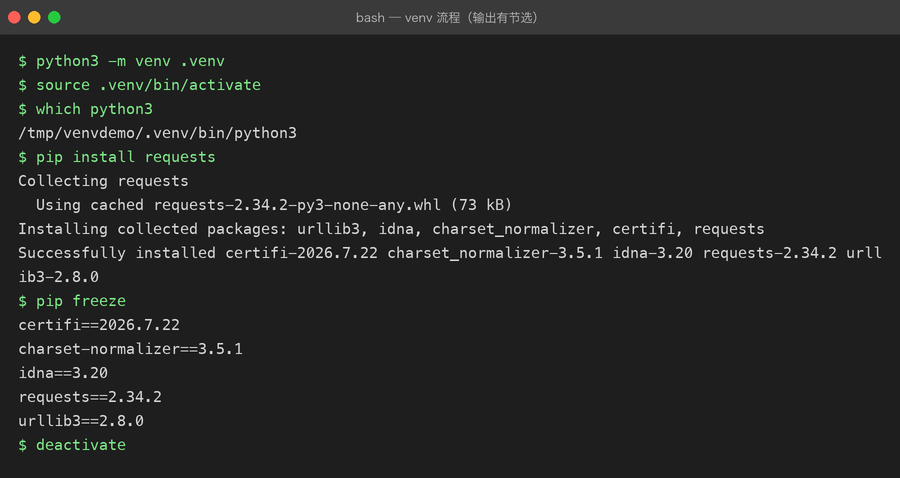

# Lesson 08 — venv / pip / Environment：给 AI CLI Assistant 建立真正的 Python 开发环境

> 项目：Python AI CLI Assistant  
> 版本：v0.8  
> 核心主题：Virtual Environment【虚拟环境】、pip【Python 包管理工具】、Dependency【依赖】、Environment Variable【环境变量】、`.env` 配置、`.gitignore`

---

# 一、这一章，我们到底要解决什么问题？

现在我们的 AI CLI Assistant 已经可以：

- 接收用户输入
    
- 保存多轮消息
    
- 使用函数拆分逻辑
    
- 使用模块组织代码
    
- 捕获异常
    
- 把聊天记录持久化到 JSON 文件
    

但是它还存在一个非常明显的工程问题：

> **这个项目虽然能运行，但它还没有真正的“项目运行环境”。**

例如：

你在自己的 Mac 上开发。

你的电脑刚好有：

```text
Python
某些第三方库
某些环境变量
某些配置
```

于是：

```bash
python main.py
```

可以运行。

但是以后把项目放到另一台电脑：

```text
Python 版本不同
第三方库没有安装
pip 安装到了另外一个 Python
环境变量不存在
```

项目就可能直接报错。

甚至更危险的是：

你以后可能同时开发：

```text
项目 A → 需要某个版本的库

项目 B → 需要另外一个版本的库
```

如果所有项目共用一个 Python 环境，就容易出现：

```text
项目 A 安装了依赖
        ↓
影响项目 B
        ↓
版本冲突
        ↓
程序突然无法运行
```

所以这一章的真正任务不是“记住几个命令”。

而是：

> **让 AI CLI Assistant 拥有自己的独立运行环境、依赖声明和配置管理方式。**

---

# 二、先看项目从 v0.7 到 v0.8 发生了什么

上一章：

```text
v0.7
AI CLI Assistant
        │
        ├── Python 代码
        ├── 聊天记录
        └── messages.json
```

现在升级：

```text
v0.8
AI CLI Assistant
        │
        ├── Python 代码
        ├── 聊天记录
        ├── Virtual Environment【虚拟环境】
        ├── Dependency【依赖】
        ├── requirements.txt【依赖清单】
        ├── Environment Variable【环境变量】
        ├── .env【本地配置】
        └── .gitignore【Git 忽略规则】
```

这一次，我们开始真正接触 Python 项目的“工程基础设施”。

---

# 三、第一个真实问题：Python 到底是谁？

先不要急着创建虚拟环境。

先执行：

```bash
python3 --version
```

例如：

```text
Python 3.12.6
```

然后：

```bash
which python3
```

可能得到：

```text
/opt/homebrew/bin/python3
```

这里实际上存在两个概念。

## 1. Python Interpreter【Python 解释器】

Interpreter【解释器】就是：

> 真正负责执行 Python 代码的程序。

当你执行：

```bash
python3 main.py
```

本质上是：

```text
main.py
   ↓
Python Interpreter
   ↓
执行 Python 代码
```

可以把它简单理解成：

```text
Java：

.java
 ↓
JDK / JVM
 ↓
执行

Python：

.py
 ↓
Python Interpreter
 ↓
执行
```

---

# 四、第二个问题：为什么需要 Virtual Environment？

假设我们有两个项目。

```text
项目 A
需要 package-X 1.x

项目 B
需要 package-X 2.x
```

如果两个项目共用一个 Python 环境：

```text
全局 Python
   │
   ├── package-X 1.x
   └── package-X 2.x
```

很容易出现冲突。

所以 Python 提供：

# Virtual Environment【虚拟环境】

它的核心思想非常简单：

> **每个项目拥有自己的 Python 包环境。**

于是：

```text
全局 Python
   │
   ├── 项目 A
   │    └── .venv
   │         └── 自己的依赖
   │
   └── 项目 B
        └── .venv
             └── 自己的依赖
```

项目之间彼此隔离。

---

# 五、创建 AI CLI Assistant 的虚拟环境

先进入项目：

```bash
cd projects/01-python-ai-cli
```

创建：

```bash
python3 -m venv .venv
```

这里非常值得理解。

不是简单记：

```bash
venv
```

而是：

```bash
python3 -m venv .venv
```

拆开来看：

```text
python3
   ↓
使用当前 Python 解释器

-m
   ↓
运行一个 Python 模块

venv
   ↓
Python 官方提供的虚拟环境模块

.venv
   ↓
创建出来的虚拟环境目录
```

最终：

```text
projects/01-python-ai-cli/
├── .venv/
├── src/
├── messages.json
└── ...
```

下面是完整的创建 → 激活 → 装依赖 → 导出 → 退出流程实测（输出有节选）：



---

# 六、为什么目录叫 `.venv`？

`.venv` 中的：

```text
.
```

表示它通常被当作隐藏目录。

`venv` 表示：

```text
Virtual Environment【虚拟环境】
```

所以：

```text
.venv
```

只是一个非常常见的命名习惯。

也可以叫：

```text
venv
python-env
myenv
```

但实际项目里：

```text
.venv
```

非常常见，也容易让开发工具识别。

---

# 七、激活虚拟环境

Mac / Linux：

```bash
source .venv/bin/activate
```

成功后终端前面可能出现：

```text
(.venv) beiluo@MacBook ...
```

这说明：

> 当前终端已经进入项目自己的虚拟环境。

现在再执行：

```bash
python --version
```

以及：

```bash
which python
```

你会发现 Python 路径发生变化。

例如：

```text
.../projects/01-python-ai-cli/.venv/bin/python
```

这就是非常关键的变化。

---

# 八、这里发生了什么？

原来：

```text
终端
 ↓
系统 Python
 ↓
执行项目
```

现在：

```text
终端
 ↓
激活 .venv
 ↓
项目自己的 Python 环境
 ↓
执行项目
```

所以以后在这个项目里：

```bash
python
```

指向的是当前项目的虚拟环境。

---

# 九、退出虚拟环境

执行：

```bash
deactivate
```

然后：

```bash
which python3
```

就会回到系统 Python。

所以可以把：

```bash
source .venv/bin/activate
```

理解成：

> 进入项目的 Python 开发环境。

把：

```bash
deactivate
```

理解成：

> 离开项目的 Python 开发环境。

---

# 十、Virtual Environment 到底隔离了什么？

一个非常重要的理解：

> `.venv` 主要解决的是 Python 解释器和 Python 包依赖的隔离问题。

它并不是：

```text
Docker
```

也不是：

```text
虚拟机
```

更不是：

它主要解决：

```text
Python 项目
   ↓
独立 Python 包环境
```

例如：

```text
项目 A
.venv
 ├── requests
 ├── python-dotenv
 └── ...

项目 B
.venv
 ├── fastapi
 ├── torch
 └── ...
```

---

# 十一、第二个核心问题：什么是 Dependency？

现在我们的项目准备开始使用第三方库。

例如下一步我们会让 AI CLI Assistant 读取：

```text
.env
```

而 `.env` 的读取，我们可以使用：

```text
python-dotenv
```

这个库。

这时候出现一个新的概念：

# Dependency【依赖】

Dependency 的意思是：

> **项目运行所依赖的外部软件包或组件。**

比如：

```text
AI CLI Assistant
        │
        ├── Python
        ├── python-dotenv
        └── 未来的 HTTP Client【HTTP 客户端】
```

这些都是项目运行时可能需要的东西。

---

# 十二、第三个核心问题：什么是 pip？

# pip【Python 包安装工具】

它主要负责：

```text
安装
升级
卸载
查看
管理
```

Python 第三方包。

例如：

```bash
python -m pip install python-dotenv
```

这里我特别推荐你先形成这个习惯：

```bash
python -m pip
```

而不是到处使用：

```bash
pip
```

为什么？

因为：

```bash
python -m pip
```

明确表示：

> **使用当前这个 Python 解释器对应的 pip。**

这样更容易避免：

```text
python 是 A
pip 却来自 B
```

这种非常常见的环境问题。

---

# 十三、安装第一个第三方依赖

进入虚拟环境：

```bash
source .venv/bin/activate
```

执行：

```bash
python -m pip install python-dotenv
```

安装完成后：

```bash
python -m pip show python-dotenv
```

可以查看安装信息。

也可以：

```bash
python -m pip list
```

查看当前环境里的包。

---

# 十四、项目现在有什么变化？

之前：

```text
Python 自带功能
```

现在：

```text
Python
   ↓
虚拟环境
   ↓
第三方依赖
   ↓
python-dotenv
```

所以项目第一次真正具备了：

```text
环境
+
依赖
```

---

# 十五、为什么不能直接把整个 `.venv` 提交到 Git？

假设：

```text
git add .
```

如果没有配置忽略规则，Git 可能把：

```text
.venv/
```

也纳入版本控制。

这是不合理的。

原因很简单：

`.venv` 是：

> **本地环境产物**

而不是：

> **项目源码本身。**

你真正应该提交的是：

```text
项目源码
+
依赖声明
+
配置模板
```

而不是：

```text
整个本机 Python 环境
```

---

# 十六、加入 `.gitignore`

项目根目录创建：

```text
.gitignore
```

内容：

```gitignore
.venv/
.env
__pycache__/
*.pyc
```

---

# 十七、每一行是什么意思？

## `.venv/`

表示：

> 不提交 Python 虚拟环境。

---

## `.env`

表示：

> 不提交本地敏感配置。

这个尤其重要。

因为以后我们很可能会出现：

```text
OPENAI_API_KEY=xxxx
```

或者：

```text
DASHSCOPE_API_KEY=xxxx
```

API Key【应用程序编程接口密钥】属于敏感凭证。

不能直接提交到 GitHub。

---

## `__pycache__/`

Python 运行过程中可能产生：

```text
__pycache__
```

里面主要是缓存相关文件。

通常也不需要提交。

---

## `*.pyc`

Python 字节码缓存文件。

同样属于运行产物。

---

# 十八、但是别人怎么知道需要安装什么？

这就引出了新的问题。

我们不提交：

```text
.venv
```

那么别人拿到项目之后：

```bash
git clone
```

怎么知道需要：

```text
python-dotenv
```

？

答案：

# requirements.txt

---

# 十九、requirements.txt 是什么？

它本质上就是：

> **项目依赖清单。**

可以理解为：

```text
这个项目需要哪些 Python 包？
```

例如：

```text
python-dotenv
```

于是其他人拿到代码之后：

```bash
python -m pip install -r requirements.txt
```

Python 就可以根据这个文件安装依赖。

---

# 二十、让 pip 自动生成 requirements.txt

不要手工猜版本。

在当前虚拟环境中执行：

```bash
python -m pip freeze > requirements.txt
```

于是得到：

```text
requirements.txt
```

文件内容会根据你当前环境中的真实安装结果生成。

可能类似：

```text
python-dotenv==某个版本
```

注意：

> 不要在教程里手写一个你没有验证过的版本号。

最可靠的方法是：

```bash
python -m pip freeze > requirements.txt
```

让当前环境产生真实结果。

---

# 二十一、别人拿到项目后怎么恢复环境？

整个流程：

```text
Git 仓库
   │
   ├── source code
   ├── requirements.txt
   └── .gitignore
```

别人 clone 后：

```bash
git clone ...
cd projects/01-python-ai-cli
```

创建环境：

```bash
python3 -m venv .venv
```

激活：

```bash
source .venv/bin/activate
```

安装依赖：

```bash
python -m pip install -r requirements.txt
```

于是：

```text
代码
+
虚拟环境
+
依赖安装
```

基本就恢复起来了。

---

# 二十二、这就是“可复现环境”

# Reproducibility【可复现性】

所谓可复现，简单理解就是：

> **别人可以根据项目中的代码和依赖声明，重新建立一个足够接近的运行环境。**

这会成为 AI 工程中非常重要的概念。

尤其以后你会遇到：

```text
PyTorch
Transformers
CUDA
vLLM
LangChain
Embedding
RAG
```

这些项目的依赖越来越复杂。

所以：

> Python 环境管理不是“小知识”，而是 AI 工程的地基。

---

# 二十三、现在开始第二个工程问题：配置放在哪里？

我们的 AI CLI Assistant 以后肯定会需要：

```text
模型名称
API 地址
API Key
超时时间
```

例如：

```text
MODEL_NAME
BASE_URL
API_KEY
```

但是这些信息有不同性质。

比如：

```text
模型名称
```

通常可以公开。

而：

```text
API Key
```

属于敏感信息。

所以：

> **代码和配置需要分离。**

---

# 二十四、什么是 Environment Variable？

# Environment Variable【环境变量】

简单理解：

> **由运行环境提供给程序读取的配置值。**

例如：

```bash
export MODEL_NAME="demo-model"
```

Python：

```python
import os

model_name = os.getenv("MODEL_NAME")
print(model_name)
```

程序就可以读取：

```text
MODEL_NAME
```

---

# 二十五、为什么 AI 项目特别需要环境变量？

因为 AI 项目经常存在：

```text
API Key
API URL
Model Name
Database URL
Vector DB 配置
```

这些配置在不同环境下可能不同。

例如：

```text
本地开发
↓
开发环境
↓
测试环境
↓
生产环境
```

代码不应该因为：

```text
API Key
```

不同而不断修改。

所以更合理的是：

```text
代码
+
环境变量
```

---

# 二十六、先用 Python 原生方式读取环境变量

代码：

```python
import os

api_key = os.getenv("API_KEY")

print(api_key)
```

但这里存在一个问题：

如果你直接：

```bash
export API_KEY="xxxx"
```

终端里的配置虽然有效，但不方便管理。

于是我们引入：

# `.env`

---

# 二十七、什么是 `.env`？

`.env` 是一个非常常见的：

> **本地环境配置文件**

例如：

```env
API_KEY=your-local-key
MODEL_NAME=demo-model
BASE_URL=https://example.com
```

然后 Python 程序读取它。

注意：

> `.env` 只是配置文件格式和使用习惯，不是 Python 官方特殊语言。

---

# 二十八、为什么需要 python-dotenv？

Python 标准库中的：

```python
os.getenv()
```

可以读取真正的环境变量。

而：

```text
python-dotenv
```

可以帮助你把：

```text
.env
```

里的配置加载进环境变量。

于是：

```text
.env
 ↓
python-dotenv
 ↓
Environment Variables
 ↓
os.getenv()
 ↓
Python 程序
```

---

# 二十九、创建 `.env`

项目根目录：

```text
projects/01-python-ai-cli/
├── .env
├── .gitignore
├── requirements.txt
└── src/
```

`.env`：

```env
APP_NAME=Python AI CLI Assistant
MODEL_NAME=demo-model
```

这里没有放真实密钥。

---

# 三十、在代码中读取 `.env`

例如修改：

```text
src/ai_cli/config.py
```

代码：

```python
import os

from dotenv import load_dotenv

load_dotenv()

APP_NAME = os.getenv("APP_NAME", "Python AI CLI Assistant")
MODEL_NAME = os.getenv("MODEL_NAME", "demo-model")
```

这里出现一个新的写法：

```python
os.getenv("MODEL_NAME", "demo-model")
```

意思是：

```text
读取 MODEL_NAME
        │
        ├── 有值
        │    ↓
        │   使用它
        │
        └── 没有值
             ↓
          使用默认值
          demo-model
```

---

# 三十一、为什么要提供默认值？

因为程序不能总是假设：

```text
配置一定存在
```

例如：

```python
MODEL_NAME = os.getenv("MODEL_NAME", "demo-model")
```

相当于：

> 如果环境变量没有配置，就先使用一个默认模型名称。

这叫：

# Default Value【默认值】

它可以提升程序的容错性。

---

# 三十二、创建 `.env.example`

这里有一个非常重要的工程实践。

我们不能提交：

```text
.env
```

但是别人需要知道：

> 项目需要哪些配置？

所以创建：

```text
.env.example
```

内容：

```env
APP_NAME=Python AI CLI Assistant
MODEL_NAME=demo-model
API_KEY=
BASE_URL=
```

---

# 三十三、`.env.example` 和 `.env` 的关系

它们的关系可以理解为：

```text
.env.example
   ↓
配置模板
   ↓
开发者复制
   ↓
.env
   ↓
填入自己的真实配置
```

所以：

```text
.env.example
```

可以提交。

而：

```text
.env
```

不要提交。

---

# 三十四、为什么这套方式特别适合 AI 项目？

以后你真的接入大模型时：

```text
.env.example

API_KEY=
MODEL_NAME=
BASE_URL=
```

每个开发者：

```text
复制 .env.example
       ↓
生成 .env
       ↓
填写自己的 Key
       ↓
程序读取
```

于是：

```text
源码
≠
秘密
```

这是一条非常重要的工程原则。

---

# 三十五、安全原则：千万不要这样做

不要：

```python
API_KEY = "sk-xxxxxxxxxx"
```

更不要：

```python
print(API_KEY)
```

然后把日志提交进 Git。

更不要：

```text
README.md
```

里面直接写真实 Key。

也不要：

```text
git add .
git commit
git push
```

之前忘记检查：

```text
.env
```

---

# 三十六、现在重构 config.py

可以调整成：

```python
import os

from dotenv import load_dotenv

load_dotenv()

APP_NAME = os.getenv(
    "APP_NAME",
    "Python AI CLI Assistant",
)

MODEL_NAME = os.getenv(
    "MODEL_NAME",
    "demo-model",
)

API_KEY = os.getenv("API_KEY")

BASE_URL = os.getenv("BASE_URL")
```

这一阶段：

> `API_KEY` 可以为空。

因为我们还没有真正调用远程 AI API。

我们这里只是提前把：

```text
配置管理能力
```

建立起来。

真正的 HTTP / API 调用会放到下一阶段。

---

# 三十七、为什么现在不急着接真实大模型？

因为如果现在直接：

```text
Python
↓
HTTP
↓
API
↓
LLM
```

你会同时遇到：

```text
环境
依赖
网络请求
认证
JSON
HTTP 状态码
超时
异常
API 响应
消息格式
```

这样会把太多知识一次堆起来。

现在我们先完成：

```text
Python 项目基础设施
```

下一章再解决：

```text
Python
 ↓
HTTP
 ↓
API
```

再之后：

```text
HTTP API
 ↓
真实 LLM
```

学习链路会更加稳定。

---

# 三十八、项目结构升级到 v0.8

现在项目可以整理成：

```text
projects/01-python-ai-cli/
│
├── .venv/
│
├── .env
├── .env.example
├── .gitignore
├── requirements.txt
├── messages.json
│
└── src/
    └── ai_cli/
        ├── __init__.py
        ├── main.py
        ├── config.py
        ├── conversation.py
        ├── assistant.py
        ├── formatter.py
        └── storage.py
```

其中：

```text
.venv/
```

本地环境。

```text
.env
```

本地配置。

```text
.env.example
```

配置模板。

```text
requirements.txt
```

依赖声明。

```text
src/
```

源代码。

---

# 三十九、把整个项目的职责重新梳理一遍

## main.py

负责：

```text
程序入口
程序主流程
```

---

## config.py

负责：

```text
项目配置
环境变量
.env
```

---

## conversation.py

负责：

```text
聊天记录
消息添加
历史查询
清空
```

---

## assistant.py

负责：

```text
Assistant 行为
```

目前还是：

```text
Mock Response【模拟响应】
```

---

## formatter.py

负责：

```text
输出格式
```

---

## storage.py

负责：

```text
JSON 持久化
```

---

# 四十、现在形成了一个非常重要的工程分层

```text
main.py
   │
   ├── config.py
   │      └── 环境 / 配置
   │
   ├── conversation.py
   │      └── 消息管理
   │
   ├── assistant.py
   │      └── AI 行为
   │
   ├── formatter.py
   │      └── 输出
   │
   └── storage.py
          └── 文件持久化
```

而项目之外：

```text
.venv
   ↓
运行环境

requirements.txt
   ↓
依赖声明

.env
   ↓
本地配置

.env.example
   ↓
配置模板

.gitignore
   ↓
版本控制边界
```

---

# 四十一、联系描述：这一章的真正知识链路

不要把这一章记成：

```text
venv
pip
dotenv
requirements
```

而应该把它理解成一整条工程链：

```text
Python 项目
   ↓
需要独立运行环境
   ↓
Virtual Environment【虚拟环境】
   ↓
项目可以独立安装第三方依赖
   ↓
pip 安装 Dependency【依赖】
   ↓
requirements.txt 记录依赖
   ↓
别人可以根据清单恢复环境
   ↓
项目又需要不同机器使用不同配置
   ↓
Environment Variable【环境变量】
   ↓
.env 提供本地配置
   ↓
python-dotenv 加载配置
   ↓
config.py 统一读取
   ↓
.gitignore 防止环境和秘密进入 Git
```

### 路线描述

第一步，我们发现不同 Python 项目不能安全地共用一个依赖环境，所以创建 `.venv`，把项目的 Python 运行环境隔离出来。

第二步，项目开始使用第三方库，于是通过 `pip` 安装依赖。

第三步，别人不能直接拿走我们的 `.venv`，所以项目必须把“自己需要什么”记录下来，于是使用 `requirements.txt` 描述依赖。

第四步，项目开始需要模型名称、API Key、Base URL 等配置。这些值不应该直接写死在代码里，因此引入环境变量。

第五步，为了方便本地开发，用 `.env` 保存本地配置，再通过 `python-dotenv` 加载。

第六步，`.env` 和 `.venv` 都属于本机环境或敏感数据，不能进入 Git，因此通过 `.gitignore` 把它们排除。

所以这一章真正建立的是：

> **代码、依赖、环境、配置、秘密之间的边界。**

---

# 四十二、Java 开发者怎么理解这套东西？

你已经有 Java 开发经验，所以可以直接类比。

|Python|Java 中可以类比理解|
|---|---|
|Python Interpreter【解释器】|JDK/JVM 运行体系|
|venv|项目独立运行环境|
|pip|Maven / Gradle 依赖管理|
|requirements.txt|pom.xml / build.gradle 中的依赖声明|
|`.env`|本地配置|
|Environment Variable|环境变量|
|config.py|配置读取类|
|`.gitignore`|Git 忽略构建产物 / 本地文件|

但不要把它们理解成完全等价。

例如：

```text
venv ≠ Maven
```

更准确的理解是：

```text
venv
→ Python 环境隔离

pip
→ Python 包安装与管理
```

而：

```text
Maven / Gradle
→ Java 项目的依赖 + 构建体系
```

---

# 四十三、一个非常重要的区别：代码 ≠ 环境 ≠ 配置

到这里应该开始形成三层思维。

```text
代码
│
├── main.py
├── assistant.py
└── storage.py

环境
│
└── .venv

配置
│
├── .env
└── Environment Variables
```

再加：

```text
依赖
│
└── requirements.txt
```

所以完整模型：

```text
项目
│
├── Code【代码】
├── Dependency【依赖】
├── Runtime Environment【运行环境】
└── Configuration【配置】
```

这是以后学习：

```text
FastAPI
PyTorch
Transformers
RAG
Agent
vLLM
Docker
```

都会反复出现的思维模型。

---

# 四十四、Demo：验证配置是否成功加载

创建：

```text
src/ai_cli/config_demo.py
```

代码：

```python
import os

from dotenv import load_dotenv

load_dotenv()

app_name = os.getenv(
    "APP_NAME",
    "Python AI CLI Assistant",
)

model_name = os.getenv(
    "MODEL_NAME",
    "demo-model",
)

print(f"APP_NAME={app_name}")
print(f"MODEL_NAME={model_name}")
```

运行后：

```text
APP_NAME=Python AI CLI Assistant
MODEL_NAME=demo-model
```

这样你就完成了一次完整链路：

```text
.env
 ↓
python-dotenv
 ↓
os.getenv()
 ↓
Python 变量
 ↓
程序使用
```

---

# 四十五、Demo：验证 requirements.txt

先查看：

```bash
cat requirements.txt
```

然后创建一个新的虚拟环境。

例如：

```bash
python3 -m venv .venv-test
```

激活：

```bash
source .venv-test/bin/activate
```

然后：

```bash
python -m pip install -r requirements.txt
```

再运行：

```bash
python -m pip list
```

你应该能看到项目需要的依赖。

测试完成之后：

```bash
deactivate
```

然后删除测试环境：

```bash
rm -rf .venv-test
```

这个实验很重要。

因为你不再只是：

> “我知道 requirements.txt 是干什么的。”

而是真正验证了：

> **项目可以从依赖清单重建环境。**

---

# 四十六、这一章不要陷入一个误区

很多初学者会认为：

```text
Python 环境
=
下载 Python
```

不是。

Python 项目环境实际上至少包含：

```text
Python Interpreter
        +
Python Packages
        +
Environment Variables
        +
Project Configuration
```

所以：

```text
Python 装好了
```

不代表：

```text
Python 项目环境就完整了
```

---

# 四十七、项目 v0.8 的完整运行链

最终：

```text
启动终端
   ↓
进入项目目录
   ↓
source .venv/bin/activate
   ↓
项目进入独立 Python 环境
   ↓
读取 requirements.txt 中已安装的依赖
   ↓
python-dotenv 加载 .env
   ↓
config.py 读取配置
   ↓
main.py 启动
   ↓
AI CLI Assistant 运行
```

---

# 四十八、v0.8 完成后的项目能力

现在我们的 AI CLI Assistant 已经具备：

### 程序能力

```text
输入
↓
命令
↓
聊天
↓
历史
↓
清空
↓
异常处理
↓
持久化
```

### 工程能力

```text
模块化
↓
依赖管理
↓
虚拟环境
↓
环境配置
↓
敏感配置隔离
↓
可复现环境
```

这意味着：

> 我们已经从“Python 学习脚本”逐渐进入“真正的 Python 项目”。

---

# 四十九、主动回忆训练

现在不要马上看下面的答案。

先自己回答。

## 问题 1

为什么 Python 项目需要 Virtual Environment【虚拟环境】？

---

## 问题 2

```bash
python3 -m venv .venv
```

这条命令具体做了什么？

---

## 问题 3

为什么推荐：

```bash
python -m pip install xxx
```

而不是无脑：

```bash
pip install xxx
```

---

## 问题 4

Dependency【依赖】是什么意思？

---

## 问题 5

`.venv` 和 `requirements.txt` 分别解决什么问题？

---

## 问题 6

为什么不能把 `.venv` 提交到 Git？

---

## 问题 7

为什么 `.env` 不应该提交到 GitHub？

---

## 问题 8

`.env` 和 `.env.example` 有什么区别？

---

## 问题 9

下面代码：

```python
os.getenv("MODEL_NAME", "demo-model")
```

第二个参数有什么作用？

---

## 问题 10

请你完整描述：

```text
.env
→ python-dotenv
→ os.getenv()
→ config.py
→ main.py
```

这一条链路。

---

# 五十、面试标准话术

这一章已经开始出现非常典型的 Python 工程面试问题。

## 题目：为什么 Python 项目需要虚拟环境？

### 标准回答

> Python 项目使用虚拟环境主要是为了隔离不同项目之间的 Python 解释器和第三方依赖。因为不同项目可能依赖不同版本的包，如果共用全局环境，容易产生版本冲突。通过 `venv` 可以为每个项目创建独立环境，项目之间互不影响。

---

## 题目：requirements.txt 是干什么的？

### 标准回答

> `requirements.txt` 用于记录项目所依赖的 Python 包及其版本信息。它本身不是运行环境，而是依赖声明文件。其他开发者拿到项目之后，可以通过 `pip install -r requirements.txt` 安装这些依赖，从而恢复项目所需的 Python 包环境。

---

## 题目：为什么 API Key 不应该写死在代码里？

### 标准回答

> 因为 API Key 属于敏感凭证，直接写在源码里容易被提交到 Git 仓库，造成泄露。同时不同环境的配置通常不同，所以更合理的方式是通过环境变量或者 `.env` 等配置方式注入，代码只负责读取配置，不直接保存敏感信息。

---

## 题目：`.env` 和环境变量是什么关系？

### 标准回答

> 环境变量是操作系统运行环境提供给程序的配置值，而 `.env` 是开发阶段常用的本地配置文件。像 `python-dotenv` 这样的工具可以把 `.env` 中的配置加载到环境变量中，然后程序通过 `os.getenv()` 统一读取。

---

# 五十一、代码挑战

现在给 AI CLI Assistant 增加一个新的配置命令：

```text
/config
```

用户输入：

```text
/config
```

输出：

```text
APP_NAME: Python AI CLI Assistant
MODEL_NAME: demo-model
```

要求：

1. 配置从 `.env` 读取。
    
2. 不能把配置值写死在 `main.py`。
    
3. `config.py` 负责配置管理。
    
4. `main.py` 只负责流程控制。
    
5. API Key 不允许打印出来。
    

---

# 五十二、进一步挑战：环境切换

假设：

```text
.env
```

是：

```env
MODEL_NAME=local-model
```

而开发环境可能是：

```env
MODEL_NAME=cloud-model
```

要求你的代码：

```text
完全不修改
```

只改变配置，就可以切换模型名称。

最终应该形成：

```text
代码不变
   │
   ├── 本地配置
   │     ↓
   │   local-model
   │
   └── 其他环境
         ↓
      cloud-model
```

这就是：

# Configuration Separation【配置与代码分离】

---

# 五十三、本章知识地图

```text
Python Project【Python 项目】
        │
        ├── Interpreter【解释器】
        │
        ├── Virtual Environment【虚拟环境】
        │       │
        │       └── .venv
        │
        ├── Dependency【依赖】
        │       │
        │       └── pip
        │
        ├── Dependency Declaration【依赖声明】
        │       │
        │       └── requirements.txt
        │
        ├── Configuration【配置】
        │       │
        │       ├── Environment Variable【环境变量】
        │       └── .env
        │
        ├── Configuration Loader【配置加载】
        │       │
        │       └── python-dotenv
        │
        └── Version Control Boundary【版本控制边界】
                │
                └── .gitignore
```

---

# 五十四、这一章与前七章怎么连接？

整个 Python AI CLI Assistant 的学习链已经开始形成。

```text
Lesson 01
变量 / 类型 / 输入输出
        ↓
Lesson 02
List / Dict / JSON / Messages
        ↓
Lesson 03
Condition / Loop
        ↓
Lesson 04
Function
        ↓
Lesson 05
Module / Package
        ↓
Lesson 06
Exception / Validation
        ↓
Lesson 07
File / JSON / Persistence
        ↓
Lesson 08
venv / pip / Environment
```

联系描述：

第一阶段解决的是：

> **Python 能不能表达数据？**

所以学习变量、类型、List、Dict、JSON。

第二阶段解决：

> **程序能不能运行？**

所以学习条件、循环、函数。

第三阶段解决：

> **代码能不能维护？**

所以学习模块、包、异常。

第四阶段解决：

> **数据能不能保存？**

所以学习文件和 JSON 持久化。

第五阶段解决：

> **这个程序能不能成为真正可维护、可复现的 Python 项目？**

所以学习：

```text
venv
pip
requirements
environment variables
.env
.gitignore
```

这就是整个学习路线为什么要按照项目需求推进，而不是把 Python 语法一次性背完。

---

# 五十五、项目版本进度

现在：

```text
v0.1 ✅ Input / Output
v0.2 ✅ List / Dict / JSON / Messages
v0.3 ✅ Condition / Loop
v0.4 ✅ Function
v0.5 ✅ Module / Package
v0.6 ✅ Exception / Validation
v0.7 ✅ File / JSON Persistence
v0.8 ✅ venv / pip / Environment
v0.9 ⏭ HTTP / API
v1.0 ⏭ Real LLM CLI Assistant
```

---

# 五十六、下一章：Lesson 09

下一章正式解决一个非常关键的问题：

> **Python 程序到底怎么和外部服务通信？**

也就是：

# Lesson 09 — HTTP / API：让 AI CLI Assistant 第一次真正调用外部服务

届时会开始进入：

```text
HTTP【超文本传输协议】
Request【请求】
Response【响应】
GET / POST
Status Code【状态码】
Headers【请求头】
JSON Request
JSON Response
Timeout【超时】
API Endpoint【接口地址】
```

项目路线会从：

```text
Mock Assistant
```

第一次升级为：

```text
Python
   ↓
HTTP Request
   ↓
External API
   ↓
HTTP Response
   ↓
Python
```

而这一步完成后，我们距离：

```text
Python
 ↓
真实 LLM API
 ↓
AI CLI Assistant
```

就只差最后一层。