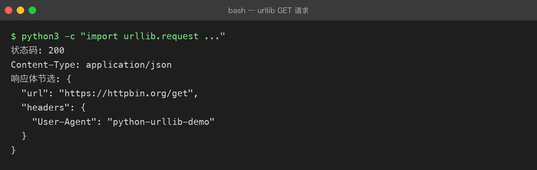

# Lesson 09 — HTTP / API：让 Python AI CLI Assistant 第一次连接外部世界

> 项目：Python AI CLI Assistant  
> 版本：v0.9  
> 核心主题：HTTP【超文本传输协议】、API【应用程序编程接口】、Request【请求】、Response【响应】、JSON、Status Code【状态码】、Headers【请求头】、POST、Timeout【超时】

---

# 一、这一章的项目需求

前面的 AI CLI Assistant 是这样的：

```text
用户
 ↓
Python
 ↓
Mock Response【模拟响应】
 ↓
AI CLI Assistant
```

例如：

```text
你：你好

AI：我收到你的问题了：你好
```

这个“AI”其实并没有真正调用任何外部 AI 服务。

它只是：

```python
def generate_mock_response(user_input):
    return f"我收到你的问题了：{user_input}"
```

所以 v0.9 我们提出一个新的项目需求：

> **让 Python 程序第一次真正访问一个外部 HTTP API。**

先不接 LLM。

我们先让程序学会：

```text
发送请求
 ↓
等待服务器
 ↓
接收响应
 ↓
解析 JSON
 ↓
处理错误
```

掌握这条链路之后，下一章再把服务器换成大模型 API。

---

# 二、为什么 AI 工程师必须懂 HTTP？

因为以后你会不断遇到：

```text
LLM API
Embedding API
Rerank API
Vector Database
MCP Server
Agent Tool
FastAPI
OpenAI-compatible API
```

这些系统虽然业务不同，但底层经常都绕不开：

```text
Client【客户端】
        ↓
HTTP Request【HTTP 请求】
        ↓
Server【服务器】
        ↓
HTTP Response【HTTP 响应】
        ↓
Client
```

所以：

> HTTP 是 AI 应用开发连接外部系统的一条基础公路。

---

# 三、先建立最重要的认知：API 到底是什么？

API：

# API = Application Programming Interface【应用程序编程接口】

不要把 API 简单理解成：

> “一个网址。”

API 更准确的理解是：

> **一个软件向另一个软件提供能力的约定。**

例如：

```text
天气系统
   ↓
提供：
查询天气

支付系统
   ↓
提供：
创建支付
查询支付
退款

LLM 服务
   ↓
提供：
文本生成
Embedding【嵌入】
Rerank【重排序】
```

所以：

```text
API
=
能力
+
调用规则
+
数据格式
```

---

# 四、API 和 HTTP 是什么关系？

这是面试非常容易问的地方。

不要混淆：

```text
API ≠ HTTP
```

API 是：

> 软件之间约定如何调用能力。

HTTP 是：

> 网络通信协议。

例如：

```text
你的 Python 程序
        ↓
调用 LLM API
        ↓
通过 HTTP
        ↓
LLM Server
```

所以可以理解成：

```text
API
  ↓
规定“我要调用什么、怎么传参数、返回什么”

HTTP
  ↓
负责“这些数据怎么在网络上传输”
```

---

# 五、谁是 Client，谁是 Server？

在我们的项目里：

```text
Python AI CLI Assistant
        ↓
Client【客户端】
```

远程服务：

```text
API Server
        ↓
Server【服务器】
```

完整关系：

```text
┌────────────────────┐
│ Python AI CLI      │
│ Client【客户端】   │
└─────────┬──────────┘
          │
          │ HTTP Request【请求】
          ↓
┌────────────────────┐
│ API Server         │
│ Server【服务器】   │
└─────────┬──────────┘
          │
          │ HTTP Response【响应】
          ↓
┌────────────────────┐
│ Python AI CLI      │
└────────────────────┘
```

---

# 六、Request【请求】到底是什么？

当客户端访问服务器时，会发送一个：

# Request【请求】

例如：

```text
POST /chat
```

它可以包含：

```text
Method【请求方法】
URL【地址】
Headers【请求头】
Body【请求体】
```

可以先形成这个结构：

```text
HTTP Request
│
├── Method
├── URL
├── Headers
└── Body
```

---

# 七、Method【请求方法】

最常见：

```text
GET
POST
PUT
DELETE
```

初学阶段先重点理解：

### GET

通常用于：

> 获取资源。

例如：

```text
GET /users/100
```

意思类似：

> 查询 ID=100 的用户。

---

### POST

通常用于：

> 向服务器提交数据，创建资源或执行某个操作。

例如：

```text
POST /chat
```

并携带：

```json
{
  "message": "你好"
}
```

意思就是：

> 把这条消息交给服务器处理。

---

### PUT

通常用于：

> 更新资源。

---

### DELETE

通常用于：

> 删除资源。

---

# 八、AI API 为什么经常使用 POST？

因为调用大模型时通常需要传递比较复杂的请求数据。

例如：

```json
{
  "model": "some-model",
  "messages": [
    {
      "role": "user",
      "content": "什么是 Java？"
    }
  ]
}
```

这种数据一般放到：

```text
Request Body【请求体】
```

中。

所以经常使用：

```text
POST
```

---

# 九、URL / Endpoint 是什么？

例如：

```text
https://api.example.com/v1/chat
```

这里可以先把它理解为：

# Endpoint【接口端点】

就是：

> **服务器提供某项 API 能力的访问入口。**

例如：

```text
https://api.example.com
```

是服务器。

而：

```text
/v1/chat
```

可能代表：

> Chat API【聊天接口】

所以：

```text
完整 URL
=
服务器地址
+
接口路径
```

---

# 十、Headers【请求头】是什么？

HTTP 请求除了 URL 和 Body，还可以携带：

# Headers【请求头】

例如：

```text
Content-Type: application/json
```

意思：

> 我发送的数据格式是 JSON。

还有：

```text
Authorization: Bearer xxx
```

意思通常是：

> 我正在提供身份认证信息。

所以可以理解：

```text
Headers
=
请求的附加元信息
```

---

# 十一、Body【请求体】是什么？

Body 就是：

> **真正提交给服务器的数据内容。**

例如：

```json
{
  "message": "你好"
}
```

它可以表示：

> 我想让服务器处理“你好”。

对于 LLM API，Body 往往更复杂：

```json
{
  "model": "model-name",
  "messages": [
    {
      "role": "user",
      "content": "你好"
    }
  ]
}
```

---

# 十二、Response【响应】

服务器处理请求之后，会返回：

# Response【响应】

一个 HTTP Response 通常包含：

```text
Response
│
├── Status Code【状态码】
├── Headers【响应头】
└── Body【响应体】
```

例如：

```text
200 OK
```

Body：

```json
{
  "message": "你好，很高兴认识你"
}
```

---

# 十三、Status Code【状态码】

状态码是 HTTP 中非常重要的一部分。

先记住几个高频的：

|状态码|含义|
|---|---|
|200|请求成功|
|201|创建成功|
|400|请求参数有问题|
|401|未认证 / 身份认证失败|
|403|没有权限|
|404|资源不存在|
|429|请求过于频繁|
|500|服务器内部错误|
|502|网关错误|
|503|服务暂时不可用|

不要死背所有状态码。

先建立：

```text
2xx
→ 成功

4xx
→ 客户端请求有问题

5xx
→ 服务端处理有问题
```

看一个真实例子 —— 用标准库 `urllib` 发一个 GET 请求，拿到 200：



---

# 十四、一个非常重要的面试点：401 vs 403

### 401

通常表示：

> 身份认证没有通过。

例如：

```text
API Key 错误
Token 无效
```

### 403

通常表示：

> 服务器知道你是谁，但你没有权限执行这个操作。

简单记：

```text
401
→ 你是谁？

403
→ 你没有权限做这个事情。
```

---

# 十五、我们开始真正写 HTTP Client

Python 标准库本身可以做 HTTP。

但是现代 Python 项目里，经常会使用第三方 HTTP Client【HTTP 客户端】库。

这一章我们使用：

```text
httpx
```

它是 Python 中常见的 HTTP Client。

进入：

```bash
source .venv/bin/activate
```

安装：

```bash
python -m pip install httpx
```

然后更新：

```bash
python -m pip freeze > requirements.txt
```

现在：

```text
requirements.txt
```

中应该同时包含：

```text
python-dotenv
httpx
```

---

# 十六、第一个 HTTP Demo

创建：

```text
projects/01-python-ai-cli/exercises/09-http-api/demo/01-get.py
```

代码：

```python
import httpx

response = httpx.get(
    "https://httpbin.org/get",
    timeout=10,
)

print("状态码：", response.status_code)
print("响应内容：", response.text)
```

运行：

```bash
python 01-get.py
```

你第一次真正完成：

```text
Python
 ↓
HTTP GET
 ↓
Internet
 ↓
HTTP Server
 ↓
HTTP Response
 ↓
Python
```

---

# 十七、这里到底发生了什么？

这一行：

```python
response = httpx.get(...)
```

背后发生的是：

```text
httpx
 ↓
创建 HTTP Request
 ↓
发送到服务器
 ↓
服务器处理
 ↓
服务器返回 Response
 ↓
httpx 接收
 ↓
response 对象
```

所以：

```python
response
```

不是字符串。

它是一个：

# Response Object【响应对象】

里面包含：

```python
response.status_code
response.headers
response.text
```

以及后面会经常使用的：

```python
response.json()
```

---

# 十八、为什么有 `.text` 和 `.json()`？

服务器返回的数据可能是：

```text
纯文本
```

也可能是：

```json
{
  "name": "AI"
}
```

如果服务器返回 JSON：

```python
response.json()
```

就可以把 JSON 响应转换成 Python 对象。

例如：

```python
data = response.json()

print(data)
```

得到的可能是：

```python
{
    "args": {},
    "headers": {...},
    "origin": "...",
    "url": "..."
}
```

这里再次连接到 Lesson 02：

```text
JSON
 ↓
Python Dict / List
```

所以前面学习 JSON 并不是孤立的。

---

# 十九、完整数据链路开始连接起来了

还记得 Lesson 02 吗？

我们学习：

```text
Python Dict
 ↓
JSON
```

现在：

```text
Python Dict
 ↓
JSON Request Body
 ↓
HTTP
 ↓
Server
 ↓
JSON Response
 ↓
Python Dict
```

这就是：

> **为什么我们之前一定要先学习 Dict 和 JSON。**

---

# 二十、POST 请求

创建：

```text
02-post.py
```

代码：

```python
import httpx

payload = {
    "message": "你好，我正在学习 Python HTTP。",
    "source": "ai-engineer-journey",
}

response = httpx.post(
    "https://httpbin.org/post",
    json=payload,
    timeout=10,
)

print("状态码：", response.status_code)

data = response.json()

print("服务器收到的数据：")
print(data["json"])
```

这里非常重要：

```python
json=payload
```

表示：

> 把 Python 对象作为 JSON 请求体发送。

---

# 二十一、`json=payload` 背后做了什么？

可以理解成：

```text
Python Dict
    ↓
JSON Serialization【JSON 序列化】
    ↓
HTTP Request Body
    ↓
服务器
```

然后服务器返回：

```text
HTTP Response
    ↓
JSON
    ↓
response.json()
    ↓
Python Dict
```

所以整个过程是：

```text
Python
 ↓
Dict
 ↓
JSON
 ↓
HTTP
 ↓
Server
 ↓
HTTP
 ↓
JSON
 ↓
Dict
 ↓
Python
```

这条链以后会反复出现。

---

# 二十二、Headers 怎么传？

例如：

```python
headers = {
    "Content-Type": "application/json",
}
```

然后：

```python
response = httpx.post(
    url,
    headers=headers,
    json=payload,
    timeout=10,
)
```

完整结构：

```python
response = httpx.post(
    url,
    headers=headers,
    json=payload,
    timeout=10,
)
```

这里：

```text
url
→ 请求发送到哪里

headers
→ 请求附加信息

json
→ 请求数据

timeout
→ 最多等待多久
```

---

# 二十三、Timeout【超时】为什么非常重要？

想象：

```text
Python
 ↓
发送请求
 ↓
服务器一直不响应
 ↓
Python 一直等
 ↓
程序卡住
```

这是非常糟糕的。

所以：

```python
timeout=10
```

可以理解成：

> 如果等待时间超过设定值，就不要无限等下去。

AI API 中尤其重要。

因为：

```text
LLM
 ↓
模型推理
 ↓
可能需要较长时间
```

但这并不意味着客户端应该：

> 无限等待。

---

# 二十四、HTTP 异常

网络请求不是一定成功。

例如：

```text
网络断开
DNS 失败
服务器超时
连接失败
HTTP 错误
```

所以不能：

```python
response = httpx.get(url)
print(response.json())
```

然后假设世界永远正常。

应该开始建立：

```text
try
 ↓
HTTP Request
 ↓
成功？
 ├── 是 → 处理 Response
 └── 否 → Exception【异常】
```

---

# 二十五、一个基础 HTTP 异常处理

```python
import httpx

try:
    response = httpx.get(
        "https://httpbin.org/get",
        timeout=10,
    )

    response.raise_for_status()

    data = response.json()

    print(data)

except httpx.HTTPStatusError as error:
    print(f"HTTP 请求失败：{error}")

except httpx.RequestError as error:
    print(f"网络请求失败：{error}")
```

这里出现一个很重要的方法：

```python
response.raise_for_status()
```

---

# 二十六、`raise_for_status()` 是什么？

如果：

```text
200
```

一般不会抛出 HTTP 状态异常。

但是：

```text
400
401
403
404
500
```

等错误状态，就可能抛出：

```text
HTTPStatusError
```

于是代码可以：

```text
Request
 ↓
Response
 ↓
raise_for_status()
 ↓
判断 HTTP 是否成功
```

---

# 二十七、为什么不能只判断 `status_code == 200`？

当然可以：

```python
if response.status_code == 200:
    ...
```

但真实项目里状态码可能有很多成功情况：

```text
200
201
202
204
```

而且不同接口的成功状态可能不同。

所以：

```python
response.raise_for_status()
```

通常更适合处理：

> “如果 HTTP 层失败，就进入异常流程。”

---

# 二十八、现在升级我们的 AI CLI Assistant

到目前为止：

```text
assistant.py
```

里面还是：

```python
def generate_mock_response(user_input):
    return f"我收到你的问题了：{user_input}"
```

现在暂时不要直接接真实 LLM。

先把结构升级成：

```text
assistant.py
       │
       ↓
HTTP Client
       │
       ↓
External API
       │
       ↓
Response
```

我们可以先使用一个测试 API 模拟远程服务。

---

# 二十九、增加 api_client.py

项目结构：

```text
src/ai_cli/
├── __init__.py
├── main.py
├── config.py
├── conversation.py
├── assistant.py
├── formatter.py
├── storage.py
└── api_client.py
```

为什么单独增加：

```text
api_client.py
```

？

因为：

```text
assistant.py
```

应该负责：

> Assistant 的业务逻辑。

而：

```text
api_client.py
```

负责：

> HTTP 通信。

这就是：

# Separation of Concerns【关注点分离】

---

# 三十、api_client.py

```python
import httpx


def get_demo_response(message):
    payload = {
        "message": message,
    }

    try:
        response = httpx.post(
            "https://httpbin.org/post",
            json=payload,
            timeout=10,
        )

        response.raise_for_status()

        return response.json()

    except httpx.HTTPStatusError as error:
        raise RuntimeError(
            f"远程服务返回 HTTP 错误：{error}"
        ) from error

    except httpx.RequestError as error:
        raise RuntimeError(
            f"网络请求失败：{error}"
        ) from error
```

---

# 三十一、assistant.py 开始调用 API Client

```python
from .api_client import get_demo_response


def generate_response(user_input):
    result = get_demo_response(user_input)

    return f"服务器收到：{result['json']['message']}"
```

现在：

```text
assistant.py
```

已经不需要知道：

```text
HTTP
headers
timeout
httpx
异常
```

这些细节。

它只知道：

```text
我要获得一个远程响应。
```

---

# 三十二、这就是分层的价值

以前：

```text
main.py
 ↓
assistant.py
 ↓
所有代码混在一起
```

现在：

```text
main.py
   ↓
assistant.py
   ↓
api_client.py
   ↓
HTTP
   ↓
External API
```

每层负责自己的事情。

---

# 三十三、联系描述：完整请求链路

这是这一章最重要的链路。

```text
用户输入
   ↓
main.py
   ↓
assistant.py
   ↓
api_client.py
   ↓
构造 Request
   │
   ├── Method = POST
   ├── URL
   ├── Headers
   └── JSON Body
   ↓
HTTP
   ↓
API Server
   ↓
处理请求
   ↓
HTTP Response
   │
   ├── Status Code
   ├── Headers
   └── JSON Body
   ↓
api_client.py
   ↓
解析 JSON
   ↓
assistant.py
   ↓
生成 Assistant Response
   ↓
main.py
   ↓
展示给用户
```

### 路线描述

用户首先输入问题，`main.py` 负责控制整个程序流程。它把用户问题交给 `assistant.py`，因为 Assistant 层负责决定“如何产生回答”。

`assistant.py` 又把真正的远程通信交给 `api_client.py`，这样业务逻辑和网络通信不会混在一起。

`api_client.py` 根据接口要求构造 HTTP Request，包括请求方法、接口地址、请求头和 JSON 请求体，然后通过 HTTP 发送给服务器。

服务器处理请求后返回 HTTP Response。Response 中包含状态码、响应头和响应体。`api_client.py` 首先处理 HTTP 层错误，然后把 JSON 响应解析成 Python 对象，再交给 `assistant.py`。

最后 `assistant.py` 把远程服务返回的数据转换成 Assistant 的业务结果，`main.py` 再负责展示。

所以整个项目真正形成了：

> **用户输入 → 业务层 → HTTP 客户端 → API → HTTP 响应 → 业务层 → 用户输出。**

---

# 三十四、为什么下一章就可以接 LLM？

因为真实 LLM API 本质上也是：

```text
HTTP Request
 ↓
LLM Server
 ↓
HTTP Response
```

区别主要在于：

```text
Request Body
```

会从：

```json
{
  "message": "你好"
}
```

变成类似：

```json
{
  "model": "某个模型",
  "messages": [
    {
      "role": "user",
      "content": "你好"
    }
  ]
}
```

然后服务器返回：

```json
{
  "choices": [
    {
      "message": {
        "role": "assistant",
        "content": "你好！"
      }
    }
  ]
}
```

所以：

> **你前面学习的 List、Dict、JSON、Function、Exception、Environment，现在全部开始汇合。**

---

# 三十五、前面学的东西为什么没有白学？

现在回头看：

## Lesson 01

变量：

```python
message = "你好"
```

---

## Lesson 02

Dict：

```python
{
    "role": "user",
    "content": message,
}
```

List：

```python
[
    {
        "role": "user",
        "content": message,
    }
]
```

JSON：

```text
Python Object
 ↓
JSON
```

---

## Lesson 03

循环处理：

```python
for message in messages:
    ...
```

---

## Lesson 04

函数：

```python
generate_response(...)
```

---

## Lesson 05

模块：

```python
from .api_client import ...
```

---

## Lesson 06

异常：

```python
try:
    ...
except:
    ...
```

---

## Lesson 07

持久化：

```text
messages
 ↓
JSON
 ↓
messages.json
```

---

## Lesson 08

环境：

```text
.venv
requirements.txt
.env
```

---

## Lesson 09

终于把它们连接：

```text
Python
 ↓
Dict
 ↓
JSON
 ↓
HTTP
 ↓
API
 ↓
JSON
 ↓
Dict
 ↓
Python
```

这才是项目驱动学习真正的价值。

---

# 三十六、Java 开发者视角

你有 Java 后端经验，这部分可以快速建立映射。

Python：

```python
response = httpx.post(
    url,
    json=payload,
    timeout=10,
)
```

可以类比 Java 后端里的：

```text
HTTP Client
 ↓
发送 HTTP Request
 ↓
接收 Response
```

例如 Java 生态中的：

```text
RestTemplate
WebClient
HttpClient
OkHttp
```

它们解决的问题本质相似：

> **让程序作为 HTTP Client 与其他服务通信。**

---

# 三十七、一个高频面试题：HTTP 请求包含什么？

### 标准话术

> 一个 HTTP 请求通常包含请求方法、URL、请求头和请求体。请求方法用于表示希望执行的操作，例如 GET、POST；URL 用于确定请求目标；Headers 用于传递元信息，例如 Content-Type 和 Authorization；Body 用于传输具体业务数据，POST 请求中经常使用 JSON 作为请求体。

---

# 三十八、一个高频面试题：HTTP Response 包含什么？

### 标准话术

> HTTP 响应通常包含状态码、响应头和响应体。状态码用于表示请求处理结果，例如 2xx 表示成功、4xx 通常表示客户端请求问题、5xx 通常表示服务端问题。响应体则用于返回具体业务数据，例如 JSON 数据。

---

# 三十九、一个高频面试题：401 和 403 有什么区别？

### 标准话术

> 401 通常表示身份认证没有通过，例如 Token 或 API Key 无效；403 通常表示服务器已经识别了请求方，但当前请求没有执行对应操作的权限。

---

# 四十、一个高频面试题：为什么 HTTP Client 要设置 Timeout？

### 标准话术

> 因为网络请求可能出现服务器无响应、网络异常或者服务处理时间过长。如果不设置超时，客户端可能长时间阻塞。设置 Timeout【超时】可以限制等待时间，在超过阈值后主动失败并进入异常处理流程，提高系统的稳定性。

---

# 四十一、主动回忆训练

先不要看答案。

### Q1

API 和 HTTP 是一回事吗？

---

### Q2

Client 和 Server 分别是什么？

---

### Q3

HTTP Request 包含哪些核心部分？

---

### Q4

GET 和 POST 最核心的区别是什么？

---

### Q5

Headers 是干什么的？

---

### Q6

Body 是干什么的？

---

### Q7

Response 包含哪些核心部分？

---

### Q8

200、400、401、403、404、429、500 分别代表什么？

---

### Q9

为什么：

```python
response.json()
```

和：

```python
response.text
```

不是一回事？

---

### Q10

为什么：

```python
json=payload
```

可以把 Python Dict 作为 JSON 请求体发送？

---

### Q11

为什么 HTTP Client 需要 Timeout？

---

### Q12

为什么我们新增：

```text
api_client.py
```

而不是把 HTTP 请求直接写进：

```text
main.py
```

？

---

# 四十二、最终挑战

现在不要复制前面的代码。

自己设计一个：

```text
GET /health
```

调用模块。

要求：

```text
health_client.py
```

提供：

```python
check_health()
```

最终：

```text
main.py
 ↓
check_health()
 ↓
HTTP GET
 ↓
Server
 ↓
Response
 ↓
判断状态码
 ↓
输出服务是否正常
```

要求：

1. 使用 `httpx`
    
2. 设置 Timeout
    
3. 处理网络异常
    
4. 处理 HTTP 错误
    
5. 返回 Python 数据
    
6. `main.py` 不直接操作 `httpx`
    

---

# 四十三、v0.9 完成标准

不要以“我看完了”作为完成标准。

达到下面状态才算：

```text
□ 我知道 API 和 HTTP 的区别
□ 我知道 Client / Server
□ 我知道 Request 的组成
□ 我知道 Response 的组成
□ 我知道 GET / POST
□ 我知道 Headers
□ 我知道 Body
□ 我知道 Status Code
□ 我知道 401 / 403
□ 我知道 response.json()
□ 我知道 Timeout
□ 我会用 httpx 发 GET
□ 我会用 httpx 发 POST
□ 我会处理 HTTP 异常
□ 我理解 api_client.py 为什么独立
□ 我能自己画出完整请求链路
```

---

# 四十四、当前项目路线

```text
v0.1 ✅ Input / Output
v0.2 ✅ List / Dict / JSON / Messages
v0.3 ✅ Condition / Loop
v0.4 ✅ Function
v0.5 ✅ Module / Package
v0.6 ✅ Exception / Validation
v0.7 ✅ File / JSON Persistence
v0.8 ✅ venv / pip / Environment
v0.9 ✅ HTTP / API
v1.0 ⏭ Real LLM CLI Assistant
```

---

# 四十五、下一章：真正接入大模型

下一章不再使用：

```text
Mock Response
```

也不再使用：

```text
httpbin
```

而是正式进入：

# Lesson 10 — Real LLM API：让 Python AI CLI Assistant 真正成为 AI Assistant

届时会把前面所有知识串起来：

```text
用户输入
   ↓
messages List
   ↓
Dict
   ↓
JSON
   ↓
HTTP POST
   ↓
LLM API
   ↓
Model【模型】
   ↓
Response
   ↓
assistant message
   ↓
messages
   ↓
messages.json
```

并开始理解：

```text
API Key
Model
Messages
System
User
Assistant
Token
Context
Temperature
Max Tokens
```

这里会第一次真正出现：

> **“我的 Python 程序到底是怎么调用大模型的？”**

但仍然会坚持项目驱动：不是先背一堆 LLM 概念，而是先让程序成功完成一次真实对话，再从代码反推这些概念。