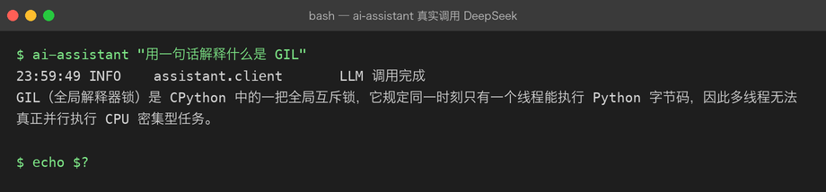
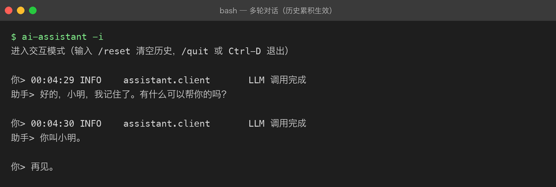
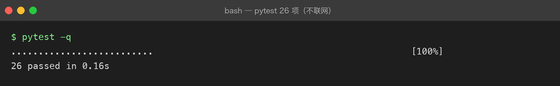

# Project 02 — Engineering AI Assistant

## 项目目标

在 Project 01 的基础上，把 CLI Assistant 从 Python Script 工程化为真正的 Python Application。

## 为什么做这个项目

Project 01 证明了 Python 能调用 LLM，但代码还是脚本级的：没有虚拟环境、没有测试、没有异步、没有类型提示、没有 FastAPI。这些问题不解决，项目无法继续扩展。

## 解决什么问题

- 脚本级代码无法维护、无法协作、无法部署
- 同步 HTTP 无法处理高并发 AI 请求
- 没有类型提示，项目一大就容易出错
- 没有日志和测试，改了代码不知道会不会坏

## 最终能力

```
Python Script
    ↓
Python Application
    ↓
可维护 AI 服务
```

## 技术栈

- `asyncio` / `aiohttp` 或 `httpx`（异步 HTTP）
- `typing` / `dataclasses`（类型安全）
- `logging`（标准日志）
- `pytest`（测试）
- `FastAPI`（Web 框架）
- `uvicorn`（ASGI Server）

## 项目演进

```
Python AI CLI Assistant（v1.0，同步脚本）
  ↓ v0.1 — async / await
Python AI CLI（异步版）
  ↓ v0.2 — 类型提示 + dataclass
  ↓ v0.3 — config / logging
  ↓ v0.4 — packaging
  ↓ v0.5 — FastAPI 服务
Engineering AI Assistant Service
```

## Milestones

| # | Milestone | 状态 | 核心能力 |
|---|-----------|------|----------|
| — | [总纲：从 Script 到 Application](OVERVIEW.md) | ✅ | 为什么要工程化 + 10 章路线 |
| 00 | [Classes and OOP](milestones/00-classes-and-oop.md) | ✅ | class / self / 构造函数 / 继承 / 封装 |
| 01 | [Async / Await](milestones/01-async-await.md) | 📝 | asyncio / coroutine / event loop |
| 02 | [Async HTTP Client](milestones/02-async-http-client.md) | 📝 | httpx / 连接池 / 超时 / 重试 |
| 03 | [Type Hints](milestones/03-type-hints.md) | 📝 | typing / 泛型 / Protocol |
| 04 | [Dataclass](milestones/04-dataclass.md) | 📝 | dataclass / frozen / field |
| 05 | [Config / Environment](milestones/05-config-and-environment.md) | ✅ | .env / Settings / 依赖注入 |
| 06 | [Logging](milestones/06-logging.md) | ✅ | logging / 级别 / 结构化日志 |
| 07 | [Testing / Debugging](milestones/07-testing-and-debugging.md) | ✅ | pytest / Fake / fixture |
| 08 | [Packaging](milestones/08-packaging.md) | ✅ | pyproject.toml / src layout |
| 09 | [FastAPI](milestones/09-fastapi.md) | ✅ | 路由 / Depends / SSE 流式 |

状态：✅ 已校对 · 📝 草稿待校对

## 当前状态

**10 / 10 个 Milestone 全部有内容**，其中 6 篇已校对（00、05、06、07、08、09），4 篇为迁移草稿（01–04，源自 Project 01，待逐篇校对）。

历史遗留已修复：

- `00-classes-and-oop.md` 原为「项目总纲 + Chapter 01」混装 → 总纲拆出为 `OVERVIEW.md`，Chapter 01 归位为 `01-async-await.md`，00 重写为真正的 classes/OOP
- `01-async-await.md` 装的其实是 Chapter 02 → 已重命名为 `02-async-http-client.md`
- `05` / `07` 原为 39 行占位空壳 → 已补写完整

## 当前版本

**v0.1** — async CLI 已落地并真实调通 DeepSeek API；FastAPI 层（Chapter 09）待实现。

## 运行效果

以下全部来自真实运行（26 项 pytest 不联网，LLM 调用为真实 API）：



多轮对话——第二轮能记住第一轮说的名字，说明 Conversation 的历史累积生效：



测试全程用 FakeClient，不联网、不花钱、16 毫秒跑完：



## 项目结构

```text
projects/02-engineering-ai-assistant/
├── README.md               # 本文件
├── OVERVIEW.md             # 总纲：为什么要工程化 + 10 章路线
├── milestones/             # 00 - 09 共 10 章
├── src/assistant/          # 工程化代码（async CLI + FastAPI）
├── tests/                  # pytest（用 Fake 对象，不联网）
├── pyproject.toml          # 打包配置（src layout）
└── .env.example            # 配置键清单（.env 不进 git）
```

## 下一步

按 Chapter 00 → 09 的顺序落地 `src/`：

1. `client.py` / `conversation.py` / `service.py` —— 分层 + 抽象基类（00）
2. 把 `chat()` 改异步，用 httpx 连接池（01、02）
3. `settings.py` 收敛配置、`logging_setup.py` 替换 print（05、06）
4. `tests/` 用 FakeClient 覆盖业务逻辑（07）
5. `pyproject.toml` 打包出 `ai-assistant` 命令（08）
6. `api.py` 加 FastAPI + SSE 流式（09）

## 已掌握能力

- Project 01 的所有 Python 基础
- 真实 LLM API 调用骨架

**前置项目**：[Project 01 — Python AI CLI Assistant](../01-python-ai-cli/)
