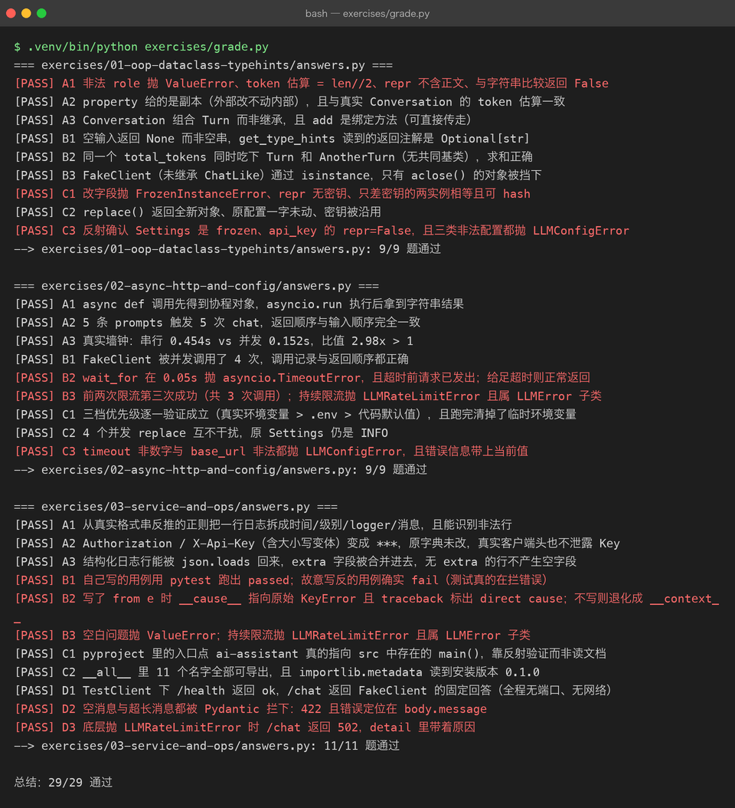

# Exercises — Project 02 配套练习题与判卷工具

> **先说清楚一件事**：这份 `answers.py` 跑通，代表的是**参考答案能跑通**，不代表你学会了。
> 生成它的人（AI）**不会**替你勾选任何进度 —— 「是否掌握」只有你自己写完、讲清楚之后才算数。
> 仓库里所有学习状态默认 ⬜，勾选权始终在你手里。

## 怎么用

1. **先看 milestone**（`../milestones/`），把概念过一遍
2. **自己在练习目录里写**（建议建 `01_answers.py`，别覆盖 `answers.py`）
3. **卡住再看 `answers.py`** —— 只准看卡住的那一个函数，不要整份抄
4. **做完回 `../LEARNING.md` 答自测题** —— 那里考的是「为什么」，答题要点写在折叠块里

## 目录

| 目录 | 覆盖 Milestone | 题数 |
|---|---|---|
| [01-oop-dataclass-typehints](01-oop-dataclass-typehints/README.md) | M00 类与 OOP / M03 类型注解 / M04 dataclass / M05 配置对象 | 9 |
| [02-async-http-and-config](02-async-http-and-config/README.md) | M01 async/await / M02 异步 HTTP / M05 配置与环境 | 9 |
| [03-service-and-ops](03-service-and-ops/README.md) | M06 日志 / M07 测试与调试 / M08 打包 / M09 FastAPI | 11 |

合计 29 题。

## 判卷

```bash
cd projects/02-engineering-ai-assistant
.venv/bin/python exercises/grade.py                 # 人读的输出
.venv/bin/python exercises/grade.py --json          # 机器可读（CI 用）
.venv/bin/python exercises/grade.py --selftest      # 验证离线哨兵还灵不灵
```

判卷出 .txt 留证：

```bash
.venv/bin/python exercises/grade.py > exercises/out/grade.txt 2>&1
```

### 判卷的四条规则

1. **每份 `answers.py` 都套着 [`_offline_guard.py`](_offline_guard.py) 跑**，退出码必须为 0
2. **每道题必须真的打印 `[PASS] <题号>`** —— 预期题号从同目录 `README.md` 扫出来。文档是题源，答案只是答案，所以「README 写了但答案没解」也算 FAIL
3. **socket 层熔断**：答案脚本只要试图连出本机，就被 `NetworkAccessDenied` 打断
4. 除此之外做一次静态提醒（读真实 Key / 硬编码 api 域名），只提示不判 FAIL

### 为什么不用「符号黑名单」判联网

一开始判卷脚本是这样写的：扫到 `httpx.AsyncClient(`、`DeepSeekClient(` 就报警。两个问题：

- **假阳性**：03 组有一道题要验证「Key 不会泄露到日志里」，做法是构造一个真实客户端、读它的 headers 再脱敏对比 —— 构造对象**不发任何请求**，但黑名单照样把它打出来
- **假阴性**：黑名单拦不住「偷偷连一个内网地址」

改成在 `socket.socket.connect` / `socket.create_connection` 上装闸门之后才是真约束。**`--selftest` 就是这条约束的自证**：它拿一个「先打印假 `[PASS] Z9`，再尝试连接外网」的脚本跑一遍，确认进程被拦下 —— 顺便也证明了「只看 `[PASS]` 标记」是不够的，必须看退出码。

## 本次判卷结果（真实运行）



哨兵自测同样是从真实进程里跑出来的：


跑通 29/29。**这是参考答案的成绩，不是你的成绩。**
