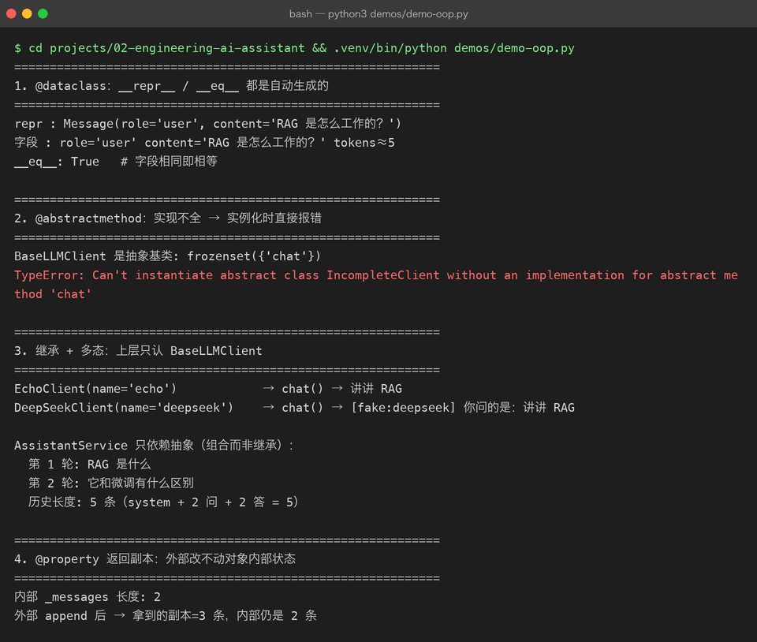

# Project 02 — Chapter 00：Classes and OOP【类与面向对象】

> 状态：✅ 已校对
> 前置：Project 01 v1.0（已有 `LLMClient` 类）
> 对应代码：`src/assistant/`

---

## 1. 项目要增加什么能力

Project 01 的 `LLMClient` **已经是一个类**了：

```python
class LLMClient:
    def __init__(self, config: Config, system_prompt: str = DEFAULT_SYSTEM_PROMPT) -> None:
        self.config = config
        self.system_prompt = system_prompt

    def ask(self, question: str) -> str:
        ...
```

但 Project 02 要面对新需求：

```text
需求 1：换成另一个模型厂商（OpenAI / 通义 / 本地 vLLM）怎么办？
需求 2：想给「问答」加一层缓存、重试、日志，代码往哪放？
需求 3：单元测试时，怎么在不联网的情况下测业务逻辑？
需求 4：对话历史谁来管？散落在 main.py 里还是归某个对象？
```

这四个问题的答案都指向同一件事：

> **用「抽象 + 继承 + 封装」把代码分层，而不是继续往一个类里堆方法。**

本章目标：

> **把「一个类包打天下」重构成「抽象基类 + 具体实现 + 会话对象」的分层结构。**

---

## 2. 为什么需要这个知识

脚本阶段（Project 01）的代码是**按执行顺序**组织的：

```text
读配置 → 构造请求 → 发 HTTP → 解析 JSON → 打印
```

工程阶段（Project 02）的代码要**按职责**组织：

```text
谁负责配置？  → Config / Settings
谁负责发请求？ → LLMClient（可以有多种实现）
谁负责记住对话？ → Conversation
谁负责业务流程？ → AssistantService
谁负责对外接口？ → CLI / FastAPI
```

区别在哪里？脚本关心「**怎么做**」，工程关心「**谁来做**」。

而表达「谁来做」的工具，就是**类**。

---

## 3. 核心概念

### 3.1 class 与 instance【类与实例】

```python
class LLMClient:          # 类：图纸
    def __init__(self, api_key: str) -> None:
        self.api_key = api_key   # 实例属性：每个对象各自一份

    def ask(self, q: str) -> str:
        return f"[{self.api_key[:4]}...] {q}"

a = LLMClient("sk-aaaa")  # 实例：按图纸造出来的房子
b = LLMClient("sk-bbbb")
```

Java 对照：

```java
public class LLMClient {
    private final String apiKey;
    public LLMClient(String apiKey) { this.apiKey = apiKey; }
    public String ask(String q) { return "[" + apiKey.substring(0,4) + "...] " + q; }
}
```

### 3.2 `self` 到底是什么

`self` **就是「当前这个对象」**，等价于 Java 的 `this`。

不同点只有一个：Java 的 `this` 是编译器隐式提供的，Python 必须**显式写进第一个参数**。

```python
def ask(self, question: str) -> str:   # 必须写 self
    return self.config.model           # 用 self 访问自己的属性
```

调用时不用传它 —— `client.ask("你好")` 里，Python 会自动把 `client` 填进 `self`。

### 3.3 `__init__` 是构造函数

```python
def __init__(self, config: Config) -> None:
    self.config = config
```

对应 Java：

```java
public LLMClient(Config config) { this.config = config; }
```

注意：Python 的 `__init__` **不是**真正的构造函数（真正的是 `__new__`），它只是「对象创建完之后自动调用的第一个方法」。99% 的场景你只需要 `__init__`。

### 3.4 继承：抽出共同点

需求 1 说要支持多家厂商。它们的共同点：

```text
共同点：都有 api_key、都要发 chat 请求、都返回一段文本
不同点：base_url 不同、请求体字段名可能不同、鉴权头格式略有差异
```

**共同点放进父类，不同点留给子类**：

```python
from abc import ABC, abstractmethod

class BaseLLMClient(ABC):                 # 抽象基类：不能被实例化
    def __init__(self, api_key: str, base_url: str) -> None:
        self.api_key = api_key
        self.base_url = base_url

    @abstractmethod
    async def chat(self, messages: list[dict[str, str]]) -> str:
        """子类必须实现这个方法。"""
        ...

class DeepSeekClient(BaseLLMClient):
    async def chat(self, messages: list[dict[str, str]]) -> str:
        # DeepSeek 特有的实现
        ...

class MockClient(BaseLLMClient):          # 测试用：不联网
    async def chat(self, messages: list[dict[str, str]]) -> str:
        return "这是假回答"
```

`@abstractmethod` 的作用：**强制子类实现**。如果子类忘了写 `chat`，实例化时直接报错，而不是等到运行到那一行才崩。

这解决了需求 1 和需求 3：换厂商 = 换一个子类；测试 = 用 `MockClient`。

### 3.5 封装：把「状态 + 操作状态的方法」放在一起

需求 4（对话历史谁管）的答案是：**新建一个对象专门管**。

```python
class Conversation:
    def __init__(self, system_prompt: str) -> None:
        self._messages: list[dict[str, str]] = [
            {"role": "system", "content": system_prompt}
        ]

    def add_user(self, text: str) -> None:
        self._messages.append({"role": "user", "content": text})

    def add_assistant(self, text: str) -> None:
        self._messages.append({"role": "assistant", "content": text})

    @property
    def messages(self) -> list[dict[str, str]]:
        """只读视图：外部不能绕过方法直接改内部列表。"""
        return self._messages.copy()

    def clear(self) -> None:
        self._messages = self._messages[:1]   # 保留 system
```

三个关键点：

1. **下划线 `_messages`** 表示「内部实现，外部别碰」（约定，不是强制）
2. **`@property`** 让 `conv.messages` 像属性一样读，但背后是方法（可以加逻辑）
3. **返回 `.copy()`** 防止外部拿到引用后偷偷改内部状态

### 3.6 组合优先于继承

`AssistantService` 需要 client 和 conversation，但**它不是它们的子类**，它是「拥有」它们：

```python
class AssistantService:
    def __init__(self, client: BaseLLMClient) -> None:
        self._client = client              # 组合：持有另一个对象
        self._conversation = Conversation(...)

    async def ask(self, text: str) -> str:
        self._conversation.add_user(text)
        answer = await self._client.chat(self._conversation.messages)
        self._conversation.add_assistant(answer)
        return answer
```

这是 Java 里天天在写的**依赖注入**：`AssistantService` 不关心传进来的是 DeepSeek 还是 Mock，只关心它实现了 `chat`。

> 这也正是后面 Chapter 03 的 `Protocol`、Chapter 09 的 FastAPI `Depends` 的基础。

---

## 4. 项目代码

本章在 `src/` 下建立的分层（Chapter 01 会把 `chat` 改成 async）：

```text
src/assistant/
├── errors.py        # 异常层级（P01 已有）
├── config.py        # 配置对象（P01 已有，Chapter 05 升级）
├── client.py        # BaseLLMClient + DeepSeekClient（本章）
├── conversation.py  # Conversation：管对话历史（本章）
└── service.py       # AssistantService：业务流程（本章）
```

调用链：

```text
CLI / FastAPI
    ↓ 调用
AssistantService.ask()
    ↓ 先记历史
Conversation.add_user()
    ↓ 再发请求
BaseLLMClient.chat()   ← 可以是 DeepSeekClient，也可以是 MockClient
```

**上层不依赖下层的具体类型，只依赖抽象。** 这就是能测试、能换厂商、能加缓存的原因。

---



## 5. Java ↔ Python 对比

| Java | Python | 说明 |
|------|--------|------|
| `class X {}` | `class X:` | 同 |
| `this.field` | `self.field` | Python 必须显式声明 `self` 参数 |
| `public X(...)` 构造器 | `def __init__(self, ...)` | 同类 |
| `abstract class` | `class X(ABC)` | Python 靠继承 `ABC` |
| `abstract 方法` | `@abstractmethod` | 同 |
| `extends` | `class Sub(Base):` | 括号里写父类 |
| `implements` | 直接继承（Python 无接口关键字） | 抽象基类 / `Protocol` 代替 |
| `super.method()` | `super().method()` | 同 |
| `private String x` | `self._x`（约定） | Python 没有真正的私有 |
| `public String getX()` | `@property def x(self)` | 调用方写 `obj.x` |
| `final` | 无关键字（约定全大写 / `frozen dataclass`） | 靠自律 |
| `interface` | `typing.Protocol` | Chapter 03 细讲 |

---

## 6. 常见坑

### 坑 1：可变默认参数

```python
def __init__(self, messages: list = []) -> None:   # ❌ 灾难
    self.messages = messages
```

`[]` 在**函数定义时**就创建了一次，所有实例共享同一个列表。改一个，全都变。

正确写法：

```python
def __init__(self, messages: list | None = None) -> None:
    self.messages = messages if messages is not None else []
```

### 坑 2：类属性被所有实例共享

```python
class Client:
    history: list = []      # ❌ 类属性，所有实例共用

a, b = Client(), Client()
a.history.append("hi")
print(b.history)            # ['hi'] —— b 也被改了
```

要每个实例独立，就放进 `__init__` 里用 `self.`。

### 坑 3：忘记 `self`

```python
class Client:
    def ask(self, q):
        return config.model    # ❌ NameError: name 'config' is not defined
```

实例属性必须 `self.config`。

### 坑 4：以为 `_x` 真的私有

```python
conv._messages.append({"role": "user", "content": "绕过方法"})
```

Python 不会拦你。`_x` 只是「我和你约定别碰」。要真正保护，用 `@property` 返回副本（见 3.5）。

### 坑 5：抽象基类没实现完就想实例化

```python
class MyClient(BaseLLMClient):
    pass

MyClient()   # TypeError: Can't instantiate abstract class MyClient
```

这是好事——错误提前暴露，而不是运行到一半崩。

---

## 7. 实战挑战

**挑战 1**：写一个 `EchoClient(BaseLLMClient)`，它的 `chat()` 把最后一条 user 消息原样返回。用它跑通 `AssistantService`，验证「换实现不用改上层」。

**挑战 2**：给 `Conversation` 加一个 `token_estimate()` 方法，粗略估算历史长度（`len(text) // 2`），并在超过 2000 时自动丢弃最早的 user/assistant 对（保留 system）。

**挑战 3（进阶）**：把 `BaseLLMClient` 改写成 `typing.Protocol`（不继承、只声明方法签名），体会「结构化子类型」与「继承」的区别。

---

## 8. 主动回忆

遮住答案，看你能不能答出来：

1. `self` 是谁？调用时为什么不用传？
2. `__init__` 和 Java 构造器有什么本质区别？
3. `@abstractmethod` 解决了什么问题？
4. 为什么可变默认参数 `[]` 是坑？怎么修？
5. 「组合」和「继承」分别在什么场景下用？为什么本项目选组合？
6. Python 的 `_x` 私有吗？怎么才算真正的封装？

---

## 9. 本节完成标准

- [ ] 能说清 `class / self / __init__ / 继承 / 封装` 各自解决什么问题
- [ ] 实现 `BaseLLMClient`（抽象基类）+ 至少一个具体子类
- [ ] 实现 `Conversation`，并用 `@property` 暴露只读 `messages`
- [ ] 实现 `AssistantService`，它**只依赖抽象**，不依赖具体厂商
- [ ] 用 `MockClient` 在不联网的情况下跑通一次完整问答

下一章：[01-async-await.md](01-async-await.md) —— 把 `chat()` 变成异步，解决并发。
