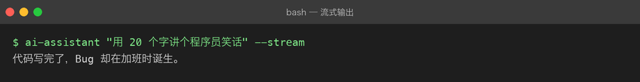

# Project 02 — Chapter 02：Async HTTP Client【异步 HTTP 客户端】

## 1. 项目问题

上一章我们已经知道：

```text
async / await
↓
Coroutine【协程】
↓
Event Loop【事件循环】
↓
可以处理异步 I/O
```

但仅仅把：

```python
def chat(...):
```

改成：

```python
async def chat(...):
```

还不够。

因为真正的 AI 应用还需要解决：

```text
连接怎么管理？
请求怎么发送？
超时怎么办？
HTTP 错误怎么办？
连接能不能复用？
多个请求怎么并发？
Client 什么时候关闭？
```

因此本章目标是：

> **构建一个真正可复用的异步 LLM HTTP Client。**

---

# 2. 从 Project 01 的写法开始

Project 01 可能是这种结构：

```python
import httpx

def chat(messages):
    response = httpx.post(
        BASE_URL,
        headers=headers,
        json=payload,
        timeout=60,
    )

    response.raise_for_status()

    return response.json()
```

现在升级为：

```python
import httpx

async def chat(messages):
    async with httpx.AsyncClient() as client:
        response = await client.post(
            BASE_URL,
            headers=headers,
            json=payload,
            timeout=60,
        )

    response.raise_for_status()

    return response.json()
```

表面看只是：

```text
httpx.post()
↓
client.post()

def
↓
async def

调用
↓
await
```

但真正变化的是：

> **HTTP 请求现在成为异步 I/O 操作。**

---

# 3. AsyncClient 是什么

`httpx.AsyncClient`

可以理解为：

> 一个专门负责异步 HTTP 请求的客户端对象。

它负责：

```text
创建连接
↓
发送 HTTP 请求
↓
接收 HTTP Response【响应】
↓
连接管理
↓
连接复用
↓
资源释放
```

所以：

```python
client = httpx.AsyncClient()
```

不是简单的：

> “换一个 post 方法。”

它代表：

**整个 HTTP 通信过程进入异步客户端模型。**

---

# 4. 为什么不每次都重新创建 Client

最简单的代码：

```python
async def chat(messages):
    async with httpx.AsyncClient() as client:
        return await client.post(...)
```

虽然正确，但如果你的程序连续请求：

```text
请求 A
请求 B
请求 C
请求 D
```

每次都：

```text
创建 Client
↓
建立连接
↓
发送请求
↓
关闭 Client
```

会增加额外开销。

工程上通常更希望：

```text
Application
     ↓
一个长期存在的 AsyncClient
     ↓
多个 HTTP Request
```

这样可以利用：

**Connection Pool【连接池】**

---

# 5. Connection Pool【连接池】

假设：

```text
你的 AI Application
        ↓
AsyncClient
        ↓
Connection Pool
   ┌────┼────┐
   ↓    ↓    ↓
 Conn1 Conn2 Conn3
   ↓    ↓    ↓
 LLM API Server
```

连接池的核心思想：

> 已经建立的连接可以在多个请求之间复用。

联系描述：

应用层不需要每次都从零建立网络连接。`AsyncClient` 管理连接池，请求到来时优先复用已有连接；请求完成后连接可以继续保留给后续请求使用。这样可以减少重复建立连接带来的开销。

---

# 6. 生命周期管理

因此 Client 不能“随便创建、随便丢”。

需要明确：

```text
Create【创建】
↓
Use【使用】
↓
Close【关闭】
```

最简单的安全方式：

```python
async with httpx.AsyncClient() as client:
    response = await client.get(...)
```

这里：

```python
async with
```

负责生命周期管理。

你可以把它理解成异步版的：

```python
with open(...) as file:
```

---

# 7. 为什么 async with 很重要

例如：

```python
async with httpx.AsyncClient() as client:
    ...
```

进入：

```text
创建 / 准备资源
```

离开：

```text
释放资源
```

即使内部发生异常，也会执行清理逻辑。

因此它特别适合管理：

- HTTP Client
    
- 文件
    
- 数据库连接
    
- 网络资源
    

---

# 8. Timeout【超时】

AI API 最大的问题之一：

> 网络可能永远等不到。

例如：

```text
请求发送
↓
服务器迟迟没有响应
↓
程序一直等待
```

因此工程代码必须设置：

```python
timeout = 60
```

例如：

```python
timeout = httpx.Timeout(
    connect=10.0,
    read=60.0,
    write=10.0,
    pool=10.0,
)
```

几个概念：

`connect`【连接超时】

建立 TCP / TLS 等连接阶段允许等待多久。

`read`【读取超时】

服务器迟迟没有返回数据时允许等待多久。

`write`【写入超时】

发送请求数据时允许等待多久。

`pool`【连接池超时】

等待连接池中可用连接时允许多久。

---

# 9. 为什么 AI API 的 read timeout 往往更重要

普通 API：

```text
请求
↓
几十毫秒
↓
响应
```

LLM：

```text
请求
↓
排队
↓
模型推理
↓
生成 Token
↓
响应
```

可能需要更长时间。

所以：

```text
AI Request
```

的超时策略不能简单照搬普通 CRUD API。

---

# 10. HTTP Error【HTTP 错误】

之前我们用了：

```python
response.raise_for_status()
```

它会把非成功 HTTP 状态转换成异常。

例如：

```text
400 → 请求参数错误
401 → 身份认证失败
403 → 没有权限
404 → 资源不存在
429 → 请求过多
500 → 服务端错误
```

因此不要写：

```python
if response.status_code != 200:
    print("出错")
```

然后什么都不做。

更合理的是：

```python
response.raise_for_status()
```

再在上层统一处理。

---

# 11. httpx Exceptions【httpx 异常】

除了 HTTP 状态码异常，网络本身也可能失败。

例如：

```python
httpx.TimeoutException
httpx.ConnectError
httpx.HTTPStatusError
httpx.RequestError
```

这里要理解：

### HTTPStatusError

服务器明确返回了 HTTP 错误状态。

例如：

```text
429
500
```

### ConnectError

连接服务器失败。

例如：

```text
DNS
网络
服务器端口
TLS
```

### TimeoutException

超过设定时间。

---

# 12. 推荐的 Client 层

现在开始把：

```text
API Key
Base URL
Model
HTTP Request
Response Parsing
```

集中到：

```text
api_client.py
```

例如：

```python
import httpx

class LLMClient:
    def __init__(
        self,
        api_key: str,
        base_url: str,
        model: str,
    ):
        self.api_key = api_key
        self.base_url = base_url
        self.model = model

        self.timeout = httpx.Timeout(
            connect=10.0,
            read=60.0,
            write=10.0,
            pool=10.0,
        )

        self.client = httpx.AsyncClient(
            timeout=self.timeout,
            headers={
                "Authorization": f"Bearer {self.api_key}",
                "Content-Type": "application/json",
            },
        )

    async def chat(self, messages: list[dict]) -> dict:
        payload = {
            "model": self.model,
            "messages": messages,
        }

        response = await self.client.post(
            self.base_url,
            json=payload,
        )

        response.raise_for_status()

        return response.json()

    async def close(self):
        await self.client.aclose()
```

---

# 13. 这里发生了什么

结构变成：

```text
LLMClient
├── 配置
│   ├── API Key
│   ├── Base URL
│   └── Model
│
├── AsyncClient
│
├── chat()
│
└── close()
```

这比：

```python
每个函数自己创建 httpx.AsyncClient
```

更加工程化。

---

# 14. Application Layer 不应该关心 HTTP 细节

比如：

```python
class Assistant:
    def __init__(self, llm_client):
        self.llm_client = llm_client

    async def generate_response(self, messages):
        response = await self.llm_client.chat(messages)
        return response["choices"][0]["message"]["content"]
```

于是：

```text
main.py
   ↓
Assistant
   ↓
LLMClient
   ↓
AsyncClient
   ↓
HTTP
   ↓
LLM
```

这样分层：

```text
main.py
负责程序流程

assistant.py
负责 AI 业务逻辑

api_client.py
负责 HTTP / API 通信
```

---

# 15. 为什么这很重要

假设以后从：

```text
OpenAI-compatible API
```

换成：

```text
另一个供应商
```

如果所有代码都写：

```python
httpx.post(...)
```

你可能需要改几十个地方。

现在：

```text
Assistant
↓
LLMClient
```

只需要主要调整：

```text
LLMClient
```

上层业务逻辑可以保持不变。

这就是：

**Separation of Concerns【关注点分离】**

---

# 16. 一个重要概念：Transport【传输层】

你的 AI Application 不应该知道太多：

```text
HTTP Header
Status Code
Connection Pool
Timeout
```

这些更偏向：

**Transport Layer【传输层】**

因此：

```text
Application Layer
        ↓
Service / Client Layer
        ↓
HTTP Transport
        ↓
LLM Server
```

联系描述：

应用层关心“我要让模型完成什么任务”；客户端层负责“怎么调用模型”；HTTP 传输层负责“怎么建立连接、发送请求、处理网络错误”。分层以后，每层只承担自己的职责。

---

# 17. 并发请求

现在我们可以开始真正使用上一章的异步能力。

例如：

```python
import asyncio

async def ask(client, question):
    return await client.chat([
        {
            "role": "user",
            "content": question,
        }
    ])

async def main():
    client = LLMClient(
        api_key=API_KEY,
        base_url=BASE_URL,
        model=MODEL_NAME,
    )

    questions = [
        "什么是 JVM？",
        "什么是 RAG？",
        "什么是 Transformer？",
    ]

    results = await asyncio.gather(
        *(ask(client, question) for question in questions)
    )

    for result in results:
        print(result)

    await client.close()
```

这里：

```python
asyncio.gather(...)
```

表示：

> 等待多个协程的结果，并允许它们并发推进。

---

# 18. 这不是“同时计算三个模型”

非常重要。

如果这三个操作主要是在：

```text
等待网络
```

那么异步能让：

```text
Request A
Request B
Request C
```

的等待时间重叠。

大致：

### 串行

```text
A █████
B      █████
C           █████
```

### 并发等待

```text
A █████
B █████
C █████
```

它并不意味着 Python 在一个线程上同时执行三个 CPU 密集计算任务。

---

# 19. 并发的工程问题

有了并发之后，新问题也来了：

```text
请求一下变成 3 个
↓
如果变成 100 个？
```

可能导致：

- API 限流
    
- 连接池耗尽
    
- 内存增加
    
- 服务端拒绝
    
- 429 Too Many Requests
    

所以后面会继续学习：

**Concurrency Control【并发控制】**

例如：

```text
Semaphore【信号量】
Rate Limit【速率限制】
Retry【重试】
Backoff【退避】
```

这些会在后续工程化中逐步加入。

---

# 20. Retry【重试】不能随便写

错误做法：

```python
while True:
    try:
        request()
        break
    except:
        pass
```

因为：

```text
服务器挂了
↓
疯狂重试
↓
请求更多
↓
服务器更忙
```

这可能形成：

**Retry Storm【重试风暴】**

所以以后要学：

```text
Retry
+
Exponential Backoff【指数退避】
+
Maximum Retry【最大重试次数】
```

本章先理解，不要求完整实现。

---

# 21. Project 02 的架构变化

上一章：

```text
main
 ↓
assistant
 ↓
Async API
```

现在：

```text
main
 ↓
assistant
 ↓
LLMClient
 ↓
httpx.AsyncClient
 ↓
HTTP
 ↓
LLM API
```

最终结构：

```text
project/
├── README.md
├── milestones/
│   ├── 01-async-await.md
│   └── 02-async-http-client.md
│
└── src/
    └── ai_assistant/
        ├── __init__.py
        ├── main.py
        ├── assistant.py
        ├── api_client.py
        └── config.py
```

---

# 22. Java 对比

你可以把：

```text
Python httpx.AsyncClient
```

类比到 Java 中的：

```text
异步 HTTP Client
+
连接池
+
Timeout
+
Exception
```

但是不要直接认为：

```text
httpx.AsyncClient = 某一个 Java 类
```

更准确的理解是：

> Python 的 `AsyncClient` 是异步 HTTP 客户端抽象；Java 中也存在类似的异步 HTTP 客户端和连接池体系，但具体 API 和执行模型由不同 HTTP 库决定。

例如 Java 生态里你可能接触：

```text
Java 11 HttpClient
Spring WebClient
OkHttp
Apache HttpClient
```

---

# 23. 本章知识地图

```text
Async / Await
      ↓
Coroutine
      ↓
Event Loop
      ↓
Async HTTP Client
      ↓
AsyncClient
      ↓
Connection Pool
      ↓
Timeout
      ↓
HTTP Error
      ↓
Request Error
      ↓
Client Lifecycle
      ↓
Reusable LLM Client
      ↓
Concurrent Requests
```

联系描述：

上一章解决的是“程序如何异步地等待 I/O”；这一章解决的是“如何把这种异步能力真正用于 HTTP 通信”。`AsyncClient` 成为应用与 LLM API 之间的网络层，再向下涉及连接池、超时和异常处理；向上则暴露一个更简单的 `chat()` 接口给 AI 业务层。这样后续 RAG、Agent、MCP 等项目都可以复用这个客户端能力。

---

# 24. 实战任务

## Task 1

创建：

```text
LLMClient
```

要求：

```text
[ ] AsyncClient
[ ] timeout
[ ] headers
[ ] POST
[ ] raise_for_status()
[ ] response.json()
[ ] close()
```

---

## Task 2

将原来的：

```python
generate_response(messages)
```

改成：

```python
await llm_client.chat(messages)
```

并保持：

```text
main
↓
assistant
↓
LLMClient
```

三层关系。

---

## Task 3

实现三个并发请求：

```text
Q1：什么是 JVM？
Q2：什么是 RAG？
Q3：什么是 Transformer？
```

使用：

```python
asyncio.gather()
```

---

## Task 4

观察：

```text
串行执行时间
vs
并发执行时间
```

记录实验结果。

不要只写：

> “异步更快。”

必须记录：

```text
请求数量
单次延迟
总耗时
环境
结果
```

---

# 25. 主动回忆

不要看上面的内容，先自己回答：

### Q1

为什么工程项目中不推荐每次请求都重新创建 `AsyncClient`？

### Q2

Connection Pool【连接池】解决什么问题？

### Q3

`async with AsyncClient()` 的意义是什么？

### Q4

Timeout 为什么必须设置？

### Q5

`HTTPStatusError` 和 `ConnectError` 有什么区别？

### Q6

为什么 `Assistant` 不应该直接处理 HTTP Header 和连接池？

### Q7

为什么 `asyncio.gather()` 适合多个 LLM 请求？

### Q8

并发请求为什么可能导致 429？

### Q9

为什么重试不能简单写成无限循环？

---

# 26. 面试标准话术

### 问：你在 Python 项目中如何封装 LLM API？

可以回答：

> 我会把 LLM API 通信独立封装成一个 `LLMClient`。底层使用 `httpx.AsyncClient` 负责异步 HTTP 通信，并统一管理 Base URL、请求头、超时、连接池和异常。上层的 Assistant Service 不直接依赖 HTTP 细节，只调用类似 `chat(messages)` 的业务接口。这样可以实现关注点分离，也方便后续替换模型供应商或增加重试、限流等能力。

### 问：为什么复用 AsyncClient？

> 主要是为了复用连接和连接池，避免每次请求都重新创建和销毁 HTTP 客户端，从而减少额外开销，并统一管理 HTTP 生命周期和连接资源。

### 问：LLM API 为什么需要 Timeout？

> LLM 请求包含网络传输和模型推理，响应时间可能明显高于普通业务 API。如果没有超时控制，异常情况下请求可能长时间占用资源，因此通常需要针对 connect、read 等阶段设置合理超时。

---

# 27. 常见坑

### 坑 1：忘记 await

错误：

```python
result = client.chat(messages)
```

正确：

```python
result = await client.chat(messages)
```

---

### 坑 2：忘记关闭 Client

长期运行程序中可能造成：

```text
连接资源
文件描述符
连接池
```

没有正确释放。

---

### 坑 3：把所有异常都捕获

不要：

```python
except Exception:
    return "调用失败"
```

这会把真正的问题隐藏掉。

---

### 坑 4：无限重试

网络问题不代表：

> 再请求 100 次就一定会成功。

重试必须有限制。

---

### 坑 5：把 HTTP 层和业务层混在一起

不要让：

```text
main.py
```

直接处理：

```text
headers
timeout
status code
JSON response parsing
```

应该让 Client 层负责这些细节。

---

# 28. 本章完成标准

```text
[ ] 理解 Async HTTP Client
[ ] 理解 httpx.AsyncClient
[ ] 理解 Connection Pool
[ ] 理解 Client Lifecycle
[ ] 理解 Timeout
[ ] 理解 HTTP Status Error
[ ] 理解 Network Error
[ ] 能封装 LLMClient
[ ] 能复用 AsyncClient
[ ] 能使用 asyncio.gather
[ ] 能完成并发 LLM 请求
[ ] 能解释 Application Layer 与 HTTP Client 的职责边界
[ ] 理解 Retry / Backoff / Rate Limit 的必要性
```

---

# 29. Project 02 当前进度

```text
Project 02 — Engineering AI Assistant

Chapter 01
Async / Await
✅

Chapter 02
Async HTTP Client
✅

Chapter 03
Type Hints
⬜

Chapter 04
Dataclass
⬜

Chapter 05
Config / Environment
⬜

Chapter 06
Logging
⬜

Chapter 07
Testing / Debugging
⬜

Chapter 08
Packaging
⬜

Chapter 09
FastAPI
⬜
```

当前项目能力：

```text
Python Script
        ↓
Async Python Application
        ↓
Reusable Async LLM Client
```

下一步：

> **Chapter 03 — Type Hints【类型提示】**

这一章会开始解决 Python 动态类型在大型 AI 项目中的可维护性问题，并把 `dict` 和裸数据逐步变成更明确的数据结构。

---

> **实跑验证**（2026-09-26）：基于本章的 httpx 客户端 + SSE 解析，`--stream` 参数已能逐段输出：

