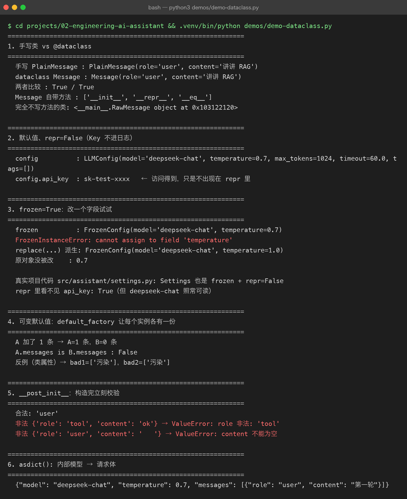

# Project 02 — Chapter 04：Dataclass【数据类】

> **本章 ↔ `src/` 对照**（校对时补：本章练习里的类名与真实代码的对应关系）
>
> 本章 Task 里让你造的三个类，在真实代码里**换了名字**（练习名更直白，真实名更贴合职责）：
>
> | 本章练习 | 真实代码 | 位置 |
> |---|---|---|
> | `LLMConfig` | `Settings` | `src/assistant/settings.py` |
> | `ChatSession` | `Conversation` | `src/assistant/conversation.py` |
> | `Message`（dataclass） | `dict[str, str]` | 沿用 OpenAI 的 messages 契约，未单独建模 |
>
> 两处做得比本章练习更进一步：
> - `Settings` 用 `@dataclass(frozen=True)`，且 `api_key` 设 `Field(repr=False)` —— **打印对象不会泄露 Key**
> - `Conversation` 没有直接暴露 `messages` 字段，而是用 `@property` 返回**副本** —— 外部拿到也改不动内部历史

## 1. 项目问题

上一章我们已经把 AI Assistant 的类型边界逐渐建立起来：

```text
User Input
    ↓
Message
    ↓
TypedDict
    ↓
Assistant
    ↓
LLMClient
    ↓
Async HTTP Client
```

例如：

```python
from typing import TypedDict


class Message(TypedDict):
    role: str
    content: str
```

然后：

```python
messages: list[Message]
```

这已经比裸 `dict` 清晰很多。

但是继续开发 Project 02，很快会遇到新问题。

例如我们的 LLM 配置：

```python
config = {
    "model": "qwen",
    "temperature": 0.7,
    "max_tokens": 1024,
    "timeout": 60,
}
```

调用：

```python
config["model"]
config["temperature"]
config["timeout"]
```

问题来了：

```text
字段很多
↓
全部靠字符串 key
↓
容易拼错
↓
IDE 支持有限
↓
默认值分散
↓
数据和行为越来越混乱
```

例如：

```python
config["tempereture"]
```

拼错一个字母，普通 Python 代码可能直到运行到这里才暴露问题。

所以这一章要解决：

> **如何把具有明确结构的数据组织成真正的数据对象。**

---

# 2. Dataclass 是什么

Python 提供：

```python
from dataclasses import dataclass
```

最基本的形式：

```python
from dataclasses import dataclass


@dataclass
class LLMConfig:
    model: str
    temperature: float
    max_tokens: int
```

然后：

```python
config = LLMConfig(
    model="qwen",
    temperature=0.7,
    max_tokens=1024,
)
```

现在：

```python
config.model
config.temperature
config.max_tokens
```

而不是：

```python
config["model"]
config["temperature"]
config["max_tokens"]
```

---

# 3. 为什么 Dataclass 适合工程项目

一个普通 Python 类可能需要自己写：

```python
class LLMConfig:
    def __init__(
        self,
        model,
        temperature,
        max_tokens,
    ):
        self.model = model
        self.temperature = temperature
        self.max_tokens = max_tokens
```

这其实是在重复写大量样板代码。

`@dataclass` 可以自动帮助你生成常见的数据对象能力。

例如：

```python
@dataclass
class LLMConfig:
    model: str
    temperature: float
    max_tokens: int
```

它会处理很多常见的对象样板逻辑，例如初始化、对象表示、比较等，具体行为由你使用的参数决定。

所以：

> **Dataclass 的核心价值不是“少写几行代码”，而是明确表达：这是一个数据对象。**

---

# 4. TypedDict 和 Dataclass 的区别

这是本章最重要的知识点之一。

## TypedDict

```python
class Message(TypedDict):
    role: str
    content: str
```

实际运行时它仍然是：

```python
dict
```

所以：

```python
message["role"]
```

仍然是核心访问方式。

---

## Dataclass

```python
@dataclass
class Message:
    role: str
    content: str
```

实际创建的是：

```python
Message(...)
```

访问：

```python
message.role
message.content
```

所以可以简单理解：

```text
TypedDict
    ↓
“这个 Dict 应该长什么样”

Dataclass
    ↓
“这个对象应该长什么样”
```

---

# 5. Java 对比

这个地方 Java 开发者会非常容易理解。

Python：

```python
@dataclass
class Message:
    role: str
    content: str
```

可以类比 Java 中的：

```java
public class Message {
    private String role;
    private String content;
}
```

或者更接近：

```java
record Message(
    String role,
    String content
) {}
```

当然，两者并不完全相同。

Python Dataclass 更偏向：

> 快速构建带有结构化字段的数据对象。

Java `record` 则是语言层面的特殊数据载体。

---

# 6. 为什么 Project 02 需要 Dataclass

我们后面会有很多对象：

```text
LLMConfig
Message
LLMRequest
LLMResponse
ToolCall
Document
Chunk
AgentState
```

如果全都使用：

```python
dict
```

最终代码会变成：

```python
data["model"]
data["messages"]
data["usage"]
data["tool_calls"]
data["metadata"]
```

项目规模一大，就会非常难维护。

所以：

```text
裸 dict
↓
TypedDict
↓
Dataclass
```

是一种逐步增强数据表达能力的方式。

注意：

这不是“所有 dict 最后都必须变成 Dataclass”。

而是：

> **根据数据边界和使用方式选择合适的数据结构。**

---

# 7. 第一个工程改造：LLMConfig

我们先把 Project 02 配置抽出来。

```python
from dataclasses import dataclass


@dataclass
class LLMConfig:
    model: str
    base_url: str
    api_key: str
    temperature: float = 0.7
    max_tokens: int = 1024
    timeout: float = 60.0
```

使用：

```python
config = LLMConfig(
    model="qwen",
    base_url="https://example.com/v1/chat/completions",
    api_key="...",
)
```

读取：

```python
print(config.model)
print(config.timeout)
```

这样配置结构已经非常清晰。

---

# 8. Default Value【默认值】

Dataclass 支持：

```python
@dataclass
class LLMConfig:
    model: str
    temperature: float = 0.7
    max_tokens: int = 1024
    timeout: float = 60.0
```

表示：

如果调用：

```python
config = LLMConfig(model="qwen")
```

自动得到：

```text
temperature = 0.7
max_tokens = 1024
timeout = 60.0
```

这比：

```python
config.get("temperature", 0.7)
```

更加明确。

---

# 9. 字段顺序问题

Dataclass 有一个很典型的规则：

有默认值的字段通常要放在无默认值字段之后。

例如：

正确：

```python
@dataclass
class LLMConfig:
    model: str
    temperature: float = 0.7
```

错误思路：

```python
@dataclass
class LLMConfig:
    temperature: float = 0.7
    model: str
```

因为构造函数参数顺序会产生问题。

可以把它记成：

```text
必填字段
↓
可选字段 / 默认字段
```

---

# 10. Frozen Dataclass【不可变数据类】

有些配置对象创建之后不希望随意修改。

可以使用：

```python
@dataclass(frozen=True)
class ModelConfig:
    model: str
    temperature: float
```

然后：

```python
config = ModelConfig(
    model="qwen",
    temperature=0.7,
)
```

尝试：

```python
config.temperature = 1.0
```

会失败。

这适合表达：

> 创建后不应该随意改变的数据对象。

例如：

```text
模型配置
应用常量
不可变参数
```

但不要把 `frozen=True` 理解为“对象内部所有东西都深度不可变”。

它主要限制的是 Dataclass 字段自身的重新赋值。

---

# 11. Field【字段】

Dataclass 还提供：

```python
from dataclasses import dataclass, field
```

例如：

```python
@dataclass
class ChatSession:
    messages: list[str] = field(default_factory=list)
```

为什么不能直接：

```python
messages: list[str] = []
```

因为可变对象默认值容易导致多个实例共享同一个列表对象。

推荐：

```python
field(default_factory=list)
```

---

# 12. 这是一个非常重要的坑

错误：

```python
class A:
    items = []
```

这里多个对象可能共享：

```text
A1.items
A2.items
```

同一个列表。

Dataclass 中应该：

```python
@dataclass
class Session:
    messages: list[str] = field(default_factory=list)
```

这样：

```text
Session A
    ↓
自己的 list

Session B
    ↓
自己的 list
```

联系描述：

`default_factory` 每次创建新对象时都会调用工厂函数，从而给每个实例生成独立的可变默认值。这样不同 Session 不会意外共享同一个 messages 列表。

---

# 13. 建立 Message 数据对象

现在我们尝试把内部业务对象做得更清晰：

```python
from dataclasses import dataclass


@dataclass
class Message:
    role: str
    content: str
```

创建：

```python
message = Message(
    role="user",
    content="什么是 RAG？",
)
```

访问：

```python
message.role
message.content
```

---



# 14. 什么时候用 TypedDict，什么时候用 Dataclass

可以先建立一个工程判断表。

|场景|更适合|
|---|---|
|外部 JSON / 字典结构|TypedDict|
|API Response 字典|TypedDict|
|内部业务对象|Dataclass|
|配置对象|Dataclass|
|需要对象行为|Dataclass|
|需要与 JSON 直接映射|TypedDict / Pydantic 等|
|需要明确字段 + 默认值|Dataclass|
|需要不可变配置|Frozen Dataclass|

但这不是绝对规则。

后面进入 FastAPI 时，还会接触：

**Pydantic【数据校验与模型库】**

届时你会看到：

```text
TypedDict
Dataclass
Pydantic Model
```

三者的职责进一步区分。

---

# 15. Dataclass 可以拥有方法

它不只是数据容器。

例如：

```python
@dataclass
class ChatMessage:
    role: str
    content: str

    def is_user_message(self) -> bool:
        return self.role == "user"
```

现在：

```python
message.is_user_message()
```

这就是：

> **数据 + 与数据直接相关的行为**

---

# 16. 但不要把所有业务逻辑塞进 Dataclass

例如不要：

```python
@dataclass
class ChatMessage:

    def call_llm(self):
        ...

    def save_database(self):
        ...

    def send_email(self):
        ...
```

这会让一个对象承担太多职责。

应该继续保持：

```text
Message
    ↓
表示消息

AssistantService
    ↓
处理 AI 业务

LLMClient
    ↓
调用模型

Storage
    ↓
持久化
```

这就是：

**Separation of Concerns【关注点分离】**

---

# 17. Project 02 开始形成真正的分层

现在逐渐形成：

```text
Application Layer【应用层】
        ↓
Service Layer【服务层】
        ↓
Domain / Data Model【领域 / 数据模型】
        ↓
Infrastructure Layer【基础设施层】
        ↓
HTTP / External API
```

对于当前项目，可以简化成：

```text
main.py
   ↓
assistant.py
   ↓
Message / LLMConfig
   ↓
llm_client.py
   ↓
httpx.AsyncClient
   ↓
LLM API
```

联系描述：

用户请求进入应用层，应用层调用 Assistant Service；Service 使用明确的数据对象表达消息和配置，再通过 LLM Client 访问外部模型。这样数据结构和网络通信职责被分开，后续替换模型供应商时，上层代码不需要理解 HTTP 细节。

---

# 18. Dataclass 的自动能力

例如：

```python
@dataclass
class Message:
    role: str
    content: str
```

创建：

```python
message = Message("user", "你好")
```

通常可以获得比较方便的：

```text
初始化
对象表示
字段比较
```

例如：

```python
print(message)
```

会得到类似：

```text
Message(role='user', content='你好')
```

这在调试时非常方便。

---

# 19. `__repr__` 与调试

普通类如果没有定义：

```python
__repr__
```

打印对象可能只看到：

```text
<__main__.Message object at ...>
```

而 Dataclass 默认生成更有信息量的对象表示。

这对：

```text
Debugging【调试】
Logging【日志】
Testing【测试】
```

特别有帮助。

---

# 20. 转换成 Dictionary

有时候我们还需要把 Dataclass 变成字典。

可以：

```python
from dataclasses import asdict

message_dict = asdict(message)
```

得到：

```python
{
    "role": "user",
    "content": "你好"
}
```

所以：

```text
Dataclass
   ↓
asdict()
   ↓
dict
   ↓
JSON
```

这对 AI API 调用非常有用。

---

# 21. 一个重要边界

不要认为：

```python
asdict()
```

就等于一个完整的 API serialization【序列化】框架。

真实项目中：

```text
Dataclass
↓
dict
↓
JSON
```

还可能涉及：

```text
日期
枚举
嵌套对象
特殊类型
第三方 API Schema
```

后面会逐步遇到更专业的：

**Pydantic【数据校验与数据模型】**

---

# 22. Project 02 重构示例

推荐形成：

```text
src/
└── ai_assistant/
    ├── main.py
    ├── assistant.py
    ├── api_client.py
    ├── models.py
    └── config.py
```

其中：

### models.py

```python
from dataclasses import dataclass


@dataclass
class Message:
    role: str
    content: str


@dataclass(frozen=True)
class LLMConfig:
    model: str
    base_url: str
    api_key: str
    temperature: float = 0.7
    max_tokens: int = 1024
    timeout: float = 60.0
```

---

# 23. assistant.py

```python
from .models import Message
from .api_client import LLMClient


class Assistant:
    def __init__(self, llm_client: LLMClient):
        self.llm_client = llm_client

    async def generate_response(
        self,
        messages: list[Message],
    ) -> Message:

        response = await self.llm_client.chat(messages)

        return Message(
            role="assistant",
            content=response,
        )
```

这里重点观察：

以前可能是：

```text
dict
↓
dict
↓
dict
```

现在：

```text
Message
↓
LLMClient
↓
Message
```

整个业务层的数据流开始变得明确。

---

# 24. API Client 如何使用 Dataclass

例如：

```python
from dataclasses import asdict

from .models import Message


class LLMClient:

    async def chat(
        self,
        messages: list[Message],
    ) -> str:

        payload = {
            "messages": [
                asdict(message)
                for message in messages
            ]
        }

        ...
```

于是：

```text
内部业务模型
Message
    ↓
asdict()
    ↓
dict
    ↓
JSON
    ↓
HTTP
```

这就是：

**Internal Model【内部模型】 → External Schema【外部接口结构】**

---

# 25. 为什么这个边界很重要

以后不同模型供应商可能要求：

```text
Provider A
role + content

Provider B
role + content + extra_fields

Provider C
特殊请求格式
```

如果业务层到处直接操作：

```python
dict
```

供应商差异就会污染整个系统。

更好的方式：

```text
Internal Message
        ↓
Adapter / Client
        ↓
Provider Request
```

联系描述：

应用内部只维护自己的稳定数据模型；当请求离开应用进入第三方 API 时，由 Client 或 Adapter 将内部模型转换成具体供应商所要求的格式。这样外部 API 发生变化时，影响主要集中在边界层。

---

# 26. Java 对比这一整套设计

你可以把它映射成比较熟悉的 Java 思维：

```text
Python Dataclass
        ≈
Java DTO / record

Python Type Hint
        ≈
Java 类型声明

Python Protocol
        ≈
Java interface

Python AsyncClient
        ≈
Java WebClient / Async HTTP Client

Python TypedDict
        ≈
带明确结构约束的 Map / JSON DTO
```

但不要机械认为它们是一一对应。

最重要的是理解：

> **类型、数据模型、接口抽象、基础设施之间应该分离。**

---

# 27. 本章知识地图

```text
Type Hint
    ↓
TypedDict
    ↓
发现“裸 dict”仍然不够表达业务
    ↓
Dataclass
    ├── 字段
    ├── 类型
    ├── 默认值
    ├── frozen
    ├── default_factory
    └── 方法
    ↓
Internal Model
    ↓
Adapter / Client
    ↓
External API Schema
```

联系描述：

上一章 Type Hint 解决的是“数据类型如何表达”；这一章 Dataclass 进一步解决“业务数据如何组织成对象”。内部使用 Dataclass 建立稳定模型，跨越应用边界时再转换为供应商要求的 JSON/API Schema。这样 Project 02 开始真正具备清晰的数据边界。

---

# 28. 实战任务

## Task 1：创建 models.py

建立：

```python
@dataclass
class Message:
    role: str
    content: str
```

---

## Task 2：创建 LLMConfig

要求：

```python
@dataclass(frozen=True)
class LLMConfig:
    model: str
    base_url: str
    api_key: str
    temperature: float = 0.7
    max_tokens: int = 1024
    timeout: float = 60.0
```

---

## Task 3：Session

创建：

```python
@dataclass
class ChatSession:
    messages: list[Message] = field(default_factory=list)
```

测试两个 Session：

```text
Session A
Session B
```

确认它们的 messages 不会共享。

---

## Task 4：API 转换

实现：

```text
Message
↓
asdict()
↓
dict
↓
JSON
```

观察最终 HTTP Payload。

---

# 29. 实战挑战

创建：

```python
@dataclass
class LLMResponse:
    content: str
    model: str
    input_tokens: int
    output_tokens: int
```

然后模拟：

```python
response = LLMResponse(
    content="你好",
    model="qwen",
    input_tokens=20,
    output_tokens=10,
)
```

要求：

1. 可以打印对象。
    
2. 可以访问 `response.content`。
    
3. 可以转换成字典。
    
4. 给字段添加正确类型。
    
5. 尝试设计一个 `total_tokens` 计算方法。
    

例如：

```python
@property
def total_tokens(self) -> int:
    ...
```

这里可以开始理解：

**Property【属性】**

---

# 30. 主动回忆

不要看正文，先回答：

### Q1

Dataclass 解决什么问题？

### Q2

TypedDict 和 Dataclass 的核心区别是什么？

### Q3

为什么配置对象很适合使用 Dataclass？

### Q4

`default_factory=list` 为什么重要？

### Q5

`frozen=True` 有什么用途？

### Q6

Dataclass 能不能包含方法？

### Q7

为什么不应该把所有业务逻辑全部放进 Dataclass？

### Q8

为什么内部 Dataclass 不应该直接等同于第三方 API Schema？

### Q9

`asdict()` 在当前项目中有什么作用？

### Q10

Java 中你会用什么东西类比 Python Dataclass？

---

# 31. 面试标准话术

### 问：Python Dataclass 是什么？

> Dataclass 是 Python 标准库提供的一种数据类机制，用于简化具有结构化字段的数据对象定义。通过类型注解和 `@dataclass`，可以减少初始化方法、对象表示等样板代码，同时让数据结构更加明确。它很适合配置、DTO、内部业务模型等场景。

### 问：TypedDict 和 Dataclass 有什么区别？

> TypedDict 主要描述字典的预期结构，运行时本质上仍然是字典；Dataclass 则定义真正的 Python 对象，通过属性访问字段。对于外部 JSON 或字典结构，TypedDict 比较自然；对于内部稳定的业务数据对象和配置对象，Dataclass 通常更合适。

### 问：为什么 AI 项目需要数据模型？

> AI 应用的数据结构非常多，例如 Message、LLM Request、LLM Response、Tool Call、Agent State 等。如果全部使用裸字典，随着项目复杂度提高，很容易出现字段拼写错误和结构理解混乱。使用 TypedDict、Dataclass 等数据模型可以明确边界，提高可读性、IDE 支持和静态检查能力，也方便与外部 API 做转换。

---

# 32. 常见坑

## 坑 1：把 Dataclass 当数据库实体

Dataclass 只是 Python 数据对象工具。

它不自动意味着：

```text
数据库表
ORM Entity
Persistence Model
```

不要混淆。

---

## 坑 2：默认列表直接写 `[]`

不要：

```python
@dataclass
class Session:
    messages: list[Message] = []
```

使用：

```python
messages: list[Message] = field(default_factory=list)
```

---

## 坑 3：所有 dict 都转换成 Dataclass

没有必要。

例如：

```text
一次性的临时 JSON
第三方动态 metadata
不稳定结构
```

仍然可能继续使用字典。

---

## 坑 4：Dataclass 承担太多职责

不要让：

```text
Message
```

负责：

```text
HTTP
LLM
Database
File
Agent
```

保持：

```text
数据对象
≠
业务服务
≠
基础设施
```

---

# 33. Project 02 当前架构

现在已经形成：

```text
                   Application
                       │
                       ▼
                  Assistant
                       │
            ┌──────────┴──────────┐
            ▼                     ▼
       Message                LLMConfig
       Dataclass               Dataclass
            │                     │
            └──────────┬──────────┘
                       ▼
                    LLMClient
                       │
                       ▼
               Async HTTP Client
                       │
                       ▼
                    LLM API
```

联系描述：

`Assistant` 负责 AI 应用逻辑；`Message` 和 `LLMConfig` 负责稳定表达业务数据；`LLMClient` 负责把内部数据转换成外部 API 请求；异步 HTTP 客户端负责实际网络通信。这样项目开始形成“业务逻辑 → 数据模型 → 基础设施 → 外部系统”的基本工程边界。

---

# 34. Project 02 当前进度

```text
Project 02 — Engineering AI Assistant

Chapter 01
Async / Await
✅

Chapter 02
Async HTTP Client
✅

Chapter 03
Type Hints
✅

Chapter 04
Dataclass
✅

Chapter 05
Config / Environment
⬜

Chapter 06
Logging
⬜

Chapter 07
Testing / Debugging
⬜

Chapter 08
Packaging
⬜

Chapter 09
FastAPI
⬜
```

现在项目已经从：

```text
Python Script
```

逐步变成：

```text
Async Application
        ↓
Async HTTP Client
        ↓
Typed Data Model
        ↓
Structured Application
```

---

# 35. 本章完成标准

```text
[ ] 理解 Dataclass【数据类】
[ ] 理解 TypedDict vs Dataclass
[ ] 会使用 @dataclass
[ ] 会使用默认值
[ ] 理解 default_factory
[ ] 理解 frozen=True
[ ] 能定义 Message Dataclass
[ ] 能定义 LLMConfig Dataclass
[ ] 能定义 LLMResponse Dataclass
[ ] 能使用 asdict()
[ ] 理解内部模型 vs 外部 API Schema
[ ] 理解数据对象与业务服务的职责边界
[ ] 能解释 Dataclass 的 Java 对应思维
```

---

# 36. 下一章

下一步进入：

# Chapter 05 — Config / Environment【配置 / 环境变量】

这一章会把目前的：

```text
LLMConfig
API Key
Base URL
Model
Timeout
Temperature
```

继续工程化。

最终形成：

```text
代码
  ↓
配置对象
  ↓
环境变量
  ↓
.env / 系统环境
  ↓
不同运行环境
```

同时真正解决一个企业开发中非常重要的问题：

> **配置与代码分离，以及 Secret【密钥】如何安全管理。**