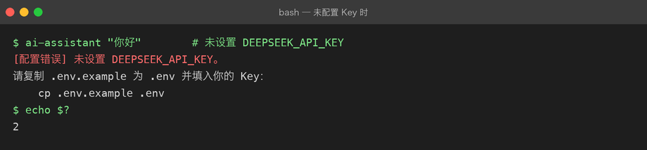

# Project 02 — Chapter 05：Config / Environment【配置与环境】

> 状态：✅ 已校对
> 对应代码：`src/assistant/settings.py`

---

## 1. 项目要增加什么能力

Project 01 的配置是这么读的（散落在 `config.py` 里）：

```python
api_key = os.getenv("DEEPSEEK_API_KEY")
model = os.getenv("DEEPSEEK_MODEL", "deepseek-chat")
timeout = int(os.getenv("DEEPSEEK_TIMEOUT", "30"))
```

能跑，但有三个毛病：

```text
毛病 1：配置散落在代码各处，想知道「这个项目要配什么」只能全文搜索
毛病 2：没有类型 —— timeout 是 str 还是 int 全靠调用处自己转
毛病 3：没法测试 —— 想测「超时配置生效」只能真的去改环境变量
```

本章目标：

> **把所有配置收敛到一个不可变的 `Settings` 对象，集中声明、带类型、可校验、可注入。**

---

## 2. 为什么需要这个知识

配置管理的业界共识是 [The Twelve-Factor App](https://12factor.net/config) 的第三条：

> **配置存储在环境中。**

理由很实在：

```text
1. 密钥不能进代码库（否则 push 到 GitHub 就等于泄露）
2. 开发 / 测试 / 生产用不同的值，但代码是同一份
3. 容器化部署时，环境变量是唯一通用的注入方式
```

Python 项目里最常见的做法是 `.env` 文件 + 环境变量 + 一个集中式配置对象。

---

## 3. 核心概念

### 3.1 配置的三层来源（优先级从低到高）

```text
代码里的默认值        ← 最低：保证「什么都不配也能跑」
    ↓ 被覆盖
.env 文件             ← 本地开发用，不进 git
    ↓ 被覆盖
真实环境变量          ← 最高：CI / 生产环境注入
```

为什么要这个顺序？因为**生产环境的环境变量必须能压过 `.env`**——否则你本地的 `.env` 会把线上的配置顶掉。

### 3.2 `.env` 文件

```bash
# .env（放在项目根目录，必须在 .gitignore 里）
DEEPSEEK_API_KEY=sk-xxxxxxxx
DEEPSEEK_BASE_URL=https://api.deepseek.com
DEEPSEEK_MODEL=deepseek-chat
DEEPSEEK_TIMEOUT=30
LOG_LEVEL=INFO
```

配套一个 `.env.example`（**这个要进 git**），只写键不写值：

```bash
DEEPSEEK_API_KEY=
DEEPSEEK_BASE_URL=https://api.deepseek.com
DEEPSEEK_MODEL=deepseek-chat
```

新人 clone 下来 `cp .env.example .env` 就知道要填什么。

### 3.3 读取：python-dotenv vs 标准库

| 方案 | 依赖 | 说明 |
|------|------|------|
| `python-dotenv` | 第三方 | `load_dotenv()` 一行搞定，最流行 |
| 手写解析 | 无 | 20 行代码，零依赖（本项目风格） |

Project 01 坚持零依赖，Project 02 已经要装 `httpx` / `fastapi` 了，用 `python-dotenv` 完全合理。但**理解它做了什么**更重要：

```python
# python-dotenv 的核心逻辑，简化后就是这样
def load_dotenv(path: str = ".env") -> None:
    with open(path) as f:
        for line in f:
            line = line.strip()
            if not line or line.startswith("#") or "=" not in line:
                continue
            key, _, value = line.partition("=")
            os.environ.setdefault(key.strip(), value.strip())
            #                    ↑ 关键：setdefault 保证「不覆盖已有环境变量」
```

**`setdefault` 是灵魂**：它实现了 3.1 里「真实环境变量优先」的规则。

### 3.4 配置对象：frozen dataclass

```python
from dataclasses import dataclass, field
import os

@dataclass(frozen=True)          # frozen = 不可变，防止运行时被改
class Settings:
    api_key: str
    base_url: str = "https://api.deepseek.com"
    model: str = "deepseek-chat"
    timeout: float = 30.0
    max_retries: int = 3
    log_level: str = "INFO"

    @classmethod
    def from_env(cls, dotenv_path: str = ".env") -> "Settings":
        if os.path.exists(dotenv_path):
            load_dotenv(dotenv_path)
        api_key = os.getenv("DEEPSEEK_API_KEY", "").strip()
        if not api_key:
            raise LLMConfigError(
                "未设置 DEEPSEEK_API_KEY。\n"
                "请复制 .env.example 为 .env 并填入你的 Key。"
            )
        return cls(
            api_key=api_key,
            base_url=os.getenv("DEEPSEEK_BASE_URL", cls.base_url),
            model=os.getenv("DEEPSEEK_MODEL", cls.model),
            timeout=float(os.getenv("DEEPSEEK_TIMEOUT", str(cls.timeout))),
            max_retries=int(os.getenv("DEEPSEEK_MAX_RETRIES", str(cls.max_retries))),
            log_level=os.getenv("LOG_LEVEL", cls.log_level),
        )
```

为什么用 `frozen=True`：

```text
配置应该是「启动时读一次，之后只读」
如果任何地方都能 settings.timeout = 5，出问题时你根本不知道是谁改的
```

### 3.5 依赖注入而非全局单例

❌ 反模式（到处 import 一个全局对象）：

```python
# settings.py
settings = Settings.from_env()      # 模块级全局

# client.py
from assistant.settings import settings   # 测试时没法替换！
```

✅ 正确做法（构造时传进去）：

```python
def build_client(settings: Settings) -> BaseLLMClient:
    return DeepSeekClient(settings)

# 测试时
def test_client():
    settings = Settings(api_key="test", base_url="http://localhost")  # 随便造
    client = build_client(settings)
```

**这就是依赖注入的全部**：不自己造，让别人传进来。测试时传假的。

---

## 4. 项目代码

```text
src/assistant/settings.py    # Settings（frozen dataclass）+ from_env()
.env.example                 # 进 git，键清单
.env                         # 不进 git，真实值
.gitignore                   # 必须有 .env
```

使用方式：

```python
from assistant.settings import Settings

settings = Settings.from_env()          # 启动时读一次
client = DeepSeekClient(settings)       # 注入进去
service = AssistantService(client)      # 再往上注入
```

---

## 5. Java ↔ Python 对比

| Java / Spring | Python | 说明 |
|---------------|--------|------|
| `application.yml` | `.env` / `settings.py` | Spring 的 yml 支持嵌套，`.env` 只有扁平 KV |
| `@ConfigurationProperties` | `dataclass Settings` | 都是「把配置绑成对象」 |
| `@Value("${x}")` | `os.getenv("X")` | 同 |
| `System.getenv()` | `os.environ` | 同 |
| Spring Profile | 环境变量切换 | Python 没有内置 profile 概念 |
| `final` 字段 | `@dataclass(frozen=True)` | 不可变 |
| `application-dev.yml` | `.env.local` 等约定 | 靠自己约定 |

最大的思维差异：

> **Spring 有 IoC 容器帮你注入，Python 没有 —— 你得自己把对象一层层传下去。**
> 到 Chapter 09 讲 FastAPI 的 `Depends` 时，会看到 Python 版本的「轻量 IoC」。

---

## 6. 常见坑

### 坑 1：把 `.env` 提交进 git

```bash
git add .env     # ❌ 密钥泄露
```

`.gitignore` 里必须有：

```text
.env
.env.*
!.env.example
```

补救：如果已经提交过，**立刻去厂商后台吊销那个 Key** —— 从 git 历史里删文件是没用的，GitHub 上的 fork 和爬虫早就抓走了。

### 坑 2：忘记类型转换

```python
timeout = os.getenv("DEEPSEEK_TIMEOUT", 30)   # ❌ 环境变量是 str！
requests.post(..., timeout=timeout)           # 可能拿到 "30"
```

`os.getenv` 的默认值和读到的值**类型不一致**：默认值你写的是 `int 30`，读出来是 `str "30"`。统一转：

```python
timeout = float(os.getenv("DEEPSEEK_TIMEOUT", "30"))
```

### 坑 3：`load_dotenv()` 覆盖线上配置

自己写解析时用了 `os.environ[key] = value` 而不是 `setdefault`，本地 `.env` 会顶掉生产环境变量。用 `python-dotenv` 默认行为是对的（不覆盖），手写时务必注意。

### 坑 4：在模块顶层就读配置

```python
# settings.py
settings = Settings.from_env()   # import 时就读，Key 没配就崩
```

后果：**连 `pytest --collect-only` 都会失败**，因为一 import 就炸。

正确做法：暴露 `from_env()` 函数，由入口（`main.py` / `app.py`）在启动那一刻调用。

### 坑 5：把 Key 打进日志

```python
logger.info(f"使用配置: {settings}")   # ❌ frozen dataclass 的 repr 会打印 api_key
```

用 `field(repr=False)` 隐藏敏感字段：

```python
@dataclass(frozen=True)
class Settings:
    api_key: str = field(repr=False)   # repr 时显示为 <hidden> 或省略
```

---

## 7. 实战挑战

**挑战 1**：手写 `load_dotenv()`（20 行，见 3.3），并写测试验证「环境变量已存在时不被 `.env` 覆盖」。

**挑战 2**：给 `Settings` 加一个 `validate()`，校验 `base_url` 必须以 `http` 开头、`timeout > 0`，不满足就抛 `LLMConfigError`。

**挑战 3（进阶）**：支持 `.env.local` 优先于 `.env`（常见的多环境约定），并保持「真实环境变量最优先」。

---

## 8. 主动回忆

1. 配置的三层优先级是什么？为什么真实环境变量要在最上层？
2. 为什么 `.env` 不能进 git，而 `.env.example` 必须进？
3. `load_dotenv` 用 `setdefault` 而不是直接赋值，是为了什么？
4. `frozen=True` 解决了什么问题？
5. 为什么不建议在模块顶层就执行 `Settings.from_env()`？
6. 怎么避免 `repr(settings)` 把 API Key 打进日志？

---

## 9. 本节完成标准

- [ ] `.gitignore` 含 `.env`，仓库里有 `.env.example`
- [ ] 实现 `Settings`（frozen dataclass）+ `from_env()`
- [ ] 所有配置项集中在一处，代码中不再散落 `os.getenv`
- [ ] 敏感字段用 `field(repr=False)` 隐藏
- [ ] 测试里能造一个假 `Settings` 注入进 client，不需要真实 Key

实际效果——没配 Key 时得到的是友好提示而不是 traceback：



下一章：[06-logging.md](06-logging.md) —— 让程序会「说话」。
