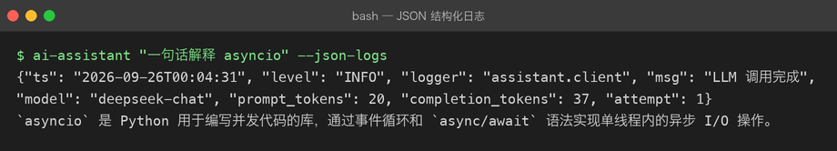

# Project 02 — Chapter 06：Logging【日志】

> 状态：✅ 已校对
> 对应代码：`src/assistant/logging_setup.py`

---

## 1. 项目要增加什么能力

Project 01 出问题时的排查方式：

```python
print("准备请求...")        # 临时加
print("响应:", resp)        # 看完忘删，进了 git
print("!!!! 到这里了")       # 经典
```

`print` 的四个致命缺陷：

```text
1. 没有级别 —— 分不清「正常信息」和「出错了」
2. 没有时间戳 —— 不知道什么时候发生的
3. 没有来源 —— 不知道是哪行代码打的
4. 关不掉 —— 上线后只能去删代码
```

本章目标：

> **用 `logging` 替换所有 `print`，做到「分级、可定位、可关闭、可结构化」。**

---

## 2. 为什么需要这个知识

AI 应用尤其需要日志，因为它的失败是**半透明**的：

```text
HTTP 200 但内容为空     → 只有日志能记录原始响应
模型返回了截断的内容     → 需要记录 token 消耗
偶发超时               → 没有时间戳根本无法复盘
多轮对话状态错乱        → 需要记录每轮的 messages
```

更现实的一点：**LLM 调用花的是真金白银**。没有日志，你连「这个月为什么账单翻倍」都答不上来。

---

## 3. 核心概念

### 3.1 五个级别（从轻到重）

| 级别 | 用途 | 生产环境默认 |
|------|------|-------------|
| `DEBUG` | 调试细节：完整请求体、headers | 关闭 |
| `INFO` | 正常流程：启动了、收到请求、调用完成 | 开启 |
| `WARNING` | 有点不对但还能跑：重试成功、降级了 | 开启 |
| `ERROR` | 某个操作失败：这次调用挂了 | 开启 |
| `CRITICAL` | 系统级崩溃：配置缺失、端口被占 | 开启 |

判断口诀：

> **会不会有人需要为这件事半夜起床？** 会 → ERROR；不会但要留痕 → INFO/WARNING。

### 3.2 三个核心组件

```text
Logger    —— 你要用的那个东西（logger.info("...")）
Handler   —— 日志往哪去（控制台 / 文件 / 网络）
Formatter —— 长什么样（时间、级别、模块名、消息）
```

关系图：

```text
logger.info("msg")
    ↓
Logger（判断级别是否够）
    ↓
Handler（决定输出到哪）
    ↓
Formatter（拼成最终字符串）
    ↓
stdout / 文件
```

### 3.3 每个模块一个 logger

```python
# assistant/client.py
import logging
logger = logging.getLogger(__name__)     # __name__ == "assistant.client"
```

用 `__name__` 的好处：日志里会显示 `assistant.client`，一眼看出是哪个模块打的。

```text
2026-09-25 23:41:02 INFO     assistant.client      调用 LLM: model=deepseek-chat
2026-09-25 23:41:05 WARNING  assistant.client      触发限流，2s 后重试（第 1 次）
2026-09-25 23:41:07 INFO     assistant.service     回答生成完毕，耗时 4.8s
```

### 3.4 只在入口配置 handler

**库代码（client.py / service.py）绝不配置 handler**，只管 `logger.info(...)`。

配置只在程序入口做一次：

```python
# src/assistant/logging_setup.py
import logging
import sys

def setup_logging(level: str = "INFO", json_format: bool = False) -> None:
    handler = logging.StreamHandler(sys.stdout)
    if json_format:
        handler.setFormatter(JsonFormatter())
    else:
        handler.setFormatter(logging.Formatter(
            fmt="%(asctime)s %(levelname)-8s %(name)s  %(message)s",
            datefmt="%Y-%m-%d %H:%M:%S",
        ))
    root = logging.getLogger()
    root.handlers.clear()          # 防止重复输出
    root.addHandler(handler)
    root.setLevel(level)

# main.py
def main():
    settings = Settings.from_env()
    setup_logging(settings.log_level)
    ...
```

为什么「库不配 handler」：库是被别人 import 的，你配了 handler 会**污染使用者的日志输出**。

### 3.5 结构化日志

人类看的日志：

```text
INFO 调用 LLM 完成，耗时 4.8s
```

机器看的日志（生产环境用）：

```json
{"ts":"2026-09-25T23:41:07","level":"INFO","logger":"assistant.client","model":"deepseek-chat","latency_ms":4800,"prompt_tokens":128}
```

为什么需要 JSON：日志会被收集到 ELK / Loki / 云厂商日志服务里，JSON 才能被检索和聚合（比如「统计 p99 延迟」）。

最小实现：

```python
import json
import logging

class JsonFormatter(logging.Formatter):
    def format(self, record: logging.LogRecord) -> str:
        payload = {
            "ts": self.formatTime(record, "%Y-%m-%dT%H:%M:%S"),
            "level": record.levelname,
            "logger": record.name,
            "msg": record.getMessage(),
        }
        if record.exc_info:
            payload["exc"] = self.formatException(record.exc_info)
        extra = getattr(record, "extra_fields", None)
        if extra:
            payload.update(extra)
        return json.dumps(payload, ensure_ascii=False)
```

带上下文地打日志：

```python
logger.info("LLM 调用完成", extra={"extra_fields": {"latency_ms": 4800, "model": "deepseek-chat"}})
```

### 3.6 异常要记堆栈

```python
try:
    answer = await client.chat(messages)
except LLMError:
    logger.exception("LLM 调用失败")     # ✅ 自动带上完整堆栈
    raise
```

`logger.exception(...)` 等价于 `logger.error(..., exc_info=True)`，但**只能在 except 块里用**。

---

## 4. 项目代码

```text
src/assistant/
├── logging_setup.py   # setup_logging() + JsonFormatter（唯一配置点）
├── client.py          # logger = getLogger(__name__)，只打不配
└── service.py         # 同上
```

打点位置（这些是真的有用）：

```text
启动      INFO  配置加载完成：model=xxx, base_url=xxx（不含 key）
每次调用   INFO  请求开始：model, prompt_tokens
         INFO  请求完成：latency_ms, completion_tokens
重试      WARNING 触发限流/超时，第 N 次重试
失败      ERROR 调用失败：错误类型、HTTP 状态、请求 ID
```

---

## 5. Java ↔ Python 对比

| Java (SLF4J + Logback) | Python (logging) | 说明 |
|------------------------|------------------|------|
| `LoggerFactory.getLogger(X.class)` | `logging.getLogger(__name__)` | 同 |
| `log.info("a={}", a)` | `logger.info("a=%s", a)` | **都是懒格式化**，别用 f-string |
| `log.error("msg", e)` | `logger.exception("msg")` | 同 |
| `logback.xml` | `logging.basicConfig()` / `dictConfig` | Python 也支持 dictConfig |
| MDC（诊断上下文） | `extra={"extra_fields": {...}}` | Python 没有线程级 MDC 的官方方案 |
| `@Slf4j` (Lombok) | 模块级 `logger = ...` | 同 |
| Appender | Handler | 同 |

一个容易踩的细节：**SLF4J 的 `{}` 在 Python 里是 `%s`**，别写串了。

---

## 6. 常见坑

### 坑 1：用 f-string 打日志

```python
logger.info(f"调用 {model} 耗时 {cost:.2f}s")      # ❌
logger.info("调用 %s 耗时 %.2fs", model, cost)     # ✅
```

区别：f-string **无论日志级别是否开启都会先拼接字符串**。上千次调用时这是实打实的开销，而且 `%s` 版本能让日志聚合系统把「同一模板的日志」归为一类。

### 坑 2：重复输出（每条日志打两遍）

原因：`basicConfig()` 被调用了多次，或者既有 root handler 又加了新的。

解决：加 handler 前 `root.handlers.clear()`。

### 坑 3：在库里 `basicConfig()`

```python
# client.py 里写这个 = 污染调用方
logging.basicConfig(level=logging.INFO)
```

库只 `getLogger(__name__)`，配置交给入口。

### 坑 4：日志里泄露 Key

```python
logger.debug("请求头: %s", headers)    # headers 里有 Authorization: Bearer sk-xxx
```

打日志前脱敏：

```python
safe = {k: ("***" if k.lower() == "authorization" else v) for k, v in headers.items()}
logger.debug("请求头: %s", safe)
```

### 坑 5：用 `print` 调试后忘了删

CI 里加一条检查（本项目 `.github/workflows/ci.yml` 可以扩展）：

```bash
grep -rn "print(" src/ && echo "src/ 里不应该有 print" && exit 1
```

### 坑 6：`logger.exception` 放在 except 外面

```python
except LLMError:
    pass
logger.exception("失败")    # ❌ 没有异常上下文，堆栈是 None
```

---

## 7. 实战挑战

**挑战 1**：实现 `JsonFormatter`，并让 `LOG_FORMAT=json` 环境变量切换人类可读 / JSON 两种格式。

**挑战 2**：给每次 LLM 调用加一个 `request_id`（`uuid4().hex[:8]`），并让它出现在该次调用的所有日志里。

**挑战 3（进阶）**：写一个 `@log_call` 装饰器，自动记录任意函数的入参（脱敏）、耗时、异常，不用在每个函数里手写 logger。

---

## 8. 主动回忆

1. 五个日志级别分别用在什么场景？
2. Logger / Handler / Formatter 各自负责什么？
3. 为什么库代码不应该配置 handler？
4. 为什么 `logger.info("a=%s", a)` 比 f-string 好？
5. 生产环境为什么要 JSON 日志？
6. `logger.exception` 和 `logger.error` 有什么区别？

---

## 9. 本节完成标准

- [ ] `src/` 下没有任何 `print(`，全部改为 `logger.*`
- [ ] 每个模块用 `logging.getLogger(__name__)`
- [ ] `setup_logging()` 只在入口调用一次，且可切换 JSON 格式
- [ ] 敏感信息（API Key / Authorization 头）已脱敏
- [ ] 关键路径有耗时打点，能从日志算出一次调用的延迟

实际效果——`LOG_FORMAT=json` 切换后，一次调用带出 model / prompt_tokens / completion_tokens：



下一章：[07-testing-and-debugging.md](07-testing-and-debugging.md) —— 让改动不再心慌。
