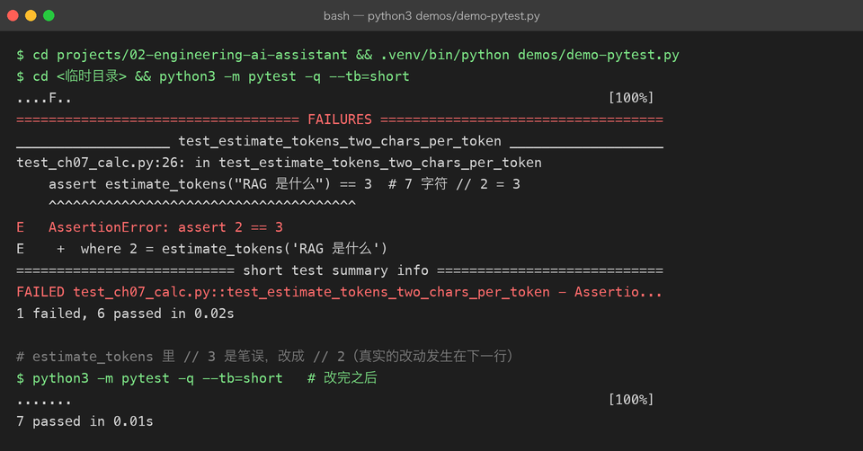

# Project 02 — Chapter 07：Testing / Debugging【测试与调试】

> 状态：✅ 已校对
> 对应代码：`tests/`

---

## 1. 项目要增加什么能力

Project 01 有 6 个 `unittest`，但只覆盖了「纯函数」：

```python
def test_build_messages(self): ...
def test_parse_answer(self): ...
```

真正有风险的地方**一行没测**：

```text
风险 1：网络请求（超时、限流、401）—— 因为它真的要联网
风险 2：多轮对话历史是否正确累积
风险 3：重试逻辑到底重试了几次
风险 4：换一个 client 实现，上层还能不能跑
```

为什么没测？因为代码**写成了没法测的样子**——`LLMClient.ask()` 里直接 `urllib.request.urlopen`，业务逻辑和网络调用焊死了。

本章目标：

> **用依赖注入 + Fake 对象，在不联网、不花一分钱的前提下，把上面四个风险全部测掉。**

---

## 2. 为什么需要这个知识

对 AI 应用来说，测试不只是「防 bug」，还有三个更现实的理由：

```text
1. 省钱 —— 每次跑测试都真调 API，一个月几百块打不住
2. 快   —— 真实调用 3-10 秒，Fake 是 0.001 秒；测试慢就没人跑
3. 确定性 —— 模型输出不固定，真调的测试会「偶发失败」，这种测试等于没有
```

结论：**AI 应用的测试必须能在完全离线的情况下验证业务逻辑。**

这恰好是 Chapter 00 分层设计的回报——因为 `AssistantService` 只依赖 `BaseLLMClient` 抽象，我们就能塞一个假的进去。

---

## 3. 核心概念

### 3.1 pytest 基础

```python
# tests/test_conversation.py
from assistant.conversation import Conversation

def test_add_user_appends_message():
    conv = Conversation(system_prompt="你是助手")
    conv.add_user("你好")
    assert conv.messages == [
        {"role": "system", "content": "你是助手"},
        {"role": "user", "content": "你好"},
    ]
```

和 Java 的对比：

```java
@Test
void addUserAppendsMessage() {
    Conversation conv = new Conversation("你是助手");
    conv.addUser("你好");
    assertEquals(List.of(...), conv.getMessages());
}
```

关键差异：

> **pytest 用的是 Python 原生的 `assert`，不是 `assertEquals`。**
> 失败时 pytest 会展开表达式的每一步值，比 JUnit 的断言信息详细得多。

### 3.2 fixture：可复用的测试脚手架

```python
import pytest

@pytest.fixture
def settings():
    return Settings(api_key="test-key", base_url="http://localhost", model="test-model")

@pytest.fixture
def fake_client():
    return FakeClient(reply="固定回答")

def test_service_ask(fake_client):        # 参数名 = fixture 名
    service = AssistantService(fake_client)
    assert service.ask_sync("问题") == "固定回答"
```

对应 JUnit 的 `@BeforeEach`，但更灵活：fixture 可以**互相依赖**、有作用域（`function` / `module` / `session`）。

### 3.3 Fake vs Mock

| | 做法 | 适用场景 |
|---|---|---|
| **Fake** | 写一个真的能用的简化实现（如 `FakeClient` 返回固定字符串） | 本项目首选 |
| **Mock** | 用 `unittest.mock` 造一个「记录调用、返回预设值」的替身 | 需要验证「有没有被调用、调了几次」 |

Fake 示例（推荐，因为直观且可复用）：

```python
class FakeClient(BaseLLMClient):
    def __init__(self, reply: str = "假回答", fail_times: int = 0) -> None:
        self.reply = reply
        self.fail_times = fail_times
        self.calls: list[list[dict[str, str]]] = []    # 记录每次收到的 messages

    async def chat(self, messages: list[dict[str, str]]) -> str:
        self.calls.append(messages)
        if len(self.calls) <= self.fail_times:
            raise LLMRateLimitError("模拟限流")
        return self.reply
```

这一个 Fake 就能测三个东西：

```python
def test_retry_on_rate_limit():
    client = FakeClient(fail_times=2)     # 前两次失败
    ...                                    # 验证第 3 次成功

def test_history_accumulates():
    client = FakeClient()
    ...                                    # 验证 client.calls[1] 包含上一轮对话

def test_passes_system_prompt():
    client = FakeClient()
    ...                                    # 验证 client.calls[0][0]["role"] == "system"
```

Mock 示例（需要验证「调用次数」时）：

```python
from unittest.mock import AsyncMock

async def test_service_calls_client_once():
    client = AsyncMock()
    client.chat.return_value = "ok"
    await AssistantService(client).ask("hi")
    client.chat.assert_awaited_once()
```

### 3.4 测异步代码

pytest 默认不认识 `async def` 测试。两种方案：

**方案 A：pytest-asyncio**（需要装依赖）

```python
@pytest.mark.asyncio
async def test_async_ask():
    result = await service.ask("hi")
    assert result == "ok"
```

**方案 B：`asyncio.run` 包一层**（零依赖，本项目可用）

```python
def test_async_ask():
    result = asyncio.run(service.ask("hi"))
    assert result == "ok"
```

还有一个好用的办法：**给 service 同时提供 `ask`（async）和 `ask_sync`（同步包装）**，测试里一律用同步版：

```python
def ask_sync(self, text: str) -> str:
    return asyncio.run(self.ask(text))
```

### 3.5 测试分层（金字塔）

```text
         ╱╲           E2E：真的调一次 API（慢、花钱、少）
        ╱  ╲          集成：FastAPI TestClient 打完整链路（中）
       ╱────╲         单元：纯函数 + Fake 对象（快、多、离钱）
      ╱______╲
```

比例建议：**单元 70% / 集成 25% / E2E 5%**。

E2E 要能被跳过（否则没网就跑不了 CI）：

```python
@pytest.mark.skipif(not os.getenv("DEEPSEEK_API_KEY"), reason="需要真实 Key")
async def test_real_api():
    ...
```

这个 `skipif` 很关键：CI 没有 Key 也能全绿，本地有 Key 就顺带验证真实链路。

### 3.6 调试：pdb 与 IDE

命令行断点：

```python
def some_func():
    breakpoint()      # Python 3.7+，等价于 import pdb; pdb.set_trace()
    ...
```

常用命令：`n`(下一行) / `s`(进入函数) / `c`(继续) / `p 变量名`(打印) / `l`(看代码) / `q`(退出)。

调试 async 代码时，`await` 处会在事件循环里跳来跳去，建议：

```text
1. 先写一个同步的最小复现（把 async 函数用 asyncio.run 包起来）
2. 在纯逻辑部分加断点，而不是在 await 那一行
```

---

## 4. 项目代码

```text
tests/
├── conftest.py              # 共享 fixture：settings / fake_client / service
├── test_conversation.py     # 对话历史累积、裁剪
├── test_service.py          # 业务逻辑（用 FakeClient，不联网）
├── test_settings.py         # 配置解析、缺失 Key 报错
└── test_api.py              # FastAPI TestClient（Chapter 09）
```

运行：

```bash
pip install pytest pytest-asyncio
pytest -v                          # 全部
pytest tests/test_service.py -v    # 单个文件
pytest -k "retry" -v               # 按名字筛
pytest --cov=assistant             # 覆盖率（需 pytest-cov）
```

---



## 5. Java ↔ Python 对比

| Java | Python | 说明 |
|------|--------|------|
| JUnit 5 `@Test` | `def test_xxx()` | pytest 靠命名约定 |
| `@BeforeEach` | `@pytest.fixture` | fixture 更灵活，可组合 |
| `assertEquals(a, b)` | `assert a == b` | pytest 失败信息更详细 |
| `assertThrows` | `pytest.raises(...)` | 见下 |
| `@ParameterizedTest` | `@pytest.mark.parametrize` | 同 |
| Mockito `mock()` | `unittest.mock.Mock` / Fake 类 | Python 更常用手写 Fake |
| `@MockBean` | 构造函数注入 Fake | 没有容器，手动传 |
| 无 | `monkeypatch` fixture | 临时替换环境变量/函数 |

`pytest.raises` 用法：

```python
import pytest

def test_missing_key():
    with pytest.raises(LLMConfigError, match="DEEPSEEK_API_KEY"):
        Settings.from_env()
```

`monkeypatch` 用法（测配置时不用真改环境变量）：

```python
def test_reads_env(monkeypatch):
    monkeypatch.setenv("DEEPSEEK_API_KEY", "sk-test")
    settings = Settings.from_env()
    assert settings.api_key == "sk-test"
```

---

## 6. 常见坑

### 坑 1：测试文件不叫 `test_*.py`

pytest 只收集 `test_*.py` 或 `*_test.py`。写成 `tests.py` 会被静默忽略——**没有任何报错，只是「0 tests collected」**。

### 坑 2：测试之间互相污染

```python
conversation_history = []      # ❌ 模块级可变状态，被所有测试共享
```

用 fixture 保证每个测试拿到新的：

```python
@pytest.fixture
def conv():
    return Conversation(system_prompt="test")
```

### 坑 3：真的在测试里调 API

```python
def test_ask():
    assert client.chat([...]) == "..."     # 模型输出每次都不一样，必然偶发失败
```

改成断言「结构性」而非「内容」：

```python
def test_ask():
    result = client.chat([...])
    assert isinstance(result, str)
    assert len(result) > 0
```

### 坑 4：async 测试忘了 await

```python
async def test_ask():
    result = service.ask("hi")     # ❌ 没 await，result 是 coroutine 对象
    assert result == "ok"          # 失败，而且不报错只说 !=
```

Python 会警告 `coroutine was never awaited`。看到这个警告就要检查。

### 坑 5：`asyncio.run` 在已有事件循环里调用会报错

```
RuntimeError: asyncio.run() cannot be called from a running event loop
```

发生在：在 async 测试里又调了 `ask_sync`。解决：测试全程用 async 版本。

---

## 7. 实战挑战

**挑战 1**：写 `test_retry.py`，用 `FakeClient(fail_times=2)` 验证「限流时重试 2 次后成功」，并断言总共调用了 3 次。

**挑战 2**：写 `test_history.py`，连续问两轮，断言第二轮发给 client 的 messages 包含第一轮的问答。

**挑战 3（进阶）**：给 FastAPI 应用写集成测试（`TestClient`），验证 `POST /chat` 返回 200 且包含预期字段——**不联网**。

---

## 8. 主动回忆

1. Fake 和 Mock 的区别？本项目为什么优先用 Fake？
2. 为什么 AI 应用的测试不能真调 API？
3. `pytest.raises` 对应 Java 的什么？
4. 怎么让「需要真实 Key」的测试在无 Key 环境下自动跳过？
5. `monkeypatch` 解决了什么问题？
6. 测试金字塔的三层比例大概是多少？

---

## 9. 本节完成标准

- [ ] `tests/` 下所有文件以 `test_` 开头
- [ ] 业务逻辑测试**完全离线**（用 FakeClient，不需要 Key）
- [ ] 覆盖：对话历史累积、重试、配置缺失报错、依赖注入替换实现
- [ ] 真实 API 的测试用 `skipif` 保护，无 Key 时自动跳过
- [ ] `pytest -v` 全绿，且总耗时 < 2 秒

下一章：[08-packaging.md](08-packaging.md) —— 让它能被别人 `pip install`。
