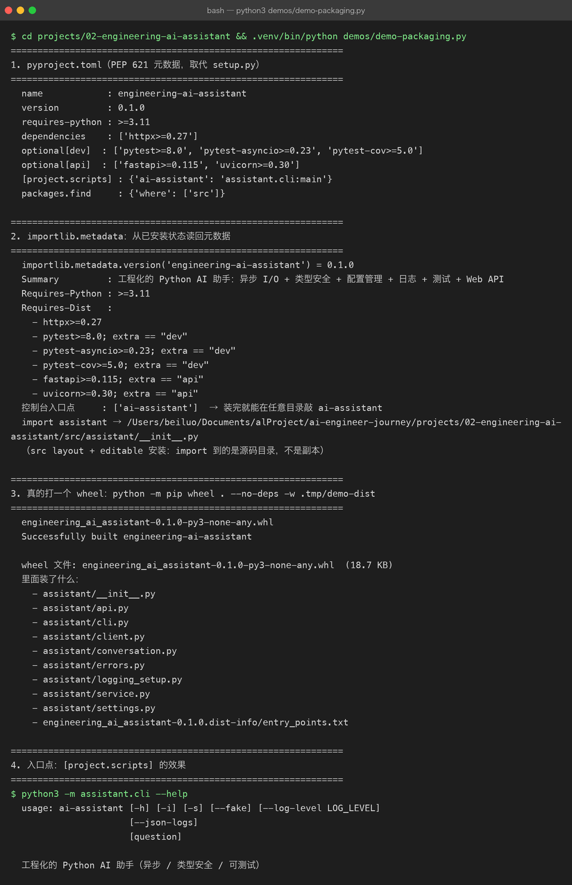

# Project 02 — Chapter 08：Packaging【打包与发布】

> 状态：✅ 已校对
> 对应代码：`pyproject.toml`

---

## 1. 项目要增加什么能力

到目前为止，运行项目的方式是：

```bash
cd projects/02-engineering-ai-assistant/src
python3 main.py "问题"
```

这有三个问题：

```text
问题 1：必须在 src/ 目录下才能跑（否则 import assistant 失败）
问题 2：别人 clone 下来，不知道要先装什么
问题 3：想复用这个包到别的项目，只能复制粘贴
```

本章目标：

> **用 `pyproject.toml` 把项目变成「可安装的包」，装完后在任意目录都能用 `ai-assistant` 命令。**

---

## 2. 为什么需要这个知识

打包解决的是**交付**问题：

```text
给自己     —— 装一次，之后在任何目录都能用，不用 cd
给同事     —— pip install -e . 之后依赖自动装齐
给用户     —— pip install ai-assistant 一条命令
给生产     —— Docker 镜像里 pip install . 是标准动作
```

而且从这一章开始，你的项目才真正符合「Python 工程」的定义：

> **能被安装、能被依赖、有明确的入口点、依赖被显式声明。**

---

## 3. 核心概念

### 3.1 `pyproject.toml` 是什么

它是 Python 官方（PEP 621）指定的**项目元数据文件**，取代了老的 `setup.py`。

类比：

| Java | Python |
|------|--------|
| `pom.xml` | `pyproject.toml` |
| `<groupId>:<artifactId>:<version>` | `name` + `version` |
| `<dependencies>` | `dependencies = [...]` |
| `<build><plugins>` | `[build-system]` |
| `mvn package` → jar | `pip wheel .` → whl |
| `mvn install` | `pip install -e .` |

### 3.2 src layout【源码布局】

推荐的目录结构（本项目采用）：

```text
projects/02-engineering-ai-assistant/
├── pyproject.toml
├── src/
│   └── assistant/          # 真正的包在这里
│       ├── __init__.py
│       ├── client.py
│       └── ...
└── tests/
```

为什么多一层 `src/`？

```text
不用 src/ 时：在项目根目录下 import assistant 会拿到「本地目录」而不是「安装的包」
              测试通过但线上失败 —— 因为本地目录里可能混进了没提交的文件
用了 src/  ：必须先安装才能 import，测试环境 = 生产环境
```

这个坑很隐蔽，业界共识是用 `src/` layout 规避。

### 3.3 最小可用的 pyproject.toml

```toml
[build-system]
requires = ["setuptools>=68"]
build-backend = "setuptools.build_meta"

[project]
name = "engineering-ai-assistant"
version = "0.1.0"
description = "一个工程化的 Python AI 助手：异步、类型安全、可测试、带 Web API"
readme = "README.md"
requires-python = ">=3.11"
dependencies = [
    "httpx>=0.27",
    "python-dotenv>=1.0",
]

[project.optional-dependencies]
dev = [
    "pytest>=8.0",
    "pytest-asyncio>=0.23",
    "pytest-cov>=5.0",
]
api = [
    "fastapi>=0.115",
    "uvicorn>=0.30",
]

[project.scripts]
ai-assistant = "assistant.cli:main"

[tool.setuptools.packages.find]
where = ["src"]
```

关键点逐个解释：

| 字段 | 作用 |
|------|------|
| `requires-python` | 声明最低版本，别人装的时候 pip 会检查 |
| `dependencies` | 运行时依赖（不写死版本，用 `>=`） |
| `optional-dependencies` | 分组可选依赖：`pip install -e ".[dev,api]"` |
| `[project.scripts]` | **生成命令行命令**：装完后直接敲 `ai-assistant` |
| `packages.find where` | 配合 src layout 告诉 setuptools 去哪找包 |

### 3.4 `[project.scripts]` 的魔法

```toml
[project.scripts]
ai-assistant = "assistant.cli:main"
```

意思是：装完后生成一个 `ai-assistant` 可执行文件，运行它 = 执行 `assistant.cli` 模块里的 `main()` 函数。

前提是你的 CLI 入口有 `main` 函数：

```python
# src/assistant/cli.py
def main() -> None:
    ...

if __name__ == "__main__":
    main()
```

对应 Java 的：`java -jar app.jar` 里的 `Main-Class`，或者 Maven 生成的启动脚本。

### 3.5 editable install【可编辑安装】

```bash
pip install -e ".[dev,api]"
```

`-e`（editable）的效果：

```text
不是把代码复制进 site-packages
而是在 site-packages 里放一个「指向你源码目录」的链接
所以你改代码立刻生效，不用重装
```

**开发期间必须用 `-e`**，否则你改一行代码就要重装一次。

### 3.6 依赖版本怎么写

```text
httpx>=0.27          ✅ 下限即可，允许升级
httpx==0.27.0        ⚠️  锁死：应用项目可以，库项目不该
httpx~=0.27          ✅ 兼容 0.27.x，不含 0.28
httpx                ❌ 完全不约束，某天上游 breaking change 你就崩了
```

规则：

> **给的约束能有多松就多松，但不能没有。**

---

## 4. 项目代码

完整安装与使用流程：

```bash
cd projects/02-engineering-ai-assistant
python3 -m venv .venv
source .venv/bin/activate
pip install -e ".[dev,api]"
cp .env.example .env      # 填入 DEEPSEEK_API_KEY

ai-assistant "用一句话解释 GIL"        # 命令行入口
ai-assistant --interactive             # 多轮对话
pytest -v                              # 测试
```

依赖分组的意义：

```text
只跑 CLI  → pip install -e .              （只装 httpx + dotenv）
要开发    → pip install -e ".[dev]"       （+ pytest）
要起服务  → pip install -e ".[api]"       （+ fastapi + uvicorn）
```

为什么 FastAPI 放进可选依赖？因为**只用 CLI 的人不该被迫装 Web 框架**。

---



## 5. Java ↔ Python 对比

| 概念 | Java / Maven | Python |
|------|-------------|--------|
| 项目描述文件 | `pom.xml` | `pyproject.toml` |
| 坐标 | `groupId:artifactId:version` | `name` + `version`（无 group，全局唯一） |
| 依赖声明 | `<dependency>` | `dependencies = [...]` |
| 依赖作用域 | `<scope>test</scope>` | `optional-dependencies.dev` |
| 构建 | `mvn package` | `python -m build` |
| 产物 | `.jar` | `.whl` / `.tar.gz` |
| 安装到仓库 | `mvn install` | `pip install .` |
| 本地开发模式 | IDE 自动 | `pip install -e .` |
| 可执行入口 | `Main-Class` | `[project.scripts]` |
| 版本锁定 | `pom` 里写死 | `requirements.txt` / `uv.lock` / `poetry.lock` |

最大的文化差异：

> **Java 的依赖版本默认是锁死的，Python 默认给下限。**
> 所以 Python 项目要发布上线时，通常会额外用 `pip freeze > requirements.txt` 或 `uv` 生成锁文件。

---

## 6. 常见坑

### 坑 1：忘了 `[tool.setuptools.packages.find] where = ["src"]`

用 src layout 却没配这一句，结果是**装上一个空包**，`import assistant` 报 `ModuleNotFoundError`，但 `pip install` 显示成功。

排查：`pip show -f engineering-ai-assistant` 看装进去的文件列表。

### 坑 2：每个目录都要 `__init__.py`

```text
src/assistant/
├── __init__.py      ← 必须有（除非用 namespace packages）
├── client.py
└── service.py
```

少了它，setuptools 可能找不到包，或者 import 行为诡异。

### 坑 3：忘了装 `-e`，改代码不生效

```bash
pip install .        # ❌ 复制了一份，改源码没用
pip install -e .     # ✅ 链接到源码
```

症状：「我明明改了，怎么运行结果还是老的」——99% 是这个。

### 坑 4：命令找不到（`ai-assistant: command not found`）

原因：没激活虚拟环境，或者装到了别的 Python 里。

排查：

```bash
which ai-assistant        # 应该在 .venv/bin/ 下
which python3             # 确认当前用的是哪个
pip show engineering-ai-assistant
```

### 坑 5：把 `tests/` 也打包进去

```toml
[tool.setuptools.packages.find]
where = ["src"]      # 只找 src 下的，tests 在根目录所以不会被打包 ✅
```

如果 tests 也在 src 下，要显式 `exclude = ["tests*"]`。

### 坑 6：`.env` 被打进包

`.env` 不在 `packages.find` 的范围内，不会被打包。但**如果你用了 `MANIFEST.in` 手动包含文件**，务必排除 `.env`。

---

## 7. 实战挑战

**挑战 1**：给项目加 `pyproject.toml`，用 `pip install -e ".[dev,api]"` 安装，验证在**任意目录**敲 `ai-assistant --help` 都能用。

**挑战 2**：加一个 `--version` 参数，从 `importlib.metadata.version("engineering-ai-assistant")` 读取版本号输出。

**挑战 3（进阶）**：用 `python -m build` 打出 wheel，然后在一个全新的 venv 里 `pip install dist/*.whl` 验证干净安装可用。

---

## 8. 主动回忆

1. `pyproject.toml` 取代了什么老文件？
2. 为什么要 src layout？不用会有什么隐蔽的坑？
3. `[project.scripts]` 做了什么？
4. `pip install -e .` 和 `pip install .` 的区别？
5. 依赖版本为什么「能松就松，但不能没有」？
6. 为什么把 FastAPI 放进可选依赖？

---

## 9. 本节完成标准

- [ ] 有 `pyproject.toml`，`pip install -e ".[dev,api]"` 成功
- [ ] 装完后在任意目录可执行 `ai-assistant`
- [ ] 用 src layout，且 `[tool.setuptools.packages.find] where = ["src"]` 已配
- [ ] 依赖分组：核心 / dev / api 三档
- [ ] `.gitignore` 含 `.venv/`、`dist/`、`*.egg-info/`

下一章：[09-fastapi.md](09-fastapi.md) —— 把 CLI 变成 HTTP 服务。
