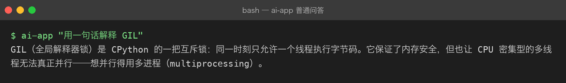
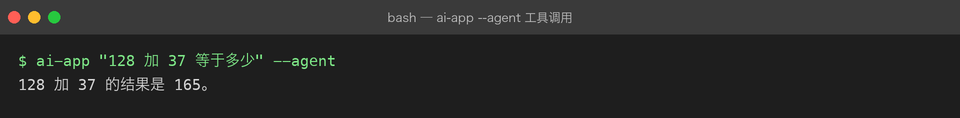

# Project 03 — AI Application

## 项目目标

从 Service 升级到真正的 AI 应用层，掌握 LLM Application【大模型应用】核心能力。

## 为什么做这个项目

会调 API 不等于会做应用。LLM Application 有自己的核心问题：Prompt 设计、流式输出、函数调用、结构化输出——这些是每个 AI 工程师每天都在处理的事情。

## 解决什么问题

- Prompt 怎么写才能让模型稳定输出？
- 怎么让用户看到打字机效果（Streaming）？
- 怎么让模型返回 JSON 而不是自然语言？
- 怎么让模型调用外部程序？

## 最终能力

```text
调用 LLM
    ↓
控制模型
    ↓
管理上下文
    ↓
获取结构化结果
    ↓
调用外部程序能力
    ↓
形成完整 AI Application
```

## 技术栈

- Prompt Engineering 方法论
- Streaming / SSE（Server-Sent Events）
- Function Calling / Tool Use
- Structured Output（Pydantic + JSON Mode）
- Multi-turn Conversation Management
- Token / Context Window 管理

## 项目演进

```
Engineering AI Assistant Service
    ↓ Prompt + Streaming
AI Chat Web v0.1
    ↓ Function Calling + Structured Output
AI Chat Web v0.2
    ↓ 前端 Chat UI
AI Chat Web v1.0
```

## Milestones

| # | Milestone | 状态 | 核心能力 |
|---|-----------|------|----------|
| 01 | [Prompt](milestones/01-prompt.md) | ✅ | 四要素 / 模板化 / Prompt 注入 |
| 02 | [Messages](milestones/02-messages.md) | ✅ | 四种 role / 历史回灌 / 消息校验 |
| 03 | [Structured Output](milestones/03-structured-output.md) | ✅ | JSON Mode / Pydantic / 校验重试 |
| 04 | [Streaming](milestones/04-streaming.md) | ✅ | SSE / 打字机 / 截断与乱码 |
| 05 | [Conversation Memory](milestones/05-conversation-memory.md) | ✅ | token 预算裁剪 / 摘要 / 会话隔离 |
| 06 | [Model Parameters](milestones/06-model-parameters.md) | ✅ | temperature / top_p / 场景 Profile |
| 07 | [Token / Context Window](milestones/07-token-context-window.md) | ✅ | 估算 / usage / 成本核算 |
| 08 | [Function Calling](milestones/08-function-calling.md) | ✅ | 工具循环 / 结果回灌 / 安全边界 |
| 09 | [Application Architecture](milestones/09-application-architecture.md) | ✅ | 五层结构 / 可观测 / 测试策略 |

状态：✅ 内容已就绪 · 🔄 代码落地中 · ⬜ 未开始

## 当前状态

**9 / 9 个 Milestone 已全部成文 + `src/` 代码落地 + 61 个离线测试全绿**（文档先行 → 代码落地 → 测试覆盖 → 真实运行验证）。

## 当前版本

**v0.2 文档 + 代码双全**：四条核心路径（普通问答 / 流式 / 结构化 / 工具调用）已用 `FakeClient` 离线跑通，无需真实 Key 即可复现。接入真实 DeepSeek 只需在 `.env` 填入 `DEEPSEEK_API_KEY`。

## 真实运行（离线冒烟，FakeClient）

下列截图全部由 `src/` 真实运行产出（`ai-app ... --fake` 或脚本化 `FakeClient`），不联网、不花钱，可复现：

**① 普通问答**



**② 流式输出（打字机）**


**③ 结构化输出（Pydantic + JSON Mode）**


**④ 工具调用（Function Calling）**



**⑤ 离线测试 61 / 61 通过**


## 项目结构

```text
src/assistant/          # 五层结构（见 09 章）
├── cli.py  api.py      # 接入层
├── service.py  agent.py# 编排层
├── prompts.py  schema.py  tools.py   # 能力层
├── client.py  settings.py            # 模型层（唯一知道 API 细节）
└── memory.py  tokens.py  logging_setup.py  # 支撑层
tests/                  # 全部离线（FakeClient），不联网、不用真实 Key
```

## 已掌握能力

- Project 01-02 的所有能力（Python 工程化、async、FastAPI、pytest）

## 下一步

1. ✅ 已落地 `src/` 并跑通四条路径（普通问答 / 流式 / 结构化 / 工具调用）
2. ✅ 已配真实运行截图，P03 从「文档就绪」转为「文档 + 代码 + 测试」双全
3. 接入真实 DeepSeek：复制 `.env.example` 为 `.env` 填入 `DEEPSEEK_API_KEY`，去掉 `--fake` 即可对比真模型效果
4. 进阶：把 `api.py`（FastAPI）部署成服务，或在前端接一个聊天 UI（呼应 Project 02 的 AI Chat Web）

**前置项目**：[Project 02 — Engineering AI Assistant](../02-engineering-ai-assistant/)
