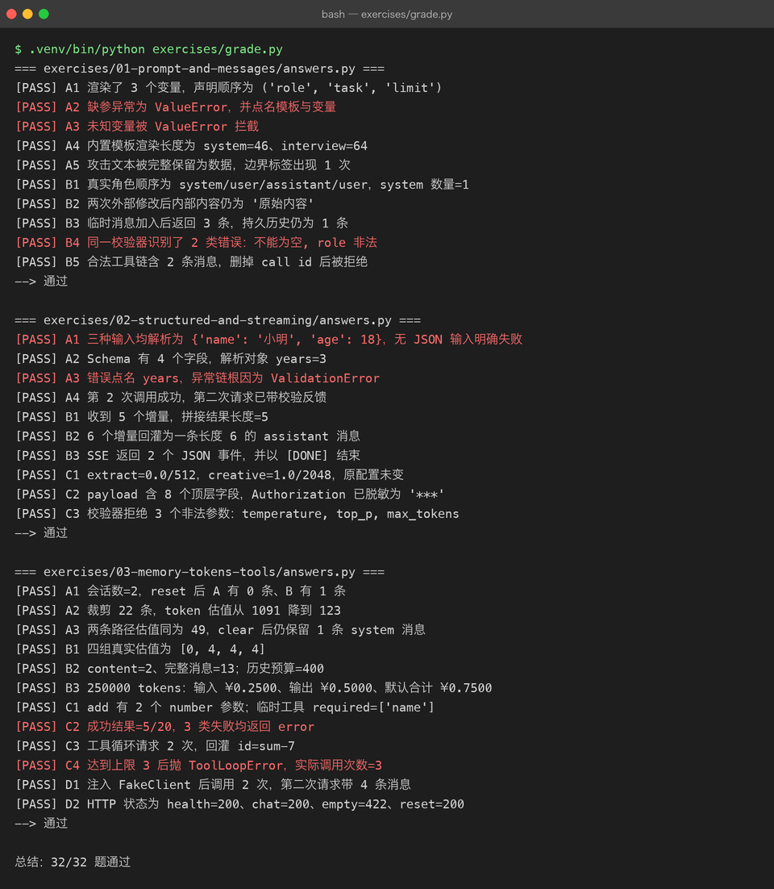
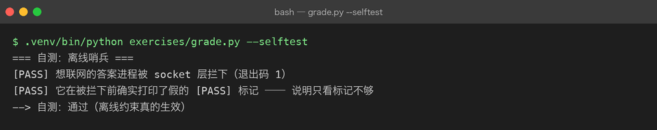

# Exercises — Project 03 学习验证与离线判卷

> **免责说明**：`answers.py` 跑通，只能证明参考答案与当前仓库实现匹配，不能证明你已经学会。
> AI 不会替你勾选学习状态；所有状态默认 ⬜，是否掌握只能由你本人在独立完成并讲清原因后判断。

## 怎么用

1. **先看 milestone**：先阅读 `../milestones/` 中对应章节，理解概念与项目实现。
2. **自己写**：按各组 `README.md` 的输入、输出和验证要求独立实现，不要先打开参考答案。
3. **卡住再看**：只查看 `answers.py` 里卡住的那一个函数，对照后关掉并重新独立完成。

## 目录

| 目录 | 覆盖 Milestone | 题数 |
|---|---|---:|
| [01-prompt-and-messages](01-prompt-and-messages/README.md) | M01 Prompt、M02 Messages | 10 |
| [02-structured-and-streaming](02-structured-and-streaming/README.md) | M03 结构化输出、M04 流式、M06 模型参数 | 10 |
| [03-memory-tokens-tools](03-memory-tokens-tools/README.md) | M05 会话记忆、M07 Token/上下文窗口、M08 Function Calling、M09 应用架构 | 12 |

合计 32 题。

## 判卷

在 `projects/03-ai-application` 下运行：

```bash
.venv/bin/python exercises/grade.py
```

如需保存结果：

```bash
.venv/bin/python exercises/grade.py > exercises/out/grade.txt 2>&1
```

判卷器会从每组 `README.md` 的 `- [ ] **A1** ...` 行读取题号，再通过 `_offline_guard.py` 运行对应 `answers.py`。每题必须打印 `[PASS] <题号>`，脚本必须以 0 退出；任何非回环网络连接都会被直接拒绝。

### 为什么不用「符号黑名单」判联网

黑名单会误报 —— 例如「构造一个真实客户端、检查它的 headers 有没有被脱敏」并不发任何请求；
它也拦不住偷偷连一个内网地址。真正可靠的是在 `socket.socket.connect` / `socket.create_connection`
上装闸门。`--selftest` 是这条约束的自证：它跑一个「先打印假 `[PASS] Z9`，再尝试连接外网」的脚本，
确认进程被拦下 —— 顺便说明**只看 `[PASS]` 标记是不够的**，还要看退出码。

```bash
.venv/bin/python exercises/grade.py --selftest
```

## 本次判卷结果（真实运行）



哨兵自测同样是从真实子进程里跑出来的：



跑通 32/32。**这是参考答案的成绩，不是你的成绩。**

**再次说明**：判卷结果是参考答案的验收结果，不是你的学习证明。只有你能决定是否把 `../LEARNING.md` 中的 ⬜ 改为完成状态。
