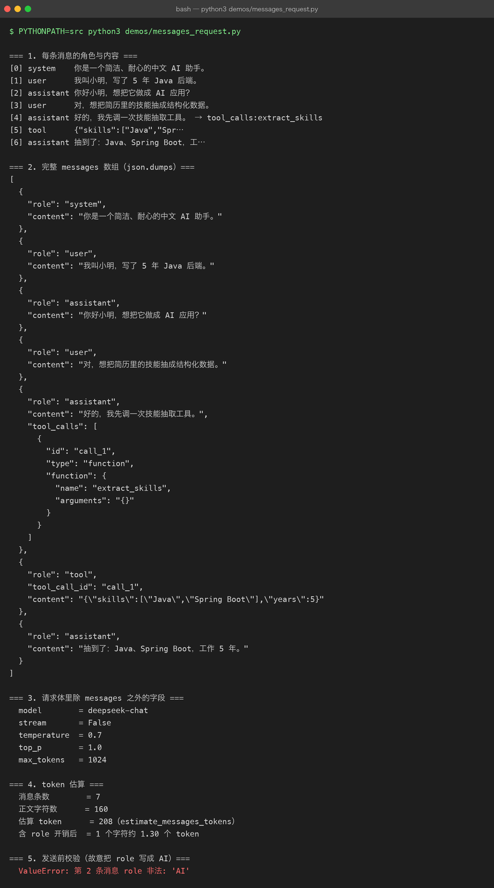

# Project 03 — Chapter 02：System / User / Assistant Messages【消息结构】

> 状态：✅ 已校对
> 对应代码：`src/assistant/memory.py`（`Conversation`）

---

## 1. 项目要增加什么能力

Chapter 01 解决了「提示词怎么写」，这一章解决「提示词怎么送过去」。

Project 02 里已经有消息结构了，但只用到两种角色：

```python
# P02 conversation.py
self._messages: list[dict[str, str]] = []
if system_prompt:
    self._messages.append({"role": "system", "content": system_prompt})
```

现在要支持完整的四种角色，并回答一个关键问题：

> **为什么必须把模型自己说过的话再发回去？**

本章目标：

> **正确地构造、累积、校验 messages，让多轮对话和工具调用都能正常工作。**

---

## 2. 为什么需要这个知识

大模型 API 是**无状态**的。这一点怎么强调都不过分：

```text
你以为：  模型记得上一轮聊了什么
实际上：  模型每次只看到你这次发过来的 messages 数组
```

所以「多轮对话」这件事，**本质上是客户端在伪造记忆**——每一轮把完整历史重新发一遍。

这意味着 messages 数组就是 AI 应用最重要的一个数据结构：

```text
messages 拼错了 → 模型表现诡异，而且很难定位
                  （因为错误不在代码里，在数据里）
```

---

## 3. 核心概念

### 3.1 四种角色

| role | 谁产生的 | 作用 |
|------|---------|------|
| `system` | 你 | 全局人设与规则，一般只在开头出现一次 |
| `user` | 你（用户） | 这一轮的输入 |
| `assistant` | 模型 | 模型上一轮的回答；**工具调用时承载 `tool_calls`** |
| `tool` | 你（执行工具后） | 把工具执行结果回灌给模型，靠 `tool_call_id` 对应 |

### 3.2 一次多轮对话的真实报文

第 1 轮：

```json
[
  {"role": "system", "content": "你是一个简洁的中文助手。"},
  {"role": "user", "content": "我叫小明"}
]
```

模型回：`{"role": "assistant", "content": "你好小明，有什么可以帮你？"}`

第 2 轮（**注意：三条都要发**）：

```json
[
  {"role": "system", "content": "你是一个简洁的中文助手。"},
  {"role": "user", "content": "我叫小明"},
  {"role": "assistant", "content": "你好小明，有什么可以帮你？"},
  {"role": "user", "content": "我叫什么名字？"}
]
```

**`assistant` 那条是自己上一轮的回复，必须回灌。** 少了它，模型就不知道自己说过什么，也不知道「小明」是谁说的。



### 3.3 代码里怎么累积

```python
@dataclass
class Conversation:
    _system: str = ""
    _turns: list[dict[str, str]] = field(default_factory=list)

    def add_user(self, content: str) -> None:
        self._turns.append({"role": "user", "content": content})

    def add_assistant(self, content: str) -> None:
        self._turns.append({"role": "assistant", "content": content})

    def add_tool(self, tool_call_id: str, content: str) -> None:
        self._turns.append({"role": "tool", "tool_call_id": tool_call_id, "content": content})

    def to_messages(self) -> list[dict[str, str]]:
        head = [{"role": "system", "content": self._system}] if self._system else []
        return head + list(self._turns)
```

关键设计：`to_messages()` 返回的是**副本**（`list(self._turns)`），外部拿去改也改不动内部状态。

### 3.4 一条消息该不该被信任

messages 是会被多处修改的共享数据，写个校验器很划算：

```python
def validate_messages(messages: list[dict]) -> None:
    if not messages:
        raise ValueError("messages 不能为空")
    for i, m in enumerate(messages):
        role = m.get("role")
        if role not in {"system", "user", "assistant", "tool"}:
            raise ValueError(f"第 {i} 条消息 role 非法: {role!r}")
        if role == "tool" and "tool_call_id" not in m:
            raise ValueError(f"第 {i} 条 tool 消息缺少 tool_call_id")
        if "content" not in m and "tool_calls" not in m:
            raise ValueError(f"第 {i} 条消息既没有 content 也没有 tool_calls")
```

在**发送请求前**调用它，能省掉大量「模型为什么答非所问」的排查时间。

---

## 4. 项目代码

```text
src/assistant/
├── memory.py      # Conversation：add_user / add_assistant / add_tool / to_messages
├── schema.py      # Message 类型别名（Chapter 03 用）
└── client.py      # 发送前调用 validate_messages()
```

调用链：

```text
用户输入
  ↓ Conversation.add_user()
Conversation.to_messages()
  ↓ validate_messages()
client.chat(messages)            ← 模型
  ↓ 拿到 assistant 消息
Conversation.add_assistant()     ← 回灌，下一轮才能带上
```

---

## 5. Java ↔ Python 对比

| Java | Python | 说明 |
|------|--------|------|
| `List<Map<String,String>>` | `list[dict[str, str]]` | 同（Python 更常用 TypedDict 约束） |
| DTO / `record Message(String role, String content)` | `@dataclass` 或 `TypedDict` | Python 里 dict 更贴合 JSON 契约 |
| HTTP 是无状态的（靠 Cookie/Session） | LLM API 无状态（靠 messages） | **完全同构** |
| `Bean Validation @NotNull` | `validate_messages()` | 同样的前置校验思路 |
| Jackson 序列化顺序 | `json.dumps(ensure_ascii=False)` | Python 默认转义中文，要关掉 |

最贴切的类比：

> **messages ≈ HTTP 请求体 + Session。** 模型没有服务端状态，每次请求必须自带全部上下文，就像 JWT 无状态鉴权每次都要带上完整的 token。

---

## 6. 常见坑

### 坑 1：忘了回灌 assistant 消息

```python
conv.add_user("我叫小明")
reply = await client.chat(conv.to_messages())
conv.add_user("我叫什么名字？")        # ❌ 少了 add_assistant(reply)
reply2 = await client.chat(conv.to_messages())   # 模型：我不知道你叫什么
```

**这是多轮对话最常见的 bug。** 表现是「模型记性好时好时坏」，其实是根本没把记忆发出去。

### 坑 2：每一轮都重复插入 system

```python
conv.add_system("你是一个助手")     # 每一轮都 append
conv.add_system("你是一个助手")
conv.add_system("你是一个助手")     # ❌ 三份 system，白烧 token
```

system 应该只存在一份，由 `to_messages()` 负责拼在开头。

### 坑 3：role 拼错

```python
{"role": "AI", "content": "..."}       # ❌ API 直接 400
{"role": "human", "content": "..."}    # ❌ 这是 LangChain 的写法，不是 OpenAI 契约
```

### 坑 4：tool 消息的 `tool_call_id` 对不上

工具调用时，模型返回的 `tool_calls[].id` 必须在回灌时原样带回。对不上会直接报协议错误，且报错信息通常很不友好。

### 坑 5：裁剪历史时切在工具调用中间

当历史太长需要裁剪（Chapter 05）时，如果截掉了 `assistant(tool_calls)` 但留下了 `tool` 消息，协议就坏了。

规则：

> **裁剪以「一轮完整交互」为单位，不要以「单条消息」为单位。**

---

## 7. 实战挑战

**挑战 1**：实现 `validate_messages()`，并在 `client.chat()` 里调用——让非法消息在发送前就失败。

**挑战 2**：给 `Conversation` 加 `last_n_turns(n)`，只保留最近 n 轮（system 始终保留）。

**挑战 3（进阶）**：支持 `tool_calls` 结构（Chapter 08 会用到），让 `add_assistant()` 既能存纯文本也能存工具调用。

---

## 8. 主动回忆

1. 为什么多轮对话必须把 assistant 的历史回复再发一遍？
2. 四种 role 分别由谁产生、作用是什么？
3. `to_messages()` 为什么要返回副本？
4. system 消息应该出现几次？放在数组的什么位置？
5. tool 消息靠什么字段与工具调用对应？
6. 裁剪历史时，为什么不能以单条消息为单位？

---

## 9. 本节完成标准

- [ ] 多轮对话能稳定记住上一轮的内容（有真实调用验证）
- [ ] `to_messages()` 返回副本，外部修改不影响内部
- [ ] 发送前有消息校验，非法 role 会直接报错
- [ ] system 消息全会话只存在一份
- [ ] 已支持 `tool` 角色与 `tool_call_id`（为 Chapter 08 做准备）

下一章：[03-structured-output.md](03-structured-output.md) —— 让模型的输出能被程序直接消费。
