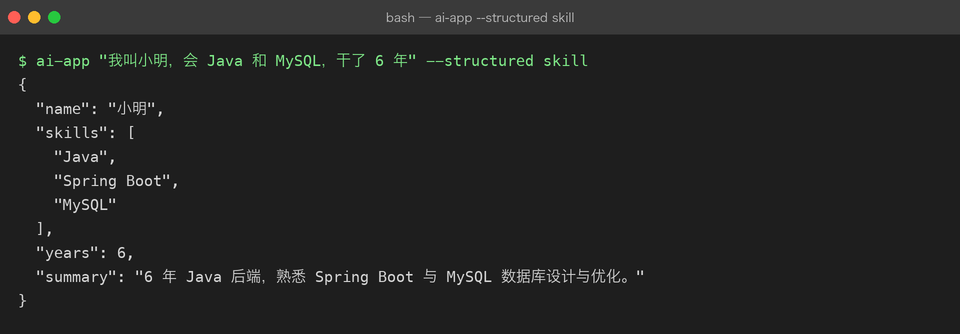

# Project 03 — Chapter 03：Structured Output【结构化输出】

> 状态：✅ 已校对
> 对应代码：`src/assistant/schema.py`

---

## 1. 项目要增加什么能力

到目前为止，模型的输出是**自然语言字符串**：

```python
reply = await client.chat(messages)      # reply: str
print(reply)                            # "好的，根据您的要求……"
```

给人看没问题。但程序要用就麻烦了：

```text
# 想拿模型抽取出的「技能列表」？
text = "候选人的技能包括：Java、Spring Boot、MySQL"
skills = ???                            # 正则？split("、")？换个问法就崩
```

本章目标：

> **让模型输出可被程序稳定消费的结构化数据（JSON），并且校验失败时能自动重试。**

这是「AI 玩具」和「AI 应用」的分水岭——**只要结果要进数据库、要传给下游系统，就必须结构化。**

---

## 2. 为什么需要这个知识

非结构化输出的三宗罪：

```text
1. 不可靠  —— 同一问题、同一 Prompt，模型这次说「Java、MySQL」，下次说「1. Java 2. MySQL」
2. 不可测  —— 断言写什么？assert "Java" in reply？换个措辞就假失败
3. 不可组合 —— 下游要的是一个对象，你只能给它一段话
```

而结构化输出能把「模型的模糊性」关在**最外一层**：里面是确定的数据，外面是一次可能失败的解析。

---

## 3. 核心概念

### 3.1 三种手段，强度递增

| 手段 | 做法 | 保证强度 | 代价 |
|------|------|---------|------|
| ① Prompt 约定 | 在 Prompt 里写「只输出 JSON」 | 弱：可能带解释、带代码块围栏 | 零成本 |
| ② JSON Mode | `response_format={"type": "json_object"}` | 中：**保证是合法 JSON**，不保证字段 | 需在 Prompt 里出现 "json" 字样 |
| ③ 工具/函数调用 | 用 `tools` + `tool_choice` 强制按 schema 输出 | 强：**字段与类型都受约束** | 请求更复杂（Chapter 08） |

选择口诀：

```text
只要能用 ③ 就用 ③（schema 强制）
模型/平台不支持时用 ②
① 永远只作为兜底，且必须配健壮的解析与重试
```

### 3.2 用 Pydantic 定义「要什么」

```python
from pydantic import BaseModel, Field

class SkillExtraction(BaseModel):
    name: str = Field(description="候选人姓名")
    skills: list[str] = Field(description="技能列表，标准英文原名")
    years: int = Field(description="工作年限", ge=0, le=40)
    summary: str = Field(description="一句话总结", max_length=100)
```

Pydantic 同时给了你两样东西：

```text
1. JSON Schema       —— 发给模型，告诉它要输出什么形状
2. 运行时校验        —— 模型输出后立刻校验，类型不对直接 ValidationError
```

```python
SkillExtraction.model_json_schema()      # → dict，直接塞进请求
SkillExtraction.model_validate(obj)      # → 校验并构造，失败抛 ValidationError
```

### 3.3 完整链路

```text
Pydantic 模型
    ↓ model_json_schema()
JSON Schema
    ↓ 放进请求（JSON Mode 的 schema / 工具的 parameters）
模型输出 JSON 字符串
    ↓ json.loads()（先剥掉 ```json 围栏）
dict
    ↓ Model.model_validate()
校验通过 → 强类型对象   |   校验失败 → 带修正提示重试一次
```

### 3.4 解析要健壮：先剥围栏

模型即使开了 JSON Mode，也常常裹一层 markdown 围栏：

````text
```json
{"name": "张三", "skills": ["Java"]}
```
````

````python
import json, re

_FENCE = re.compile(r"^\s*```(?:json)?\s*|\s*```\s*$", re.M)

def extract_json(raw: str) -> dict:
    cleaned = _FENCE.sub("", raw).strip()
    try:
        return json.loads(cleaned)
    except json.JSONDecodeError:
        # 退一步：抓第一个 {...} 到最后一个 }
        start, end = cleaned.find("{"), cleaned.rfind("}")
        if start == -1 or end <= start:
            raise
        return json.loads(cleaned[start:end + 1])
````

### 3.5 校验失败要重试，且要把错误告诉模型

```python
async def structured(client, messages, model_cls, max_retry: int = 1):
    schema = model_cls.model_json_schema()
    last_err = ""
    for attempt in range(max_retry + 1):
        extra = [{"role": "user", "content": f"上一轮输出不符合要求：{last_err}。请严格按 schema 重新输出。"}] if last_err else []
        raw = await client.chat(messages + extra, response_format={"type": "json_object"}, schema=schema)
        try:
            return model_cls.model_validate(extract_json(raw))
        except (json.JSONDecodeError, ValidationError) as e:
            last_err = str(e)[:300]
    raise StructuredOutputError(f"结构化输出重试 {max_retry + 1} 次仍失败：{last_err}")
```

关键点：**把校验错误原文回灌给模型**。模型看到「`years` 字段应该是整数但收到了字符串 '三年'」通常一次就改对了。

---

## 4. 项目代码

```text
src/assistant/
├── schema.py     # extract_json() / structured() / StructuredOutputError
├── errors.py     # StructuredOutputError(LLMError)
├── prompts.py    # EXTRACT 模板
└── api.py        # POST /chat/structured —— 返回强类型 JSON
```

对外接口应该长这样：

```python
result: SkillExtraction = await structured(client, messages, SkillExtraction)
print(result.skills)        # 有 IDE 补全、有类型检查
```

---

## 5. Java ↔ Python 对比

| Java | Python | 说明 |
|------|--------|------|
| `record SkillExtraction(...)` | `class SkillExtraction(BaseModel)` | Pydantic ≈ record + Jackson + Bean Validation 三合一 |
| Jackson `@JsonProperty` | Pydantic `Field(alias=...)` | 同 |
| `ObjectMapper.readValue(json, X.class)` | `Model.model_validate(obj)` | 同 |
| `@NotNull @Size(max=100)` | `Field(max_length=100)` | 同 |
| `JsonSchemaGenerator` | `model_json_schema()` | 同 |
| 异常 `JsonProcessingException` | `ValidationError` | 同 |
| 接口契约（OpenAPI） | JSON Schema | **同一套 schema，人和模型都读它** |

最值得记住的类比：

> **JSON Schema 就是给模型的接口契约。** 你给下游服务写 OpenAPI 文档，给模型写 JSON Schema——目的是一样的：把「约定」变成「可校验的机器可读格式」。

---

## 6. 常见坑

### 坑 1：`json.loads` 之后直接用

```python
data = json.loads(raw)
name = data["name"]          # ❌ KeyError / 类型可能是 None
```

一定要过一遍 Pydantic，让校验发生在**边界**，而不是散落在业务代码里。

### 坑 2：schema 太复杂，模型反而更容易错

```text
❌ 一个 20 字段、3 层嵌套、带联合类型的 schema
✅ 拆成两次调用，每次只要 5 个字段
```

经验值：字段超过 ~10 个或嵌套超过 2 层，成功率明显下降。

### 坑 3：`max_tokens` 把 JSON 截断了

这是最隐蔽的一个：模型输出了一半，`max_tokens` 用完，你拿到 `{"name": "张三", "skills": ["Ja`——`json.loads` 直接失败。

解法：结构化输出要给足 `max_tokens`，并且**截断要能被识别**（检查 `finish_reason == "length"`）。

### 坑 4：以为 JSON Mode 等于「字段一定对」

JSON Mode 只保证**语法是合法 JSON**，`{"error": "我不知道"}` 也是合法 JSON。字段对不对，仍然要靠 Pydantic 校验。

### 坑 5：数字被输出成字符串

模型很爱把 `years` 输出成 `"3 年"`。Pydantic 默认会尝试把 `"3"` 转成 `3`，但 `"3 年"` 不行——这就是需要重试的场景。

### 坑 6：把重试写成无限循环

一定设上限（建议 1 次重试 = 最多 2 次调用）。无限重试 = 无限烧钱。

---

## 7. 实战挑战

**挑战 1**：实现 `extract_json()`，能处理裸 JSON、带 ```json 围栏、前后带解释文字三种情况。

**挑战 2**：实现 `structured()`，校验失败时把 `ValidationError` 精简后回灌重试一次，成功返回强类型对象。

**挑战 3（进阶）**：给 `structured()` 加一个「降级」分支——连续失败时返回一个 `partial=True` 的对象（能解析出几个字段算几个），而不是直接抛异常。

---

## 8. 主动回忆

1. 三种结构化手段的强度排序是什么？各自保证什么、不保证什么？
2. Pydantic 模型同时提供了哪两样东西？
3. 为什么解析前要先剥 ```json 围栏？
4. 校验失败重试时，为什么要把错误信息回灌给模型？
5. `max_tokens` 太小会导致什么隐蔽问题？
6. JSON Mode 能保证字段正确吗？为什么？

---

## 9. 本节完成标准

- [ ] 有一个 Pydantic 模型描述至少一种抽取结果
- [ ] `extract_json()` 能处理围栏与前后废话
- [ ] `structured()` 校验失败会重试一次，且重试有上限
- [ ] 结构化输出给了足够的 `max_tokens`，能识别 `finish_reason == "length"`
- [ ] 有真实调用验证：返回的是强类型对象，不是字符串

下一章：[04-streaming.md](04-streaming.md) —— 让等待不那么难熬。

## 真实运行

结构化输出路径（`ai-app "..." --structured skill`），`schema.py` 解析 + Pydantic 校验后拿到强类型对象：


