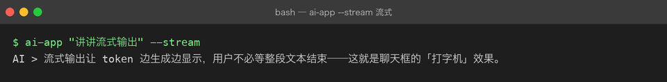

# Project 03 — Chapter 04：Streaming【流式输出】

> 状态：✅ 已校对
> 对应代码：`src/assistant/client.py`（`astream`）、`src/assistant/api.py`（`/chat/stream`）

---

## 1. 项目要增加什么能力

现在的调用是「憋大招」：

```python
reply = await client.chat(messages)     # 等 8 秒，一次拿到全部
print(reply)
```

用户视角：点了发送 → 白屏 8 秒 → 一整段文字突然出现。

本章目标：

> **让文字一个字一个字地出现（打字机效果），把「等待 8 秒」变成「0.4 秒后开始有反馈」。**

---

## 2. 为什么需要这个知识

这不是锦上添花，是**感知性能**的质变：

```text
非流式：  TTFB 8s  ────────────────► 全部内容
流式：    TTFB 0.4s ► 持续吐字 ────► 全部内容
```

总时间一样，但用户的感受完全不同。ChatGPT 之所以「感觉很快」，很大一部分功劳在流式。

第二个理由更实际：**长回答可能被 `max_tokens` 截断或中途超时**，流式至少能把已经生成的部分给用户。

---

## 3. 核心概念

### 3.1 底层：SSE（Server-Sent Events）

SSE 就是一个约定格式的 HTTP 响应：

```http
Content-Type: text/event-stream
Cache-Control: no-cache
```

报文体：

```text
data: {"delta": "你"}

data: {"delta": "好"}

data: [DONE]

```

三条规则：

```text
1. 每个事件以 data: 开头，以空行（\n\n）结束
2. 一个 data 里必须是合法 JSON（多行要用多个 data 行）
3. 用一个约定的结束标记收尾（OpenAI 系是 data: [DONE]）
```

### 3.2 服务端怎么吐

```python
async def astream(self, messages: list[dict]) -> AsyncIterator[str]:
    payload = {"model": self._settings.model, "messages": messages, "stream": True}
    async with self._client.stream("POST", url, json=payload, headers=headers) as resp:
        resp.raise_for_status()
        async for line in resp.aiter_lines():
            if not line.startswith("data:"):
                continue
            data = line[5:].strip()
            if data == "[DONE]":
                break
            chunk = json.loads(data)
            delta = chunk["choices"][0]["delta"].get("content")
            if delta:
                yield delta
```

FastAPI 侧：

```python
@router.post("/chat/stream")
async def chat_stream(req: ChatRequest, request: Request):
    service = get_service(request)
    async def gen():
        async for delta in service.astream(req.message):
            yield f"data: {json.dumps({'delta': delta}, ensure_ascii=False)}\n\n"
        yield "data: [DONE]\n\n"
    return StreamingResponse(gen(), media_type="text/event-stream")
```

### 3.3 消费端（浏览器）

`EventSource` 只能发 GET。要 POST（携带长消息体）就得用 `fetch` + `ReadableStream`：

```javascript
const res = await fetch("/chat/stream", {
  method: "POST",
  headers: {"Content-Type": "application/json"},
  body: JSON.stringify({message: "你好"}),
});
const reader = res.body.getReader();
const decoder = new TextDecoder();
while (true) {
  const {done, value} = await reader.read();
  if (done) break;
  const text = decoder.decode(value, {stream: true});
  for (const line of text.split("\n\n")) {
    if (!line.startsWith("data: ")) continue;
    const data = line.slice(6);
    if (data === "[DONE]") return;
    appendChunk(JSON.parse(data).delta);
  }
}
```

注意 `decoder.decode(value, {stream: true})`：**一个 chunk 可能在多字节的中文字符中间断开**，不加 `stream: true` 会出现乱码。

### 3.4 流式的两个硬约束

```text
1. 一旦开始吐字，HTTP 状态码就已经发出去了
   → 中途出错不能改成 500，只能在流里发一个 error 事件，前端自己处理

2. 已经吐出去的没法收回
   → 中途发现内容违规时只能截断，不能"撤销"
```

所以协议里要预留错误事件：

```text
data: {"error": "上游超时", "code": "upstream_timeout"}

data: [DONE]
```

---

## 4. 项目代码

```text
src/assistant/
├── client.py     # astream()：httpx 的 stream + aiter_lines 解析 SSE
├── service.py    # astream()：业务层只转发 delta，结束时补一条 assistant 消息
└── api.py        # /chat/stream —— StreamingResponse + [DONE]
```

一个容易漏的点：**流式结束后要把完整内容补进 Conversation**。

```python
async def astream(self, text: str):
    buf: list[str] = []
    async for delta in self._client.astream(self._conversation.to_messages_with(text)):
        buf.append(delta)
        yield delta
    self._conversation.add_user(text)
    self._conversation.add_assistant("".join(buf))   # ← 别漏
```

漏了这一句，下一轮对话就会「失忆」——而且只在流式模式下失忆，非流式正常，非常难查。

---

## 5. Java ↔ Python 对比

| Java | Python | 说明 |
|------|--------|------|
| Spring `SseEmitter` | FastAPI `StreamingResponse` | 同 |
| WebFlux `Flux<String>` | `AsyncIterator[str]` | 都是异步序列 |
| `Flux.map()` | `async for` + `yield` | 生成器 ≈ 响应式流 |
| Reactor 背压 | `await` 天然背压 | Python 消费者不消费就不拉取 |
| `MediaType.TEXT_EVENT_STREAM` | `media_type="text/event-stream"` | 同 |
| OkHttp 流式响应体 | `httpx` `client.stream()` | 同 |
| `CharsetDecoder` 处理截断 | `TextDecoder(stream: true)` | **中文截断乱码是同一个坑** |

---

## 6. 常见坑

### 坑 1：Nginx / 网关缓冲了响应

症状：本地开发流式正常，上线后变成卡 8 秒一次性出来。

原因：反向代理默认会缓冲上游响应。

```nginx
proxy_buffering off;
proxy_read_timeout 300s;
gzip off;                 # gzip 也会缓冲
```

### 坑 2：忘了 `flush`

Python 侧用 `yield` 通常没问题，但如果中间套了自定义 buffer（比如手动拼字符串再发），就会退化成非流式。

### 坑 3：中文乱码

```javascript
decoder.decode(value)                      // ❌ 可能乱码
decoder.decode(value, {stream: true})      // ✅
```

服务端也一样：读取 SSE 行时如果按字节切，可能切在多字节字符中间。

### 坑 4：`EventSource` 发不了 POST

标准的 `EventSource` API 只支持 GET。带历史消息的请求体太大，不能放 URL 里——用 `fetch` + `ReadableStream`（见 3.3），或者拆成「先 POST 创建会话，再 GET 订阅」。

### 坑 5：流式 + 结构化输出天然冲突

流式是「半个 JSON 也要显示」，结构化是「必须完整才能 `json.loads`」。

解法：

```text
界面上流式展示原始文本（给用户看）
同时后台缓冲完整字符串，流结束后再一次性 parse（给程序用）
```

两者并存，不要试图边流边 parse。

### 坑 6：客户端断开后服务端还在烧钱

用户关了页面，服务端还在等模型吐完。要用请求级取消：`asyncio.CancelledError` 捕获后关闭上游连接。

---

## 7. 实战挑战

**挑战 1**：给 `/chat/stream` 加一个错误事件格式，上游失败时发 `{"error": ...}` 而不是静默断流。

**挑战 2**：实现一个命令行流式效果——`--stream` 时逐字打印，并统计首字延迟（TTFB）与总耗时。

**挑战 3（进阶）**：流式 + 结构化并存：界面流式展示，流结束后用 Chapter 03 的 `structured()` 解析完整内容；解析失败时提示用户「内容不完整」。

---

## 8. 主动回忆

1. SSE 报文的三条格式规则是什么？
2. 为什么流式能改善体验，但总耗时不变？
3. 流式结束后要补做什么，漏了会有什么症状？
4. 为什么 `EventSource` 不够用，要用 `fetch` + `ReadableStream`？
5. 中文乱码的根因是什么？怎么修？
6. 流式和结构化输出为什么冲突？怎么共存？

---

## 9. 本节完成标准

- [ ] `--stream` 命令行能看到逐字输出，并打印首字延迟
- [ ] `/chat/stream` 返回 `text/event-stream`，以 `data: [DONE]` 收尾
- [ ] 流式结束后完整内容已回灌进 Conversation（下一轮不失忆）
- [ ] 上游出错时流里能发出 error 事件
- [ ] 用 `curl -N` 实测过（`-N` 关闭 curl 自己的缓冲）

上一章：[03-structured-output.md](03-structured-output.md)
下一章：[05-conversation-memory.md](05-conversation-memory.md) —— 历史越来越长怎么办。

## 真实运行

流式路径（`ai-app "..." --stream`），token 边生成边打印，呈现「打字机」效果：


