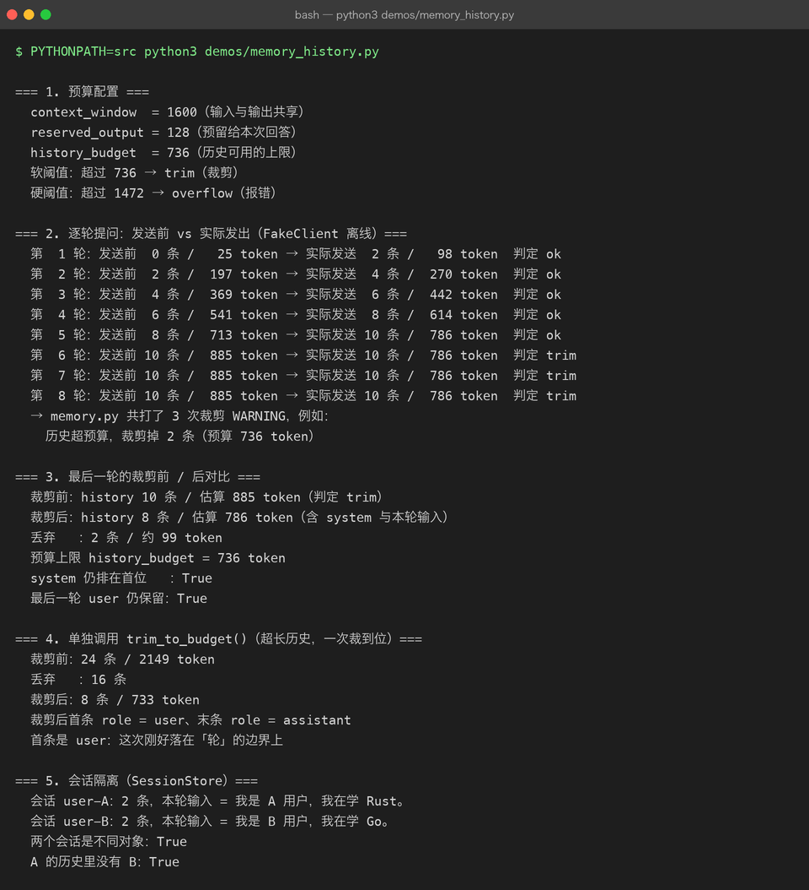

# Project 03 — Chapter 05：Conversation Memory【对话记忆】

> 状态：✅ 已校对
> 对应代码：`src/assistant/memory.py`、`src/assistant/tokens.py`

---

## 1. 项目要增加什么能力

Chapter 02 解决了「怎么把历史发出去」，这一章解决：

> **历史越来越长，怎么办？**

现在的实现是全量累积：

```python
self._turns.append({"role": "user", "content": content})     # 只增不减
```

20 轮对话之后，每次请求都要带上 40 条消息。三个后果同时发生：

```text
1. 变贵 —— token 数随轮数线性增长，成本随轮数平方增长
2. 变慢 —— 上下文越长，首字延迟越高
3. 会炸 —— 超过上下文窗口，API 直接报错
```

本章目标：

> **在「记得住」和「装得下」之间做工程取舍：预算裁剪 + 摘要压缩。**

---

## 2. 为什么需要这个知识

「记忆」是 AI 应用最容易被低估的复杂度。它不像写代码，错了会报错——**记忆出错的表现是模型慢慢变笨**：

```text
第 5 轮：  回答精准
第 15 轮： 开始忘记开头说过的要求
第 25 轮： 把用户 A 的偏好答给用户 B（如果共享了会话）
```

而且成本是隐性的：一个每天 1000 次调用的应用，如果每次都带 8000 token 的历史，一个月的光是历史部分就是一笔真金白银。

---

## 3. 核心概念

### 3.1 记忆的三个层次

| 层次 | 放什么 | 实现 | 对应章节 |
|------|--------|------|---------|
| 短期记忆 | 最近若干轮原文 | 滑动窗口 / token 预算裁剪 | 本章 |
| 中期记忆 | 较早内容的压缩摘要 | 让模型总结历史 | 本章 |
| 长期记忆 | 知识库、用户画像 | 向量检索（RAG） | Project 04 |

### 3.2 策略一：按 token 预算裁剪

```python
def trim_to_budget(turns: list[dict], budget: int) -> list[dict]:
    kept: list[dict] = []
    used = 0
    for msg in reversed(turns):          # 从最近的往前留
        cost = estimate_tokens(msg["content"])
        if used + cost > budget:
            break
        kept.append(msg)
        used += cost
    return list(reversed(kept))
```

三条铁律：

```text
1. system 永远保留（它是人设和规则）
2. 最后一轮用户输入永远保留（这是当前问题）
3. 按「轮」剪切，不要切在工具调用的中间（见 Chapter 02 坑 5）
```



### 3.3 策略二：摘要压缩

裁剪是「丢掉」，摘要是「压缩」。做法：

```text
历史超过阈值
    ↓
让模型把「第 1 ~ 第 N 轮」总结成一段话
    ↓
用这条 summary 替换掉那 N 轮原文
    ↓
之后的历史在 summary 基础上继续累积
```

```python
SUMMARY_PROMPT = (
    "请把下面的对话压缩成一段不超过 {max_words} 字的摘要，"
    "保留：用户的关键事实、已确认的结论、未完成的请求。\n\n{dialog}"
)
```

摘要的代价是**细节丢失**。适合「用户说了自己是谁、想要什么」这类事实，不适合「用户让你改的那段代码原文」。

### 3.4 会话必须隔离

```python
# ❌ 全局单例：所有用户共享一段历史
_conversation = Conversation()

# ✅ 按会话 ID 隔离
_sessions: dict[str, Conversation] = {}
```

多用户共享一个会话对象，会出现「用户 A 问的问题出现在用户 B 的回答里」——这是**数据泄漏级别**的 bug。

FastAPI 侧按 `session_id` 建会话：

```python
def get_conversation(session_id: str) -> Conversation:
    if session_id not in _sessions:
        _sessions[session_id] = Conversation(system_prompt=DEFAULT_SYSTEM)
    return _sessions[session_id]
```

生产环境要把 `_sessions` 换成 Redis（进程重启不丢、多副本共享）。

### 3.5 成本随轮数平方增长

这一点很多人没意识到：

```text
第 n 轮请求携带的历史长度 ≈ n × 单轮长度
总消耗 ≈ 1 + 2 + 3 + ... + n = O(n²)
```

30 轮对话的总 token 消耗，大约是单轮的 465 倍（30×31/2）。所以**裁剪不是优化，是必需**。

---

## 4. 项目代码

```text
src/assistant/
├── memory.py     # Conversation：add_* / to_messages() / trim_to_budget() / summarize()
├── tokens.py     # estimate_tokens() / TokenBudget
└── service.py    # 每次调用前按预算裁剪，超阈值时先摘要
```

调用链：

```text
add_user(本轮输入)
    ↓
if estimate(turns) > budget:
        trim_to_budget()             ← 先裁
    ↓
if estimate(turns) > hard_limit:      ← 还超就摘要
        summarize(oldest_half)
    ↓
to_messages()  →  client.chat()
    ↓
add_assistant(reply)
```

---

## 5. Java ↔ Python 对比

| Java | Python | 说明 |
|------|--------|------|
| `HttpSession` | `Conversation` 对象 | 都是会话状态 |
| `@SessionAttributes` | `session_id → Conversation` 字典 | 同 |
| Redis 存 session | Redis 存会话 JSON | 生产环境都走外部存储 |
| LRU `LinkedHashMap` | `trim_to_budget()` | 同是「保留最近」 |
| 分页（丢掉旧页） | 滑动窗口 | 同 |
| 对象序列化 `Serializable` | `to_messages()` → JSON | 同 |
| Ehcache / Caffeine 淘汰策略 | token 预算裁剪 | 目标一致：有界内存 |

一个提醒：

> **Java 里 session 存多了是内存问题；AI 应用里历史存多了是钱的问题。** 后者更容易被忽视，因为账单是月底才来的。

---

## 6. 常见坑

### 坑 1：裁剪时把 system 裁掉了

裁剪逻辑从后往前保留，很容易连开头的 system 一起丢掉，结果是「聊了几轮后人设没了」。

修法：system 不参与裁剪，单独保存、单独拼装（Chapter 02 已埋好这个设计）。

### 坑 2：切在工具调用中间

`assistant(tool_calls)` 被裁掉、但 `tool` 结果还在 → API 直接报协议错误。

修法：裁剪单位是一轮完整交互（user → [assistant → tool]* → assistant）。

### 坑 3：多用户共享会话

见 3.4。这是**数据泄漏**，优先级高于其他所有坑。

### 坑 4：摘要太频繁，反而更贵

每轮都做摘要 = 每轮多一次模型调用。合理阈值：

```text
软阈值（比如 4000 token）：触发裁剪，免费
硬阈值（比如 12000 token）：触发摘要，付费但必要
```

### 坑 5：用 `len(字符串)` 当 token 数

中文场景下 `len()` 和实际 token 差得很远（详见 Chapter 07）。用估算函数而不是字符数。

### 坑 6：进程重启后会话全丢

`dict` 在内存里，服务重启 = 所有人失忆。开发环境无所谓，生产环境必须外部化（Redis / 数据库）。

---

## 7. 实战挑战

**挑战 1**：实现 `trim_to_budget()`，保证 system 和最后一轮输入一定保留。

**挑战 2**：实现两级阈值——软阈值裁剪、硬阈值摘要，并在日志里记录触发了哪一级。

**挑战 3（进阶）**：实现多会话隔离（`session_id` → `Conversation`），并写一个测试：**两个会话交替提问，验证历史不会串味**。

---

## 8. 主动回忆

1. 为什么对话成本是 O(n²) 而不是 O(n)？
2. 裁剪的三条铁律是什么？
3. 裁剪和摘要的区别与各自的适用场景？
4. 什么时候该用摘要而不是直接丢掉？
5. 多用户共享一个 Conversation 会造成什么级别的后果？
6. 为什么裁剪要以「轮」为单位而不是「条」？

---

## 9. 本节完成标准

- [ ] `Conversation` 有 token 预算裁剪，system 与最后一轮输入必留
- [ ] 有软/硬两级阈值，硬阈值触发摘要压缩
- [ ] 多会话隔离：并发交替提问不会串味（有测试覆盖）
- [ ] 每次调用能在日志里看到历史的 token 数与是否触发裁剪
- [ ] 连续 20 轮对话不会报上下文超长错误

上一章：[04-streaming.md](04-streaming.md)
下一章：[06-model-parameters.md](06-model-parameters.md) —— 给模型调参。
