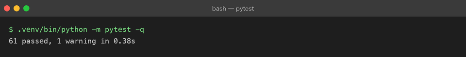

# Project 03 — Chapter 09：AI Application Architecture【应用架构】

> 状态：✅ 已校对
> 对应代码：`src/assistant/` 整体

---

## 1. 项目要增加什么能力

前八章各自解决了一个点。这一章把它们拼起来：

```text
Prompt（01）+ 消息（02）+ 结构化（03）+ 流式（04）+ 记忆（05）
+ 参数（06）+ 预算（07）+ 工具（08）
= ？
```

本章目标：

> **给出一套能长期维护的 AI 应用分层结构，并明确每层的职责边界与失败处理。**

---

## 2. 为什么需要这个知识

AI 应用有一种独特的「熵增」倾向：**所有东西都会往 Prompt 里掉**。

```text
第 1 周：  业务逻辑在 service.py 里，干干净净
第 4 周：  「这里让模型顺便判断一下吧」→ 逻辑进了 Prompt
第 8 周：  Prompt 变成 800 字的说明书，没人敢改
          改一行 Prompt，不知道会影响什么
```

这像极了早期 JSP 里写业务逻辑——能跑，但不可维护。

分层不是为了好看，是为了**让变化可控**：模型会换、Prompt 会改、工具会加，层与层之间的接口稳定，改动就只影响一层。

---

## 3. 核心概念

### 3.1 五层结构

```text
┌─────────────────────────────────────────┐
│ 接入层  cli.py / api.py                  │  参数解析、鉴权、协议（HTTP/SSE）
├─────────────────────────────────────────┤
│ 编排层  service.py / agent.py            │  业务流程：串起 prompt/memory/tools
├─────────────────────────────────────────┤
│ 能力层  prompts.py / schema.py / tools.py│  可独立测试的知识与能力
├─────────────────────────────────────────┤
│ 模型层  client.py / settings.py          │  唯一知道「怎么调 LLM」的地方
├─────────────────────────────────────────┤
│ 支撑层  logging / tokens.py / memory.py  │  可观测、预算、状态
└─────────────────────────────────────────┘
```

铁律：

> **只有模型层知道 API 长什么样。** 换厂商、换模型、加 mock，都只在 `client.py` 里改。

对比一下坏味道：

```python
# ❌ 编排层直接拼 HTTP
async def ask(text):
    async with httpx.AsyncClient() as c:
        r = await c.post("https://api.deepseek.com/...", json={...})
    return r.json()["choices"][0]["message"]["content"]
```

```python
# ✅ 编排层只依赖抽象
async def ask(self, text: str) -> str:
    return await self._client.chat(self._conversation.to_messages_with(text))
```

### 3.2 无状态服务 + 外部化会话

服务本身不保存会话（Chapter 05）：

```text
开发环境：dict[session_id, Conversation]     够用
生产环境：Redis / 数据库                      可多副本、重启不丢
```

好处是可以水平扩展；代价是要处理并发写与过期清理。

### 3.3 每条路径都要有失败处理

| 失败点 | 处理 |
|--------|------|
| 配置缺失 | 启动即失败，给出清晰的设置指引（P02 已做到 exit 2） |
| 上游限流 429 | 指数退避重试（P02 已实现） |
| 上游超时 | 设分层超时，返回明确错误而不是无限等 |
| 结构化输出不合规 | 校验失败重试一次（Chapter 03） |
| 历史超窗口 | 先裁剪，仍失败则提示开新会话（Chapter 07） |
| 工具循环失控 | 轮数上限（Chapter 08） |
| 客户端断开 | 取消上游、记录日志 |

### 3.4 可观测性：三个必埋的指标

```text
1. 延迟     latency_ms（含首字延迟 TTFB）
2. 消耗     prompt_tokens / completion_tokens / 估算费用
3. 失败率   按错误类型分类（限流 / 超时 / 解析失败 / 工具失败）
```

有了这三类，你才能回答「为什么这个月账单翻倍」「为什么用户说变慢了」。

### 3.5 测试策略

```text
Fake 模型    —— 所有模型调用走 BaseLLMClient 抽象，测试用 FakeClient（零网络零花费）
契约测试     —— Prompt 模板的变量校验、schema 生成结果用快照测试
集成测试     —— TestClient 打真实 HTTP 路径，但模型层仍是 Fake
Prompt 回归  —— 固定样例集，人工抽检（完全自动判定不现实）
```

原则：**测试里绝不出现真实 API Key，也绝不联网。**

### 3.6 成本与性能的三个杠杆

```text
1. 缓存     —— 相同 Prompt + 参数的结果缓存（尤其适合抽取/分类）
2. 裁剪     —— 历史预算控制（Chapter 05/07），成本从 O(n²) 降下来
3. 小模型   —— 简单任务路由到小模型，复杂任务才上大模型
```

---

## 4. 项目代码

```text
src/assistant/
├── cli.py            # 接入层：命令行
├── api.py            # 接入层：FastAPI（/chat /chat/stream /chat/structured /chat/agent）
├── service.py        # 编排层：普通问答
├── agent.py          # 编排层：工具循环
├── prompts.py        # 能力层：模板
├── schema.py         # 能力层：结构化输出
├── tools.py          # 能力层：工具注册表
├── memory.py         # 支撑层：会话与裁剪
├── tokens.py         # 支撑层：预算与成本
├── client.py         # 模型层：唯一知道 API 细节的地方（含 FakeClient）
├── settings.py       # 模型层：配置
├── errors.py         # 异常层级
└── logging_setup.py  # 支撑层：日志
```

一次请求的完整调用链：

```text
cli/api
  ↓ 解析参数、取 session_id
service.ask(text)
  ↓ memory.add_user(text)
  ↓ tokens 预算校验 → 必要时裁剪
  ↓ prompts 渲染（system / 场景 Profile）
  ↓ client.chat(messages, tools=?, response_format=?)
  ↓ schema 校验（结构化场景）
  ↓ memory.add_assistant(reply)；记录 usage 到日志
  ↓ 返回
```

---

## 5. Java ↔ Python 对比

| Java (Spring Boot) | Python (本项目) | 说明 |
|--------------------|-----------------|------|
| `@RestController` | FastAPI `APIRouter` | 接入层 |
| `@Service` | `service.py` / `agent.py` | 编排层 |
| `@Component` / 工具类 | `prompts.py` / `tools.py` | 能力层 |
| `@Repository` / `RestClient` | `client.py` | **外部依赖的封装，最该被隔离的一层** |
| 接口 + 实现类（可换实现） | `BaseLLMClient` ABC + `FakeClient` | 依赖倒置，可测可换 |
| `@ConfigurationProperties` | `Settings` frozen dataclass | 配置 |
| 自定义异常 + `@ControllerAdvice` | `errors.py` + FastAPI exception handler | 异常分层 |
| Micrometer + Actuator | usage 日志 + `/metrics` | 可观测 |
| `@Valid` | Pydantic | 边界校验 |

一个值得记住的原则（两边都成立）：

> **外部依赖（数据库、HTTP 客户端、LLM）必须被接口隔离。** 否则单元测试只能靠 mock 框架打补丁，而依赖倒置让你直接换一个实现。

---

## 6. 常见坑

### 坑 1：业务逻辑写进 Prompt

「让模型顺便判断一下用户是不是 VIP」——这个判断进了 Prompt，就意味着：没法单测、没法灰度、改了没痕迹。

正确做法：VIP 判断是传统代码的事，结果作为参数喂给 Prompt。

### 坑 2：编排层直接用 httpx

见 3.1。这是最常见的分层破坏。

### 坑 3：同步阻塞

在 async 函数里用同步的 `requests` / `time.sleep()`，会把整个事件循环堵死（P02 Chapter 01 已讲）。

### 坑 4：没有幂等与重试边界

重试对「生成文本」是安全的，对「写数据库」不是。工具层要区分只读与写入。

### 坑 5：日志里记了用户原文

用户可能输入手机号、身份证。日志脱敏不只是脱 API Key。

### 坑 6：全局单例会话

Chapter 05 坑 3，属于数据泄漏级别。

### 坑 7：把配置散落在各层

「这个超时时间写在 client.py，那个写在 api.py」——统一进 `Settings`。

---

## 7. 实战挑战

**挑战 1**：画出（或写出）本项目一次请求的完整调用链，标注每层负责什么。

**挑战 2**：加一个 `/metrics` 端点或用日志输出：累计请求数、失败率、累计 token 与估算费用。

**挑战 3（进阶）**：实现「小模型路由」——简单问答走便宜模型，命中关键词（如「分析」「总结」）时走强模型，并在日志里记录路由决策。

---

## 8. 主动回忆

1. 五层分别是什么？哪一层是「唯一知道 API 长什么样」的？
2. 为什么业务逻辑不该写进 Prompt？
3. 服务为什么要做成无状态？会话存哪？
4. AI 应用必须埋的三种可观测指标是什么？
5. 测试策略里，为什么强调「零网络、零真实 Key」？
6. 降低成本与延迟的三个杠杆是什么？
7. 重试在什么场景下是危险的？

---

## 9. 本节完成标准

- [ ] `src/` 的目录符合五层结构，编排层不出现 httpx / API URL
- [ ] 换模型厂商只需要改 `client.py` + `settings.py`
- [ ] 全部测试离线运行（FakeClient），无真实 Key
- [ ] 日志里有 latency / token / 错误类型三类信息
- [ ] CLI 与 API 两条入口复用同一个 service
- [ ] 有真实运行验证：普通问答、流式、结构化、工具调用四条路径全通

**Project 03 完成。** 此时的能力闭环：

```text
Prompt 工程 + 消息结构 + 结构化输出 + 流式 + 记忆
+ 参数调优 + 成本预算 + 工具调用 + 分层架构
= 一个真正可用的 AI 应用（而不只是「会聊天的壳」）
```

回到项目主页：[../README.md](../README.md)
下一步：Project 04 —— 让应用拥有外部知识（RAG）。

## 测试策略

整套 `src/` 用 `FakeClient`（不联网、不用真实 Key）做离线测试，当前 **61 / 61 通过**：


