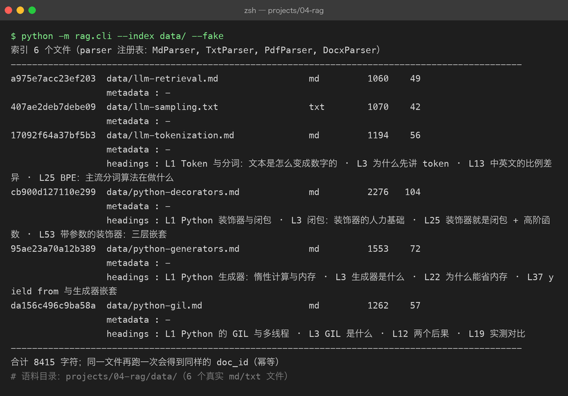

# Project 04 — Chapter 01：Document Ingestion【文档摄入】

> 状态：✅ 已成文（文档先行，作为 src/ 落地设计依据）
> 对应代码：`src/rag/parsers.py`（BaseParser + 四个格式适配器）、`src/rag/document.py`（Document）

---

## 1. 本章要解决什么问题

很多人以为 RAG 的第一步是「检索」，其实不是。RAG 的第一步是：**把世界上乱七八糟的文档变成干净文本**。

你的知识库输入不会只有 `.txt`。真实场景里有 PDF、Word、Markdown、网页导出的 HTML……它们长这样：

```text
你以为：  拿到文档 = 拿到一段干净的字符串
实际上：  PDF 是排版指令（"在第 3 页的 (x, y) 画这几个字"）
          docx 是压缩包（一坨 XML 打包成 zip）
          Markdown 是带语法噪音的文本（##、```、[]()）
```

Garbage in, garbage out【垃圾进，垃圾出】——这句老话在 RAG 里格外贴切：解析阶段丢了一段、乱序了一栏、混进了一页页眉，后面的切分、向量化、检索全都是在放大这个错误，而且**你几乎查不出来**（检索结果"差不多但不准"，很难联想到是三个月前某个 PDF 解析坏了）。

本章目标：

> **设计一个格式适配器体系，把 .txt / .md / .pdf / .docx 统一解析成干净文本 + 元数据。**

---

## 2. 为什么需要这个知识

RAG 流水线的第一环决定了整个系统的上限：

```text
解析质量 → 切分质量 → 向量质量 → 检索质量 → 回答质量
```

每一环都只能继承上一环的垃圾，无法自救。所以摄入阶段要守住两条底线：

1. **不丢信息**：正文、标题、页码都要留下（页码后面检索溯源要用）。
2. **不多噪音**：页眉、页脚、乱码、控制字符要在源头清掉，不要留给下游。

同时，格式会不断增加（说不定哪天要支持 epub、HTML）。如果写成一坨 `if ext == ".pdf": ... elif ext == ".docx": ...`，每加一种格式就要改老代码。**Java 里这叫开闭原则**：对扩展开放、对修改关闭。用格式适配器（parser per format）来解决。

---

## 3. 核心概念

### 3.1 统一的产物：Document dataclass

不管什么格式，解析器的输出都是同一个结构——这是整条流水线的"通用货币"：

```python
# src/rag/document.py
from dataclasses import dataclass, field

@dataclass
class Document:
    doc_id: str                  # 内容哈希，见 3.3
    source: str                  # 文件路径 / 来源标识
    text: str                    # 解析后的干净正文
    metadata: dict = field(default_factory=dict)
    # metadata 约定存：format / size_bytes / page_count / parsed_at
```

**metadata 不是可选项，是检索溯源的生命线。** 检索命中一段文字后，用户会问"这出自哪里？"——没有 `source` 和页码，RAG 就成了无出处的一本正经胡说。

### 3.2 格式适配器：BaseParser + 四个实现

Java 里你写过策略模式或 SPI（`java.nio.file.spi.FileSystemProvider` 就是这个味道）：定义接口，每种实现处理一种情况，运行时按 key 选择。**Java 里叫 Parser 接口 + 一组 `@Component` 实现，Python 里用 `ABC` + 注册表字典，思路完全一样：**

```python
# src/rag/parsers.py
from abc import ABC, abstractmethod
from pathlib import Path

class BaseParser(ABC):
    """所有格式解析器的抽象基类：输入文件路径，输出 Document。"""

    supported_extensions: tuple[str, ...] = ()

    @abstractmethod
    def parse(self, path: Path) -> Document:
        ...

    @classmethod
    def supports(cls, path: Path) -> bool:
        return path.suffix.lower() in cls.supported_extensions
```

四个实现各管一种格式，各自封装该格式的"脏活"：

```python
import hashlib
import re
import time
from dataclasses import dataclass, field
from pathlib import Path

from pypdf import PdfReader
from docx import Document as DocxDocument   # python-docx


def _make_doc(path: Path, text: str, extra: dict) -> Document:
    clean = text.replace("\x00", "").strip()
    return Document(
        doc_id=hashlib.sha256(clean.encode("utf-8")).hexdigest()[:16],
        source=str(path),
        text=clean,
        metadata={
            "format": path.suffix.lower().lstrip("."),
            "size_bytes": path.stat().st_size,
            "parsed_at": time.strftime("%Y-%m-%d %H:%M:%S"),
            **extra,
        },
    )


class TxtParser(BaseParser):
    supported_extensions = (".txt",)

    def parse(self, path: Path) -> Document:
        text = path.read_text(encoding="utf-8", errors="strict")
        return _make_doc(path, text, {})


class MdParser(BaseParser):
    supported_extensions = (".md", ".markdown")

    # Markdown 是纯文本的超集，但有两个必须做的预处理：
    # 1) 保留代码围栏（后续切分时不能按句号切开代码块）
    # 2) 标题层级是天然语义边界，保留到 metadata 供 02 章使用
    _HEADING_RE = re.compile(r"^(#{1,6})\s+(.*)$")

    def parse(self, path: Path) -> Document:
        raw = path.read_text(encoding="utf-8", errors="strict")
        headings: list[dict] = []
        for lineno, line in enumerate(raw.splitlines(), start=1):
            m = self._HEADING_RE.match(line)
            if m:
                headings.append({"level": len(m.group(1)), "title": m.group(2).strip(), "line": lineno})
        return _make_doc(path, raw, {"headings": headings})


class PdfParser(BaseParser):
    supported_extensions = (".pdf",)

    def parse(self, path: Path) -> Document:
        reader = PdfReader(str(path))
        parts: list[str] = []
        for i, page in enumerate(reader.pages, start=1):
            page_text = (page.extract_text() or "").replace("\x00", "").strip()
            parts.append(f"[第 {i} 页]\n{page_text}")   # 页码内联，切分时可携带
        full = "\n\n".join(parts)
        return _make_doc(path, full, {"page_count": len(reader.pages)})


class DocxParser(BaseParser):
    supported_extensions = (".docx",)

    def parse(self, path: Path) -> Document:
        doc = DocxDocument(str(path))
        lines = [p.text for p in doc.paragraphs if p.text.strip()]
        return _make_doc(path, "\n\n".join(lines), {})
```

### 3.3 解析器注册表与入口

用注册表代替 if-elif，新增格式 = 新增一个类 + 注册一行，老代码零改动：

```python
PARSERS: list[type[BaseParser]] = [MdParser, DocxParser, PdfParser, TxtParser]


def ingest(path: str | Path) -> Document:
    path = Path(path)
    if not path.is_file():
        raise FileNotFoundError(f"文件不存在: {path}")
    for parser_cls in PARSERS:
        if parser_cls.supports(path):
            return parser_cls().parse(path)
    raise ValueError(f"不支持的格式: {path.suffix!r}（支持 .txt/.md/.pdf/.docx）")
```

### 3.4 doc_id 为什么用内容哈希

Java 里你可能习惯用 UUID 或自增 ID。但知识库会**重复摄入**同一个文件（重建索引、增量更新），用文件名或 UUID 做主键会产生两条一样的记录。对内容做 SHA-256 后取前 16 位：

- 同一个文件重复摄入 → 同一个 `doc_id` → 天然幂等（upsert 覆盖）；
- 文件内容改了 → `doc_id` 变化 → 新旧版本可以区分。

**Java 里这类似数据库用 `ON DUPLICATE KEY UPDATE` 依赖业务唯一键，Python 里直接让 ID 从内容派生，更省心。**

---



## 4. 动手实现（设计稿）

以下代码将在 `src/rag/` 落地时实现，现在当设计稿读。目标文件结构：

```text
src/rag/
├── document.py    # Document dataclass
├── parsers.py     # BaseParser + Txt/Md/Pdf/Docx + ingest() 入口
└── __init__.py
```

关键实现思路（补全上面的骨架）：

1. **TxtParser 的 encoding 兜底**：先尝试 utf-8，捕获 `UnicodeDecodeError` 后回退 `gbk`，再不行回退 `latin-1`（保证永远能读出来，宁可出噪音也别崩）。`errors="strict"` 的版本是教学简化，落地版写成三层回退：

```python
def _read_text_fallback(path: Path) -> str:
    for enc in ("utf-8", "gbk", "latin-1"):
        try:
            return path.read_text(encoding=enc)
        except UnicodeDecodeError:
            continue
    raise ValueError(f"无法解码文件（尝试过 utf-8/gbk/latin-1）: {path}")
```

2. **PDF 页眉页脚清洗**：解析完所有页后做一次统计——出现在超过 60% 页面开头/结尾且长度 < 40 字符的行，判定为页眉页脚，整批删掉。这是"用统计对抗噪音"，比硬编码页码可靠。

3. **docx 表格**：`python-docx` 的 `doc.paragraphs` 不含表格内容，落地版要遍历 `doc.tables`，把每个单元格用 ` | ` 拼接成行文本，否则表格信息全部丢失。

4. **Markdown 代码围栏标记**：`MdParser` 在 ``` 围栏前后插入哨兵注释，供 02 章的切分器识别"这段是代码，不许按句号拆"。

5. **依赖安装**：

```bash
pip install pypdf python-docx
```

---

## 5. 踩坑清单

### 坑 1：Windows 产出的 txt 用 utf-8 读直接炸

- **现象**：`UnicodeDecodeError: 'gbk' codec can't decode`（或反过来 utf-8 报错），文件明明是正常中文文档。
- **原因**：Windows 记事本/某些老系统默认编码是 gbk，macOS/Linux 默认 utf-8。文本文件**没有自我声明的编码**，扩展名 .txt 不代表 utf-8。
- **正确做法**：永远显式传 `encoding=`，并做三层回退（utf-8 → gbk → latin-1）或用 `chardet` 探测。**Java 里 `new FileReader(file)` 也踩同一个坑（依赖平台默认编码），所以 Java 17 引入了 `Files.readString(path, Charset)` 强制显式传参——Python 同理，`open()` 不传 encoding 是欠账。**

### 坑 2：PDF 提取出 `\x00`，后续 embedding API 直接 400

- **现象**：本地解析正常，调 embedding 接口时报 `invalid request`，错误信息完全没提哪个字符有问题。
- **原因**：某些 PDF 的字体编码表异常，`pypdf` 提取出的文本里混入 null 字符 `\x00`，部分 API 侧校验会拒绝。
- **正确做法**：在 `_make_doc` 的统一出口处 `text.replace("\x00", "")`，并且可以做一层更狠的清洗：删掉所有 C0 控制字符（保留 `\n` 和 `\t`）。**清洗逻辑放在统一出口，而不是各 parser 里各写一遍——入口多个、出口只有一个，这是防漏的关键。**

### 坑 3：用文件名当 doc_id，同名的两个文件互相覆盖

- **现象**：`notes/README.md` 和 `project-b/README.md` 都叫 README，入库后只剩一条；或者文件改了名，同一段内容被存了两份。
- **原因**：文件名是"位置信息"不是"内容身份"，重命名、同名目录都会让它失效。
- **正确做法**：`doc_id = sha256(清洗后的正文)[:16]`，文件名只放进 `metadata["source"]` 做展示。

### 坑 4：pypdf 把双栏 PDF 拆成"左右交错"的乱序文本

- **现象**：解析出的文字内容是对的，但读起来像这样：第一行是左栏前半句，第二行是右栏前半句……检索命中后给模型看，模型的理解完全错乱。
- **原因**：`extract_text()` 按几何坐标的行序输出，双栏排版在同一行高度上有左右两段文字。
- **正确做法**：先用 `page.extract_text(extraction_mode="layout")` 尝试保布局模式；仍然乱序就换 `pdfplumber` 按 x 坐标分栏；实在不行只对纯文本型文档做 RAG，扫描件交给 OCR 流水线（超出本章范围，先知道有这条路）。

---

## 6. 自检清单

- [ ] 能说清 RAG 第一步为什么是摄入而不是检索（垃圾进 = 垃圾出）
- [ ] 能写出 `BaseParser` ABC 并解释它对应 Java 的哪种模式（策略 / SPI）
- [ ] 四种格式各说出一个解析层面的坑（md 代码围栏 / pdf 双栏 / docx 表格 / txt 编码）
- [ ] `Document` 的 metadata 里存了什么，检索溯源时分别用在哪里
- [ ] 能解释 doc_id 用内容哈希而不是文件名/UUID 的理由
- [ ] 清洗逻辑（控制字符、编码回退）放在统一出口而不是各 parser 内

---

回到项目主页：[../README.md](../README.md)

下一章：[02-chunking.md](02-chunking.md) —— 拿到了整篇干净文本，为什么还要把它切碎？
