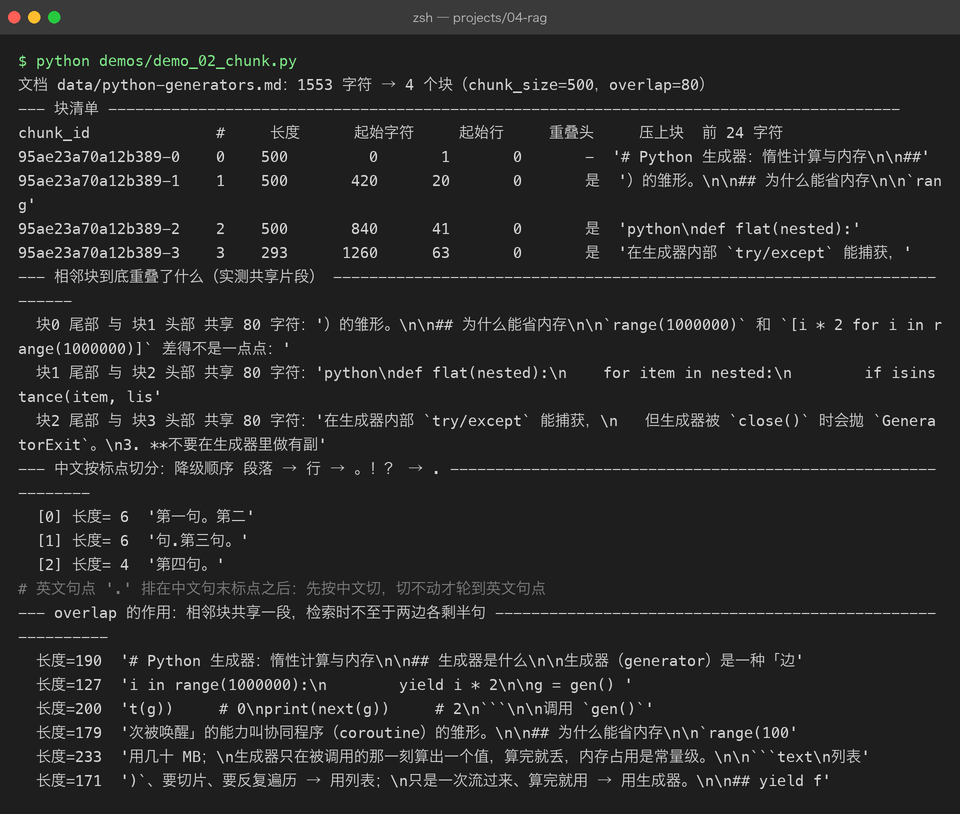

# Project 04 — Chapter 02：Chunking【文档切分】

> 状态：✅ 已成文（文档先行，作为 src/ 落地设计依据）
> 对应代码：`src/rag/chunker.py`（`Chunk` + `chunk_text()` + `recursive_split()`）

---

## 1. 本章要解决什么问题

Chapter 01 的产物是一篇篇完整的 `Document`。看起来"整篇文档直接入库"最省事——为什么不呢？

三个原因，每个都足够致命：

1. **上下文窗口有限**。检索到 10 篇文档、每篇 2 万字，塞给模型的 prompt 直接爆炸。你只能选一小部分塞进去，那"选的部分"其实就是隐式切分——不如自己显式地控制。
2. **检索粒度 = 答案粒度**。用户问"RAG 的 overlap 参数是干嘛的"，理想命中的是**那一小段**讲 overlap 的文字，而不是整篇 50 页的教程。你存什么粒度，就只能检索到什么粒度。
3. **Embedding 的语义稀释**（下一章细讲）。一篇长文档被压成一个向量，这个向量是"全文大意"的平均味道——而用户的 query 是具体的小问题，大意对不上小问题。

```text
你以为：  文档越完整，模型知道得越多，回答越好
实际上：  检索的单位是"块"，块的粒度决定答案的精度；
          整篇存整篇检索 = 用大炮的瞄准镜找一只蚊子
```

本章目标：

> **把整篇 Document 切成大小合适、边界不切断答案的 Chunk，并保留溯源信息。**

---

## 2. 为什么需要这个知识

Chunking 是 RAG 里"最不起眼但收益最高"的一环：换 embedding 模型、换向量库都是边际提升，**切分策略错了，后面的所有优化都是在错误的地基上装修**。

两个核心参数必须真正理解，而不是背默认值：

| 参数 | 含义 | 太大的后果 | 太小的后果 |
|------|------|-----------|-----------|
| `chunk_size` | 每块的目标长度 | 块向量是大意，检索不准；塞 prompt 也费 token | 一句话被拆散，检索到的块没有上下文，模型看不懂 |
| `overlap` | 相邻块重叠的长度 | 浪费存储和 token | 答案正好跨在两个块的边界上被切断，两边都检索不到完整答案 |

`overlap` 的存在动机值得单独说：答案经常恰好落在切分边界上。比如"overlap 的作用是防止答案被切断"这句话，按 500 字切正好断在中间——两个块各拿到半句，都不完整。相邻块重叠 80 字，边界内容就会完整地出现在至少一个块里。

**Java 里这个概念你天天见：分页。** `chunk_size` 就是 `pageSize`，`overlap` 就是"下一页往前回退几条"。切大文件的道理也一样：Java 里按固定字节数分批读大文件时，也要考虑边界记录被截断的问题——Python 里 `chunk_text()` 干的是同一件事，只是边界单位从"字节"换成了"语义"。

---

## 3. 核心概念

### 3.1 Chunk dataclass：切分产物必须可溯源

切完之后，"这段话出自哪篇文档的哪个位置"必须跟着块走：

```python
# src/rag/chunker.py
from dataclasses import dataclass, field

@dataclass
class Chunk:
    chunk_id: str        # f"{doc_id}-{index}"
    doc_id: str          # 指回 Document，溯源链的关键
    text: str
    index: int           # 在原文档中的序号，用于恢复顺序
    metadata: dict = field(default_factory=dict)
    # metadata 里合并 Document.metadata（source/格式/页码）+ 自己的 start_char
```

注意 `chunk_id = f"{doc_id}-{index}"`：内容哈希做前缀意味着文档变了块 ID 全变，重建索引是安全的覆盖式操作——这和 Chapter 01 的幂等设计一脉相承。

### 3.2 三种切分策略

| 策略 | 做法 | 优点 | 缺点 | 何时用 |
|------|------|------|------|--------|
| 固定长度 | 每 N 个字符切一刀 | 简单、可预期 | 经常把句子/概念拦腰斩断 | 基线、日志类无结构文本 |
| 递归分隔符（推荐） | 按 `\n\n` → `\n` → 句号 → 强制切的顺序降级 | 尽量贴着自然段落边界切，实现也就 30 行 | 段落极长时退化成固定长度 | **默认选择** |
| 语义切分 | 句子两两算 embedding 相似度，相似度骤降处切 | 边界最贴合语义 | 要先跑一遍 embedding，成本高 | 进阶，本章只提一句 |

递归分隔符的直觉：**优先在段落之间切（`\n\n`），段落太长就在句子之间切，句子太长才硬切。** 语义边界的优先级从高到低降级，所以叫"递归"。

### 3.3 长度单位：token 估算

`chunk_size=500` 的"500"是什么单位？字符还是 token【词元】？

生产上应该用 tokenizer 精确数；本章沿用 P03 的估算思路——**英文约 4 字符/token，中文约 1.5~2 字符/token，混合文本用 `len(text) / 1.6` 估算**：

```python
def estimate_tokens(text: str) -> int:
    """粗略估算 token 数，只用于 sizing，不用于计费判断。"""
    return max(1, int(len(text) / 1.6))
```

为什么可以估：切分的 size 是一个工程参数不是法律条款，±20% 的误差不影响检索质量。**Java 里你也会用 `text.length() / 2` 粗估中英混排的宽度来排版，同一个量级的妥协。**

---



## 4. 动手实现（设计稿）

以下代码将在 `src/rag/chunker.py` 落地时实现，现在当设计稿读。

```python
def split_with_overlap(text: str, size: int, overlap: int) -> list[str]:
    """固定长度切分：步长 = size - overlap。"""
    if overlap >= size:
        raise ValueError(f"overlap({overlap}) 必须小于 size({size})，否则 死循环/原地踏步")
    pieces: list[str] = []
    step = size - overlap
    for start in range(0, len(text), step):
        piece = text[start:start + size]
        if piece.strip():
            pieces.append(piece)
        if start + size >= len(text):
            break
    return pieces


def recursive_split(text: str, size: int, overlap: int,
                    separators: list[str] | None = None) -> list[str]:
    """递归分隔符切分：优先大边界，降级到强制切。"""
    seps = separators if separators is not None else ["\n\n", "\n", "。", "！", "？", "."]
    if len(text) <= size:
        return [text] if text.strip() else []

    # 找到第一个"切得动"的分隔符
    for sep in seps:
        if sep in text:
            parts = text.split(sep)
            break
    else:
        # 所有分隔符都切不动：按字符强制切（带 overlap）
        return split_with_overlap(text, size, overlap)

    # 贪心合并：小段攒成不超过 size 的块
    chunks: list[str] = []
    buffer = ""
    for part in parts:
        candidate = (buffer + sep + part) if buffer else part
        if len(candidate) <= size:
            buffer = candidate
        else:
            if buffer:
                chunks.append(buffer)
            if len(part) <= size:
                buffer = part
            else:
                # 单段超长：用下一级分隔符继续递归切它
                chunks.extend(recursive_split(part, size, overlap, seps[1:]))
                buffer = ""
    if buffer:
        chunks.append(buffer)

    # 给相邻块补 overlap：取前一块尾部 overlap 个字符接到下一块开头
    if overlap > 0:
        glued: list[str] = []
        for i, c in enumerate(chunks):
            if i > 0 and chunks[i - 1]:
                head = chunks[i - 1][-overlap:]
                glued.append(head + c)
            else:
                glued.append(c)
        chunks = glued
    return chunks


def chunk_text(text: str, size: int = 500, overlap: int = 80) -> list[str]:
    """对外主入口。size/overlap 的单位是字符（粗对齐 token）。"""
    if size <= 0 or overlap < 0:
        raise ValueError("size 必须为正，overlap 不能为负")
    return recursive_split(text, size, overlap)


def chunk_document(doc: "Document", size: int = 500, overlap: int = 80) -> list[Chunk]:
    """Document → list[Chunk]，逐块带上溯源信息。"""
    from .document import Document  # 落地时移到模块顶部
    pieces = chunk_text(doc.text, size, overlap)
    chunks: list[Chunk] = []
    cursor = 0
    for i, piece in enumerate(pieces):
        start = doc.text.find(piece, cursor)          # 记录在原文中的位置
        cursor = start + len(piece)
        chunks.append(Chunk(
            chunk_id=f"{doc.doc_id}-{i}",
            doc_id=doc.doc_id,
            text=piece,
            index=i,
            metadata={**doc.metadata, "start_char": start},
        ))
    return chunks
```

关键实现思路：

1. **`overlap >= size` 直接抛异常**：步长 `size - overlap` 会变成 0，切分死循环。这个参数约束要在入口处把守，**Java 里 `@Min` 校验干的就是这事**。
2. **`chunk_document` 里 `find(piece, cursor)` 用游标**：既拿到真实的 `start_char`，又避免内容重复的块被 find 到错误位置。
3. **Markdown 文档走专用预处理**：Chapter 01 留下的代码围栏哨兵在这里生效——围栏内的文本按 `\n` 切而不是按句号切，绝不把代码按 `。` 拦腰斩断；`headings` 元数据用于在块 metadata 上标注"本块属于哪个章节标题下"，检索命中后能展示出处章节。
4. **`size=500, overlap=80` 是本章默认值，不是普适最优**：落地后用真实文档调参，经验范围 size 在 300~800、overlap 在 size 的 10%~20%。

---

## 5. 踩坑清单

### 坑 1：chunk 太大，检索"好像都相关但都不准"

- **现象**：top-5 检索结果每块都沾边，但答案质量差；塞进 prompt 又贵又稀释。
- **原因**：块越大，块向量越代表"全文大意"，而 query 是具体小问题，大意匹配不出小问题的相关性。
- **正确做法**：从 size=500 起步，检索不准时**优先调小块**（如 300），观察命中片段是否变准，而不是先换 embedding 模型。

### 坑 2：chunk 太小，检索命中了"正确但没有上下文"的碎片

- **现象**：命中一个孤句"它需要先经过向量化"，模型不知道"它"是谁，回答瞎猜。
- **原因**：块小于完整语义单元，指代、主语全在上一块里。
- **正确做法**：适当加大 size；更稳的做法是检索命中后**带上相邻块**（`index-1` 和 `index+1` 一起给模型），或给每块补上所属章节标题作为上下文前缀。

### 坑 3：中文文本用英文习惯切分，块里全是碎句

- **现象**：按 `.` 或空格切中文，一个块里七八个半截句子，句号（中文是 `。`）压根没当边界。
- **原因**：英文以空格分词、句号结束；中文没有空格，句末是全角 `。！？`。**Java 里处理 i18n 文本不也要注意 `BreakIterator` 的 locale 吗——同一类教训。**
- **正确做法**：分隔符序列里**中文句末标点必须排在英文 `.` 前面**，如上面的 `["\n\n", "\n", "。", "！", "？", "."]`。绝不要按空格切中文。

### 坑 4：overlap 导致同一段话被检索重复命中

- **现象**：top-5 里有三个块内容几乎一样（都是 overlap 区的重复），浪费了 prompt 空间，还让"5 个来源"变成"1 个来源说三遍"。
- **原因**：overlap 让相邻块共享一段文本，检索时这段文本在多个块里都算命中。
- **正确做法**：检索后做去重——相邻块（index 连续）且重叠部分占比高的，合并或只保留信息量最大的一块；prompt 组装阶段按 `doc_id + index` 排序后再去重。

### 坑 5：`overlap >= size` 没做校验，切分器悄悄死循环

- **现象**：`chunk_text("...", size=100, overlap=120)` 程序卡死，CPU 飙满。
- **原因**：步长 `size - overlap` ≤ 0，窗口永远不前进。
- **正确做法**：入口处参数校验直接 raise（见设计稿），不要相信调用方。

---

## 6. 自检清单

- [ ] 能不看笔记说出"为什么必须切"的三个原因（上下文窗口 / 检索粒度 / 语义稀释）
- [ ] 能解释 overlap 的存在动机：答案被边界切断
- [ ] 能写出递归分隔符的降级顺序，并说出为什么中文分隔符要排前面
- [ ] `Chunk` 里 `doc_id` 和 `index` 各自用于什么（溯源 / 恢复顺序与取相邻块）
- [ ] size/overlap 单位是字符，能说出 `len/1.6` 估算 token 的适用范围
- [ ] 知道检索侧重复命中的去重时机（检索后、prompt 组装前）

---

上一章：[01-document-ingestion.md](01-document-ingestion.md) —— 把乱七八糟的文档变成干净文本

下一章：[03-embedding.md](03-embedding.md) —— 文本切好了，怎么让机器"理解"它说的是什么？
