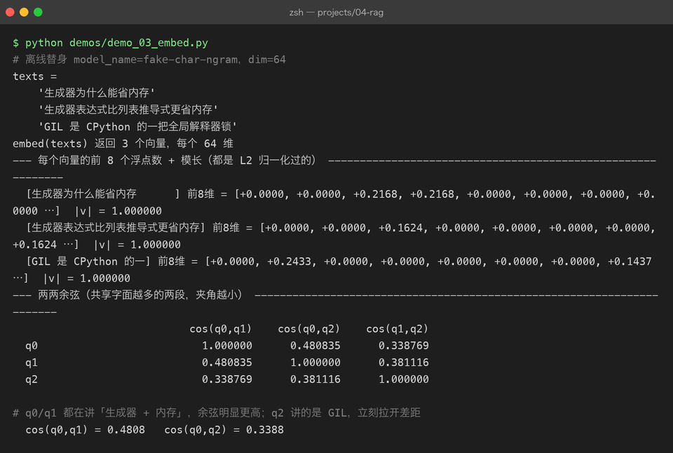
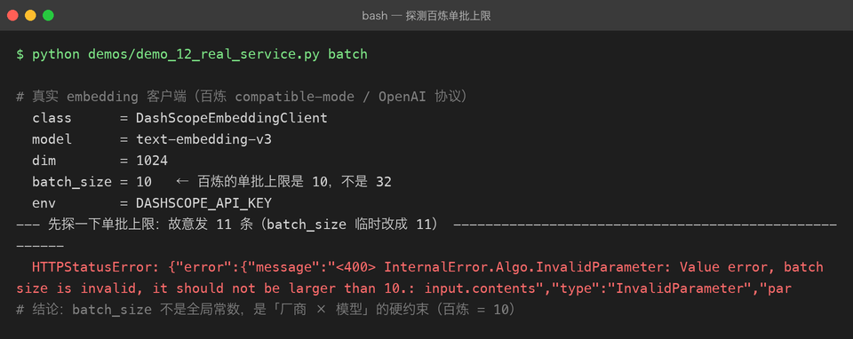
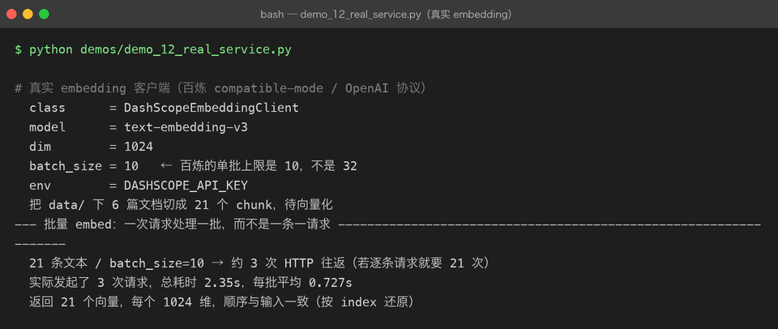

# Project 04 — Chapter 03：Embedding【文本向量化】

> 状态：✅ 已成文（文档先行，作为 src/ 落地设计依据）
> 对应代码：`src/rag/embedding.py`（`BaseEmbeddingClient` + `SiliconFlowEmbeddingClient` + `FakeEmbeddingClient`）

---

## 1. 本章要解决什么问题

Chapter 02 结束时，我们手里是一堆干净的 `Chunk`。现在来了一个用户问题："RAG 为什么要 overlap？"

问题来了：**计算机怎么判断"这个问题"和"那个块"是在说同一件事？**

字符串匹配不行——问题里没有"overlap"这个词的块（比如某块写"相邻块之间的重复区域是为了……"）照样是正确答案。关键词匹配也不行——同义词、改写、中英混说，关键词永远追不上。

答案是把文本变成**向量**，让"意思接近"变成"距离接近"，然后用数学比较：

```text
你以为：  机器读懂了文本的含义
实际上：  机器只是把文本压成一个高维坐标点，
          训练让"语义相近的文本"落在相邻的位置——
          "读懂"是幻觉，"可计算的相近"才是真的
```

本章目标：

> **设计一个可替换的 embedding 客户端体系：真实 API + 离线 Fake，统一走批量异步接口。**

---

## 2. 为什么需要这个知识

### Embedding 是什么

Embedding【嵌入/向量化】把一段文本映射成一个**定长向量**（比如 1024 个浮点数），由一个预训练的嵌入模型完成。它的核心性质：

> **哈希是"精确相等"的指纹，embedding 是"语义相似"的指纹。**

- SHA-256（Chapter 01 用过）：内容变一个比特，指纹完全不同——它能回答"这两段文本一模一样吗"。
- Embedding：两段说得差不多的话，向量在空间里很接近——它能回答"这两段文本意思接近吗"。

这是本章必须建立的核心直觉：**我们第一次拥有了"语义"的可运算表示。**

### 两个基本属性

1. **维度**：不同模型的向量维度不同（bge-m3 是 1024，OpenAI text-embedding-3-small 是 1536）。维度本身没有优劣，但**同一张向量表里必须全是同一个模型、同一个维度**。
2. **归一化**：多数嵌入模型输出已做 L2 归一化（模长为 1）。归一化之后，余弦相似度和欧氏距离可以互相换算，用哪个距离度量都等价。落地时可以用模长验证一下模型输出是否已归一化。

### 查询与文档要"同一种语言"

用户 query 也要被 embed 成向量，再去和文档向量比距离。**查询和文档必须用同一个嵌入模型**——不同模型的向量空间互不相通（第 5 节详述）。

---

## 3. 核心概念

### 3.1 嵌入模型选型

| 模型 | 维度 | 说明 |
|------|------|------|
| BAAI/bge-m3 | 1024 | 中文最强开源系之一，多语言、支持长文本（8192 token），SiliconFlow 可直接调 |
| BAAI/bge-large-zh-v1.5 | 1024 | 中文专用老将，轻量、稳定 |
| OpenAI text-embedding-3-small | 1536 | 效果好、贵一点；国内直连不稳 |
| SiliconFlow API 托管的 bge 系列 | 1024 | 国内 API 访问稳定、价格低，**本章首选** |

一个必须点明的坑：**DeepSeek 没有 embedding API。** DeepSeek 只提供 chat 模型——很多人"用 DeepSeek 做 RAG"时想当然以为它家也有 embedding，没有。RAG 里 LLM 负责生成，embedding 是另一家的事（本项目：SiliconFlow 托管的 bge 系列做嵌入，LLM 另选）。

### 3.2 接口抽象：延续 P02/P03 的 FakeClient 模式

P02/P03 已经建立了"接口 + 多实现"的模式：`BaseLLMClient` 抽象，真实客户端和 `FakeLLMClient` 互换。embedding 沿用同一套思路：

```python
# src/rag/embedding.py
from abc import ABC, abstractmethod

class BaseEmbeddingClient(ABC):
    """嵌入客户端抽象。注意：接口是批量的。"""

    model_name: str = ""
    dim: int = 0

    @abstractmethod
    async def embed(self, texts: list[str]) -> list[list[float]]:
        """一批文本 → 一批向量，顺序与输入一一对应。"""
        ...

    async def embed_one(self, text: str) -> list[float]:
        return (await self.embed([text]))[0]
```

**为什么接口是批量 `embed(texts: list[str])` 而不是单个 `embed_one(text: str)`？** 一句话向量化一次 HTTP 往返，1000 个块就是 1000 次请求——限流、延迟全爆。批量接口一次往返处理几十上百条，这是 embedding 和 chat 最大的接口差异。`embed_one` 只是批量的单元素便捷方法。

**Java 里这就是典型的"接口 + 多实现 + 依赖注入"**：`EmbeddingClient` 接口，`@Profile("prod")` 的真实实现和 `@Profile("test")` 的 Fake 实现，上层 `VectorStore` 只依赖接口。Python 里没有容器帮你注入，但同样的模式靠"构造函数传入实现"手工达成——**Java 里叫 DI，Python 里叫"把依赖当参数传"，是同一个设计**。

### 3.3 真实实现：SiliconFlow + httpx 异步

```python
import asyncio

import httpx


class SiliconFlowEmbeddingClient(BaseEmbeddingClient):
    model_name = "BAAI/bge-m3"
    dim = 1024

    BASE_URL = "https://api.siliconflow.cn/v1/embeddings"
    BATCH_SIZE = 32          # 单请求最多多少条文本
    MAX_RETRIES = 3

    def __init__(self, api_key: str, batch_size: int = 32):
        self.api_key = api_key
        self.batch_size = batch_size

    async def embed(self, texts: list[str]) -> list[list[float]]:
        vectors: list[list[float]] | None = None
        for i in range(0, len(texts), self.batch_size):
            batch = [t[:8000] for t in texts[i:i + self.batch_size]]  # 超长截断，见 5.3
            batch_vectors = await self._embed_batch_with_retry(batch)
            vectors = batch_vectors if vectors is None else vectors + batch_vectors
        assert vectors is not None
        return vectors

    async def _embed_batch_with_retry(self, batch: list[str]) -> list[list[float]]:
        delay = 1.0
        for attempt in range(1, self.MAX_RETRIES + 1):
            try:
                return await self._embed_batch(batch)
            except RateLimitError:
                if attempt == self.MAX_RETRIES:
                    raise
                await asyncio.sleep(delay)          # 指数退避：1s → 2s → 4s
                delay *= 2

    async def _embed_batch(self, batch: list[str]) -> list[list[float]]:
        async with httpx.AsyncClient(timeout=30) as client:
            resp = await client.post(
                self.BASE_URL,
                headers={"Authorization": f"Bearer {self.api_key}"},
                json={"model": self.model_name, "input": batch},
            )
        if resp.status_code == 429:
            raise RateLimitError("embedding 触发限流")
        resp.raise_for_status()
        data = sorted(resp.json()["data"], key=lambda d: d["index"])  # 按 index 还原顺序！
        return [item["embedding"] for item in data]


class RateLimitError(Exception):
    pass
```

两个容易忽略的细节：**响应里按 `index` 字段重新排序**（有的服务不保证返回顺序与请求一致），以及**限流用指数退避重试**而不是立刻重试。

### 3.4 离线实现：FakeEmbeddingClient

```python
import hashlib
import struct


class FakeEmbeddingClient(BaseEmbeddingClient):
    """确定性哈希向量：同样的文本永远得到同样的向量，离线可跑、零成本。"""

    model_name = "fake-hash"
    dim = 64

    def __init__(self, dim: int = 64):
        self.dim = dim

    async def embed(self, texts: list[str]) -> list[list[float]]:
        return [self._hash_vector(t) for t in texts]

    def _hash_vector(self, text: str) -> list[float]:
        raw = hashlib.sha256(text.encode("utf-8")).digest()
        # 扩展 digest 到 dim * 4 字节，解包成 float32
        buf = (raw * ((self.dim * 4 // len(raw)) + 1))[: self.dim * 4]
        floats = struct.unpack(f"<{self.dim}f", buf)
        # 归一化到单位向量
        norm = sum(f * f for f in floats) ** 0.5 or 1.0
        return [f / norm for f in floats]
```

**为什么测试绝不能调真实 API？** 三个理由，每个都足以单独成立：

1. **慢**：单测要秒级跑完，真实 API 一次几百毫秒起步，批量更是几十秒——没人愿意跑一个 5 分钟的测试套件。
2. **花钱**：每次 CI 都烧 API 费用，测试失败重跑更是双倍烧。
3. **不稳定**：限流、网络抖动、模型静默升级，都会让"昨天绿的测试今天红"——测试的意义就是排除这些外部变量。

Fake 的"语义"当然为零（哈希向量与语义无关，相同文本相同向量、不同文本近似随机），但它能验证：**接口契约（批量、顺序、维度）、向量库的存取与排序、RAG 流水线的串联**。这些是测试目标，"语义准不准"是评测目标，不是单测目标。

---



## 4. 动手实现（设计稿）

以下代码将在 `src/rag/embedding.py` 落地时实现。目标结构：

```text
src/rag/
├── embedding.py   # BaseEmbeddingClient / SiliconFlowEmbeddingClient / FakeEmbeddingClient
└── ...
```

关键实现思路（在上面的骨架上补全）：

1. **客户端工厂**，按配置选择实现——上层代码（第 04 章的入库流水线）只依赖 `BaseEmbeddingClient`：

```python
def create_embedding_client(config: dict) -> BaseEmbeddingClient:
    provider = config.get("provider", "fake")
    if provider == "siliconflow":
        return SiliconFlowEmbeddingClient(api_key=config["api_key"])
    if provider == "fake":
        return FakeEmbeddingClient()
    raise ValueError(f"未知 embedding provider: {provider!r}")
```

2. **入库用批量、查询用单条**：

```python
# 入库：所有 chunk 一次性批量
vectors = await client.embed([c.text for c in chunks])

# 查询：单条
query_vector = await client.embed_one(question)
```

3. **入库时把模型名记进 metadata**：`store.add(chunks, vectors, model=client.model_name)`，查询前校验"当前查询模型 == 入库模型"（第 5 节坑 1 的防线）。

4. **浮点精度**：向量在内存里是 Python float（float64），落库和传输统一转 float32——`struct.unpack` 的格式串、Chroma 的存储、NumPy 的 `dtype=np.float32`，全链路 float32，省一半空间且和 API 返回精度一致。

5. **依赖**：`pip install httpx`（P02/P03 已装）。

---

## 5. 踩坑清单

### 坑 1：查询和文档用了不同的嵌入模型，检索结果看似正常实则全错

- **现象**：入库用的是 bge-m3，后来换了 text-embedding-3 做 query（或者代码里两处硬编码了不同模型名），检索仍能返回结果，但相关性完全是噪声——top-1 和 top-5 没有区别。
- **原因**：不同模型把文本映射到**不同的向量空间**，1024 维的两套坐标之间没有任何对齐关系，跨模型算余弦相似度 = 拿北京的经纬度在上海找路。
- **正确做法**：模型名是向量库元数据的一部分，入库时记录、查询时校验，不一致直接抛异常拒绝服务，而不是默默返回错结果。

### 坑 2：批量太大触发 429，重试又立刻打过去，雪崩

- **现象**：批量入库时疯狂报 429 Too Many Requests，重试也全是 429，最后整个任务失败。
- **原因**：batch_size 或并发数超过服务商配额（SiliconFlow 对 bge 系列有 RPM/TPM 限制）；且失败后立刻重试，限流窗口还没过。
- **正确做法**：三件套——batch_size 调小（32 是安全起点）、失败后**指数退避**（1s→2s→4s）、大批量任务控制并发（顺序分批而不是 `asyncio.gather` 全量并发）。**Java 里 Resilience4j 的 RateLimiter + Retry 干的就是这两件事，Python 里手写 `asyncio.sleep` 的退避循环。**

### 坑 3：文本超过模型最大输入（8192 token），请求直接 400

- **现象**：某几条 chunk 特别长（Chapter 02 里"段落极长退化"漏网的），embedding 请求报 400，整批入库失败。
- **原因**：嵌入模型有最大输入长度（bge-m3 是 8192 token），超长文本服务端拒绝；一条坏文本毁掉整批请求。
- **正确做法**：客户端层统一截断（`t[:8000]` 字符级别粗截，留足安全余量）；更讲究的做法是 Chapter 02 的切分参数保证 chunk 不超限——但**客户端的防御性截断仍然要有**，不能信任上游。

### 坑 4：API 返回的向量顺序和输入不一致

- **现象**：批量入库后，块和向量错位——检索命中的块和它的向量对不上号，症状是"检索结果驴唇不对马嘴"，且完全稳定复现不了是哪一步错的。
- **原因**：部分服务的响应数组不保证与请求顺序一致，靠 `data[].index` 字段标识原位置；不排序直接 zip 就会错位。
- **正确做法**：`sorted(data, key=lambda d: d["index"])` 后再取 embedding（见 3.3 代码）。**这和 Java 里 `parallelStream` 之后不保证顺序、要靠 `forEachOrdered` 是同一类教训：并行/批量操作的结果要显式对回顺序。**

---

## 6. 自检清单

- [ ] 能用一句话说清哈希指纹与 embedding 指纹的区别（精确相等 vs 语义相似）
- [ ] 能说出批量接口 `embed(texts)` 的设计理由，以及入库/查询各自的调用方式
- [ ] 记住了 DeepSeek 没有 embedding API，嵌入和生成是两个供应商两件事
- [ ] 能解释为什么单测必须用 Fake 而不是真实 API（慢/花钱/不稳定）
- [ ] 知道 429 的三件套对策：调小批量、指数退避、控制并发
- [ ] 知道入库要记录模型名、查询要校验模型一致性

---

## 7. 真实运行截图（第十一章补充）

第十一章用百炼 `text-embedding-v3` 把本章的离线替身换成了真实服务，两个截图直接把「批量上限」与「真实链路」可视化：





> 关键结论：`batch_size` 不是全局常数 —— 百炼的单批上限是 10，第 11 条会直接报 `400 batch size is invalid`；21 个 chunk 按 batch_size=10 只发 3 次 HTTP，真实返回 1024 维向量。

---

上一章：[02-chunking.md](02-chunking.md) —— 把文档切成大小合适、边界完整的块

下一章：[04-vector-database.md](04-vector-database.md) —— 几十万条向量，怎么在毫秒内找到最近的那些？
