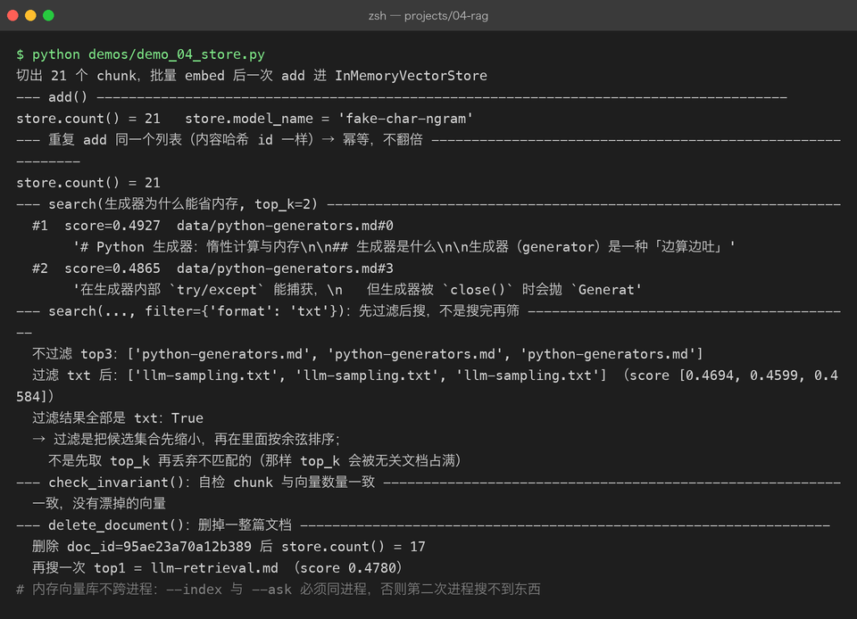
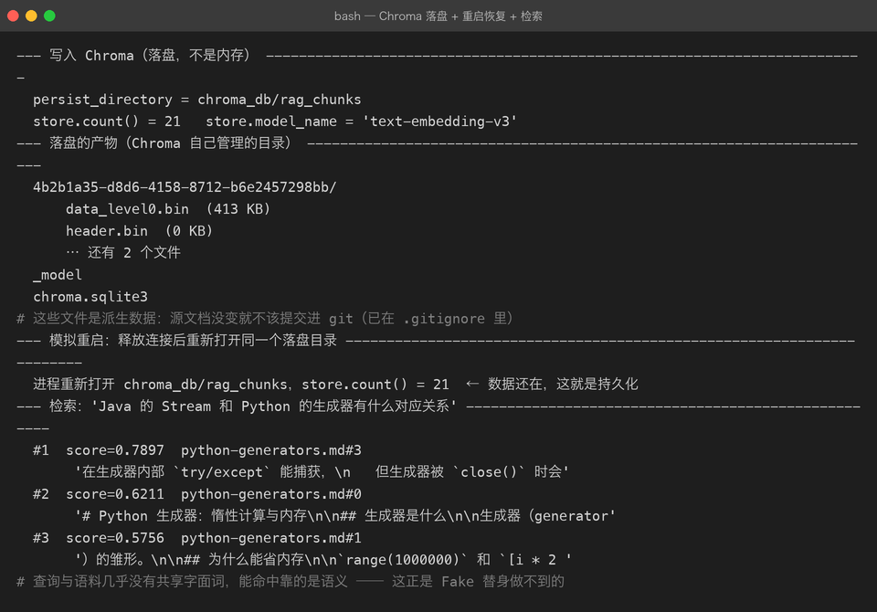
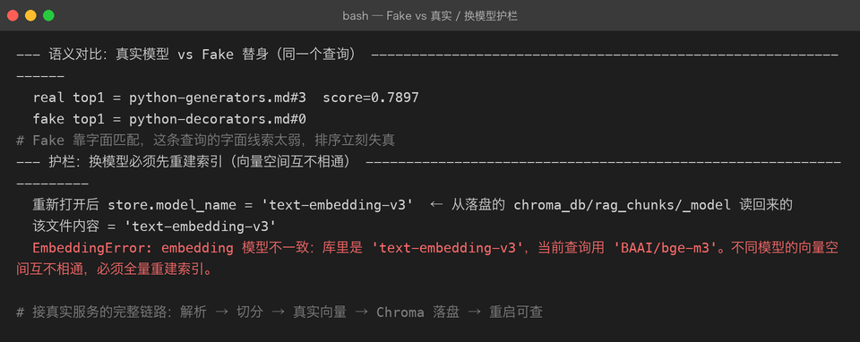

# Project 04 — Chapter 04：Vector Database【向量数据库】

> 状态：✅ 已成文（文档先行，作为 src/ 落地设计依据）
> 对应代码：`src/rag/vector_store.py`（`BaseVectorStore` + `InMemoryVectorStore` + `ChromaVectorStore`）

---

## 1. 本章要解决什么问题

Chapter 03 结束时，每个 `Chunk` 都有了自己的向量。现在用户提问，query 也变成了向量——**接下来要在几百上千条文档向量里，找出和 query 向量最近的那几条**。

第一反应往往是：这有什么难的？数据库里存了向量字段，`SELECT ... WHERE ... LIKE` 或者写个循环算相似度不就行了？

```text
你以为：  向量检索就是把所有向量都比一遍，选最近的
实际上：  全量比对是 O(N × d)（N 条向量 × d 维），
          10 万条 × 1024 维的库，每次查询都是几千万次浮点运算，
          用户等不起，服务器也算不起
```

用 `LIKE` 更不行——它匹配的是**字符串**，而我们的相似度在**几何空间**里，SQL 的 WHERE 子句根本表达不了"余弦距离最近"。这是向量数据库作为一个独立品类存在的根本原因。

本章目标：

> **设计可替换的向量存储层：先手写暴力检索吃透原理，再切到 Chroma 获得持久化与 ANN 能力。**

---

## 2. 为什么需要这个知识

### 为什么普通数据库做不了：从 O(N) 到 ANN

向量检索的本质是**最近邻搜索**【Nearest Neighbor Search】。精确解只有暴力比对 O(N)，于是工业界的答案是 ANN【Approximate Nearest Neighbor，近似最近邻】：**放弃"绝对最近"，换取快几个数量级的检索**——召回 top-10 时偶尔漏掉真正第 3 名，但对 RAG 来说"差不多最近的几条"完全够用。

主流索引算法里，Chroma 默认使用的 **HNSW**【Hierarchical Navigable Small World，分层可导航小世界图】的直觉一句话就能讲：**把向量组织成一张"跳表层"的图——最上层稀疏边长，像高速公路；往下每层更稠密、边更短，像城市道路。查询从高速公路粗定位，再逐层下钻精确逼近，不用遍历所有点就能到达近邻。** 和跳表（skip list）的分层思想同源，数学细节本章不展开。

### 三阶段路线

学习路线和工程路线在这里是同一条：

| 阶段 | 方案 | 定位 |
|------|------|------|
| ① 纯 Python：dict + NumPy 暴力余弦 | `InMemoryVectorStore` | **先懂原理**。几百条文档完全够用，且每一步都透明可见 |
| ② Chroma | `ChromaVectorStore` | `pip install` 即用、本地持久化、自带 HNSW。**个人知识库首选** |
| ③ Milvus | 生产级 | 分布式、十亿级向量，需要单独部署集群——本章提一句即可，不落地 |

先写阶段 ① 的理由和 P02/P03 一脉相承：**框架当黑盒之前，先用 50 行代码把白盒拆开看一遍。** 否则 Chroma 报一个"dimension mismatch"，你连报错在说什么都不知道。

---

## 3. 核心概念

### 3.1 存储抽象：BaseVectorStore

**Java 里你天天写 Repository 接口**：`interface ChunkRepository { void save(...); List<Chunk> search(...); }`，内存实现给测试，JPA 实现给生产。Python 里同一个模式，一个 ABC 三个实现：

```python
# src/rag/vector_store.py
from abc import ABC, abstractmethod

from .chunker import Chunk


class BaseVectorStore(ABC):
    """向量存储抽象：存 (Chunk, vector)，查 top-k。"""

    @abstractmethod
    def add(self, chunks: list[Chunk], vectors: list[list[float]],
            model: str = "") -> None:
        """入库。model 记录嵌入模型名，供查询时校验（Chapter 03 坑 1）。"""
        ...

    @abstractmethod
    def search(self, query_vector: list[float], top_k: int = 5,
               filter: dict | None = None) -> list[dict]:
        """返回 [{chunk, score}, ...]，按相似度降序。filter 为 metadata 过滤。"""
        ...

    @abstractmethod
    def count(self) -> int: ...

    @abstractmethod
    def clear(self) -> None: ...

    @abstractmethod
    def delete_document(self, doc_id: str) -> None:
        """删除一个文档的所有 chunk 及其向量。"""
        ...
```

注意 `search` 的返回是 `chunk + score` 的组合——检索结果必须带相似度分数，下游（Chapter 05 的 rerank 和阈值过滤）都要用。

### 3.2 阶段 ①：NumPy 暴力余弦

把余弦相似度亲手算一遍，这个知识就永远是你的了：

```python
import numpy as np


class InMemoryVectorStore(BaseVectorStore):
    model_name = ""          # 记录入库时用的嵌入模型

    def __init__(self) -> None:
        self._chunks: dict[str, Chunk] = {}            # chunk_id -> Chunk
        self._matrix: np.ndarray | None = None         # (N, dim) 矩阵
        self._ids: list[str] = []                      # 矩阵第 i 行对应的 chunk_id
        self._meta: list[dict] = []                    # 与矩阵行对齐的元数据

    def add(self, chunks, vectors, model: str = "") -> None:
        new_rows = np.asarray(vectors, dtype=np.float32)
        self._matrix = new_rows if self._matrix is None else np.vstack([self._matrix, new_rows])
        for c in chunks:
            self._chunks[c.chunk_id] = c
            self._ids.append(c.chunk_id)
            self._meta.append(dict(c.metadata))
        self.model_name = model or self.model_name

    def search(self, query_vector, top_k: int = 5, filter: dict | None = None):
        if self._matrix is None or len(self._ids) == 0:
            return []

        q = np.asarray(query_vector, dtype=np.float32)
        # 归一化后点积 == 余弦相似度
        q = q / (np.linalg.norm(q) or 1.0)
        m = self._matrix / (np.linalg.norm(self._matrix, axis=1, keepdims=True) + 1e-9)
        scores = m @ q                                   # (N,) 一次矩阵乘算完全部相似度

        order = np.argsort(-scores)
        results = []
        for i in order:
            meta = self._meta[i]
            if filter and not all(meta.get(k) == v for k, v in filter.items()):
                continue                                  # 先过滤后搜，见 3.3
            results.append({
                "chunk": self._chunks[self._ids[i]],
                "score": float(scores[i]),
            })
            if len(results) >= top_k:
                break
        return results

    def count(self) -> int:
        return len(self._ids)

    def clear(self) -> None:
        self._chunks.clear(); self._ids.clear(); self._meta.clear(); self._matrix = None

    def delete_document(self, doc_id: str) -> None:
        keep = [i for i, cid in enumerate(self._ids)
                if self._chunks[cid].doc_id != doc_id]
        self._matrix = self._matrix[keep]
        self._ids = [self._ids[i] for i in keep]
        self._meta = [self._meta[i] for i in keep]
        for cid in [c for c, chk in self._chunks.items() if chk.doc_id == doc_id]:
            del self._chunks[cid]
```

读懂三个点，这段代码就没白写：

1. `m @ q` 一行就是"全部向量与 query 的余弦相似度"——NumPy 把 O(N) 次点积压成一次矩阵乘，这就是几百条文档时"暴力也够快"的原因。
2. 归一化之后点积等价于余弦相似度（Chapter 03 讲过的归一化红利）。
3. `filter` 在**取 top_k 之前**逐行检查——这正是 3.3 要对比的"先过滤后搜"。

### 3.3 metadata 过滤：先过滤后搜 vs 先搜后过滤

需求：只在"某个 PDF"里检索。两种做法：

| 顺序 | 做法 | 问题 |
|------|------|------|
| 先搜后过滤 | 全库搜 top-50，再按 metadata 筛 | 筛完可能只剩 1 条甚至 0 条——top-50 里根本没有目标文档的内容 |
| **先过滤后搜** | 先把候选集缩到目标文档，在子集内搜 top-5 | 正确：top-5 一定来自过滤后的集合 |

所以抽象层的约定是：**`filter` 语义 = 先过滤后搜**。Chroma 的 `where` 参数也是这个语义。

**Java 里这就像 SQL 的 `WHERE` 在 `ORDER BY ... LIMIT` 之前生效——你不会先 `LIMIT 5` 再 WHERE，同样的直觉。**



### 3.4 阶段 ②：ChromaVectorStore

```python
import chromadb


class ChromaVectorStore(BaseVectorStore):
    def __init__(self, persist_directory: str = "./data/chroma",
                 collection_name: str = "rag_chunks"):
        self._client = chromadb.PersistentClient(path=persist_directory)
        self._collection = self._client.get_or_create_collection(
            name=collection_name,
            metadata={"hnsw:space": "cosine"},       # 指定余弦距离
        )

    def add(self, chunks, vectors, model: str = "") -> None:
        self._collection.upsert(
            ids=[c.chunk_id for c in chunks],
            embeddings=[[float(x) for x in v] for v in vectors],
            documents=[c.text for c in chunks],
            metadatas=[{**c.metadata, "_model": model, "doc_id": c.doc_id,
                        "index": c.index} for c in chunks],
        )

    def search(self, query_vector, top_k: int = 5, filter: dict | None = None):
        kwargs: dict = {
            "query_embeddings": [[float(x) for x in query_vector]],
            "n_results": top_k,
            "include": ["documents", "metadatas", "distances"],
        }
        if filter:
            kwargs["where"] = filter                  # 先过滤后搜
        res = self._collection.query(**kwargs)
        out = []
        for cid, doc, meta, dist in zip(res["ids"][0], res["documents"][0],
                                        res["metadatas"][0], res["distances"][0]):
            chunk = Chunk(chunk_id=cid, doc_id=meta.get("doc_id", ""),
                          text=doc, index=meta.get("index", 0), metadata=meta)
            out.append({"chunk": chunk, "score": 1.0 - float(dist)})  # 距离 → 相似度
        return out

    def count(self) -> int:
        return self._collection.count()

    def clear(self) -> None:
        cid = self._collection.name
        self._client.delete_collection(cid)
        self._collection = self._client.get_or_create_collection(
            name=cid, metadata={"hnsw:space": "cosine"})

    def delete_document(self, doc_id: str) -> None:
        self._collection.delete(where={"doc_id": doc_id})
```

值得注意的两处：`upsert`（而不是 `add`）让重复入库变成覆盖，呼应 Chapter 01 的内容哈希幂等设计；Chroma 返回的是**距离**，`score = 1 - distance` 换算回相似度，和 `InMemoryVectorStore` 的语义对齐——**这正是先定义抽象层的红利：上层代码对两个实现零感知。**

---

## 4. 动手实现（设计稿）

以下代码将在 `src/rag/vector_store.py` 落地时实现。目标结构：

```text
src/rag/
├── vector_store.py   # BaseVectorStore / InMemoryVectorStore / ChromaVectorStore
└── ...
```

关键实现思路：

1. **存储工厂**，与 Chapter 03 的 embedding 工厂呼应：

```python
def create_vector_store(config: dict) -> BaseVectorStore:
    backend = config.get("backend", "memory")
    if backend == "memory":
        return InMemoryVectorStore()
    if backend == "chroma":
        return ChromaVectorStore(persist_directory=config.get("persist_directory",
                                                              "./data/chroma"))
    raise ValueError(f"未知向量库 backend: {backend!r}")
```

2. **查询侧的模型校验**（Chapter 03 坑 1 的防线落地）：入库时模型名存进 metadata 的 `_model` 字段，查询前取出比对，不一致抛 `ValueError`。

2. **端到端串联自测**（用 Fake，不需要 API key）：`ingest → chunk → FakeEmbeddingClient.embed → store.add → store.search(query_vector, filter={"format": "md"})`，断言结果非空且分数降序。整条链路离线可跑，是后面 05 章真实检索的地基。

4. **依赖**：`pip install chromadb numpy`。

5. **Milvus 提一句**：当向量到千万级、需要多副本和标量混合索引时再上 Milvus（独立部署、gRPC 接入）。个人知识库和单机服务，Chroma 的上限远比想象中高，不要提前优化。

---

## 5. 踩坑清单

### 坑 1：Chroma collection 名字不符合规范，报错信息看不懂

- **现象**：`get_or_create_collection(name="我的 知识库!")` 报 `ValueError: Expected collection name ... (3-63 characters, ...)`，一长串正则让人摸不着头脑。
- **原因**：Chroma 的 collection 名要求：3~63 字符、只允许字母数字和 `-`/`_`、必须以字母或数字开头结尾——中文名、空格、`!`、以 `-` 开头都不行。
- **正确做法**：用固定英文 snake_case（如 `rag_chunks`），要区分多知识库时用配置里的英文 key 拼接，不要用用户输入的任意字符串当 collection 名。

### 坑 2：持久化目录被 .gitignore 漏掉，仓库里塞了半 GB 的向量数据

- **现象**：`git status` 里冒出 `data/chroma/` 几百个文件；或者反过来，同事 clone 下来发现向量库是空的，"检索怎么没结果"。
- **原因**：默认 `persist_directory="./data/chroma"` 落在项目根目录，而 `.gitignore` 可能没覆盖到（数据被误提交），或覆盖过头把 `data/` 全局忽略导致误以为程序坏了。
- **正确做法**：把持久化目录约定为 `./data/` 并加入 `.gitignore`；入库写一个"重建脚本"（从原始文档全量重建索引）代替提交数据本身——**向量库永远是可再生的派生数据，源文档才是 source of truth，和 Java 项目不把 target/ 提交进 git 是同一个道理。**

### 坑 3：维度不一致，报错发生在查询而不是入库

- **现象**：`InvalidDimensionException: Embedding dimension 1536 does not match collection dimensionality 1024`。更隐蔽的变体：换了 embedding 模型重建索引但没清空旧 collection，检索结果里混着两个模型的向量，分数全是垃圾。
- **原因**：collection 在第一次写入时就固定了维度；同一模型空间校验通过、跨模型混存时 Chroma 不会替你校验"是不是同一个模型"。
- **正确做法**：入库和查询前都校验模型一致性（见 4.2）；换模型 = 换 collection 名（如 `rag_chunks_bge_m3`）或先 `clear()` 再全量重建。**就像 Java 里改了实体字段结构，老表必须跑 migration——向量空间变了，库必须重建。**

### 坑 4：删除文档时向量和 chunk 元数据不同步

- **现象**：删除某文档后再检索，top 结果里出现"幽灵 chunk"——`self._chunks` 里查不到对应的 Chunk，直接 `KeyError`；或者 `count()` 显示的条数和能检索到的条数对不上。
- **原因**：删除时只删了向量矩阵的行、忘了同步删 `chunks` 字典（或反过来）；自研存储里这种双结构不同步是最常见 bug。
- **正确做法**：`delete_document` 里对矩阵行、`_ids`、`_meta`、`_chunks` **四处一起删**（见 3.2 实现），并写一个不变量断言测试：`count() == len(_ids) == len(_chunks)`，任何时刻三者必须相等。

### 坑 5：把"先搜后过滤"当成了正确语义

- **现象**：指定"只检索某 PDF"后，10 次里有 3 次结果为空或混入其他文档——数据明明都在库里。
- **原因**：实现成了"全库 top-k 再按 metadata 筛"（3.3 表格里的第一种），目标文档的内容根本没进 top-k 候选。
- **正确做法**：过滤条件下沉到检索层（自研实现在打分循环里跳过不匹配行；Chroma 用 `where` 参数），保证 top-k 来自过滤后的子集。

---

## 6. 自检清单

- [ ] 能说清 `LIKE`/全表扫描为什么做不了向量检索，ANN 用什么换了什么
- [ ] 能用"高速公路 + 城市道路"讲一遍 HNSW 的直觉
- [ ] 亲手实现过 NumPy 版余弦检索，并能解释 `m @ q` 那一行在算什么
- [ ] 能说清"先过滤后搜"和"先搜后过滤"的区别及各自的后果
- [ ] 两个实现（InMemory / Chroma）能在同一个 `BaseVectorStore` 抽象下互换
- [ ] 知道换 embedding 模型时向量库必须重建，以及 collection 命名规范

---

## 7. 真实运行截图（第十一章补充）

第十一章用 `ChromaVectorStore` 把向量库从内存换成了持久化落盘。两张截图分别展示「Chroma 落盘与重启恢复」和「换模型时的护栏」：





> 关键结论：持久化目录里出现 `_model` sidecar 文件，专门用来在进程重启后恢复 `model_name`，否则 `check_model()` 这道换模型护栏会失效；Chroma 的 metadata 也不收 `list`，入库前要把 `headings` 这类列表压成字符串。

---

上一章：[03-embedding.md](03-embedding.md) —— 文本变成了向量，语义第一次可以被计算

下一章：[05-retrieval.md](05-retrieval.md) —— 库建好了，检索链路怎么把"最近的几条"变成模型的上下文？

回到项目主页：[../README.md](../README.md)
