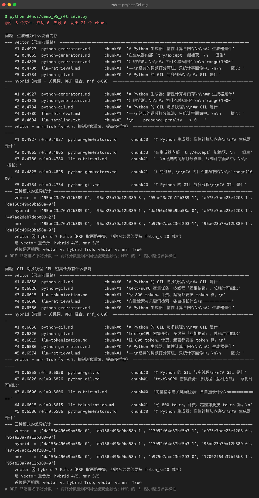

# Project 04 — Chapter 05：Retrieval【检索流程】

> 状态：✅ 已成文（文档先行，作为 src/ 落地设计依据）
> 对应代码：`src/rag/retriever.py`（代码落地时实现）

---

## 1. 本章要解决什么问题

Chapter 04 结束时，我们已经有一个装满向量的数据库：文档被切好块（Chapter 02）、算好嵌入（Chapter 03）、存进了向量库（Chapter 04）。看起来万事俱备——但实际上**什么检索都还没发生**。用户敲进来一句「怎么配置重试策略？」，这条 query 还是自然语言，向量库里存的还是一堆 float，两者之间需要一条完整的流水线把它们接起来。

**先划清两章的边界**：本章（05）讲的是检索的**流程与策略**——query 怎么预处理、取多少条、向量检索和关键词检索怎么配合、怎么避免取回来的全是同义重复；下一章（06）讲的才是**度量原理**——「两个向量有多相似」这件事在数学上到底怎么算。一个是工程流水线，一个是流水线上最核心的那个度量件。本章在用到「相似度」时只当黑盒调用，细节留给 06。

一个常见误解：

```text
你以为：  向量库里"搜"一下，最相关的段落就自动排好队出来了
实际上：  检索是一整条策略流水线——k 取多少、单路还是混合、
          要不要过滤、要不要打散，每一步都是设计决策
```

本章目标：

> **用 Retriever 把「query → 相关 chunk 列表」封装成一步可靠调用，并让 top-k、混合检索、多样性这些策略变成可调参数。**

---

## 2. 为什么需要这个知识

RAG 的效果上限，在生成之前就被检索锁死了。这条链路是这样的：

```text
检索质量 = RAG 上限
生成模型再强，也只是在"喂给它的材料"里作答
材料里没有答案 → 模型要么瞎编，要么回答"文档里没有"
```

这和 Java 里的分层很像：`Service` 逻辑写得再漂亮，DAO 层查错了表，出来的结果照样是错的。检索就是 RAG 的 DAO 层。

而且检索错误有个阴险的特点：**它是静默的**。向量库永远会返回 k 条结果——哪怕这 k 条和问题毫无关系。没有异常、没有日志、没有空指针，只有一段看起来一本正经但答非所问的生成结果。所以检索层的每一步策略都必须**显式设计**，而不是依赖默认值。

---

## 3. 核心概念

### 3.1 检索的完整流程

一条 query 从用户输入到变成 chunk 列表，经过五步：

```text
用户 query
  ↓ ① 预处理：截断/清洗（query 长度受 embedding 模型输入上限约束）
  ↓ ② embed：query → 向量（必须用和入库时同一个 embedding 模型！）
  ↓ ③ 向量库 top-k：按相似度取 k 条最近的 chunk
  ↓ ④ 可选 metadata 过滤：如 {"source": "python-doc", "lang": "zh"}
  ↓ ⑤ 返回 list[ScoredChunk]：chunk 文本 + 相似度分数 + 元数据
```

两个最容易忽略的点：

- **② 和入库必须用同一模型、同一维度**。用模型 A 编码的库，拿模型 B 的 query 向量去搜，等于拿身高去比体重，结果完全是噪声。
- **④ 过滤发生在向量搜索之后（post-filter）还是搜索时（pre-filter）取决于向量库实现**，但对你来说 API 语义是一致的：先缩小范围再排序。

### 3.2 top-k 的权衡

k 不是越大越好，它是**召回率 vs 噪音**的跷跷板：

| k 值 | 好处 | 代价 |
|------|------|------|
| 太小（1~2） | 上下文干净、省 token | 真正相关的段落可能不在其中（漏召回） |
| 适中（4~8） | 覆盖率与噪音的平衡点 | — |
| 太大（>20） | 几乎不漏 | 噪音淹没重点；挤占上下文窗口预算；模型被无关内容带偏 |

还有一笔隐形的账：**上下文预算**。第 08 章拼 context 时，每个 chunk 几百 token，k=20 就是上万 token，可能直接顶到模型上限，还稀释了真正的答案。工程上有个经典组合拳：

> **粗召回取大 k（如 20），精排后只留前 5**——这就是 Chapter 07 rerank 的入场券。本章先在 `Retriever` 里把「召回 k」和「最终 n」分成两个参数，为它留好接口。

### 3.3 混合检索与 RRF

纯向量检索有软肋：它擅长**语义**（「怎么让程序等一会」→ 能召回「sleep / 延迟执行」），但搞不定**精确符号**——函数名 `setTimeout`、类名 `BaseVectorStore`、报错码 `ECONNRESET` 这种专有名词，被 embedding 压成向量后反而被「泛化」掉了。

反过来，BM25 关键词检索（一种经典的词频打分算法）正好相反：精确匹配是强项，同义改写就抓瞎。两边互补：

| | 向量检索 | BM25 关键词检索 |
|---|---|---|
| 同义改写（"卡住了" → "阻塞"） | ✅ 强 | ❌ 弱 |
| 精确词/专有名词/代码标识符 | ❌ 弱（被语义泛化稀释） | ✅ 强 |
| 跨语言语义 | ✅ 可 | ❌ 基本不行 |
| 索引构建 | 需 embedding（贵、慢） | 分词即可（便宜） |

两路各取 top-k，怎么合并排名？**分数不能直接相加**（原因见踩坑 3），业界标准做法是 RRF（Reciprocal Rank Fusion，倒数排名融合）：

```text
RRF_score(doc) = Σ  1 / (k + rank_i)      # k 是平滑常数（常取 60），rank_i 是它在第 i 路的排名（从 1 开始）
```

它只看**排名**不看**分数**，天然规避了两路分数量纲不同的问题。实现只需要十几行：

```python
def rrf_fuse(rankings: list[list[str]], k: int = 60) -> list[str]:
    """rankings: 每一路检索返回的 id 有序列表；返回融合后的 id 有序列表"""
    scores: dict[str, float] = {}
    for ranking in rankings:
        for rank, doc_id in enumerate(ranking, start=1):
            scores[doc_id] = scores.get(doc_id, 0.0) + 1.0 / (k + rank)
    return [doc_id for doc_id, _ in sorted(scores.items(), key=lambda x: -x[1])]
```

在两路都出现的文档会拿到两份加分，自然浮到最上面——这正是我们想要的：**语义和关键词都认可的文档，最可能是答案**。

### 3.4 MMR：别让 top-k 全是同义重复

还有一个隐蔽的浪费：向量检索的 top-k 经常是**同一段内容的三种说法**。查询「Python 列表怎么追加元素」，返回的可能是「append 用法」「在列表末尾添加元素」「list 添加项」三个几乎一样的段落——3 个名额花在了 1 个信息点上。

MMR（Maximal Marginal Relevance，最大边际相关性）在选每一条时同时考虑两点：

```text
MMR = λ × 与 query 的相似度 − (1−λ) × 与已选结果的最大相似度
```

- λ=1：退化为普通 top-k（只顾相关）；
- λ=0：只顾彼此最不相似（太散）；
- 实践常取 0.5~0.7：**既要相关，也要互不重复**。

Java 里这就像给 `LinkedHashSet` 去重，只是这里的「重复」是向量夹角意义上的重复，需要边选边算。

---



## 4. 动手实现（设计稿）

> 以下代码将在 `src/rag/retriever.py` 落地时实现，这里先当设计稿读。它组合前几章的两个抽象：`BaseEmbeddingClient`（Chapter 03）和 `BaseVectorStore`（Chapter 04）。

```python
"""src/rag/retriever.py — 检索门面：把 embed + 向量库搜索封装成一步调用"""
from __future__ import annotations

from dataclasses import dataclass, field

from rag.embedding_client import BaseEmbeddingClient
from rag.vector_store import BaseVectorStore, ScoredChunk, SearchFilter


@dataclass
class Retriever:
    """检索门面。

    Java 类比：一个 @Service 聚合了 EmbeddingDao 和 VectorStoreDao，
    对上层只暴露一个 retrieve() 方法。
    """
    embedding_client: BaseEmbeddingClient
    vector_store: BaseVectorStore
    rrf_k: int = 60           # RRF 平滑常数
    mmr_lambda: float = 0.7   # 1.0 = 纯相关性；0.5~0.7 兼顾多样性

    def retrieve(
        self,
        query: str,
        top_k: int = 5,
        filter: SearchFilter | None = None,
        mode: str = "vector",       # "vector" | "hybrid"
        mmr: bool = False,
        fetch_k: int = 20,          # 粗召回数量（mmr / rerank 场景取大值）
    ) -> list[ScoredChunk]:
        if not query or not query.strip():
            raise ValueError("query 不能为空")

        query = self._truncate(query)                      # ① 预处理：截断
        query_vec = self.embedding_client.embed(query)     # ② 单条嵌入

        if mode == "vector":
            hits = self.vector_store.search(query_vec, top_k=fetch_k, filter=filter)
        elif mode == "hybrid":
            hits = self._hybrid_search(query, query_vec, fetch_k, filter)
        else:
            raise ValueError(f"未知 mode: {mode!r}（可选 vector / hybrid）")

        if mmr and len(hits) > top_k:
            hits = self._mmr_select(query_vec, hits, top_k)
        return hits[:top_k]                                # 粗召回 → 最终 top_k

    # ---- 内部方法 ----

    def _truncate(self, query: str, max_chars: int = 1024) -> str:
        """embedding 模型有输入上限，超长 query 静默截断会丢失语义，这里显式处理"""
        return query[:max_chars]

    def _hybrid_search(self, query: str, query_vec, fetch_k, filter):
        # 向量路：语义召回
        vec_hits = self.vector_store.search(query_vec, top_k=fetch_k, filter=filter)
        # 关键词路：BM25 精确召回（BM25Index 由 Chapter 04 附带提供）
        kw_hits = self.bm25.search(query, top_k=fetch_k, filter=filter)
        # RRF 只认排名不认分数 → 两路安全融合
        fused_ids = rrf_fuse(
            [[h.chunk_id for h in vec_hits], [h.chunk_id for h in kw_hits]],
            k=self.rrf_k,
        )
        by_id = {h.chunk_id: h for h in vec_hits + kw_hits}
        return [by_id[i] for i in fused_ids]

    def _mmr_select(self, query_vec, hits, top_k) -> list[ScoredChunk]:
        """贪心 MMR：每轮选出 lambda*sim(query) - (1-lambda)*max_sim(已选) 最大的那条"""
        selected: list[ScoredChunk] = []
        candidates = list(hits)
        while candidates and len(selected) < top_k:
            best, best_score = None, float("-inf")
            for cand in candidates:
                rel = self.vector_store.similarity(query_vec, cand.vector)
                if selected:
                    max_div = max(
                        self.vector_store.similarity(s.vector, cand.vector)
                        for s in selected
                    )
                else:
                    max_div = 0.0
                score = self.mmr_lambda * rel - (1 - self.mmr_lambda) * max_div
                if score > best_score:
                    best, best_score = cand, score
            selected.append(best)
            candidates.remove(best)
        return selected
```

设计要点：

1. **一个方法对外**：上层（第 09 章的 pipeline）只需要 `retriever.retrieve(query, top_k=5)`，策略全部带默认值——Java 里「门面 Service 聚合多个 DAO」的同款思路。
2. **策略是参数不是类**：`mode` / `mmr` 用参数切换而不是搞出 `HybridMmrRetriever` 子类，避免类爆炸。
3. **错误显式化**：空 query 直接抛 `ValueError`，不静默返回空列表——检索错误本来就是静默的，能提前炸的都提前炸。

> 为什么不用 LangChain 的 `VectorStore.as_retriever()`？框架把这些策略都封装好了，但封装也意味着你看不见「RRF 为什么用排名不用分数」「MMR 的 λ 怎么影响结果」。手写一遍，框架在你眼里就从黑盒变成透明盒。

---

## 5. 踩坑清单

### 坑 1：query 太长，超出 embedding 模型输入上限

**现象**：长问题（比如用户把整段报错日志贴进搜索框）检索结果莫名其妙，或 API 直接报 413/超长错误；更阴险的是某些实现**静默截断**，日志里毫无异常，只是结果越来越差。

**原因**：embedding 模型有输入 token 上限（如 512 或 8192），超限部分被截掉。你贴的日志里真正有信息量的报错码恰好排在后面，全被剪没了。

**正确做法**：在 `Retriever` 入口显式截断（如 `_truncate`），或做「日志提纯」——只取报错信息那几行再检索。原则：**宁可显式截断并打日志，也不要让底层静默剪**。

### 坑 2：metadata 过滤条件写错字段名，静默返回空

**现象**：加了个过滤 `filter={"sorce": "python-doc"}`（source 拼错），检索永远返回 0 条，但程序不报错，你以为是「库里没资料」排查了半天。

**原因**：很多向量库对不存在的过滤字段做「不匹配」处理而不是报错，属于静默失败。

**正确做法**：① 过滤字段名集中定义为常量或 dataclass（`SearchFilter(source=...)`），杜绝裸 dict 手写；② 首次接入某批数据时，先不带 filter 验证有结果，再逐步加 filter 验证每一步结果集不为空。

### 坑 3：hybrid 两路分数直接相加

**现象**：把向量相似度（0~1）和 BM25 分数（可能是 3.7、15.2 这种没上限的值）直接加权求和，结果关键词路永远碾压向量路，混合检索退化成纯 BM25。

**原因**：两路分数**量纲完全不同**，BM25 没有归一化到固定区间，直接相加等于拿米和斤做加法。

**正确做法**：用 RRF——它只消费**排名**（第 1 名、第 2 名……），排名天然无量纲。除非你能保证两路分数都做了统一的 min-max 归一化，否则不要碰加权求和。

### 坑 4：查询时换了 embedding 模型

**现象**：换了新的 embedding 模型重新生成 query 向量，但库里的向量还是老模型生成的，检索结果像随机数。

**原因**：不同模型的向量空间互不相通，维度都可能对不上。

**正确做法**：向量库里记录 embedding 模型名（Chapter 04 的 collection metadata），查询时校验一致；换模型必须全量重建索引。

---

## 6. 自检清单

- [ ] 能不看笔记说出检索五步：预处理 → embed → top-k → 过滤 → 返回
- [ ] 能解释 k 太小和 k 太大各会出什么问题，以及「粗召回 20 + 精排 5」的动机
- [ ] 能说出向量检索和 BM25 各自的强弱场景，并解释为什么混合检索用 RRF 而不是分数相加
- [ ] 能手写 `rrf_fuse()` 并解释常数 60 的作用
- [ ] 能解释 MMR 的 λ 从 0 到 1 变化时，结果会发生什么
- [ ] `Retriever.retrieve()` 的参数含义（top_k / filter / mode / mmr / fetch_k）全部能对上号

---

上一章：[04-vector-database.md](04-vector-database.md) —— 向量已经存进库里，就差一条查询指令。

下一章：[06-similarity-search.md](06-similarity-search.md) —— 本章调用的「相似度」黑盒，是时候打开看里面的数学了。
