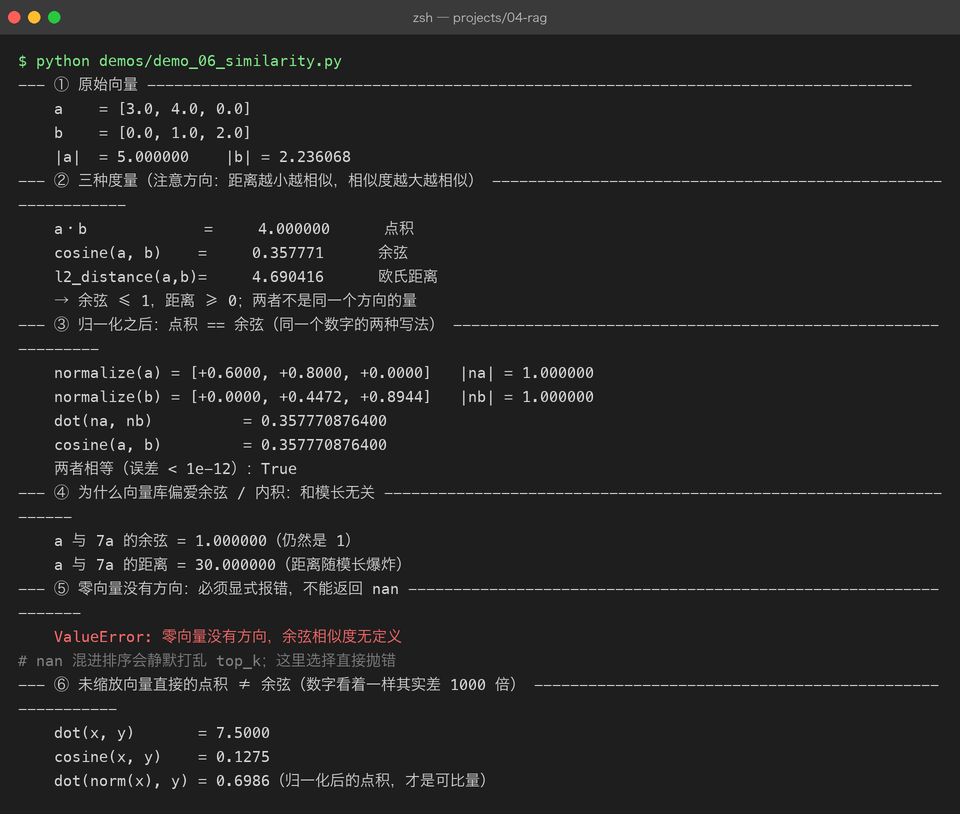

# Project 04 — Chapter 06：Similarity Search【相似度度量】

> 状态：✅ 已成文（文档先行，作为 src/ 落地设计依据）
> 对应代码：`src/rag/similarity.py`（代码落地时实现）

---

## 1. 本章要解决什么问题

Chapter 05 的 `Retriever` 每一步都在调用同一个黑盒：「这两个向量有多相似」。向量库排序靠它、MMR 打分靠它、判断召回质量也靠它。但「相似」到底是什么？为什么两个 768 维的浮点数列表一相乘，就能表示「两段话语义接近」？

不搞清楚这个黑盒，后面全是玄学调参：分数 0.82 算高吗？换个模型分数变成 0.35，是变差了吗？为什么同样两段文本，用点积和用余弦得到的排名不一样？

先破除一个误解：

```text
你以为：  embedding 是把文本压缩成"内容摘要"，相似度就是比摘要
实际上：  embedding 是把文本映射成高维空间中的一个"方向"，
          相似度 = 比较方向（和长度无关，见 3.2）
```

本章目标：

> **把「相似度」从直觉变成可手算、可手写的数学：三种度量、它们的适用场景，以及为什么全行业默认余弦相似度。**

---

## 2. 为什么需要这个知识

一句话：**向量库的 top-k 排序，从头到尾只由相似度公式决定**。你选哪个公式，直接决定哪些段落被召回。

- 召回错了段落，生成模型再强也救不回来（检索质量 = RAG 上限，Chapter 05 讲过）；
- 相似度公式错了，后面 rerank（Chapter 07）精排的也是一堆错料。

而且这个知识点是纯数学，不依赖任何框架、任何 API——学一次，换什么向量库、什么 embedding 模型都通用。Java 开发者都有线代基础（哪怕已经还给老师了），本章只需要用到「向量、点积、夹角」三个概念，不超过大学第一节课。

---

## 3. 核心概念

### 3.1 三种度量方式

设两个向量 a = (a₁, a₂, …, aₙ)，b = (b₁, b₂, …, bₙ)：

| 度量 | 公式 | 取值范围 | 受向量模长影响？ | 适用场景 |
|------|------|---------|----------------|---------|
| 点积 Dot Product | a·b = Σ aᵢbᵢ | (−∞, +∞) | **受**（模长越大值越大） | 向量已归一化；推荐系统（有时要利用「热门度=模长大」） |
| 余弦 Cosine | a·b / (\|a\|·\|b\|) | [−1, 1] | **不受**（只看夹角） | **文本语义检索（行业默认）** |
| 欧氏距离 L2 | √Σ(aᵢ−bᵢ)² | [0, +∞) | 受（值越小越相似，注意方向相反） | 图像特征、聚类；低维向量 |

三者的关系（了解即可，不必推导）：**当所有向量都归一化（模长=1）后，点积 = 余弦 = (1 − 欧氏距离²/2)**，三种排序结果完全一致。这就是为什么很多向量库（如 FAISS 的内积索引）干脆只实现点积——把归一化的责任推给上层。

### 3.2 为什么行业默认余弦，以及那个必会的等价式

文本 embedding 的模长没有语义含义——它主要被**文本长短、词频高低**牵着走。一篇 2000 字的文档和一句 20 字的提问，很可能说的是同一件事（方向相同），但模长差出好几倍。如果用点积，长文档仅凭模长就赢了；余弦把模长除掉，只比方向：

```text
点积：    a·b = |a| |b| cosθ     ← 模长和夹角都影响结果
余弦：    cosθ = a·b / (|a||b|)  ← 只留下夹角（语义）
```

由此得出本章最重要的工程结论。**把两个向量都归一化**（各自除以自己的模长），得到单位向量 â 和 b̂，此时：

```text
â·b̂ = |â| |b̂| cosθ = 1 × 1 × cosθ = cosθ
```

**归一化之后，点积就是余弦**。用几行 NumPy 验证：

```python
import numpy as np

rng = np.random.default_rng(42)
a, b = rng.normal(size=8), rng.normal(size=8)

a_unit = a / np.linalg.norm(a)      # 归一化：除以模长
b_unit = b / np.linalg.norm(b)

dot     = float(np.dot(a_unit, b_unit))
cosine  = float(np.dot(a, b) / (np.linalg.norm(a) * np.linalg.norm(b)))
print(dot)      # 0.2437...
print(cosine)   # 0.2437...  ← 完全相等
```

这个等价式是向量库高性能的基石：库内部只需要最快的点积运算（矩阵乘法，CPU/GPU 都有极致优化），归一化在入库时做一次、查询时做一次就完事。**Java 类比**：就像把昂贵的格式化预处理放到写入时做一次（写时转换），而不是每次查询都重复转换——本质是预计算换查询性能。



### 3.3 手写实现：纯 Python 版与 NumPy 批量版

先写纯 Python 版，逼自己直面每个循环（面试也常考）：

```python
import math

def cosine_similarity(a: list[float], b: list[float]) -> float:
    """余弦相似度，纯 Python 版。两个向量必须等长。"""
    if len(a) != len(b):
        raise ValueError(f"维度不一致: {len(a)} vs {len(b)}")
    dot = sum(x * y for x, y in zip(a, b))
    norm_a = math.sqrt(sum(x * x for x in a))
    norm_b = math.sqrt(sum(y * y for y in b))
    if norm_a == 0.0 or norm_b == 0.0:
        raise ValueError("零向量没有方向，余弦相似度无定义")
    return dot / (norm_a * norm_b)
```

但检索场景从来不是比两个向量，而是**一个 query 向量 vs 库里几万个向量**。用 Python 双层循环遍历几万条，每条还要除模长——慢到不可用。NumPy 的向量化写法把整个问题变成一次矩阵乘法：

```python
import numpy as np

def top_k_by_cosine(query: np.ndarray, matrix: np.ndarray, k: int = 5) -> tuple[np.ndarray, np.ndarray]:
    """query: (d,)  matrix: (n, d)——每行是一个已归一化的文档向量。
    返回相似度最高的 k 条的下标和分数。"""
    # 关键一行：一次算出 query 与全部 n 个文档的点积（余弦）
    sims = matrix @ query                     # (n,) —— 等价于 n 次点积
    k = min(k, len(sims))
    idx = np.argsort(-sims)[:k]               # 分数降序，取前 k
    return idx, sims[idx]
```

为什么 `matrix @ query` 一行能顶替双重循环？因为 NumPy 调用的是 BLAS（底层线性代数库）的矩阵-向量乘法——C/Fortran 写的、SIMD 指令级并行、CPU 缓存友好的内存访问顺序。**Java 类比**：就像 `parallelStream()` 对比手写 for 循环，但 NumPy 的并行发生在原生代码层，快得多。n=10000、d=768 时，这行耗时是毫秒级；纯 Python 双循环是秒级。

Java 里用 `Comparator` + `Collections.sort` 对整个列表排序再取前 k（O(n log n)）；上面的 `argsort(-sims)[:k]` 是同一件事的 NumPy 版——注意取的是**头部**（因为取了负号变成降序），细节见踩坑 4。

### 3.4 相似度 ≠ 相关性

最后校准一个致命误区，它直接引出下一章：

```python
q1 = embed("Java 里怎么定义数组？")
q2 = embed("Python 中 list 的用法")
print(cosine_similarity(q1, q2))   # 0.68 —— 挺高！
```

两段话都是「编程语言 + 容器 + 入门问题」，语义相近所以相似度高。但如果你在问 Java 数组，一段 Python list 的文档**不是答案**，它只能帮模型答得更歪。

```text
你以为：  相似度高的 chunk 就能回答问题
实际上：  相似度衡量的是"语义像不像"，
          不是"能不能回答"——后者需要 query 和 doc 放在一起联合判断
```

向量检索的 bi-encoder（双塔结构）天生只能算前者：query 和 doc 各自独立编码，互相看不见。要判断「这段文档对**这个问题**有没有用」，必须让两者碰面——这就是 Chapter 07 cross-encoder 和 rerank 存在的理由。

---

## 4. 动手实现（设计稿）

> 以下代码将在 `src/rag/similarity.py` 落地时实现，这里先当设计稿读。要点：归一化负责到底 + 排序方向不出错。

```python
"""src/rag/similarity.py — 相似度计算工具：归一化 + 批量 top-k"""
from __future__ import annotations

import numpy as np


def normalize(matrix: np.ndarray) -> np.ndarray:
    """按行归一化，零向量直接报错而不是返回全 0（除零防护）。

    matrix: (n, d)，也兼容一维向量 (d,)
    """
    if matrix.ndim == 1:
        matrix = matrix.reshape(1, -1)
    norms = np.linalg.norm(matrix, axis=1, keepdims=True)   # (n, 1)
    if np.any(norms == 0.0):
        raise ValueError("输入中包含零向量，无法归一化")
    return matrix / norms


def cosine_top_k(
    query: np.ndarray,
    doc_matrix: np.ndarray,
    k: int = 5,
    assume_normalized: bool = True,
) -> tuple[np.ndarray, np.ndarray]:
    """返回相似度降序的前 k 条 (下标, 分数)。

    assume_normalized=True 时跳过归一化（向量库入库时已归一化的场景），
    否则内部先归一化再算——等价式见 3.2。
    """
    q = query.reshape(1, -1).astype(np.float32)
    docs = doc_matrix.astype(np.float32)
    if not assume_normalized:
        q, docs = normalize(q), normalize(docs)
    sims = (docs @ q.T).ravel()              # (n,)
    k = min(k, sims.shape[0])
    # -sims 升序 == sims 降序；取头部即 top-k（argsort 默认升序，方向别搞反）
    idx = np.argsort(-sims)[:k]
    return idx, sims[idx]
```

落地时的两个纪律：

1. **归一化的责任要明确归属**：本项目约定「入库前统一归一化」（在 Chapter 04 的 `VectorStore.upsert` 里做），检索侧默认信任 `assume_normalized=True`；一旦信任，就绝不混入未归一化的向量。
2. **分数只用于排序，不用于解读**：余弦分数 0.7 和 0.8 之间的差距没有绝对含义，别写 `if score > 0.75: trust it` 这种魔法阈值（要阈值也应该基于自己的数据集实测校准）。

---

## 5. 踩坑清单

### 坑 1：零向量除零

**现象**：某条数据是空文本（chunk 切出来一段空白），embedding 返回全 0 向量，余弦计算抛 `ZeroDivisionError`，或 NumPy 静默给出 `nan`，后续排序全部乱套。

**原因**：余弦公式分母含模长，零向量模长为 0；且 NumPy 的 `0/0` 只给 warning 不抛异常，`nan` 会一路污染 `argsort` 的结果。

**正确做法**：入口处显式校验（见 `normalize()` 里的 `norms == 0.0` 检查），直接抛 `ValueError`。同时在上游（chunking 阶段）就过滤空 chunk，别让垃圾数据流到这里。

### 坑 2：float32 精度累积误差

**现象**：768 维向量的点积，纯 Python `sum()` 和 NumPy 算出来的结果在小数点后 5~6 位开始不一致；判断「两个分数是否相等」的测试时好时坏。

**原因**：float32 只有约 7 位有效数字，几万次加法的舍入误差会累积；纯 Python 的 `float` 是 float64，两者精度本来就不同。

**正确做法**：比较分数用容差（`abs(a - b) < 1e-6`）而不是 `==`——**Java 里用 `BigDecimal` 或 `Math.abs(a-b) < eps` 对比浮点数，Python 里是同一纪律**；全链路统一用 float32（embedding 模型输出就是 float32，再转 float64 只是浪费内存），误差源就只剩一处。

### 坑 3：归一化忘掉一半，点积结果飘

**现象**：明明该用余弦，却直接用点积排序；或者入库时归一化了、查询向量忘了归一化。表现为排名「看起来大致对，但某些长文档总是排前面」，且分数不稳定。

**原因**：点积 = 模长 × 模长 × cosθ，模长（≈文本长度）在偷偷加分；只归一化一边等价于没归一化干净。

**正确做法**：归一化策略写成不变量——在 `upsert` 和 `search` 的交界处统一做并加断言（`assert max(abs(norms - 1)) < 1e-5`），让「忘归一化」在开发期就炸，而不是在线上悄悄影响排序。

### 坑 4：Top-K 排序方向搞反

**现象**：用 `np.argsort(sims)[:k]` 取回的居然是**最不相似**的 k 条；或者把欧氏距离当相似度用 `argsort(-dists)` 排序，取回的是**最远**的。

**原因**：`argsort` 默认**升序**。对相似度（越大越好）要取尾部或取负号取头部；对距离（越小越好）直接取头部。两者方向相反，混用必翻车。

**正确做法**：给函数命名和参数带上方向语义（本项目统一用相似度：`cosine_top_k` 内部固定 `argsort(-sims)`），距离只在调用向量库 API 时出现（有些库返回 distance，注意它的注释是「越小越好」）。

---

## 6. 自检清单

- [ ] 能默写三种度量的公式，并说出各自取值范围和模长敏感性
- [ ] 能推导「归一化后点积 == 余弦」这 3 步等价式
- [ ] 手写 `cosine_similarity()` 能一次写对（含零向量防护）
- [ ] 能解释 `matrix @ query` 一行代码替代双重循环的性能来源
- [ ] 能举出「相似度高但不是答案」的例子，并说清 bi-encoder 为什么判断不了「能否回答」
- [ ] 知道相似度和距离的排序方向相反，不写混

---

上一章：[05-retrieval.md](05-retrieval.md) —— 检索流水线的骨架已经搭好，本章填上了最核心的度量件。

下一章：[07-rerank.md](07-rerank.md) —— 相似度判断不了「能不能回答」，那就让 query 和文档真正见一面。
