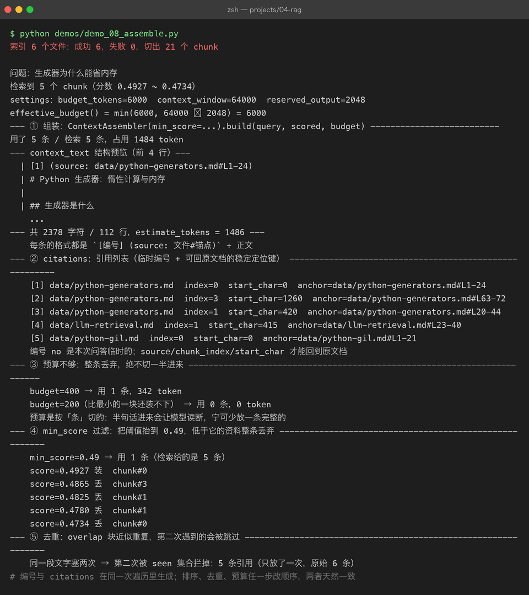

# Project 04 — Chapter 08：Context Assembly【上下文组装】

> 状态：✅ 已成文（文档先行，作为 src/ 落地设计依据）
> 对应代码：`src/rag/assembly.py`（代码落地时实现）

---

## 1. 本章要解决什么问题

Chapter 07 结束时，我们手里已经有了一批 rerank 后的高分 chunk：

```python
scored: list[ScoredChunk]   # 按 score 降序的 top_k 条
```

很自然的想法是：把这几段文本直接拼起来塞进 prompt，让模型回答。

```text
你以为：  检索到的资料直接给模型就行，剩下的交给模型自由发挥
实际上：  不带来源、不控预算、不管顺序的资料堆，会带来三个问题——
          引用无法验证、prompt 超长报错、重要资料被模型"看漏"
```

具体展开：

- **无法溯源**。模型说「RAG 的全称是检索增强生成」，这句话出自哪份文档？没有来源标注，用户只能选择全信或全不信。幻觉就是在这个「无法验证」的缝隙里长出来的。
- **预算失控**。top_k 是按条数截断的，不是按 token。5 条 chunk 每条 800 token，加上 system 和用户问题，很容易撞上上下文窗口（P03 Chapter 07 的教训）。
- **顺序随意**。资料以什么顺序进 prompt，会直接影响模型的注意力分布（本章 3.3 讲 lost in the middle）。

本章目标：

> **把检索结果组装成「引用可溯源、顺序合理、预算不超」的上下文——这是检索结果进入模型前的最后一道工序。**

---

## 2. 为什么需要这个知识

模型本身没有任何「引用」能力。你不给它带编号的资料，它就不可能输出 `[1]` 这样的标注；你给了编号，它才会学着用。

所以 RAG 的防幻觉链条是三段式的：

```text
检索找对资料  →  组装时编号溯源  →  system 规则约束模型只依据资料回答
   (Ch05-07)        (本章)              (system prompt 承诺可验证性)
```

其中第二段最容易被轻视，但它是用户信任的锚点：用户看到 `[1] (source: docs/rag-guide.md#L12-40)`，可以点开原文核对——**可验证的回答才可信，哪怕它仍然可能是错的**。

另一个原因是工程性的：上下文窗口是硬上限，而检索结果天然是「多多益善」的竞争性资源。必须有一个明确的装配规则来分配空间，而不是「能塞多少塞多少」。

Java 里写后端接口前会有一层 DTO 组装 / View 渲染——把 DAO 查出来的实体转换成带来源、带格式的前端需要的结构；Python 里这一层就是 `ContextAssembler`：**检索层产出的是「原材料」，组装层产出的是「成品 prompt」**，两层职责必须分开。

---

## 3. 核心概念

### 3.1 拼装格式：带编号的来源块

推荐的 context 文本格式：

```text
[1] (source: docs/rag-guide.md#L12-40)
RAG（Retrieval-Augmented Generation）是一种先检索外部知识、
再交给大模型生成回答的技术……

[2] (source: docs/hallucination.md#L3-27)
幻觉指模型生成与事实不符的内容。常见诱因包括：训练数据缺失、
prompt 上下文不足……
```

配套的 system 规则（每个 RAG 问答请求都带）：

```text
你是知识库问答助手。请严格遵守：
1. 只依据下面的【参考资料】回答用户问题。
2. 引用资料时用编号标注，如 [1]、[2]。
3. 如果参考资料不足以回答问题，直接说「知识库中没有相关资料」，
   不要使用你自己的知识，不要编造。
```

三条规则缺一不可：第 1 条圈定信息来源，第 2 条要求输出可验证的引用，第 3 条定义「不知道」的行为。没有第 3 条，模型在资料不相关时依然会用自身知识「热心」作答——那正是幻觉的高发区。

关于 `#L12-40` 这个锚点：Chapter 02 定下的 Chunk metadata 里存的是 `source`（文档路径）、`index`（块序号）和 `start_char`（在原文档中的字符偏移）。行号是**展示层格式**——落地时由 `start_char` 换算出行号（或直接用字符偏移做锚点），目标是同一个：用户拿着引用能回到原文档的精确位置。

### 3.2 token 预算：分数截断，不是均匀截断

沿用 P03 Budget 的思路，先算出这次问答能给资料用多少空间：

```text
总预算 = context_window - reserved_output - estimate_tokens(query) - estimate_tokens(system)
```

然后按 chunk 的**分数从高到低**装入，装不下就停：

```text
分数截断（正确）：  [0.92][0.88][0.85][0.41] → 装到第 4 条超预算，丢弃第 4 条
均匀截断（错误）：  每条 chunk 按比例砍掉 30% → 每条都被拦腰斩断，全文皆碎
```

均匀截断的问题在于：被砍的可能正是答案所在的 chunk。**宁可少放一条完整的，也不要放四条残缺的**——模型从半句话里猜答案，正是幻觉的温床。注意是「装不下就停」而不是「跳过继续装后面的」：分数是有序的，第 k+1 条不比第 k 条更值得装（若已启用 MMR，跳装可保留多样性，属于可选优化）。

### 3.3 引用位置还原：citations 是回答的一部分

组装时给每条资料分配编号 `[1] [2] [3]`，回答结束后把模型输出中的 `[n]` 映射回原文档位置：

```text
模型回答：「RAG 是检索增强生成 [1]，它依赖文档切分质量 [3]。」
                              ↓
citations = [
  Citation(no=1, source="docs/rag-guide.md", chunk_index=4,  start_char=1204),
  Citation(no=3, source="docs/chunking.md",  chunk_index=11, start_char=8800),
]
```

前端拿这个列表渲染出可点击的引用，点 `[1]` 跳到 `rag-guide.md` 对应位置。

结构设计上有个取舍：`[n]` 编号是**本次请求临时分配**的，同一份文档在两次提问里编号会不同。所以 `Citation` 里同时存了稳定键（`source` + `chunk_index` + `start_char`）和临时编号（`no`）——持久定位靠稳定键，回答里的 `[n]` 靠 `no` 对上。Java 里这就像 REST 响应同时带业务键和展示序号，持久化永远用业务键。

---



## 4. 动手实现（设计稿）

以下代码将在 `src/rag/assembly.py` 落地，这里先当设计稿读。

```python
"""Context Assembly：把检索结果组装成可溯源、预算可控的 prompt 资料。"""

from dataclasses import dataclass

from assistant.tokens import estimate_tokens   # 复用 P03 的 token 估算
from rag.chunker import Chunk
from rag.vector_store import ScoredChunk       # Chapter 04/05 的检索产物


@dataclass(frozen=True)
class Citation:
    no: int              # [1] [2]，本次请求内的临时编号
    source: str          # 稳定键：文档路径
    chunk_index: int     # 稳定键：块序号（chunk.index）
    start_char: int      # 稳定键：在原文档中的字符偏移


@dataclass(frozen=True)
class AssembledContext:
    context_text: str
    used_chunks: list[ScoredChunk]
    citations: list[Citation]      # citations[i].no == i + 1
    context_tokens: int            # 估算，用于日志与预算核对


RAG_SYSTEM_RULES = (
    "你是知识库问答助手。请严格遵守：\n"
    "1. 只依据下面的【参考资料】回答用户问题。\n"
    "2. 引用资料时用编号标注，如 [1]、[2]。\n"
    "3. 如果参考资料不足以回答问题，直接说「知识库中没有相关资料」，"
    "不要使用你自己的知识，不要编造。\n"
)


class ContextAssembler:
    def __init__(self, min_score: float = 0.2) -> None:
        # 分数低于阈值的资料视为噪声，装进去只会稀释注意力
        self._min_score = min_score

    def build(
        self,
        query: str,
        scored_chunks: list[ScoredChunk],
        budget: int,
    ) -> AssembledContext:
        budget -= estimate_tokens(query) + estimate_tokens(RAG_SYSTEM_RULES)

        used: list[ScoredChunk] = []
        citations: list[Citation] = []
        blocks: list[str] = []
        seen: set[str] = set()                       # 按内容去重
        total = 0

        for sc in sorted(scored_chunks, key=lambda s: s.score, reverse=True):
            if sc.score < self._min_score:
                break
            key = sc.chunk.text.strip()
            if key in seen:                          # overlap 造成的近似重复
                continue
            seen.add(key)

            block = self._format_block(no=len(used) + 1, chunk=sc.chunk)
            cost = estimate_tokens(block) + 1
            if total + cost > budget:                # 分数截断：装不下就停
                break

            used.append(sc)
            citations.append(self._to_citation(no=len(used) + 1, chunk=sc.chunk))
            blocks.append(block)
            total += cost

        context_text = "\n\n".join(blocks)
        return AssembledContext(
            context_text=context_text,
            used_chunks=used,
            citations=citations,
            context_tokens=total,
        )

    def _format_block(self, no: int, chunk: Chunk) -> str:
        meta = chunk.metadata
        source = meta.get("source", "unknown")
        start = meta.get("start_char", 0)
        end = start + len(chunk.text)
        # 展示层锚点用字符偏移；需要 #L12-40 形式时由 start_char 换算行号
        return f"[{no}] (source: {source}#char-{start}-{end})\n{chunk.text}"

    @staticmethod
    def _to_citation(no: int, chunk: Chunk) -> Citation:
        meta = chunk.metadata
        return Citation(
            no=no,
            source=meta.get("source", "unknown"),
            chunk_index=chunk.index,
            start_char=meta.get("start_char", 0),
        )
```

调用方（Chapter 09 的 `RAGService`）这样用它：

```python
assembler = ContextAssembler()
ctx = assembler.build(query, scored_chunks, budget=60_000)
messages = [
    {"role": "system", "content": RAG_SYSTEM_RULES + "【参考资料】\n" + ctx.context_text},
    {"role": "user", "content": query},
]
```

两个设计要点：

- **`budget` 由调用方传入而不是 assembler 自算**。窗口多大、给输出留多少，是配置层（Chapter 09 的 Settings）的事，组装层只负责「在给定空间内装最优的」——和 Java 里方法不读全局配置、依赖由构造器注入是同一个道理。
- **`AssembledContext` 同时携带 context_text 和 citations，且编号分配与 citations 生成在同一次遍历里完成**。排序、去重、预算截断任何一个环节改变顺序时，两者天然保持一致（见坑 4）。

---

## 5. 踩坑清单

### 坑 1：重复 chunk 白白烧预算

```text
现象：  top_k=5 里有两段几乎一样的文字，一条重要资料被挤出预算
原因：  相邻 chunk 有 overlap（Chapter 02），同一段话被切进两个块；
        MMR 去重的是「向量相近」，不保证文本不重复
做法：  组装前按内容（strip 后的文本）做最后一级去重；
        Chapter 02 的坑 4 也说过这件事——去重时机在检索后、组装时
```

### 坑 2：中英文字符 token 比例估偏

```text
现象：  按「字符数 / 4」估算预算，中文文档装进去后 prompt 超长报 400
原因：  英文 1 token ≈ 4 字符，中文 1 字 ≈ 0.6~1.5 token，
        比例差 4 倍以上（P03 Chapter 07 已踩过一次）
做法：  用区分中英文的 estimate_tokens() 做预算决策；
        计费对账才用响应里的 usage
```

### 坑 3：lost in the middle——资料顺序影响注意力

```text
现象：  明明第 3 条资料里有答案，模型却回答「资料中没有提到」
原因：  模型对超长上下文的注意力呈 U 形：开头和结尾记得牢，
        中间容易被忽略（lost in the middle 现象）
做法：  分数最高的资料放最前，次相关的放最后，低分放中间；
        至少要意识到资料顺序不是无关紧要的细节
```

### 坑 4：引用编号与实际来源错位

```text
现象：  用户点 [2]，跳转到的文档段落和被引用的内容对不上
原因：  排序、去重、预算截断改变了资料的最终顺序，
        citations 列表却按老顺序另行生成
做法：  编号分配与 citations 生成必须在同一次遍历里完成
        （见设计稿：used/citations/blocks 一起 append），
        绝不允许「先拼文本、后补列表」两步走
```

---

## 6. 自检清单

- [ ] 能解释为什么检索结果不能直接拼给模型（溯源 / 预算 / 顺序三个维度）
- [ ] 知道总预算公式，并理解为什么是分数截断而不是均匀截断
- [ ] `ContextAssembler.build()` 产出 `AssembledContext`，编号与 citations 同遍历生成
- [ ] system 规则包含「资料不足就拒答」，而不只是「依据资料回答」
- [ ] 拿一组带 overlap 的检索结果测过：重复 chunk 只占一次预算
- [ ] 能把模型回答中的 `[n]` 还原回 `source + chunk_index + start_char`

上一章：[07-rerank.md](07-rerank.md)
下一章：[09-rag-pipeline.md](09-rag-pipeline.md) —— 零件全齐了，是时候把 01-08 串成完整流水线。
