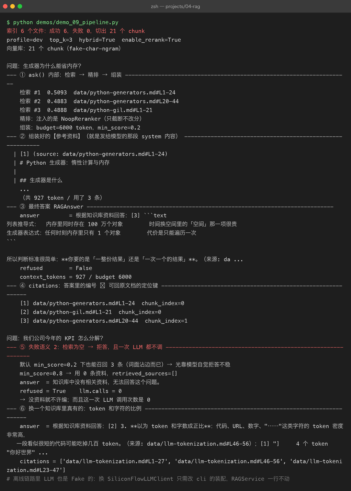
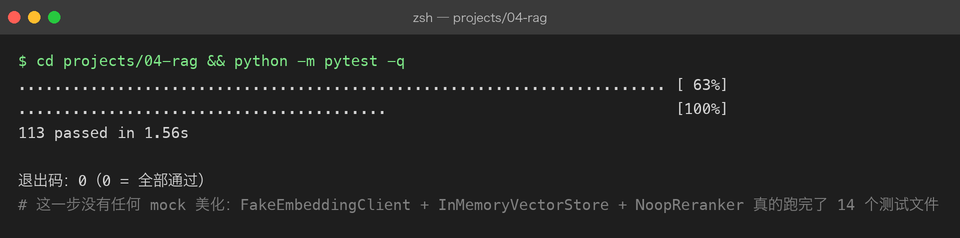

# Project 04 — Chapter 09：RAG Pipeline【完整流水线】

> 状态：✅ 已成文（文档先行，作为 src/ 落地设计依据）
> 对应代码：`src/rag/pipeline.py` + `src/rag/service.py`（代码落地时实现）

---

## 1. 本章要解决什么问题

Chapter 01-08 已经把所有零件造好了：`BaseParser` 解析文档、`chunk_document` 切分、`BaseEmbeddingClient` 向量化、`BaseVectorStore` 存储、`Retriever` 检索（支持 hybrid / MMR）、`BaseReranker` 重排、`ContextAssembler` 组装。

但零件散落在各自的章节里，互相怎么调用还没有定论：

```text
你以为：  RAG = 这些函数按顺序调用一遍，写个 main 就完事了
实际上：  这条链路天然分成两条完全不同的链——
          一条是离线批处理（建索引），一条是在线服务（问答），
          它们的触发时机、失败语义、性能要求全都不一样
```

这两条链是：

```text
离线索引链路（可以慢，可以定时跑）：
  ingest(paths) → parse → chunk_document → embed → store

在线问答链路（每次请求都要快）：
  ask(query) → retrieve → rerank → assemble → llm → answer + citations
```

本章目标：

> **把 01-08 的零件串成两条完整链路，并定下配置、分层、失败语义——这就是 Personal RAG v1.0。**

---

## 2. 为什么需要这个知识

数仓领域有一句老话：**批处理（batch）与在线服务（serving）必须分离**。Java 里 Spring Batch 跑夜间报表、Tomcat 提供在线 API，从来不会混在一个事务里；Python 里 RAG 的索引和问答也是同构关系。

分离的直接收益是**失败语义可以分开定义**：

```text
索引失败：  不阻塞问答。用户照常用旧索引提问，后台记 WARNING，下次重跑
检索为空：  不进入 LLM。直接返回「知识库中没有相关资料」，不花一分钱 token
LLM 失败：  重试一次，仍失败则明确告知，不返回空字符串
```

如果没有明确定义，实际写出来的代码往往是「任何一步挂了整个请求 500」，或者更糟——静默返回一个看起来正常、实则瞎编的答案。

另一个原因：把零件的调用顺序固化在两个入口类（`IngestionPipeline` / `RAGService`）里，Chapter 10 的评估就能**只依赖 `RAGService` 的公开方法**测整条链路，而不需要知道内部有几个零件。Java 里这就是「面向接口编程」：评估代码拿到的是一个黑盒，Python 里同样是这一个对象。

---

## 3. 核心概念

### 3.1 分层架构：RAG 只是「多了索引链路的 chat 应用」

呼应 P03 Chapter 09 的五层结构，P04 的分层是这样的：

```text
┌──────────────────────────────────────────────────┐
│ 接入层    cli.py / api.py                         │ 复用 P03 的 FastAPI + SSE 模式
├──────────────────────────────────────────────────┤
│ 编排层    IngestionPipeline / RAGService          │ 本章主角：串起两条链路
├──────────────────────────────────────────────────┤
│ 能力层    Retriever / BaseReranker / Assembler    │ Ch05-08 的零件
├──────────────────────────────────────────────────┤
│ 模型层    BaseEmbeddingClient / DeepSeek /        │ Ch03-04 的零件
│           BaseVectorStore                        │
├──────────────────────────────────────────────────┤
│ 数据层    BaseParser / chunk_document / Chunk     │ Ch01-02 的零件
└──────────────────────────────────────────────────┘
```

关键的心智模型：**在线问答链路和 P03 的 chat 应用几乎一模一样**（system + user → LLM → 回答），RAG 只多了两件事——前置的检索阶段（能力层）和一条离线索引链路。所以 P03 的 FastAPI + SSE、token 预算、结构化输出经验全部直接复用，不需要重新发明。

### 3.2 配置整合：frozen Settings + for_profile

沿用 P02/P03 定下的模式：配置不可变、按 profile 生成。RAG 比 chat 多了一组索引参数：

| 配置项 | 默认值 | 说明 |
|--------|--------|------|
| `chunk_size` / `chunk_overlap` | 500 / 80 | Chapter 02 定下的切分参数 |
| `top_k` | 5 | 检索召回条数（rerank 后交给组装） |
| `enable_hybrid` | True | 是否启用混合检索 |
| `enable_rerank` | True | 是否启用重排（离线测试时可关） |
| `min_score` | 0.2 | 组装时的分数阈值 |
| `context_window` / `reserved_output` | 64000 / 2048 | 预算计算（P03 Budget 思路） |
| `embedding_model` | BAAI/bge-m3 | SiliconFlow 向量模型 |

```python
@dataclass(frozen=True)
class RAGSettings:
    chunk_size: int = 500
    chunk_overlap: int = 80
    top_k: int = 5
    enable_hybrid: bool = True
    enable_rerank: bool = True
    context_window: int = 64_000
    reserved_output: int = 2_048

    @classmethod
    def for_profile(cls, profile: str) -> "RAGSettings":
        if profile == "test":
            # 离线测试：关 rerank（不调外部 API），窗口收小逼出裁剪逻辑
            return cls(enable_rerank=False, context_window=2_000, reserved_output=512)
        return cls()
```

frozen 的意义和 Java 里的不可变对象（`record` / builder 产出的 immutable config）一样：**配置对象在多处传递时，不会中途被谁悄悄改掉**。

### 3.3 失败语义：三种失败三种处理

```text
1. 索引失败（某个文件解析报错 / embedding API 超时）
   → 捕获、记日志、跳过该文件继续处理其余文件；
     整体失败时问答服务不受影响，旧索引照常可用

2. 检索为空（score 全部低于 min_score）
   → 不调 LLM，直接返回固定话术「知识库中没有相关资料」。
     这既是省钱，更是防幻觉：模型手里没资料还硬答，必然瞎编

3. LLM 调用失败
   → 重试一次；仍失败则向用户报明确错误，绝不返回空字符串
```

第 2 条值得单独强调：**「不知道」是一个合法且必须优先输出的答案**。判断「知识库里没有相关资料」不需要 LLM，用分数阈值就够了——这是在检索层就能做的决定，比让模型自己承认不知道可靠得多。

---



## 4. 动手实现（设计稿）

以下代码将在 `src/rag/pipeline.py` 和 `src/rag/service.py` 落地，这里先当设计稿读。

```python
"""离线索引链路：ingest(paths) → parse → chunk_document → embed → store"""

import logging
from dataclasses import dataclass
from pathlib import Path

from rag.chunker import chunk_document
from rag.embedding_client import BaseEmbeddingClient
from rag.ingestion import BaseParser
from rag.vector_store import BaseVectorStore

logger = logging.getLogger(__name__)


@dataclass(frozen=True)
class IngestReport:
    files_total: int
    files_ok: int
    files_failed: list[str]
    chunks_stored: int


class IngestionPipeline:
    def __init__(
        self,
        parsers: list[BaseParser],
        embedding_client: BaseEmbeddingClient,
        vector_store: BaseVectorStore,
    ) -> None:
        self._parsers = parsers
        self._embedding = embedding_client
        self._store = vector_store

    def ingest(self, paths: list[Path], size: int = 500, overlap: int = 80) -> IngestReport:
        failed: list[str] = []
        all_chunks = []
        for path in paths:
            parser = self._find_parser(path)
            if parser is None:
                failed.append(f"{path}: 无可用 parser")
                continue
            try:
                doc = parser.parse(path)
                all_chunks.extend(chunk_document(doc, size=size, overlap=overlap))
            except Exception:
                # 单文件失败不拖垮整批：记日志、跳过、继续
                logger.warning("解析失败，跳过文件: %s", path, exc_info=True)
                failed.append(str(path))

        vectors = self._embedding.embed([c.text for c in all_chunks])
        for chunk, vec in zip(all_chunks, vectors):
            # 主键 = chunk_id（内容哈希前缀，Ch01/Ch02 定的）→ 重复 ingest 幂等
            self._store.upsert(
                id=chunk.chunk_id,
                vector=vec,
                text=chunk.text,
                metadata=chunk.metadata,
            )
        return IngestReport(
            files_total=len(paths),
            files_ok=len(paths) - len(failed),
            files_failed=failed,
            chunks_stored=len(all_chunks),
        )

    def _find_parser(self, path: Path) -> BaseParser | None:
        return next((p for p in self._parsers if p.supports(path)), None)
```

```python
"""在线问答链路：ask(query) → retrieve → rerank → assemble → llm → answer"""

import logging
from dataclasses import dataclass

from rag.assembly import AssembledContext, ContextAssembler, RAG_SYSTEM_RULES

logger = logging.getLogger(__name__)

NO_RESULT_ANSWER = "知识库中没有相关资料，无法回答这个问题。"


@dataclass(frozen=True)
class RAGAnswer:
    answer: str
    citations: list                  # AssembledContext.citations
    context_tokens: int
    retrieved_sources: list[str]     # rerank 后的来源序列（评估用，Ch10 依赖）


class RAGService:
    def __init__(self, retriever, reranker, assembler: ContextAssembler, llm) -> None:
        self._retriever = retriever
        self._reranker = reranker
        self._assembler = assembler
        self._llm = llm

    def ask(self, query: str, budget: int) -> RAGAnswer:
        scored = self._retriever.retrieve(query, top_k=10, mode="hybrid", mmr=True)
        if self._reranker is not None:
            scored = self._reranker.rerank(query, scored)[:5]   # 精排出 top5

        ctx: AssembledContext = self._assembler.build(query, scored, budget)
        if not ctx.used_chunks:                                 # 失败语义 2
            return RAGAnswer(NO_RESULT_ANSWER, [], ctx.context_tokens, [])

        messages = [
            {"role": "system", "content": RAG_SYSTEM_RULES + "【参考资料】\n" + ctx.context_text},
            {"role": "user", "content": query},
        ]
        answer = self._llm.chat(messages)
        return RAGAnswer(
            answer=answer,
            citations=ctx.citations,
            context_tokens=ctx.context_tokens,
            retrieved_sources=[sc.chunk.metadata.get("source", "") for sc in ctx.used_chunks],
        )
```

接入层的组装只发生在启动时一次（`cli.py` / `api.py`）：按 profile 读 `RAGSettings`，`enable_rerank` 为 True 时注入 `SiliconFlowReranker`、否则注入 `NoopReranker`，LLM 用 DeepSeek 的 `deepseek-chat`（用户自备 API Key）。之后每个请求只调 `service.ask(query, budget)`。

---

## 5. 踩坑清单

### 坑 1：索引与查询用了不同的 embedding 模型

```text
现象：  换了一版 embedding 模型后（只改了代码没重建索引），
        检索结果完全不对，top1 的相似度也低得离谱
原因：  两个模型把文本映射到不同的向量空间，跨空间算余弦相似度没有意义
做法：  Chapter 03 的防线在这里兑现——collection metadata 里记录
        embedding 模型名，查询前校验一致；不一致就全量重建索引
        （全库作废，没有增量方案）
```

### 坑 2：增量索引重复入库

```text
现象：  同一批文档跑了两次 ingest，向量库条目翻倍，
        检索结果里同一段话出现两遍，浪费 Context 预算（呼应 Ch08 坑 1）
原因：  用时间戳或自增 id 当主键，同一内容每次入库都是「新条目」
做法：  主键用 chunk_id（内容哈希前缀 + 块序号，Ch01/Ch02 已定），
        配合 store 的 upsert 天然幂等——这和 Java 里
        「业务键 + UPSERT 替代裸 INSERT」是同一个思路
```

### 坑 3：流式输出时 citations 发早了

```text
现象：  SSE 场景下，前端在正文开始前就收到了 citations，
        点引用发现内容对不上；或者正文完了 citations 永远不来
原因：  citations 由 AssembledContext 产生，在 LLM 开始生成之前就有了，
        但「本次回答实际引用了哪些编号」要等模型输出完才知道
做法：  流式协议里 citations 作为最后一个事件、在 done 事件前补发；
        若要精确到「实际被引用的编号」，需在流结束后对全文
        提取 [n] 再过滤 citations
```

### 坑 4：测试连着真实 API 跑全链路

```text
现象：  想验证 pipeline 逻辑，却每次测试都真实调 SiliconFlow + DeepSeek，
        慢、花钱、断网就红
原因：  没有用离线替身
做法：  test profile 下固定使用 FakeEmbeddingClient（确定性向量）
        + InMemoryVectorStore + NoopReranker，
        全链路（索引 → 检索 → 组装 → 拒答）不碰任何外部 API；
        LLM 层用录制回放或假实现。这正是 Ch03/Ch07 预留 Fake 类的原因
```

---



## 6. 自检清单

- [ ] 能画出五层架构图，并说清「RAG = 多了索引链路的 chat 应用」
- [ ] 能不看书写出两条链路的入口：`IngestionPipeline.ingest(paths)` 与 `RAGService.ask(query)`
- [ ] `RAGSettings.for_profile("test")` 下的全链路测试完全不碰外部 API
- [ ] 检索为空时直接拒答，不调 LLM
- [ ] 单文件解析失败不阻塞整批索引；重复 ingest 不会重复入库
- [ ] 知道 embedding 模型变更必须重建索引，且 store 里记录了模型名

上一章：[08-context-assembly.md](08-context-assembly.md)
下一章：[10-rag-evaluation.md](10-rag-evaluation.md) —— 流水线跑通了，但「感觉变好了」不算数，这一章教你用数字说话。
