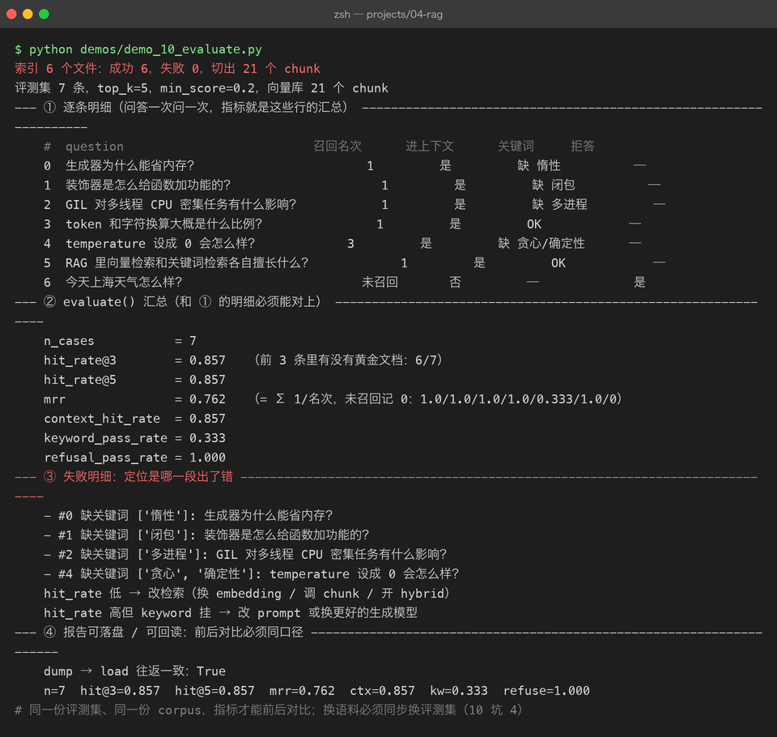

# Project 04 — Chapter 10：RAG Evaluation【RAG 效果评估】

> 状态：✅ 已成文（文档先行，作为 src/ 落地设计依据）
> 对应代码：`src/rag/evaluation.py`（代码落地时实现）

---

## 1. 本章要解决什么问题

Chapter 09 把流水线跑通了。接下来你想优化：换一个 embedding 模型？把 chunk_size 从 500 调到 300？打开 hybrid 检索？

每次改完，你问了三个问题，回答都变好了，于是得出结论：「效果提升了」。

```text
你以为：  我问了几个问题，回答变好了，说明改动有效
实际上：  三个问题、凭印象判断——既没有覆盖面，也没有可复现的口径。
          明天换个时间段再问一次，模型措辞变了，你的"感觉"也会变。
          这不是评估，是抽签
```

真正的评估要回答的问题非常具体：

```text
改动前：Hit Rate@5 = 0.62，MRR = 0.48
改动后：Hit Rate@5 = 0.78，MRR = 0.61
```

两个数字，一前一后，谁也不用争。

本章目标：

> **把 RAG 效果拆成三段分别量化，用一套固定评测集把「感觉变好」变成「指标变好」。**

---

## 2. 为什么需要这个知识

RAG 链路是一条三段接力：检索 → 组装 → 生成。整体效果差时，「整体问一下好不好」无法定位问题出在哪一段。所以必须拆开测：

```text
第一段  检索质量：  能不能找对文档？      → Hit Rate@k / MRR
第二段  上下文质量：找对的有没有装进 prompt？（预算截断有没有把答案截掉？）
第三段  生成质量：  装进去了，答案对不对？有没有幻觉？引用对不对？
                    → 忠实度 Faithfulness / 答案相关性
```

拆开测的直接好处是**调参有方向**：Hit Rate 低，说明问题在检索层（换 embedding 模型、调 chunk 策略），改 prompt 措辞毫无用处；Hit Rate 高但答案不对，说明资料找对了模型却在自由发挥，该改 system 规则或换模型。**不看分段指标就调参，等于蒙着眼睛拧螺丝。**

Java 里这对应单元测试与集成测试的分层：DAO 层单测、Service 层集成测试，挂了先看哪一层红；Python 里就是检索层指标 + 端到端指标两级。也对应覆盖率报告的思路——覆盖率不会告诉你代码没 bug，但它会告诉你「哪些地方你根本没测到」。

---

## 3. 核心概念

### 3.1 指标总览：每个指标测哪一段

| 指标 | 测哪段 | 问题 | 计算成本 |
|------|--------|------|---------|
| Hit Rate@k | 检索 | top-k 里有没有出现正确文档 | 零成本，纯规则 |
| MRR | 检索 | 正确文档排得靠不靠前 | 零成本，纯规则 |
| 上下文命中率 | 组装 | 正确文档是否被装进最终 prompt | 零成本，纯规则 |
| 忠实度 Faithfulness | 生成 | 答案的每句话是否被资料支持 | 需要裁判（LLM Judge） |
| 答案相关性 | 生成 | 答案是否回应了用户的问题 | 需要裁判（LLM Judge） |

前三个是**确定性指标**，代码就能算，学习阶段先把这三个做扎实。后两个需要 LLM 当裁判（本章只做采样观察，进阶可选）。

### 3.2 Hit Rate@k 与 MRR：手算一遍

假设知识库里有 5 篇文档，4 个评测问题，「正确文档」人工标注好了。检索器返回 top-3：

```text
问题 Q1  正确答案: doc_B    检索返回: [doc_A, doc_B, doc_C]  → 命中，排第 2
问题 Q2  正确答案: doc_A    检索返回: [doc_A, doc_D, doc_E]  → 命中，排第 1
问题 Q3  正确答案: doc_C    检索返回: [doc_E, doc_D, doc_B]  → 未命中
问题 Q4  正确答案: doc_D    检索返回: [doc_C, doc_D, doc_A]  → 命中，排第 2
```

**Hit Rate@3** = 命中的问题数 / 总问题数 = 3 / 4 = **0.75**

**MRR（Mean Reciprocal Rank，平均倒数排名）**——对每个命中问题取「排名的倒数」，再求平均：

```text
Q1: 排第 2 → 1/2
Q2: 排第 1 → 1/1
Q3: 未命中 → 0
Q4: 排第 2 → 1/2

MRR = (0.5 + 1.0 + 0 + 0.5) / 4 = 2.0 / 4 = 0.50
```

两个指标看的角度不同：Hit Rate 只问「有没有」，MRR 还问「靠不靠前」。上面这组数据 Hit Rate@5 可能是 1.0（都在 top5 里），但 MRR 只有 0.5——正确答案全排在第 2 名以后，用户要翻两屏才看到。**所以两个都要看。**

### 3.3 评测集怎么建：黄金标准来自文档本身

```python
@dataclass(frozen=True)
class EvalCase:
    question: str                              # 用户会问的问题
    expected_source: str                       # 答案应该在的文档（黄金标准）
    expected_keywords: tuple[str, ...] = ()    # 好答案应包含的关键词
    should_refuse: bool = False                # True = 知识库里没有，应拒答
```

构建规则：

```text
1. 规模：手写 20~50 条，覆盖典型问题 + 边界问题
2. 黄金标准不需要人工写答案——打开文档，把「这个问题的答案在哪篇文档」
   记下来就是 expected_source，keywords 从原文里摘
3. 必须包含 should_refuse=True 的案例：问知识库里完全没有的东西
   （如「今天天气怎么样」），期望系统回答「知识库中没有相关资料」
   ——这是 Chapter 09 定下的失败语义， refuse 路径也要被测
4. 建议拒答案例占 20%~30%，和正常案例分开统计
```

黄金标准来自文档本身，意味着**建评测集的成本很低，但它是唯一能复现的基准**。没有它，每次调参你都在重新掷骰子。

---



## 4. 动手实现（设计稿）

以下代码将在 `src/rag/evaluation.py` 落地，这里先当设计稿读。评估只依赖 Chapter 09 `RAGService` 的公开接口（`ask()` 返回的 `RAGAnswer` 里有 `retrieved_sources` 和 `citations`），内部零件对评估代码是黑盒。

```python
"""RAG 三段式评估：检索 / 组装指标（确定性） + 生成质量（LLM Judge 进阶可选）。"""

import json
import logging
from dataclasses import dataclass, field
from pathlib import Path

logger = logging.getLogger(__name__)


@dataclass(frozen=True)
class EvalCase:
    question: str
    expected_source: str
    expected_keywords: tuple[str, ...] = ()
    should_refuse: bool = False


@dataclass
class EvalReport:
    n_cases: int
    hit_rate_at_3: float
    hit_rate_at_5: float
    mrr: float
    context_hit_rate: float         # 正确文档装进最终 prompt 的比例
    keyword_pass_rate: float        # 关键词出现在答案中的比例（非拒答案例）
    refusal_pass_rate: float        # 该拒答的案例正确拒答的比例
    failed_cases: list[str] = field(default_factory=list)

    def dump(self, path: Path) -> None:
        path.write_text(json.dumps(self.__dict__, ensure_ascii=False, indent=2))


def _source_name(source: str) -> str:
    """metadata 里的 source 是路径，统一取文件名比对，避免路径前缀口径问题。"""
    return Path(source).name if source else ""


def evaluate(service, eval_cases: list[EvalCase], budget: int) -> EvalReport:
    hits3 = hits5 = ctx_hits = kw_pass = ref_pass = 0
    rr_sum = 0.0
    failed: list[str] = []

    for i, case in enumerate(eval_cases):
        answer = service.ask(case.question, budget)
        sources = [_source_name(s) for s in answer.retrieved_sources]

        # —— 第一段：检索质量（不经过 LLM，纯规则指标）——
        ranks = [j + 1 for j, s in enumerate(sources) if s == case.expected_source]
        if ranks:
            rr_sum += 1.0 / ranks[0]
            hits5 += 1
            if ranks[0] <= 3:
                hits3 += 1
        else:
            failed.append(f"#{i} 未命中 [{case.expected_source}]: {case.question}")

        # —— 第二段：上下文质量——正确文档有没有装进最终 prompt ——
        cited = {_source_name(c.source) for c in answer.citations}
        if case.expected_source in cited:
            ctx_hits += 1

        # —— 第三段：生成质量（确定性子集：拒答 + 关键词）——
        if case.should_refuse:
            if "没有相关资料" in answer.answer:
                ref_pass += 1
            else:
                failed.append(f"#{i} 应拒答却作答: {case.question}")
        else:
            missing = [k for k in case.expected_keywords if k not in answer.answer]
            if not missing:
                kw_pass += 1
            else:
                failed.append(f"#{i} 缺关键词 {missing}: {case.question}")

    n = len(eval_cases)
    n_normal = sum(1 for c in eval_cases if not c.should_refuse)
    n_refuse = n - n_normal
    return EvalReport(
        n_cases=n,
        hit_rate_at_3=hits3 / n,
        hit_rate_at_5=hits5 / n,
        mrr=rr_sum / n,
        context_hit_rate=ctx_hits / n,
        keyword_pass_rate=kw_pass / max(n_normal, 1),
        refusal_pass_rate=ref_pass / max(n_refuse, 1),
        failed_cases=failed,
    )
```

使用方式（改参数前后各跑一次，同口径对比）：

```bash
python -m rag.evaluation --profile dev --report reports/before.json
# 修改 chunk_size / 换 embedding 模型 / 开关 hybrid
python -m rag.evaluation --profile dev --report reports/after.json
```

两点定位说明：

- **LLM Judge 是进阶可选**。上面只用了「关键词 + 拒答」这类确定性检查；忠实度（答案是否被资料支持）严格来说要靠 LLM 当裁判——把「参考资料 + 答案」发给裁判模型逐句判断。学习阶段可以做一个 `NoopLLMJudge` 占位接口（只记录样本、不判分），之后接入 DeepSeek 实现真实采样，不阻塞主线。
- **RAGAS / TruLens 等框架是生产工具**。它们把指标、裁判、报告都封装好了，生产可直接用。但学习阶段建议先手写这 100 行——手写过 MRR 的分子分母，才真正理解指标口径；框架对你才是透明盒而不是魔法。

---

## 5. 踩坑清单

### 坑 1：评测问题混进了知识库语料

```text
现象：  所有指标满分，Hit Rate@5 = 1.0、MRR = 1.0，完美得可疑
原因：  建索引用了某批文档，建评测集时又"顺手"从同一批文档
        摘了原句当 question——问题文本和语料几乎逐字相同，
        检索器等于在做字符串匹配
做法：  question 必须换一种问法（陈述句 → 疑问句、换同义词）；
        更严格的做法是留出一部分文档只做评测、永不建索引
```

### 坑 2：expected_source 写错，案例永远 fail

```text
现象：  某几条案例无论怎么调参都是 0 分，failed_cases 里稳定出现同一批编号
原因：  人工标注时文档名写错（大小写、路径前后缀不一致），
        与 metadata 里的 source 永远匹配不上
做法：  建评测集时用程序自检：每条 expected_source 必须真实
        存在于索引中；比对时统一取文件名（见 _source_name），
        不要拿完整路径裸比
```

### 坑 3：只测 happy path，不测拒答

```text
现象：  指标全绿，但用户问「股票明天涨吗」时系统煞有介事地编了一段分析
原因：  评测集里没有 should_refuse=True 的案例，
        "知识库外的问题"这条路径从未被测过
做法：  评测集固定安排 20%~30% 的拒答案例，
        并把 refusal_pass_rate 当作与 hit_rate 同级的指标来盯
```

### 坑 4：指标口径不一致，前后对比失真

```text
现象：  改动前报告写 Hit@3，改动后报告写 Hit@5，得出"大幅提升"的结论
原因：  不同 k 值的指标本来就不可比，何况还可能换了评测集
做法：  报告结构固化（EvalReport 字段即口径），评测集文件入库固定，
        对比只允许同口径、同评测集前后对照
```

---

## 6. 自检清单

- [ ] 能说出三段式评估各段对应哪些指标，以及「检索差该改什么、生成差该改什么」
- [ ] 给 4 个检索结果，能手算 Hit Rate@k 和 MRR
- [ ] 评测集含 should_refuse 拒答案例，且拒答率被单独统计
- [ ] expected_source 经过程序自检，且比对口径统一（文件名）
- [ ] 调参前后能产出两份同口径的 EvalReport JSON 并对比
- [ ] 知道 LLM Judge（忠实度）与 RAGAS / TruLens 的定位，且明白学习阶段先手写的价值

上一章：[09-rag-pipeline.md](09-rag-pipeline.md)
回到项目主页：[../README.md](../README.md)
下一步：Project 05 —— Research Agent / MCP。
