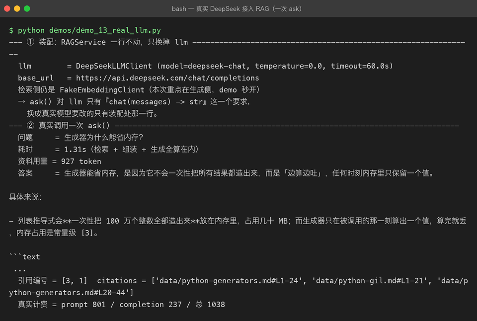
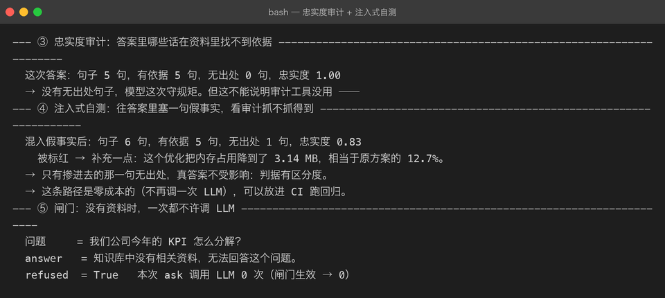
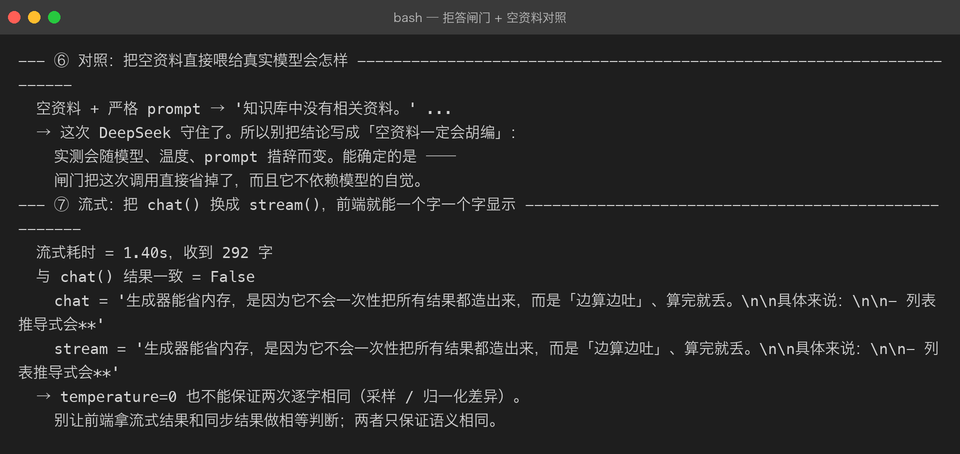

# Milestone 12 — 真实 LLM 接入与忠实度审计

> 目标：把 `RAGService.ask()` 最后的 `FakeLLMClient` 换成真实模型（DeepSeek），
> 并回答一个只有真实接入才会被问到的问题：模型回答里哪些话没有依据？

---

## 目录

1. [为什么不能一直用 FakeLLMClient](#1-为什么不能一直用-fakellmclient)
2. [设计：OpenAI 兼容协议骨架](#2-设计openai-兼容协议骨架)
3. [代码：DeepSeekLLMClient](#3-代码deepseekllmclient)
4. [RAGAnswer 留档：把真实 prompt 保存下来](#4-raganswer-留档把真实-prompt-保存下来)
5. [忠实度审计](#5-忠实度审计)
6. [真实运行截图](#6-真实运行截图)
7. [坑清单](#7-坑清单)
8. [自检清单](#8-自检清单)

---

## 1. 为什么不能一直用 FakeLLMClient

FakeLLMClient 只干一件事：从【参考资料】里挑和问题词面最相关的句子，
按编号拼成答案。它的行为是**确定性的**：资料里没有的词，它绝对不说。

真实模型则相反：它会总结、类比、举例、补充背景知识。
这些行为有一半正是我们想要的（回答更自然、可读性更高），
另一半则是 RAG 最怕的：**幻觉**——答案里混进了资料里没有的信息。

所以接真实 LLM 时，不能只换 client，还要加一层**事后审计**：

    模型答完 → 忠实度审计 → 标出无出处句子 → 人工/自动处理

---

## 2. 设计：OpenAI 兼容协议骨架

国产大模型这几年已经全部收敛到 OpenAI 的 `/chat/completions` 协议，
区别只剩 base_url 和模型名。和 11 章 embedding 层一样，
我们先抽出协议骨架，再派生具体厂商：

| 类 | 职责 |
|---|---|
| `BaseLLMClient` | 抽象：只有 `chat(messages)` |
| `OpenAICompatibleLLMClient` | 协议骨架：chat + stream + timeout + temperature + usage 记录 |
| `DeepSeekLLMClient` | 只填 `BASE_URL` 和 `MODEL` |

为什么把 `stream()` 也放进骨架？因为 Web 端最终要用 SSE（P03 已验证），
RAG 链路只比 chat 多了一个检索阶段。骨架里直接提供流式，
将来复用 `RAGService` 时不需要再开一套 client。

---

## 3. 代码：DeepSeekLLMClient

核心片段（完整实现见 `src/rag/llm.py`）：

```python
class OpenAICompatibleLLMClient(BaseLLMClient):
    BASE_URL = "https://api.deepseek.com/chat/completions"
    MODEL = "deepseek-chat"
    TIMEOUT = 60.0

    def __init__(self, api_key: str, *, model: str = "",
                 timeout: float = TIMEOUT, temperature: float = 0.0):
        if not api_key:
            raise RAGLLMError("api_key 为空，无法调用大模型接口")
        self.api_key = api_key
        self.model_name = model or self.MODEL
        self.timeout = timeout
        self.temperature = temperature
        self.last_usage: dict | None = None

    def chat(self, messages: list[dict]) -> str:
        import httpx
        payload = {
            "model": self.model_name,
            "messages": messages,
            "stream": False,
            "temperature": self.temperature,
        }
        with httpx.Client(timeout=self.timeout) as client:
            resp = client.post(self.BASE_URL, headers=self._headers(),
                               json=payload)
            ...
        self.last_usage = data.get("usage") or None
        return content
```

接入 `RAGService` 时只改装配点：

```python
llm = DeepSeekLLMClient(api_key=os.environ["DEEPSEEK_API_KEY"])
service = RAGService(retriever, reranker, assembler, llm, settings)
answer = service.ask("生成器为什么能省内存？")
```

`RAGService.ask()` 一行代码都不需要动。

---

## 4. RAGAnswer 留档：把真实 prompt 保存下来

RAG 出现「模型答的不是我喂给它的那段」时，最难的是复现。
所以 `RAGAnswer` 增加了一个字段 `system_prompt`：

```python
@dataclass(frozen=True)
class RAGAnswer:
    answer: str
    citations: list = field(default_factory=list)
    context_tokens: int = 0
    system_prompt: str = ""      # ← 12 章新增：真实发出去的系统提示
```

它让审计工具可以直接从答案对象里取回 prompt，不需要再跑一遍检索。

---

## 5. 忠实度审计

审计在 `src/rag/evaluation.py` 里实现。逐句判断「这句话有没有依据」。
两条判据同时生效：

### 5.1 强词判据

句中的**数字**和**英文标识符**是最容易编造的部分。
如果这类词在资料里找不到，就记为「无出处」。

> 实测踩坑：第一版写成了「至少一个命中」，结果语料里恰好有 "MB" 和 "3.13"，
> 一句纯编造的数字事实被判定为有依据。改成**命中比例 ≥ 50%** 之后才拦得住。

### 5.2 实词覆盖率

中文里「的 / 了 / 是」这类虚词几乎每个句子里都有，
留在分母里会把覆盖率刷到 1.0，让审计失去区分度。
先过滤掉常见虚词，再算实词命中率：

```python
def _content_tokens(text: str) -> set[str]:
    return {t for t in _token_set(text) if t not in _STOPWORDS}
```

### 5.3 注入式自测

真实答案有时确实 100% 有出处，这会让审计工具看起来像摆设。
我们在 demo 里手动往答案里塞一句假事实，验证它能否被标红：

```python
POISON = "补充一点：这个优化把内存占用降到了 3.14 MB，相当于原方案的 12.7%。"
poisoned = answer.answer + POISON
report = check_faithfulness(poisoned, answer.system_prompt)
# → 忠实度 0.83，被标红的是 POISON 这一句
```

如果审计工具自己测不过这一关，它就不配上生产。

---

## 6. 真实运行截图

全部来自 `demos/demo_13_real_llm.py`，真实调用 DeepSeek `deepseek-chat`。

### 6.1 真实 ask()：一次完整的在线问答链路



注意两点：

- 真实计费被记录下来：`prompt 801 / completion 237 / 总 1038`。
- 模型回答里带了 `[3]` 编号， citations 可以回原文档。

### 6.2 忠实度审计 + 注入式自测



真答案忠实度 1.00；混进一句假事实后，只有那一句被标红。

### 6.3 拒答闸门 + 空资料对照



没有资料时 `RAGService` 直接返回拒答，**这次 ask 调用 LLM 0 次**。
右图的空资料对照也显示 DeepSeek 这次守住了 prompt，但结论要说清楚：

> 这道闸门不是防模型「不乖」，而是提供**确定性**：不依赖模型自觉，不花这次钱。

---

## 7. 坑清单

| # | 现象 | 原因 | 正确做法 |
|---|---|---|---|
| 1 | 上线后 LLM 调用间歇性超时 | httpx 默认 timeout 只有 5s，生成类接口首 token 经常 >10s | 显式设 `timeout=60.0`，并纳入监控 |
| 2 | 同一问题每次答案不同，评测报告飘 | 默认 temperature > 0，采样有随机性 | RAG 设 `temperature=0.0`，保证可复现 |
| 3 | 流式结果与同步结果不一致 | 两次调用是两次采样，即使 temperature=0 也未必逐字相同 | 前端不要用等号比对，只保证语义一致 |
| 4 | 真实计费看不到 | 没读返回体里的 `usage` | client 内记录 `last_usage`，打日志 |
| 5 | 答案里没 `[n]` 编号， citations 无法对齐 | 模型不遵守格式指令 | 留 `system_prompt` 并做忠实度审计兜底 |
| 6 | 忠实度审计只报 1.00，区分度不足 | 虚词 / 常用词把覆盖率刷高 | 过滤虚词 + 强词比例判据 + 注入式自测 |
| 7 | 重试层级混乱，一次抖动请求四次 | client 内与 RAGService 都重试 | RAGService 重试一次即可；client 只负责单次请求 |

---

## 8. 自检清单

- [ ] 能解释 `RAGService` 为什么只改装配点就能换真实模型
- [ ] 能说明 `temperature=0` 的作用和局限
- [ ] 知道 `last_usage` 该记录在哪里、用于什么
- [ ] 能写出注入式自测，验证忠实度审计不是摆设
- [ ] 知道流式结果与同步结果为什么不能做字符串相等判断
- [ ] 理解拒答闸门不只是防胡说，更是为了省钱和确定性

---

上一章：[11-real-service-integration.md](11-real-service-integration.md) —— 真实 embedding + Chroma 持久化

下一章：待发布 —— FastAPI Web API / 真实 RAG 评估 / 接入真实 reranker

回到项目主页：[../README.md](../README.md)
