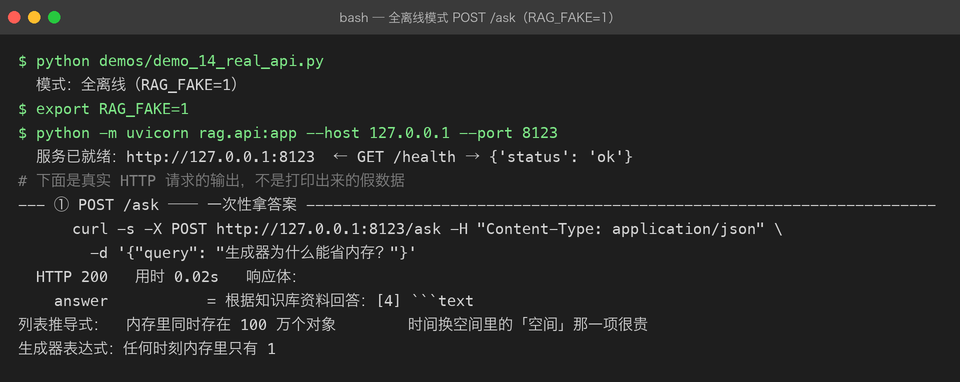
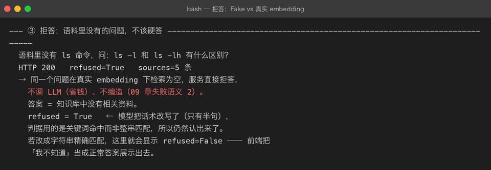
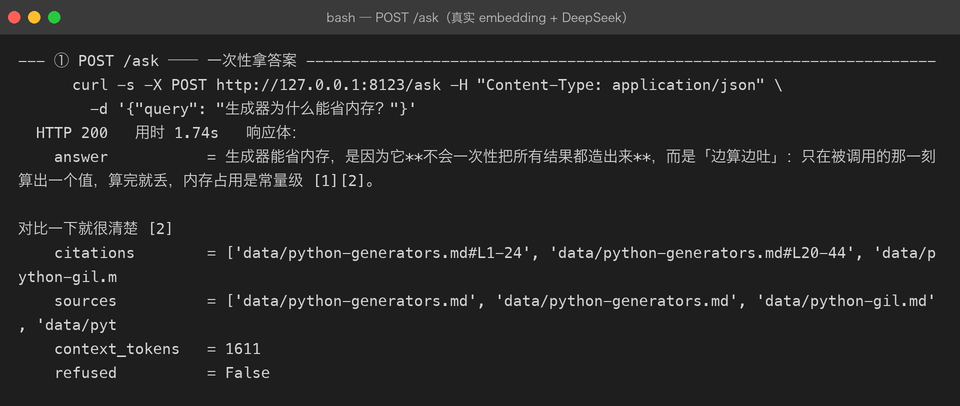
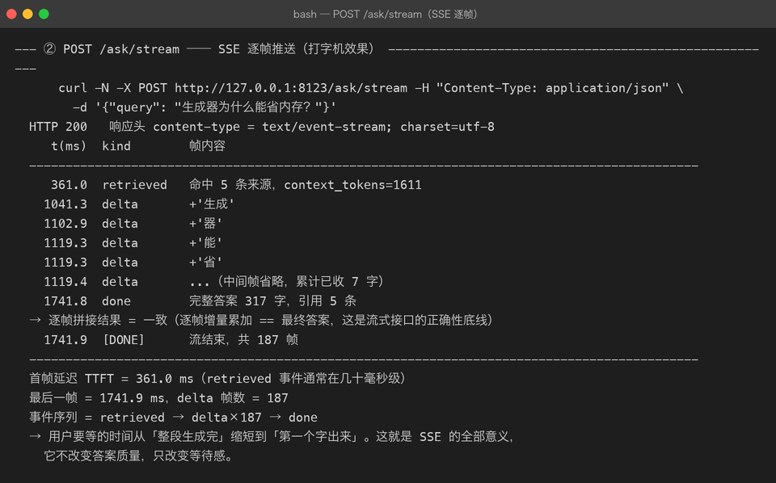

# Milestone 13：给 RAG 加上 FastAPI Web API（复用 P03 的 SSE 模式）

到 12 章为止，RAG 链路还只能在命令行 / demo 里跑。真正的应用形态是一个可被前端调用的 Web 服务。这一章把 Pipeline 封装成 HTTP API，并重点解决「同步链路被硬塞进 async 框架」时会炸出来的那一整类问题。

## 1. 目标与接口契约

新增 `src/rag/api.py`，职责边界与 P03 的 `assistant/api.py` 完全一致：**零业务逻辑**。只做三件事：校验入参 → 调 `RAGService` → 包装响应。

对外暴露五个端点：

| 方法 | 路径 | 说明 |
| --- | --- | --- |
| GET | `/health` | 存活探针 |
| GET | `/stats` | 当前索引规模、embedding 模型、top_k |
| POST | `/ask` | 一次性返回 JSON（answer + citations + sources + refused） |
| POST | `/ask/stream` | SSE 流式推送，前端打字机效果 |
| POST | `/index` | 重新建索引（内存向量库每次进程冷启动都为空） |

环境变量决定链路：

- `RAG_FAKE=1`（默认）：全离线，FakeEmbeddingClient + FakeLLMClient
- `RAG_FAKE=0`：真实 embedding + 真实 DeepSeek LLM

## 2. 代码骨架

### 2.1 `RAGService` 加流式接口

一次性答案和流式答案必须**共用同一段检索 + 组装逻辑**。否则同一个问题，/ask 和 /ask/stream 会给出两份参考资料，前端会疯掉。

```python
@dataclass(frozen=True)
class AnswerEvent:
    kind: str                       # "retrieved" | "delta" | "done" | "error"
    payload: dict = field(default_factory=dict)


class RAGService:
    def _prepare(self, query, budget=None) -> _PreparedQuery:
        # 检索、rerank、组装 prompt

    def ask(self, query, budget=None) -> RAGAnswer:
        # 失败语义 2（检索为空直接拒答） + 失败语义 3（LLM 失败重试一次）

    def stream_answer(self, query, budget=None) -> Iterator[AnswerEvent]:
        # 先 yield "retrieved"（前端可立刻展示「已找到资料」）
        # 再逐 token yield "delta"
        # 最后 yield "done"（完整答案 + 引用）
```

### 2.2 LLM 层暴露 `iter_tokens`

```python
class BaseLLMClient(ABC):
    @abstractmethod
    def chat(self, messages) -> str: ...

    def iter_tokens(self, messages):
        """默认整段一次性返回；真实客户端 override 成逐 token yield。"""
        yield self.chat(messages)
```

`OpenAICompatibleLLMClient.iter_tokens()` 用 `httpx.Client.stream()` 边收边推；`FakeLLMClient.iter_tokens()` 按句切分，保证离线也能演示增量效果。

### 2.3 API 层

```python
def create_app(index_paths=None) -> FastAPI:
    app = FastAPI(lifespan=_make_lifespan(paths))

    @app.post("/ask")
    async def ask(req: AskRequest, service=Depends(get_service)):
        answer = await asyncio.to_thread(service.ask, req.query, req.budget)
        return AskResponse(...)

    @app.post("/ask/stream")
    async def ask_stream(req: AskRequest, service=Depends(get_service)):
        async def gen():
            async for event in _to_async(service.stream_answer(...)):
                yield f"data: {json.dumps(event.as_dict())}\n\n"
        return StreamingResponse(gen(), media_type="text/event-stream")
```

SSE 信封沿用 P03 的格式：`data: {json}\n\n`，json 内用 `kind` 字段区分事件类型。

## 3. 真实踩坑清单

下面每一条都是跑真实 demo 时才炸出来的，不是读文档能脑补的。

### 坑 1：`asyncio.run()` 不能从已有事件循环里调用

真实 embedding 客户端内部是 async httpx，`run_sync()` 用 `asyncio.run()` 收口。CLI / demo / pytest 里没有 running loop，一切正常。但 uvicorn 的 `lifespan` 本身就跑在事件循环里，启动时直接调用 `build_components()` 会报：

```text
RuntimeError: asyncio.run() cannot be called from a running event loop
```

**正确做法**：把整段同步装配丢进线程池。

```python
settings, embedding_client, store, retriever, service = await asyncio.to_thread(
    build_components, profile="dev", fake=False,
    index_paths=paths, quiet=True, llm=_build_llm(False)
)
```

线程里没有 running loop，`asyncio.run()` 就合法了；同时建索引这种重 I/O 也不会堵住事件循环。

### 坑 2：`request` 参数没写 `Request` 注解

依赖函数写成：

```python
def get_service(request) -> RAGService: ...
```

FastAPI 把 `request` 当成一个**必需的 query 参数**，每个端点都开始要求 `?request=xxx`。`GET /stats` 直接 422，报错是 `Field required`。

**正确做法**：

```python
from fastapi import Request

def get_service(request: Request) -> RAGService: ...
```

### 坑 3：同步 LLM / embedding 在 async 端点里会堵死事件循环

即使避开了 `asyncio.run()`，如果直接在 `async def ask()` 里 `for token in service.stream_answer(...)`，整个事件循环会被同步 HTTP 请求卡住，别的请求的 `/health` 都会超时。

**正确做法**：

- `/ask`：整段 `service.ask()` 丢 `asyncio.to_thread`
- `/ask/stream`：每个 `next()` 都丢线程池，让事件循环继续转

```python
async def _to_async(sync_gen):
    loop = asyncio.get_running_loop()
    sentinel = object()
    while True:
        item = await loop.run_in_executor(None, lambda: next(sync_gen, sentinel))
        if item is sentinel:
            break
        yield item
```

代价是一次一个 token 一次线程切换；token 特别碎时（真实模型）可以改成「整段丢一个工作线程 + 队列」的版本。

### 坑 4：Fake 的流式必须发增量，不能发累积前缀

早期 `FakeLLMClient.iter_tokens()` 每句 yield 一次「从开头到当前句」的完整前缀。前端按「追加」消费，结果会把同一段话重复显示 N 遍。

**正确做法**：

```python
pos = 0
for sent in _split_sentences(text):
    yield text[pos:pos + len(sent)]
    pos += len(sent)
```

逐帧增量累加必须**严格等于**最终答案 —— 这是流式接口正确性的底线。

### 坑 5：Fake embedding 下「拒答」根本测不出来

FakeEmbeddingClient 是 char-ngram 哈希：任何查询都会和任何 chunk 算出一个非零相似度。于是 `min_score=0.2` 的闸门在离线模式下形同虚设，问一个语料里完全没有的问题也会召回 5 条。



这不是 bug，是离线替身的固有特性。它意味着：**拒答能力只能用真实 embedding 来验证**。

### 坑 6：真实模型会改写拒答话术

之前 `RAGAnswer.refused` 用精确字符串匹配：

```python
return NO_RESULT_ANSWER in self.answer
# NO_RESULT_ANSWER = "知识库中没有相关资料，无法回答这个问题。"
```

真实 DeepSeek 在拒答时回了一句：

```text
知识库中没有相关资料。
```

只有半句。结果 `refused=False`，前端把「我不知道」当成正常答案展示出去。

**正确做法**：关键词命中。

```python
REFUSAL_MARKERS = ("无法回答", "知识库中没有相关资料", "没有相关资料",
                   "没有找到相关资料", "资料中没有")

def looks_refused(text: str) -> bool:
    return any(marker in (text or "") for marker in REFUSAL_MARKERS)
```

宁可放宽匹配，也不要漏判。



### 坑 7：流式路径一旦发了 delta，就无法回滚重试

同步路径的 `ask()` 遵循失败语义 3：LLM 失败 → 重试一次。但流式路径不同 —— 你已经把部分 delta 推给前端，再重试就会拿到两段拼起来的怪话。

所以 `stream_answer()` 只在**一个字都没吐出去**时重试；一旦开始流式，遇到错误只能发 `error` 事件。

```python
buf = []
sent_any = False
try:
    for tok in self._llm.iter_tokens(prepared.messages):
        sent_any = True
        yield AnswerEvent("delta", {"text": tok})
except Exception as e:
    if sent_any:
        yield AnswerEvent("error", {"message": ...})
        return
    # 还没发任何 delta，重试一次
```

## 4. 真实运行截图

### 一次性接口 `/ask`



真实 embedding + DeepSeek，耗时约 1.7s，答案带 `[n]` 编号引用。

### 流式接口 `/ask/stream`



关键指标：

- **首帧延迟 TTFT ≈ 361 ms**：用户在这个时间点已经看到第一个字。
- **最后一帧 ≈ 1741 ms**：完整答案交付时间。
- **事件序列**：`retrieved → delta×187 → done`

如果没有 SSE，用户要瞪着空白屏等 1.7s；有了 SSE，361ms 后就有反馈。流式**不改变答案质量，只改变等待感**。

## 5. 自检清单

- [ ] 能解释为什么 `/ask` 和 `/ask/stream` 必须共用 `_prepare()`
- [ ] 能说明 `asyncio.run()` 在 uvicorn lifespan 里为什么会炸
- [ ] 能写出把同步生成器桥成 async 生成器的最小代码
- [ ] 知道 SSE 每帧增量累加必须等于最终答案
- [ ] 知道拒答判据为什么不能用精确字符串匹配
- [ ] 知道流式路径的失败重试和同步路径有何不同

---

上一章：[12-real-llm-integration.md](12-real-llm-integration.md) —— 真实 LLM 接入与忠实度审计

下一章：[14-real-rag-evaluation.md](14-real-rag-evaluation.md) —— 真实 RAG 评估：Hit Rate / MRR / 忠实度

回到项目主页：[../README.md](../README.md)
