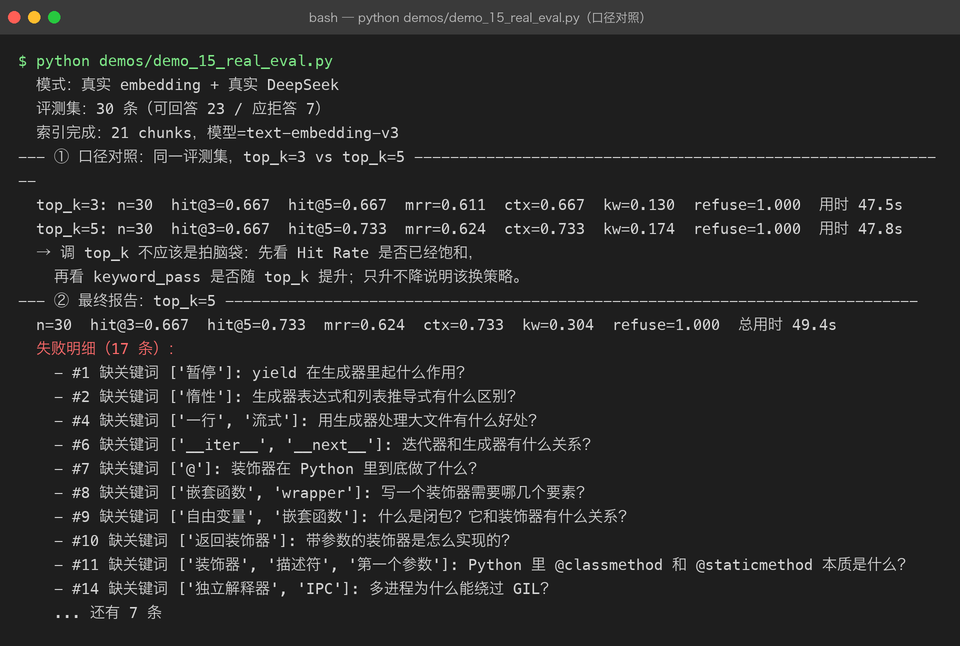
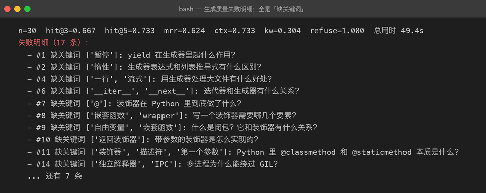
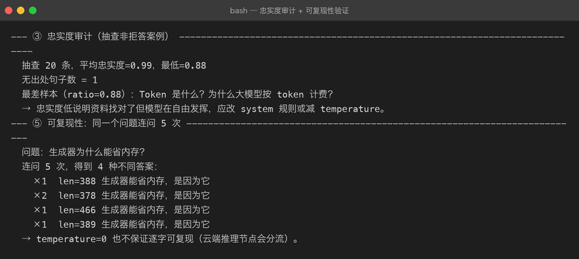

# Milestone 14：真实 RAG 评估（30 条 EvalCase：Hit Rate / MRR / 忠实度）

到 13 章为止，RAG Web API 已经能跑。但一个没人评测过的 RAG 系统跟闭着眼炼丹没有本质区别。这一章用手写 30 条 EvalCase，在**真实 embedding + 真实 DeepSeek** 上跑一遍，看看哪一段链路最拉胯。

## 1. 目标与评测集

评估要解决的不是「分数高不高」，而是：

1. 检索段：正确文档有没有被召回（Hit Rate@k / MRR）
2. 上下文段：正确文档有没有被装进最终 prompt（ctx hit rate）
3. 生成段：答案是否忠实于资料，是否该拒答的没有硬答（keyword / refusal / 忠实度）

三段指标解耦之后，优化才有方向：

- **Hit Rate 低** → 换 embedding / 调 chunk / 加 rerank，改 prompt 没用。
- **Hit Rate 高但答案错** → 资料找对了，模型在自由发挥，改 system 规则 / 降 temperature。
- **拒答判错** → 调整拒绝话术识别或提高检索闸门的 `min_score`。

### 1.1 `data/eval_cases.json`

30 条手写案例，覆盖仓库里 6 份语料：

| expected_source | 数量 | 说明 |
| --- | --- | --- |
| python-generators.md | 7 | 可回答：yield、惰性、生成器表达式 |
| python-decorators.md | 5 | 可回答：@、闭包、wrapper |
| python-gil.md | 4 | 可回答：GIL、多线程、多进程 |
| llm-tokenization.md | 3 | 可回答：token、字符换算 |
| llm-sampling.txt | 2 | 可回答：temperature、贪心采样 |
| llm-retrieval.md | 2 | 可回答：向量检索 vs 关键词检索 |
| not-in-kb.md | 7 | 应拒答：知识库里没有的问题 |

每条案例的「答案」**不是人工写的**。我们只看：

- 正确文档有没有出现在 top_k 里（`expected_source`）
- 答案里有没有出现几个关键信息（`expected_keywords`）
- 没有资料的问题有没有成功拒答（`should_refuse=True`）

这是 10 章讲过的「黄金标准不依赖人工答案」原则。

### 1.2 `demos/demo_15_real_eval.py`

demo 分五节：

1. **口径对照**：同一评测集，top_k=3 vs top_k=5。
2. **最终报告**：固定 top_k=5 出完整 EvalReport。
3. **忠实度审计**：抽查非拒答案例，用 `check_answer_faithfulness()` 逐句核对。
4. **可复现性**：同一个问题连问 5 次，验证 temperature=0 是否逐字稳定。
5. **口径纪律**：评测集、评估函数、指标口径三固定。

报告会落盘到 `reports/eval_report.json`，保证前后对比是同一份口径。

## 2. 三段式指标的真实数值

运行环境：

- embedding：DashScope text-embedding-v3，21 chunks
- LLM：DeepSeek Chat，temperature=0
- 评测集：30 条（可回答 23 / 应拒答 7）

### 2.1 口径对照：top_k=3 vs top_k=5



关键数字：

| 指标 | top_k=3 | top_k=5 | 含义 |
| --- | --- | --- | --- |
| hit@3 | 0.667 | 0.667 | 正确文档进入前 3 的比例 |
| hit@5 | 0.667 | 0.733 | 正确文档进入前 5 的比例 |
| mrr | 0.611 | 0.624 | 正确文档平均排名的倒数 |
| ctx | 0.667 | 0.733 | 正确文档被装进 prompt 的比例 |
| refuse | 1.000 | 1.000 | 应拒答案例成功拒答的比例 |

**结论**：

- top_k 从 3 提到 5，**检索类指标（hit / ctx / mrr）稳定提升**，说明第 4/5 位确实捞进了更多正确文档。
- 但 **hit@3 纹丝不动**，说明模型排序质量没变好：正确文档只是从「第 4/5 位」挪到了「被召回」，并没有被推到更前面。
- 如果你的目标是 hit@3，单纯加 `top_k` 没用，该换的是 embedding 或 rerank。

### 2.2 生成质量：为什么 keyword_pass 这么低

上图中最终报告的 `kw=0.304`，失败明细里 17 条全是「缺关键词」。



但这**不是模型在胡说**——检索类指标 0.667/0.733 说明资料找对了。真正原因是：

> `keyword_pass` 要求答案里**原样出现**预设关键词。真实 LLM 会用同义词、换一种说法，仍然正确，但触发不了关键词匹配。

例如：

- 预设关键词：`惰性`；模型回答：`按需计算`。
- 预设关键词：`暂停`；模型回答：`挂起`。

所以 `keyword_pass` 只能当**保守下界**，不能直接当正确率。

### 2.3 忠实度审计：抽查 20 条



- 平均忠实度 **0.99**，最低 **0.88**
- 20 条里只有 1 句找不到出处
- 最差样本：`Token 是什么？为什么大模型按 token 计费？`

这说明：资料找对了，模型基本不会瞎编。真正需要优化的是**召回率**，而不是生成规则。

### 2.4 可复现性：同一问题连问 5 次

上图中「连问 5 次，得到 4 种不同答案」，长度分别是 388 / 378 / 466 / 389。

即使 `temperature=0`，云端推理节点也会分流，**不保证逐字可复现**。这带来的工程结论是：

- **keyword_pass 不适合当 CI 回归门槛**：今天 0.30，明天可能 0.35，不一定代表系统变好。
- **检索类指标（hit / ctx / mrr）才适合当回归门槛**：它们只跟 embedding + 索引有关，同一批文档跑出来的结果完全一致。

## 3. 代码关键点

### 3.1 `evaluate()` 的拒答口径必须共用 pipeline 的判据

13 章把 `RAGAnswer.refused` 从精确字符串匹配改成了关键词命中（`REFUSAL_MARKERS`）。`evaluate()` 也**必须**复用 `answer.refused`，否则同一套拒答答案会出现两套结果。

```python
if case.should_refuse:
    if answer.refused:          # ← 用 pipeline 已经定义好的判据
        ref_pass += 1
    else:
        failed.append(...)
```

如果这里写死 `"没有相关资料" in answer.answer`，真实模型回一句「资料中没有相关内容。」就会被漏判。

### 3.2 忠实度审计用 system_prompt 当参考资料

`check_answer_faithfulness()` 复用 `RAGAnswer` 留档的 `system_prompt`：

```python
def check_answer_faithfulness(answer, **kw):
    return check_faithfulness(answer.answer, answer.system_prompt, **kw)
```

这样审的就是「模型实际看到的那一段资料」，而不是索引里的全部 chunk，口径更干净。

## 4. 坑清单

### 坑 1：只看 keyword_pass 会误判系统好坏

keyword_pass 低 = 检索错了吗？**不一定**。这里检索类指标 0.667，模型只是在换说法。把 keyword_pass 当最终指标，会白白去调 prompt。

**修法**：把 keyword_pass 当「信号」；下结论先看 hit / ctx / mrr，再用忠实度做定性复核。

### 坑 2：temperature=0 也不保证可复现

DeepSeek 等大型云服务即使 temperature=0，也可能因为负载均衡到不同节点而返回不同文本。实测同一问题 5 次，4 种答案。

**修法**：

- 评估时**至少跑 3 次取平均**，或者只看检索类指标。
- 不要把 keyword_pass 设成 hard gate。
- 如果需要严格可复现，考虑本地 vLLM（见 04 章）。

### 坑 3：top_k 提升不一定改善答案质量

top_k=3→5 让 hit@5 和 ctx 提升了，但 hit@3 没变。这意味着：

- 只是召回范围变宽了，排序能力没提升。
- 想提升 hit@3，该换 embedding 模型或加 rerank，而不是继续加大 top_k。

### 坑 4：评测集和评估函数必须三固定

前后对比只允许「同评测集、同评估函数、同指标口径」。一旦悄悄改评测集，分数再高也没意义。

## 5. 自检清单

- [ ] 能解释 Hit Rate@3 / Hit Rate@5 / MRR 分别衡量什么
- [ ] 能说明为什么 keyword_pass 低不代表系统差
- [ ] 能解释为什么 temperature=0 的 API 调用仍可能返回不同答案
- [ ] 能指出 top_k=3 到 top_k=5 的实验说明了什么
- [ ] 知道忠实度审计和关键词命中率的适用场景区别
- [ ] 能写一条 EvalCase，并知道拒答案例的 expected_source 该怎么填

---

上一章：[13-fastapi-web-api.md](13-fastapi-web-api.md) —— FastAPI Web API（SSE 流式）

回到项目主页：[../README.md](../README.md)
