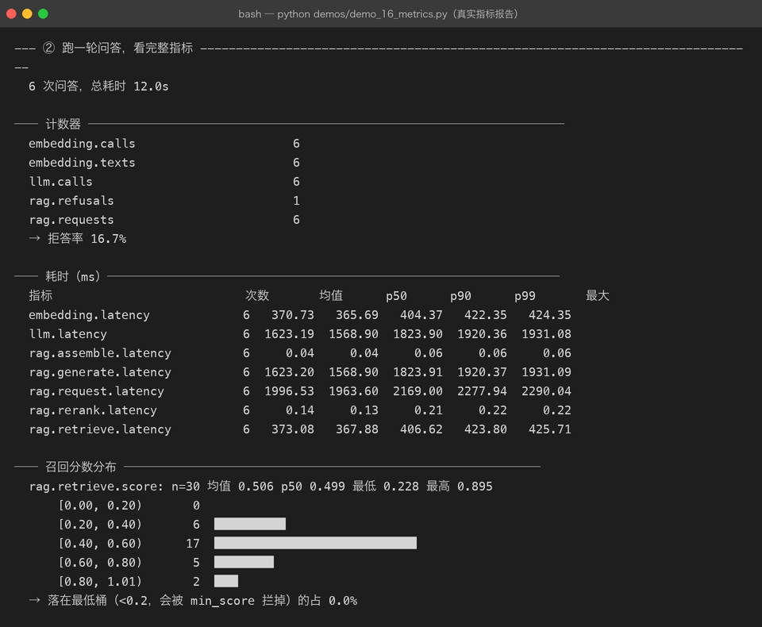
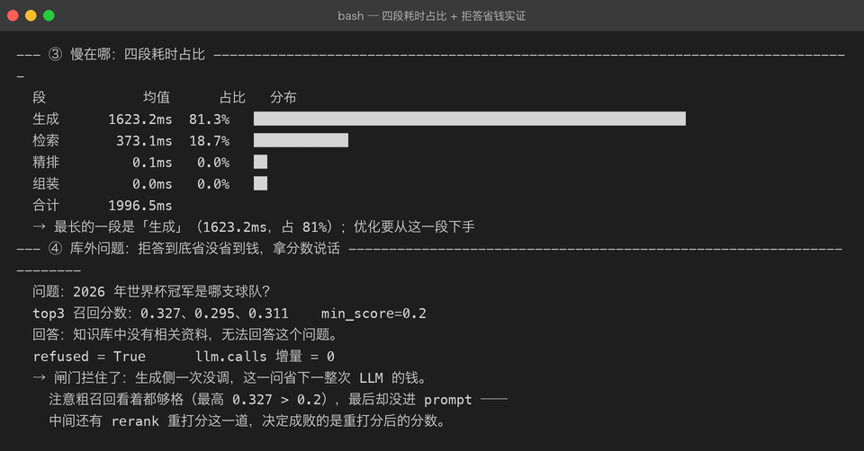
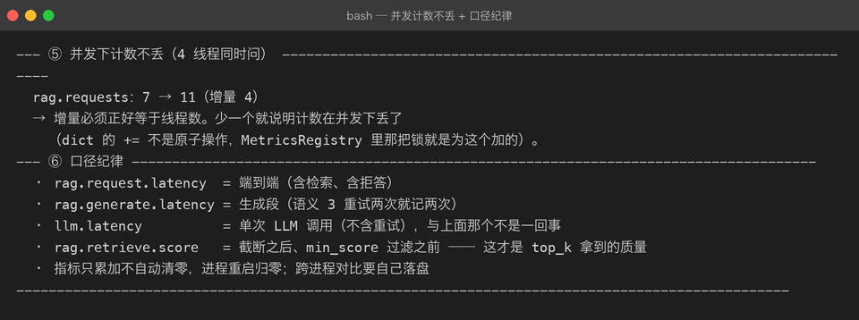

# 15 — Observability（可观测性）

> 14 章回答的是「答得准不准」，这一章回答另一组问题：**慢在哪、召回有没有退化、钱花在哪**。
> 这三个问题光看日志答不上来——日志是逐条的事件，而这三个是**聚合的分布**。



## 0. 这章解决什么问题

RAG 服务上线后最先被问到的三句话，没有一句是「功能对不对」：

| 问题 | 需要的数据 | 对应指标 |
| --- | --- | --- |
| 「怎么这么慢？」 | 各阶段耗时分布 | `rag.request.latency` + 四段分段耗时 |
| 「召回是不是退化了？」 | 相似度分数的分布 | `rag.retrieve.score` + 分桶 |
| 「这个月 API 账单怎么算的？」 | 外部调用次数 | `embedding.calls/texts`、`llm.calls` |

逐条日志给不出这三问的答案：日志适合排查**单次**故障，分布才适合回答**整体**健康度。

## 1. 设计：一层薄的计数器，不是监控系统

新增 `src/rag/metrics.py`，核心是 `MetricsRegistry`——进程内的 counter / timing / score 三种样本，加锁保证线程安全。

三个关键决策：

**① 内部一律存秒，出报告才转毫秒。** 早期版本直接存毫秒，结果一处取秒、一处取毫秒，p99 差了 1000 倍都没人发现。SI 基准单位只有一个，换算只发生在渲染层。

**② 埋点用装饰器包装，不改 client 内部。** `MeteredEmbeddingClient` / `MeteredLLMClient` 包在真实客户端外面转发调用：

```python
class MeteredLLMClient(BaseLLMClient):
    def chat(self, messages: list[dict]) -> str:
        self.registry.inc(Names.LLM_CALLS)
        t0 = time.perf_counter()
        try:
            return self._inner.chat(messages)
        except Exception:
            self.registry.inc(Names.LLM_ERRORS)
            raise
        finally:
            self.registry.observe(Names.LLM_LATENCY, time.perf_counter() - t0)
```

「计量」和「怎么调模型」是两个职责，写死进 `OpenAICompatibleLLMClient` 会让它同时承担协议适配和统计，测试时还得想办法关掉统计。包一层则完全不包就是原客户端。失败也要记耗时——**超时的那次往往是最慢的，只记成功会把 p99 洗得很好看**。

**③ 分位数用线性插值，不用 nearest-rank。** 样本少（比如只有 3 次调用）时 nearest-rank 只会给出已有的某个值，p90 永远等于 max，看着像「每次都最慢」。插值在样本少时更诚实。

## 2. 埋点位置与口径

`RAGService` 增加可选 `metrics` 参数，总是持有一个 registry（没传就内部建），埋点代码不用判空，外部读指标取 `service.metrics`——**免去改 `build_components` 五元组返回签名**（那一改要动全部测试和 demo）。

```
ask(query)
 ├─ rag.request.latency      端到端（try/finally，失败也记）
 ├─ rag.retrieve.latency     检索段
 ├─ rag.rerank.latency       精排段
 ├─ rag.assemble.latency     组装段
 ├─ rag.generate.latency     生成段（语义 3 重试两次就记两次）
 │    └─ llm.latency         单次 LLM 调用（MeteredLLMClient，不含重试）
 ├─ rag.retrieve.score       分数采样：截断之后、min_score 过滤之前
 └─ rag.requests / rag.refusals
```

两个口径故意分开：`rag.generate.latency`（这一趟生成总共多久，可能含重试）和 `llm.latency`（单次调用）。混成一个的话，「重试变多」和「单次变慢」就分不开了。

**分数为什么在「截断之后、过滤之前」采样？** 这才是 top_k 真正拿到的那批质量。过滤后再采样，会把「召回全是噪声」洗成「分数不错」——被 min_score 拦掉的恰恰是最该看见的样本。

另一个容易被忽略的事实：`min_score` 是在 `ContextAssembler` **构造时**定死的，不是每次 build 读 settings。改了 `settings.min_score` 却没重建 assembler，闸门其实没变——写测试造「检索为空」场景时踩到一次。

## 3. 真实运行：12.3 秒问答告诉我们的三件事

6 条库内问题 + 1 条库外问题，真实百炼 embedding + 真实 DeepSeek，总计 12.3s：

**发现一：慢在生成，不在检索。** 端到端均值 2045.6ms，其中生成 1653.5ms（80.8%）、检索 391.8ms（19.2%）、精排 0.2ms、组装 0.05ms。优化优先级一目了然——换更快的模型 / 缩短输出，而不是优化向量检索。对比离线模式（Fake 全在内存里），检索反而占 74%：**占比结论只在真实链路上成立，离线数不能用来做性能判断**。



**发现二：`min_score=0.2` 对百炼 embedding 形同虚设。** 30 个召回样本的分数最低 0.228、均值 0.506，**没有一个落进 <0.2 的桶**。余弦相似度的绝对量级在不同模型之间不可比：bge-m3 / 百炼对中文的分数普遍偏高，0.2 这种「通用阈值」在这里永远拦不住任何东西。阈值必须按实际分布校准（比如取 p10）。

**发现三：拒答省钱的闸门其实在 rerank，不在 min_score。** 库外问题「2026 年世界杯冠军」的粗召回分数 0.327 / 0.295 / 0.311，全都高于 0.2，看起来该进 prompt；最终 `llm.calls` 增量却是 **0**——真正把它拦下来的是 FakeReranker 重打分之后的低分。这提醒我们：**链路上每一道闸门都要单独验证，不能只看粗召回分数**。

**发现四：并发计数不丢。** 4 线程同时问，`rag.requests` 增量正好是 4。Web API 里 `/ask` 是 `asyncio.to_thread` 跑的，字典的 `+=` 不是原子操作，不加锁会在压测时丢计数——丢的偏偏是「调用次数」这种最不该丢的数（计费对账就靠它）。



## 4. 踩坑清单

1. **离线模式下拒答测出 `llm.calls` 增量 1**——`FakeEmbeddingClient` 是 char-ngram 哈希，什么查询都召回；`FakeLLMClient` 发现资料与问题重叠不足，返回拒答话术。拒答发生在 **LLM 之后**而不是闸门。所以 demo 第④节改成「拿分数说话」，两种模式各自给出诚实结论，而不是硬写「省下一次 LLM」。
2. **改 `settings.min_score` 不生效**——`ContextAssembler(min_score=...)` 构造时固化。测试里换成重建 assembler 才造出「检索为空」。
3. **包装器让 `isinstance(service._llm, FakeLLMClient)` 失败**——计量壳改变了静态类型。给两个包装器加 `inner` 属性，测试穿透一层断言，本意不变。
4. **pytest 函数名里写括号**（`test_并发计数不丢(异步无关)`）会被当成参数化标记直接收集报错。中文测试名可以，括号不行。
5. **p99/p50 抖动判读需要足够样本**——2 个样本时插值 p50≈1.05、p99≈1.98，比值不到 2，判读永远不触发。判读逻辑要有「样本够了才说话」的自觉，测试里用 9 快 1 慢的构造触发它。

## 5. 自检清单

- [x] 指标名集中在 `Names`，没有散落的裸字符串
- [x] 计数、耗时、分数三类样本分开存；snapshot 一次拿全（避免「请求数」与「耗时数」来自不同时刻）
- [x] 失败请求也进耗时分布；`llm.errors` / `embedding.errors` 单独计数
- [x] `rag.generate.latency`（含重试）与 `llm.latency`（单次）口径分离并写进文档
- [x] 分数采样在截断后、过滤前；分桶边界与 `min_score` 对齐
- [x] `/stats` 直接返回 `metrics.snapshot()`，API 层零加工
- [x] 17 项 metrics 单测：并发 20 线程 × 500 次 inc 不丢、异常也计时、分桶守恒
- [x] 报告带自动判读（拒答率 >50%、p99/p50 >5 倍抖动、最低桶占比）
