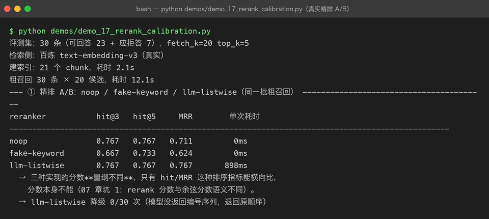
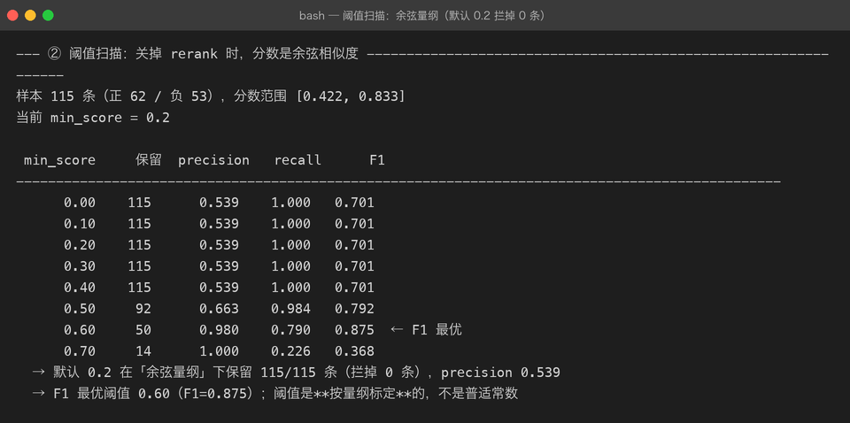
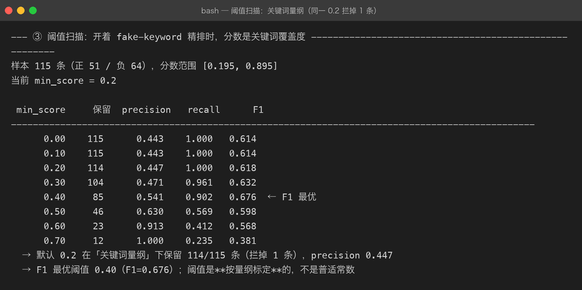
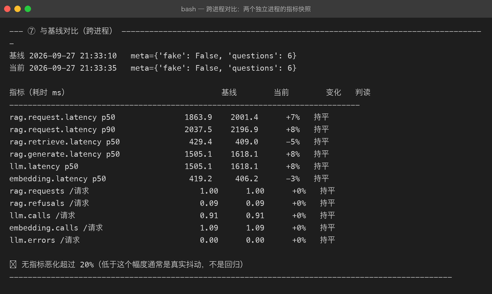

# Milestone 16 — 真实 Reranker 与阈值校准

> 15 章的可观测性报告留下两个尾巴：**`min_score=0.2` 对百炼 embedding 形同虚设**（30 个召回样本最低 0.228，一条没拦），以及「接入真实 reranker」一直挂在做不了的状态。这一章把两个都收掉。

## 1. 先交代一件事：cross-encoder 为什么没接上

原计划是接真实的 cross-encoder 精排（`bge-reranker-v2-m3`），但两条路都走不通：

| 尝试 | 结果 |
|---|---|
| SiliconFlow `bge-reranker-v2-m3` | 本机**没有** `SILICONFLOW_API_KEY` |
| 百炼 `gte-rerank` | `403 AccessDenied`（账号未开通该服务） |
| 百炼 `text-rerank-v2` | `400 Model not exist` |

结论：**cross-encoder 路线在本机做不了真实验证**。与其在文档里假装接了真实 reranker，不如换一条真实能调通的路线——**用 DeepSeek 做 listwise 精排**（LLM-as-reranker，工业界的成熟备选）。这不是降级凑数：它同样是「把 query 和候选一起送进模型、让模型判断相关性」的 cross-encoder 思想，只是判断者是生成模型而不是打分头。

先验证能力再动手（不写没跑过的结论）：

```
输入：1 个问题 + 5 条候选（生成器/装饰器/GIL/迭代器）
输出：'0,2,4' —— 恰好是三条生成器相关的片段
耗时 0.82s，157 token（其中 completion 只有 5 个）
```

排序准确，成本极低（completion 只有编号）。**真实可用**，这才落地成 `LLMReranker`。



## 2. LLMReranker 的设计

```python
class LLMReranker(BaseReranker):
    def __init__(self, llm, max_candidates=12, max_doc_chars=300): ...
```

三个必须写清楚的设计决策：

**① 分数只表达名次，不表达置信度。** LLM 不给分，这里按名次线性递减造一个分数（1.0, 0.95, …）。它只能用于排序——**不能拿它设 `min_score` 阈值**，也不能和余弦分数比大小。这是它和 cross-encoder 最大的差距：cross-encoder 的 relevance_score 至少还能扫阈值，listwise 的名次分什么都不能扫。

**② 解析失败降级为原顺序，服务故障才抛错。** 两者必须分开：模型没按格式答（返回空串、废话）是**模型行为**，降级重排为原顺序照样可用，不该打断整条问答链路；而 API 超时/断连是**服务故障**，要抛 `RerankError` 让接入层决定降级策略。首跑 30 条出现过 1 次空串降级，重跑 0 次——偶发，但正因为偶发，降级路径必须存在且**可观测**（`reranker.degraded` 计数，见截图第 14 行）。

**③ 解析要容错。** `2,2,99,0` → 重复编号去重、越界编号丢弃、没被点名的候选按原顺序垫底。宁可排序质量降级，不能丢候选（`max_candidates` 截掉的候选也按原顺序补回来，保证 rerank 只改顺序不改集合）。

## 3. 精排 A/B：真实结论出乎意料

同一批粗召回（30 条 EvalCase × fetch_k=20），三种实现在检索侧指标的对照：

| reranker | hit@3 | hit@5 | MRR | 单次耗时 |
|---|---|---|---|---|
| noop（不精排） | 0.767 | 0.767 | 0.711 | 0ms |
| fake-keyword | 0.667 | 0.733 | **0.624** | 0ms |
| llm-listwise | 0.767 | 0.767 | **0.767** | 898ms |

三个真实发现：

1. **「有精排」不等于「更准」。** fake-keyword 这种朴素关键词覆盖度精排在真实 embedding 上反而把 MRR 从 0.711 拉到 0.624——它按「query 词命中比例」打分，会把长而沾边的片段顶到前面，把真正答案挤下去。**离线替身里看起来合理的启发式，上真实数据可能是有害的。**
2. **LLM 精排的收益形态是「往前挪」而不是「捞回来」。** hit@3 / hit@5 与 noop 持平（0.767），但 MRR 从 0.711 → 0.767：正确文档没有变多，只是平均排位更靠前了。收益 +8%，代价 898ms/次——值不值取决于业务在意首条命中率还是平均排位，这个数字让决策有依据。
3. **评估刻意只测检索侧。** rerank 影响的是「哪些片段进 prompt」，和生成质量无关。30 条 × 3 种配置都真实生成一遍，既慢又贵，还会把生成抖动（14 章已证明：同一问题连问 5 次有 4 种答案）混进检索差异里。

## 4. 阈值校准：用正负样本扫描，不拍脑袋

标注方式不用人工：`expected_source` 命中的候选即正样本，其余即负样本（拒答案例的占位符全部排除）。只扫「**rerank + 截断 top_k 之后**」的候选——因为 `min_score` 只在这个位置生效，扫全库候选没有意义。





| 量纲 | 分数范围 | 默认 0.2 拦掉 | F1 最优阈值 | precision / recall |
|---|---|---|---|---|
| 余弦（关精排） | [0.422, 0.833] | **0 条** | 0.60 | 0.980 / 0.790 |
| 关键词覆盖（开 fake 精排） | [0.195, 0.895] | 1 条 | 0.40 | 0.541 / 0.902 |

这组数字把 15 章的「形同虚设」量化成了可执行的结论：

- **余弦量纲下 0.2 一条都拦不住**：最低分 0.422，是阈值的 2.1 倍。百炼 embedding 的余弦分数整体偏高，阈值必须贴着实际分布的下沿定（本例 0.60，F1 从 0.701 提到 0.875）。
- **同一个 0.2，换一个精排量纲含义全变**：0.2 在关键词覆盖度上是个死门槛（把 0.195 的片段拦掉），在余弦上是什么都不拦。**阈值不是常数，是「分数产生方式」的函数**——换 embedding 或换 reranker 都必须重新扫一遍。
- 阈值提得太狠会翻车：0.70 时 precision 1.000 但 recall 只剩 0.226——拦噪声拦到把答案也拦了。

> 口径纪律：① 阈值绑定「分数是谁产生的」；② 实现之间只比 hit/MRR 排序指标，分数绝对值不跨实现比；③ 阈值扫描只扫进 prompt 的那几条。

## 5. 指标落盘：跨进程对比

15 章的指标只活在单进程内存里，`MetricsRegistry` 现在补上三件套：`save(path)` / `load(path)` / `render_diff(base, curr)`。

设计要点：

- **落盘存摘要不存原始样本**：几万条耗时样本全写盘要好几 MB，而对比只需要分位数；也避免把单条请求数据落到盘上。
- **快照内部一律存秒**，渲染和对比时才 ×1000 转毫秒。第一版 `render_diff` 直接拿快照值打印，0.25 秒会印成 `0.25` 看着像 250ms——差点造出一个 1000 倍量纲 bug，靠单测（`p50 == 0.25` 而不是 `250.0`）锁住。
- **计数器折算成「每次请求」再比**：问 6 题和问 20 题的 `llm.calls` 总数没有可比性。
- **报警线 20% 而不是 5%**：真实 LLM 的 p50 本身就有 ±15% 抖动，阈值低于抖动幅度只会天天误报——报警要报在噪声之上。

真实跑两次独立进程（间隔 25s）验证：



p50 1863.9ms → 2001.4ms（+7%），判定持平不报警；`llm.calls/请求` 0.91 → 0.91 完全一致。回归检测要的就是这种「真抖动不报、真恶化才报」的行为。

## 6. 使用的 API 与踩坑记录

| # | 踩坑 | 证据与处理 |
|---|---|---|
| 1 | 百炼 rerank 账号未开通，`gte-rerank` 返回 403；`text-rerank-v2` 模型不存在 | 探测后再写代码；本机没有 cross-encoder 可用 → 落地 `LLMReranker`（DeepSeek listwise，先小样本验证排序能力） |
| 2 | LLM rerank 偶发返回空串（首跑 30 条出现 1 次） | 降级为原顺序 + `degraded` 计数可观测；不能让一次格式抖动打断链路 |
| 3 | fake-keyword 精排在真实 embedding 上 MRR 反降 0.711 → 0.624 | 离线启发式上真实数据可能有害；精排要 A/B，不能「加了就信」 |
| 4 | listwise 名次分没有置信度语义 | 分数只保证单调递减；对它设 min_score 毫无意义 |
| 5 | 快照存秒、报告印毫秒，`render_diff` 第一版直接印快照值 | 对比前统一 ×1000；用单测锁 `p50 == 0.25`（秒） |
| 6 | 同一 `min_score` 在两个量纲下行为完全不同 | 阈值是「分数产生方式」的函数，换模型必须重扫 |

## 7. 交付物清单

- `src/rag/reranker.py`：新增 `LLMReranker`（真实 DeepSeek listwise）+ `_parse_ranking` 解析容错 + 工厂支持 `provider="llm"`
- `src/rag/cli.py`：`build_components` 新增 `reranker=`（显式指定精排实现）与 `min_score=`（阈值注入）参数
- `src/rag/metrics.py`：新增 `save` / `load` / `render_diff`（跨进程对比，20% 容忍带 + 每请求折算）
- `demos/demo_17_rerank_calibration.py`：真实 A/B + 双量纲阈值扫描；`demo_16_metrics.py` 新增 `--save` / `--baseline`
- `tests/test_reranker.py` +6 项、`tests/test_metrics.py` +5 项（166 → 177 项全绿）
- 4 张真实运行截图：`term-rerank-ab.png`、`term-threshold-cosine.png`、`term-threshold-rerank.png`、`term-metrics-diff.png`

## 8. 自检清单

- [x] 每个结论都有真实运行截图或表格数字支撑
- [x] rerank 只改顺序不改集合（`max_candidates` 之外的候选不会丢）有测试
- [x] 解析失败降级 / 服务故障抛错两条路径分开，各有测试
- [x] 阈值结论标注了适用量纲，不冒充普适常数
- [x] 跨进程对比真实跑过两个进程，验证「不误报」行为
- [x] `check_links.py --strict` 无死链坏图
