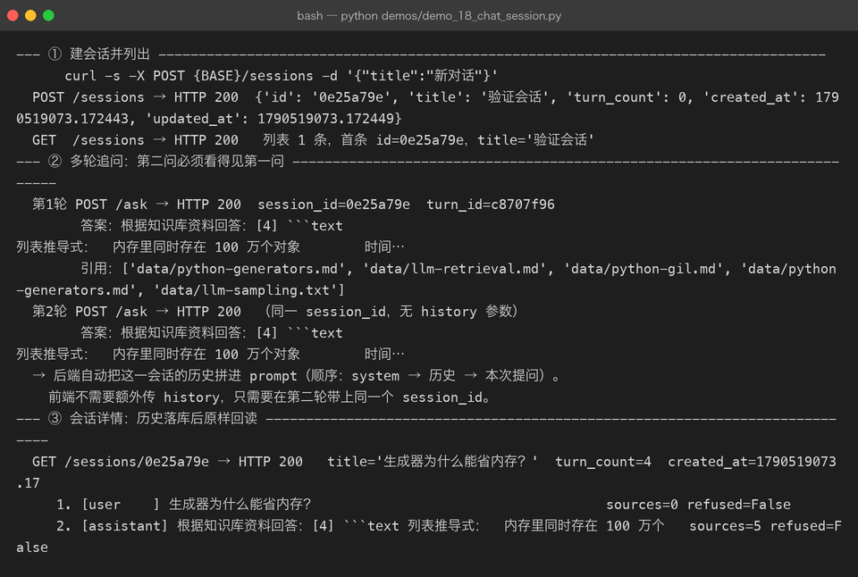
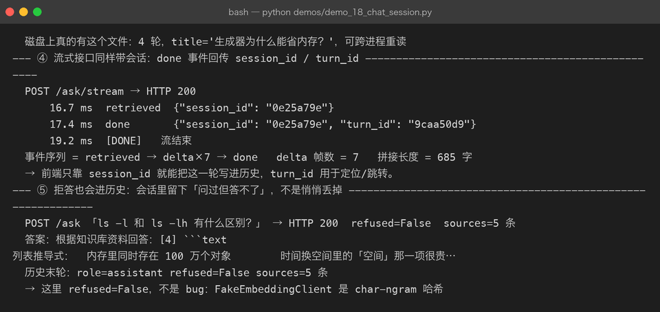
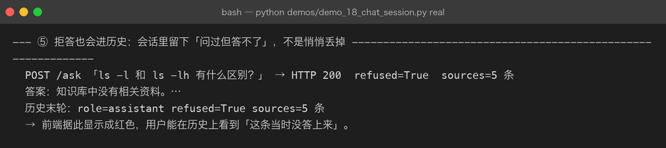
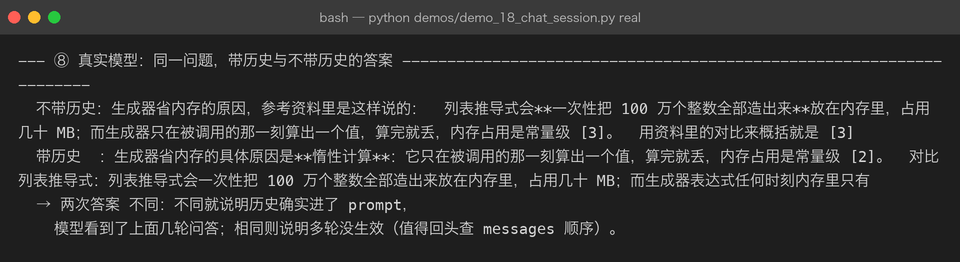
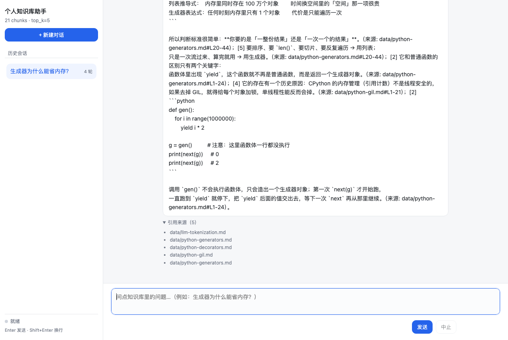

# Milestone 17 — Chat UI / 会话历史 / 多轮追问

> 把 RAG 从「问一句答一句的接口」变成「可以连续聊的产品」。

## 目标

1. 后端支持**会话**：创建 / 列表 / 详情 / 改名 / 删除；问答接口支持 `session_id`，
   自动把 user 提问与 assistant 回答落库。
2. 后端支持**多轮追问**：同一 `session_id` 下的历史会自动拼进 prompt，
   并按 token 预算裁剪，用户不用手动传 history。
3. 前端提供**零构建的 Chat UI**：原生 HTML/JS/CSS，连上 SSE 就能用；
   有会话列表、消息气泡、流式打字、引用来源、中止按钮。

## 为什么产品化是独立的里程碑

此前的 P04 一直在做「核心链路」：检索、精排、评估、可观测性、真实 LLM。
这些做完之后，你有了一个**能答对问题的引擎**，但用户无法连续追问：

- 每次都要把完整上下文自己塞进 prompt，体验等于在用 Postman 调接口
- 想回看之前的问答？只能看终端输出
- 一个拒答或一个引用，转眼就翻屏过去

会话历史 + 多轮追问 + 前端 UI，是把 RAG 从「脚本」变成「产品」的最后一块。

## 关键设计

### 1. 会话模型不可变

`Session` 的 `turns` 是 `tuple[Turn, ...]`，不是 `list`。追加一轮的 `with_turn()`
返回新的 `Session`，原对象不动。

为什么这么做：FastAPI 的 `/ask` 与 `/ask/stream` 都是 async 端点，它们在线程池里
调用同一个 `SessionStore`。如果 `turns` 是 list，并发两个请求同时 append，
后一个线程的读-改-写会覆盖前一个线程的结果 —— 历史里会**丢轮次**。

```python
class Session:
    session_id: str
    title: str
    turns: tuple[Turn, ...] = ()

    def with_turn(self, turn: Turn) -> "Session":
        return replace(self, turns=self.turns + (turn,), updated_at=_now())
```

### 2. 存储可插拔

`SessionStore` 是 ABC，有 `InMemorySessionStore`（测试 / 重启即丢）和
`JsonFileSessionStore`（默认落 `data/sessions/`）。切换方式只有环境变量：

```bash
export RAG_SESSIONS_DIR=./data/sessions   # 落盘
# 不设置 = 纯内存
```

文件存储用**原子写**：先写临时文件，再 `os.replace()`。进程在写一半被杀，
不会留下截断的 JSON —— 对会话目录里的文件，用户是当记忆看的。

### 3. 历史拼进 prompt 的精确顺序

多轮很容易写错：如果把历史放到本次 query 之后，模型会把「上一轮的问题」
当成当前任务。正确的顺序是：

```
system（含本轮参考资料）
  ↓
历史 user / assistant 轮次（只含 role + content）
  ↓
本次 user query
```

```python
messages = [{"role": "system", "content": system}]
messages.extend(t.to_message() for t in history_turns)
messages.append({"role": "user", "content": query})
```

同时历史要**裁剪**：`max_history_turns` 限制条数，`max_history_chars` 限制字符。
超字符时从**最旧**的一轮开始丢，保留相对顺序 —— 跳着丢会断掉指代链。

### 4. 前端零构建

`web/` 目录下只有三个原生文件：`index.html` / `style.css` / `app.js`。
不依赖 React/Vue/CDN，服务启动时直接通过 `StaticFiles` 挂载。

SSE 解析有个常见坑：**数据帧可能跨 chunk 到达**。前端必须维护一个 buffer，
以 `\n\n` 为边界切分，而不是假设每次 `read()` 都是一整帧。

```javascript
let buf = '';
while ((sep = buf.indexOf('\n\n')) >= 0) {
  const raw = buf.slice(0, sep);
  buf = buf.slice(sep + 2);
  const line = raw.split('\n').find(l => l.startsWith('data: '));
  if (!line) continue;
  const ev = JSON.parse(line.slice(6).trim());
  // ...
}
```

## 代码位置

- `src/rag/session.py`：Turn / Session 模型 + InMemory + JsonFile 存储 + 裁剪函数
- `src/rag/pipeline.py`：`ask(stream_answer)` 增加 `history` 参数；`_prepare` 拼历史
- `src/rag/api.py`：`/sessions/*` 端点、`/ask` 与 `/ask/stream` 支持 `session_id`、挂载 `web/`
- `src/rag/settings.py`：`max_history_turns` / `max_history_chars`
- `web/index.html` / `web/style.css` / `web/app.js`：零构建前端
- `demos/demo_18_chat_session.py`：真实起服务 + HTTP 完整走通（支持 `real` 真实链路）
- `tests/test_session.py`、`tests/test_api.py`、`tests/test_pipeline.py`：新增 27 项测试

## 真实运行输出

离线模式：FakeEmbedding + FakeLLM，验证接口与落库逻辑。



流式接口同样返回 `session_id` / `turn_id`，前端据此把这一轮补进历史：



用真实 embedding + 真实 DeepSeek 时，拒答闸门真正生效，`refused=True` 也会进历史：



更关键的是：真实模型下，**同一问题带不带历史，答案不同** —— 这说明历史真的进了 prompt：



前端页面（原生 HTML/JS，零构建）运行在同一进程里：



## 新增端点

```text
POST /sessions                  创建会话
GET  /sessions                  会话列表（按最近更新排序）
GET  /sessions/{id}             会话详情 + 历史
PATCH /sessions/{id}            改标题
DELETE /sessions/{id}           删除
POST /ask         （+session_id）一次性问答并落库
POST /ask/stream  （+session_id）SSE 流式问答并落库
GET  /                          前端 Chat UI（StaticFiles 挂载）
```

## 坑与结论

1. **`mount("/", StaticFiles)` 会吃掉所有路由**。
   如果把它注册在 `/health`、`/ask` 之前，StaticFiles 会对这些路径返回 404。
   解决方案：把 `StaticFiles` 放在 `create_app()` 路由注册**之后**。

2. **流式路径里必须先落 user turn**。
   如果等生成完再一次性落库，客户端中途关闭页面或点「中止」，历史上就只剩
   用户提问、没有助手回答。我们在 stream 开始时就 append user turn，
   生成结束后再 append assistant turn。

3. **多轮裁剪不能跳着丢历史**。
   如果从中间丢掉某一轮，模型看到「A 问 → B 答 → 追问」的中间部分会懵。
   策略：先按条数从旧截，再按字符从最旧丢。

4. **离线替身测不出拒答**。
   FakeEmbeddingClient 是 char-ngram 哈希，任何查询与任何 chunk 都有非零相似度，
   `min_score=0.2` 形同虚设。只有切到真实 embedding（百炼 / SiliconFlow）时，
   拒答闸门和 threshold 校准才有意义。

5. **前端 SSE 不要按 `read()` 边界拆帧**。
   网络分包会把多个 `data:` 帧或半帧塞进一次 `read()`，buffer 以 `\n\n` 切分
   是刚需，不是优化。

## 版本

- P04 从 **v0.7** 升级到 **v0.8**
- Milestones：16 → **17**
- 模块：`src/rag/session.py` + `web/*`（共新增 4 个文件）
- 测试：170 → **197 passed**
- 真实运行截图：39 → **44** 张
