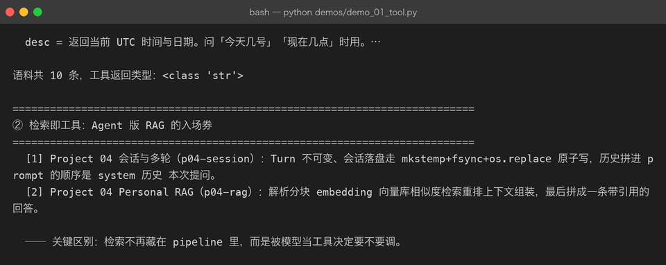
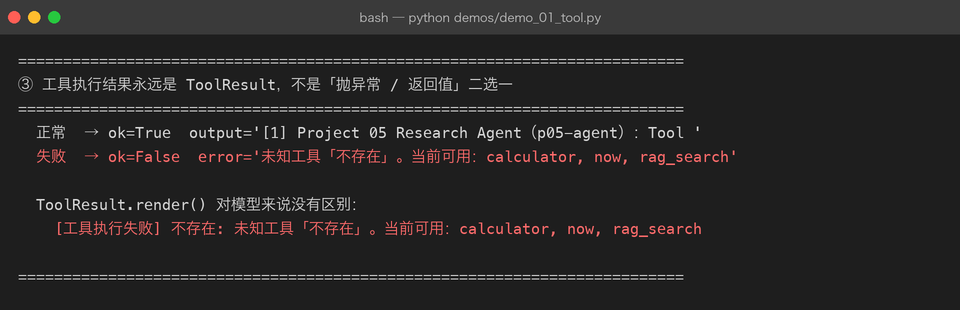
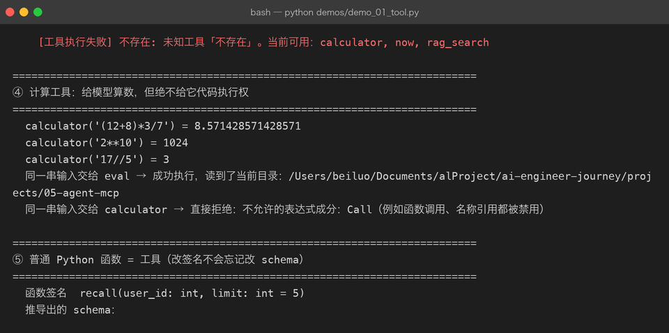
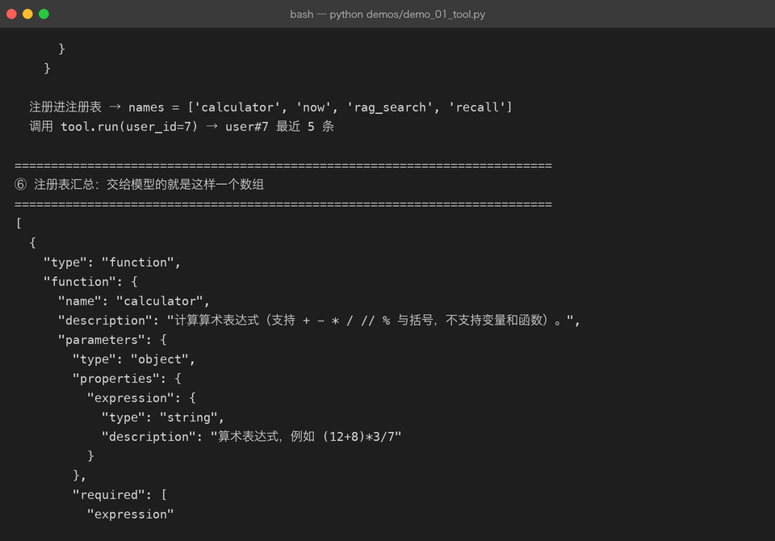

# Milestone 01 — Tool：工具就是能被模型调用的 Python 函数

> Project 04 的 RAG 解决了「模型不知道答案时去查资料」。但查资料这件事，在那个版本里是**写在 pipeline 里的固定步骤**——用户问什么都会走一遍检索，不需要检索也得走。
>
> 这一章做一件事：把检索从「pipeline 的固定步骤」改造成「摆在模型面前的工具」。区别听上去细，实际是「问答系统」和「Agent」的分界线。

## 1. Tool 的最小接口

一个工具只需要三样东西：名字、描述、一个 `run` 方法。

```python
class Tool(ABC):
    name: ClassVar[str]        # 模型靠它调用
    description: ClassVar[str] # 模型靠它决定要不要调用

    @abstractmethod
    def run(self, **kwargs) -> str: ...
```

**`run` 必须返回字符串**，这一条是硬约束。大模型只吃文本；返回 dict 就意味着某个地方要写序列化，而那段代码应该在框架里统一做，不该每个工具各写一遍。

本项目目前有三个内置工具：

| 工具 | 作用 | 为什么必须存在 |
|---|---|---|
| `rag_search(query, k)` | 在知识库里检索 | 事实性问题的唯一事实来源 |
| `calculator(expression)` | 算算术表达式 | 模型算数不可靠，交给工具 |
| `now()` | 当前 UTC 时间 | 问「今天几号」这类问题 |



## 2. 检索即工具

Milestone 01 真正要讲的是这一个变化。

Project 04 的调用链是死的：`ask()` → 检索 → 拼 prompt → 生成。**检索一定发生。**

这一版把它包成工具：

```python
class RagSearchTool(Tool):
    name = "rag_search"
    def run(self, **kwargs) -> str:
        return self._backend(kwargs["query"], kwargs.get("k", 3))
```

模型的消息里出现 `tool_calls=[rag_search]` 时，检索才发生；不出现就不发生。**要不要查、查什么词，由模型决定。**

同一个工具名可以换后端，这是「工具只是能力描述」的直接证明：

```python
ToolRegistry()                                  # → 本地语料
make_http_search_tool("http://127.0.0.1:8000")  # → Project 04 的 RAG 服务
```



## 3. 执行结果永远是 ToolResult，不是「抛异常 / 返回值」

这是工业界和玩具代码最大的差别。

```python
@dataclass(frozen=True)
class ToolResult:
    call_id: str
    name: str
    output: str = ""
    error: str | None = None

    def render(self) -> str:
        return self.output if self.error is None else f"[工具执行失败] {self.name}: {self.error}"
```

`ToolRegistry.call()` **永不抛异常**。原因很实际：一次工具失败不代表整轮任务失败。把 `[工具执行失败] …` 当普通文本回灌给模型，它大概率会换个参数重试；直接把异常抛出去，等于一次抖动打死整条链路。


## 4. 计算工具：给模型算数，不给它代码执行权

`calculator` 用 `ast` 解析 + **白名单节点**求值，任何不在白名单里的节点直接拒绝：

```python
_ALLOWED = {ast.Constant, ast.BinOp, ast.UnaryOp}   # 只有字面量和四则运算
```

这不是过度设计。`eval` 会把 `__import__` 也一起执行，等于把代码执行权交给模型输出的一段字符串：

```
同一串输入交给 eval       → 成功执行，读到了当前目录：/Users/.../projects/05-agent-mcp
同一串输入交给 calculator → 直接拒绝：不允许的表达式成分：Call
```

`eval` 那一行是 demo 里故意写的危险写法，只为说明「这样就能执行任意代码」——**真实项目里绝不能出现**。



## 5. 普通 Python 函数就是工具

```python
def recall(user_id: int, limit: int = 5) -> str:
    """按 id 查这个人最近的备忘，最多返回 limit 条。"""
    return f"user#{user_id} 最近 {limit} 条"
```

`function_to_schema()` 用 `inspect` 读签名反推 JSON Schema，**有默认值的参数不进 `required`**。这样「改了代码忘了改 schema」这类事故从根上不存在——schema 和代码永远同一个来源。



## 6. 坑与结论

**坑 1：自定义工具不写 schema，参数会被全部拒绝。**
`Tool` 基类的默认 `schema()` 返回空 `properties`。自定义工具如果只是重写 `run` 而不重写 `schema()`，模型传什么都会被判成「参数不存在」。这条在 Milestone 02 会展开。

**坑 2：`eval` 的诱惑。**
「模型要算数，直接 `eval(expression)` 不就行了」——这个决定等价于把服务器执行权交给模型输出。用 `ast` 白名单。

**结论：**
1. Tool 三件套（name / description / run→str）足够撑起一个真实 Agent。
2. 工具失败必须回灌成文本，不能抛异常打断链路。
3. 「检索即工具」不是名词升级，是**控制权从代码转移到模型**。

## 7. 代码位置

| 文件 | 职责 |
|---|---|
| `src/agent/tools.py` | `Tool` / `FunctionTool` / `ToolCall` / `ToolResult` / 三个内置工具 |
| `src/agent/registry.py` | 注册、汇总 schema、参数纠偏、派发 |
| `src/agent/errors.py` | `ToolError` / `ToolNotFoundError` / `ToolSchemaError` |

## 8. 版本

v0.1 → **v0.2**，新增 `src/agent/tools.py` 与 `registry.py`，测试 0 → 34 passed，截图 3 张。
